# 5 Evaluation

#### 5.1 Experimental Setup

Environment: We use PyTorch v2.3 [\[5\]](#page-13-20) and CUDA 12.1 [\[23\]](#page-13-21). Our testbed is an Azure instance, Standard\_NC48ads\_A100\_v4, which provides two NVIDIA A100 (80GB) GPUs. This instance has 440 GB of host DRAM. As default, we allocate about 50% of memory (224GB) for caching history KVs. We configure 2 NVMe SSDs (960GB for each) with a RAID-0 volume to improve the read and write bandwidth.

Models: We use the popular LLM models, OPT [\[38\]](#page-14-5) and Llama-2 [\[32\]](#page-14-1). The Llama-2 70B model uses grouped-query attention (GQA) while the rest of the models are equipped with multi-head attention (MHA). The OPT 13B and Llama-2 13B models are evaluated in a single GPU, while the OPT 30B and Llama-2 70B models are evaluated under two GPUs using tensor parallelism [\[30\]](#page-13-22). All the models are FP-16 formatted versions [\[19\]](#page-13-23) and we extend the maximum sequence length of the models to 16k to evaluate multi-turn prompts.

Comparisons: We evaluate the effectiveness of our techniques in comparison to vLLM and a concurrent work, CachedAttention [\[12\]](#page-13-24). We explore our three design options: memoryaware scheduling (FlashGen-Sched), multi-level KV caching (FlashGen-Cache), and the integration of the two (FlashGen). Although FlashGen-Cache is similar to CachedAttention, it has a different capability that opportunistically chooses between recomputing KVs and retrieving them from SSD to minimize the negative impact of SSD involvement. Furthermore, FlashGen-Sched addresses head-of-line blocking caused by amplified prompts in multi-turn dialogues, improving GPU memory utilization—an aspect not covered by CachedAttention.

Attention kernels: Both the baseline and our techniques employ the Flash-Attention [\[9\]](#page-13-25) and Flash-Decoding [\[10\]](#page-13-26) techniques for prompt and generation phases, respectively. When restoring KVs from the host memory or SSD, there is no guarantee that memory blocks[2](#page-7-5) pertaining to the previous turns are contiguous in the physical GPU memory. This limitation stems from the attention kernel for prompt phases not being designed with multi-turn scenarios in mind. To deal with non-contiguously stored KVs, we revise the Flash-Attention [\[9\]](#page-13-25) and Flash-Decoding [\[10\]](#page-13-26) kernels used for prompt phases and generation phases in vLLM, respectively. This modification is similar to the implementation of the FlashInfer [\[36\]](#page-14-6) library.

Benchmark: For performance evaluation, we mimic realworld chat scenarios by replaying a real-world chatbot dataset from ShareGPT [\[27\]](#page-13-7). We also use two other popular datasets, Alpaca [\[31\]](#page-13-8) and HumanEval [\[8\]](#page-13-9). However, since these two

2Each block is a fixed-size management unit for storing attention keys and values in PagedAttention.

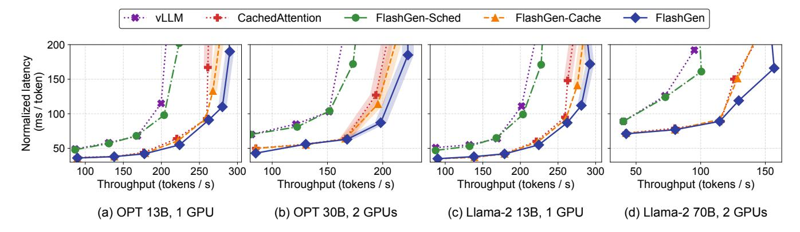

**Figure 9.** End-to-end latency normalized by the number of generated tokens and throughput in ShareGPT [27] (The shaded points indicate SSD involvement.)

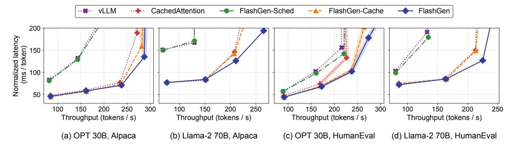

Figure 10. End-to-end latency normalized by the number of generated tokens and throughput in Alpaca [31] and HumanEval [8]

datasets are not comprised of multi-turn conversations, we configure them to have multi-turn characteristics by applying the turn distribution of ShareGPT while preserving their input and output length.

Each client acts as a load generator, sending a request (prompt) and receiving a response (generation). Once a turn is completed, a client sends the next prompt. The interval between turns depends on the length of the prompt and the generation. According to Rayner's work, humans can read average 300 words per minute [26]. We set the time per token to 1minute/300words = 200ms in our evaluation. Each interval is the sum of the number of prompt tokens and previous output tokens, then multiplied by 200ms. After completing a session, the client executes the next session. By varying the number of clients, we adjust the workloads to the LLM serving framework.

#### 5.2 End-to-end Latency and Throughput

We measure the end-to-end token latency and throughput for OPT and Llama-2 models by increasing the number of clients (loads) to the serving framework. As in previous studies [17, 37], we present normalized latency where the end-to-end latency is divided by the number of output tokens.

Figure 9 exhibits the normalized token latency (y-axis) and token throughput (x-axis) as the number of clients increases. The ShareGPT dataset is used for generating prompts and outputs. Overall, our two techniques, FlashGen-Cache and FlashGen-Sched, can improve both latency and throughput, compared to vLLM, in the four different models. Compared to CachedAttention, our FlashGen-Cache performs better as the load increases, as FlashGen-Cache can dynamically choose between recomputation and retrieving historical KVs from SSD. The shaded points in the figure indicate SSD involvement. The integration version, FlashGen, improves performance further compared to individual schemes. As FlashGen-Sched increases the GPU memory utilization, FlashGen-Cache can handle more requests, leading to throughput improvement.

Figure 10 presents the latency and throughput results for two different datasets, Alpaca and HumanEval with two selected models, OPT 30B and Llama-2 70B, running on two GPUs. Regardless of the datasets or models, our FlashGen significantly outperforms the baseline performance, and our two techniques contribute to performance improvement by reducing the recomputation cost and increasing GPU memory utilization. In the Llama-2 70B model, FlashGen-Cache

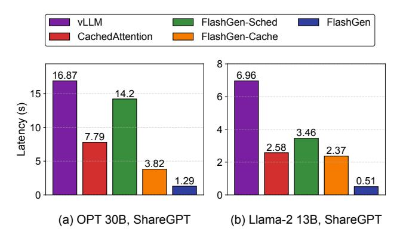

**Figure 11.** P95 time to first token (TTFT) when serving OPT 30B and Llama-2 13B for ShareGPT

shows a similar performance to CachedAttention. This is because the host memory is sufficient to keep all history KVs. They do not utilize SSD in that case. However, our integrated version, FlashGen, outperforms CachedAttention with the increased GPU memory utilization.

As the request load increases, our FlashGen-Sched demonstrates a trend of improving performance. In the OPT 30B model shown in Figure 9b, our scheduling technique shows a latency improvement of approximately 1.28× while providing a similar throughput of around 165~175 tokens per second. Under light loads, however, the performance benefit from FlashGen-Sched is marginal because the head-of-line blocking problem is unlikely to occur. FlashGen-Sched is relatively more beneficial in the limited GPU memory. This is because long prompts are more likely to be in the request queue when the available GPU memory is insufficient.

With FlashGen-Cache, the performance improvement is remarkable in all the models. The main performance benefit comes from replacing the recomputation of history KVs with caching. In Figure 9b, when generating 166 tokens per second, the generation latency is around 64 ms on average. On the other hand, the baseline can only achieve 81 tokens per second in a similar latency boundary. Our integrated version, FlashGen, presents the best performance in terms of both latency and throughput in all cases as the load pressure on the server increases. In the 100ms latency boundary, for the OPT 13B and 30B models shown in Figure 9, FlashGen exhibits around 1.56~1.63× throughput over the baseline. The Llama-2 13B and 70B models present about 1.55× and 2.85× throughput improvement, respectively.

To evaluate the responsiveness of our techniques, Figure 11 presents the tail latency (P95) for time to first token (TTFT) when serving OPT 30B and Llama-2 13B for the ShareGPT dataset with a load of around 1 request per second on average. Compared to the baseline, our scheduling technique reduces TTFT by 16% and 50% for each case. With our caching technique, the latency is further reduced by 77% and 66%. When integrating the caching and scheduling techniques, the responsiveness can be drastically improved.

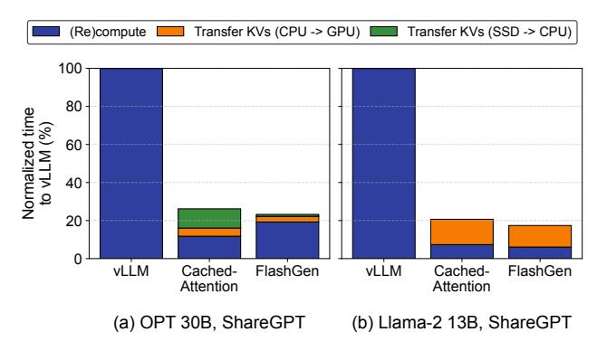

Figure 12. Time breakdown for processing prompt phases

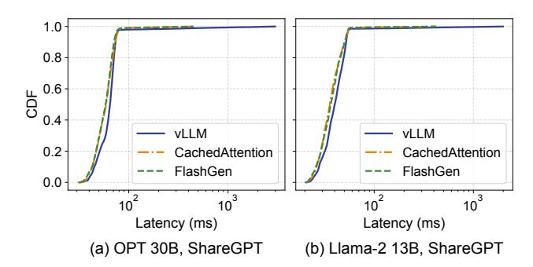

Figure 13. CDF of time per output token (TPOT) from Figure 11's OPT 30B and Llama-2 13B models

To understand the performance benefit of FlashGen over CachedAttention, we decompose the time for processing prompt phases into compute and KV transfer in Figure 12. The compute region includes processing input tokens of current turns and history tokens of previous turns. The transfer region presents two cases: transferring KVs from host to GPU and SSD to host. For OPT 30B, FlashGen spends more time on (re)computing prompts than CachedAttention but requires less time for transferring KVs from SSD to host memory. This is because FlashGen opportunistically retrieves history KVs of previous turns if the transfer time can be (partially) overlapped with the computation. As a result, FlashGen performs 1.13× better than CachedAttention. For Llama-2 13B, we do not observe the performance benefit of dynamically selecting either recomputation or retrieving KVs from SSD because all history KVs are kept in the host memory. Nevertheless, FlashGen performs 1.19× better than CachedAttention. FlashGen utilizes the GPU memory more effectively than CachedAttention by employing GPU caching, which reduces the time for transferring KVs from host memory to GPU.

Also, we measure the changes in time per output token (TPOT). Figure 13 provides the cumulative distribution function (CDF) for TPOT extracted from the evaluation presented in Figure 11. As FlashGen alleviates the recomputation cost with caching, it substantially reduces the token generation

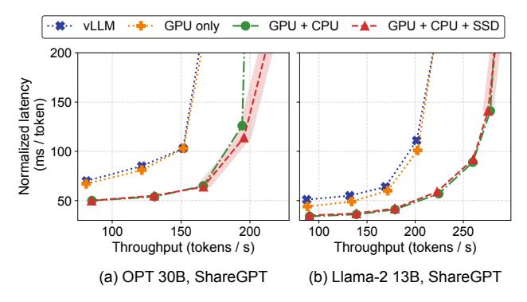

**Figure 14.** Performance comparison of KV caching strategies for OPT 30B and Llama-2 13B

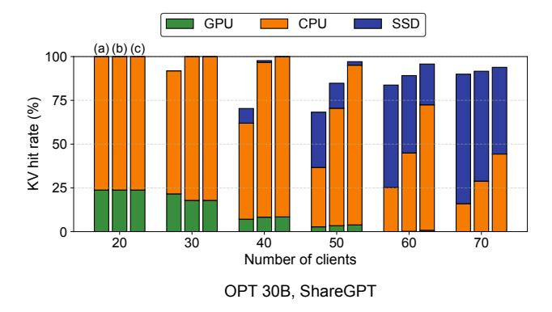

**Figure 15.** Hit rate for history KVs in three different CPU memory sizes (a: 168GB, b: 224GB, c: 280GB)

latency. We do not observe that the KV transmission negatively affects the iteration time while vLLM exhibits a long tail distribution. For OPT 30B, the P99 latency of output token generation is 103ms with FlashGen, compared to 608ms with vLLM. We observe a similar behavior in Llama-2 13B. Compared to CachedAttention, TPOT shows a similar performance result in both models.

## 5.3 Analysis of Multi-level Caching Strategies

To analyze the performance gain in FlashGen-Cache, we measure performance for each caching option separately. We select two models, OPT 30B and Llama-2 13B, from Figure 9 and the evaluation is done with ShareGPT. Figure 14 shows the performance comparison of our three design configurations: (1) GPU-only, (2) GPU+CPU, and (3) GPU+CPU+SSD. At low loads, the GPU-only design shows improved performance over the baseline. However, as the request load increases, the performance improvement becomes marginal. This is because the available GPU memory for caching history KVs is shrunk due to the increased number of ongoing requests. Consequently, the hit rate for history KVs in the GPU memory decreases.

Figure 15 decomposes the hit rate of history KVs. The remaining portion indicates recomputation, which is considered cache misses. Note that even though the SSD capacity is

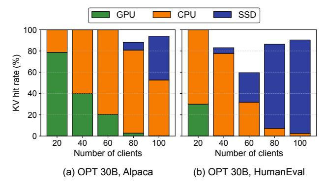

**Figure 16.** History KV hit rate for Alpaca and HumanEval evaluated in Figure 10

sufficient to keep all previous KVs, FlashGen can select the recomputation option. We also evaluate the OPT 30B model across three different CPU memory sizes for a sensitivity study. The CPU cache size is 3, 4, and 5 times the size of the model: 168GB, 224GB, and 280GB, respectively. The GPU portion steadily decreases as the number of clients (loads) increases. Even with 20 clients, the GPU cache portion falls below 25%. With more than 40 clients, this indicates that the GPU-only design becomes ineffective. When enabling caching history KVs in the host memory, the GPU+CPU design can further improve latency and throughput shown in Figure 14. Nevertheless, the portion retrieving KVs from the host memory also gradually decreases as the load increases. As the size of CPU memory decreases, we need to retrieve the required KVs more from SSD or recompute them. With the integration of SSD (GPU+CPU+SSD), the latency and throughput performance are significantly improved by efficiently replacing the recomputation cost with the KV restoration.

Similarly, in the Llama-2 13B model (not shown in a figure), the GPU cache hit rate is also drastically impacted by increasing the number of clients. Since the size of attention KVs for Llama-2 13B is relatively smaller than that of OPT 30B, the SSD is rarely utilized. As a result, the GPU+CPU and GPU+CPU+SSD designs present similar performance.

Figure 16 presents the KV hit rate for the other two datasets: Alpaca and HumanEval. Each data point is extracted from the evaluation of Figure 10. The GPU+CPU+SSD configuration achieves a higher cache hit rate compared to the other setups. In HumanEval, the GPU+CPU+SSD hit rate decreases steadily as load increases but begins to rise from 80 of clients. Under higher loads, requests are more likely to wait in the queue, providing opportunities to hide the latency of retrieving KVs from SSD. Thus, FlashGen-Cache opts for retrieval over recomputation. In contrast, CachedAttention solely relies on SSD, leading to limited throughput, as shown in Figure 10c.

We also perform a sensitivity study by varying the CPU memory size. Figure 17 presents the end-to-end performance of FlashGen and CachedAttention for three different CPU

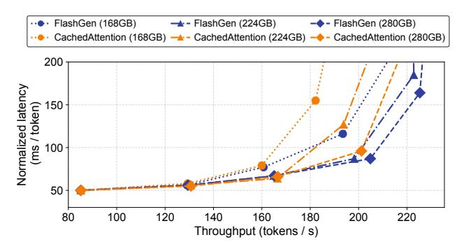

Figure 17. CPU memory sensitivity for OPT 30B

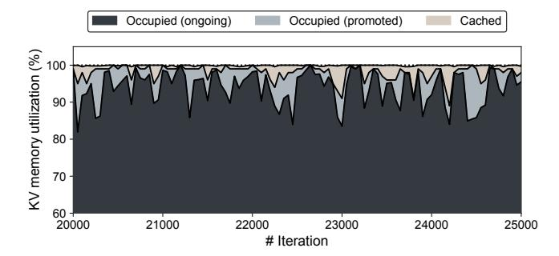

**Figure 18.** GPU memory utilization while serving an OPT 30B model with the ShareGPT dataset

memory sizes. Generally, the larger the cache, the more requests can be served with low latency. As the load increases, the CPU portion in retrieving KVs decreases inevitably as shown in Figure 15, leading to the performance gap. Also, as the caching space decreases, the performance gap between FlashGen and CachedAttention is remarkable because FlashGen can minimize the SSD involvement.

#### 5.4 Analysis of Request Reordering Technique

In this section, we investigate the performance improvement by FlashGen-Sched. Figure 18 presents the memory utilization by decomposing three regions: (1) occupied for ongoing requests, (2) occupied for promoting requests, and (3) cached for caching history KVs. We extract the utilization data from Figure 9b with a load of around 1 request per second on average. The occupied-promoted region indicates that our scheduling technique utilizes GPU memory for executing reordered requests instead of caching history KVs. If there are no reordering opportunities, the memory is left available for caching KVs. For other workloads, we can achieve effective memory utilization of more than 98% on average, which increased by 10% compared to vLLM. As we effectively utilize the GPU memory space, we can dispatch additional requests, leading to larger batch sizes on average. Table 2 shows the increased average number of batched requests normalized to vLLM. In OPT 30B, FlashGen shows 1.15× larger batch size on average.

|          | Figure 9 |         |             |             |  |
|----------|----------|---------|-------------|-------------|--|
|          | OPT 13B  | OPT 30B | Llama-2 13B | Llama-2 70B |  |
| FlashGen | 1.15×    | 1.15×   | 1.06×       | 1.06×       |  |

**Table 2.** Increase in the average number of batched requests normalized to vLLM

#### 5.5 Request Reordering with Increased Context

Additionally, we evaluate FlashGen-Sched with a synthetic dataset that follows a similar distribution of ShareGPT. For the synthetic dataset, we generate three traces by increasing the context length. The first trace includes the requests with prompt length ranging from 4 to 16k, and the output length ranging from 32 to 1024. We then scale these lengths proportionally: the maximum prompt length increases to 24k and 32k, while the maximum output length scales to 1536 and 2048, respectively. Figure 19 shows improved throughput and GPU memory utilization over the baseline for each trace. For the maximum prompt length of 16k, vLLM shows an average memory utilization of 92%, while FlashGen-Sched reaches 99%. At the maximum prompt length of 32k, the memory utilization in vLLM drops to 78%, whereas FlashGen-Sched maintains it at 97%. In this case, FlashGen-Sched demonstrates a 1.17× increase in throughput compared to vLLM.

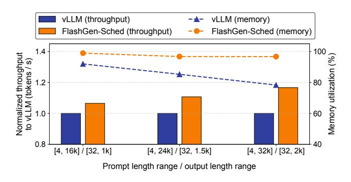

**Figure 19.** Token throughput and GPU memory utilization according to the context length distribution

#### 6 Related Work

There have been significant efforts in optimizing LLM inferences. We summarize a couple of important and related techniques to our study. Most of the following techniques are employed in LLM serving frameworks such as Orca, TensorRT-LLM, vLLM, and TGI.

KV reuse: There are several studies optimizing multi-turn dialogues. SGLang [39] and ChunkAttention [35] focused on efficiently managing KVs by sharing common prefixes across multiple requests. However, they store KVs only in GPU memory, without utilizing host memory or SSDs. CachedAttention [12] also proposed storing history KVs in both host memory and SSDs. However, unlike CachedAttention,

FlashGen-Cache does not always retrieve history KVs from SSD. In case of that the latency of retrieving KVs from SSD is higher than recomputation, FlashGen-Cache selects the recomputation option dynamically.

Beyond a single server, FlashGen can be extended to include remote memory in the caching hierarchy such as Mem-Serve [\[14\]](#page-13-28) and InfiniteLLM [\[18\]](#page-13-29). We expect that RDMAenabled memory, being faster than SSD, has the potential to improve performance by reducing storage access times.

Scheduling: Since each LLM inference request has a different number of output tokens, batching multiple requests together is considered harmful. When a request in a batch is completed, it cannot be returned immediately if another request in the same batch is still processing, leading to unnecessary inference latency and GPU resource wastage. To tackle this problem, iteration-level scheduling has been widely adopted in LLM serving systems [\[15,](#page-13-6) [17,](#page-13-3) [33,](#page-14-4) [37\]](#page-14-2). When handling multiple requests in batches, it allows for individual requests to receive immediate responses upon completion, irrespective of the processing status of other requests within the same batch. Furthermore, this approach permits the initiation of a new request in the subsequent iteration, eliminating the need to wait for the completion of the previous batch.

Recently, FastGen [\[20\]](#page-13-12) and Sarathi-Serve [\[2\]](#page-13-30) addressed an inefficiency issue related to handling long prompts in the iteration-level scheduling. In this scheduling approach, the execution time of a batch involves two phases: prompt and generation. When the prompt length increases, there is a delay even in processing requests during the generation phase. This is because the requests belonging to the same batch are processed together. Sarathi-Serve introduced a method of splitting a long prompt into smaller chunks and distributing them across multiple iterations. This approach serves to decrease the processing time of a batch, mitigating the adverse effects on generation phases.

Although there are several efforts in scheduling, none of the prior studies address the head-of-line blocking problem incurred by amplified prompts in multi-turn dialogues, which reduces GPU memory utilization. In contrast, FlashGen-Sched goes a step further by optimizing GPU memory utilization through effective scheduling.

Memory optimizations: Kwon et al. introduced a memory management technique, called PagedAttention, to maximize GPU memory utilization [\[17\]](#page-13-3). The proposed technique employs the classic virtual memory concept to manage the memory space for attention KVs. Traditionally, the memory for attention KVs is allocated equal to the model's maximum number of tokens for a given request since the number of output tokens is unknown In contrast, PagedAttention divides memory into fixed-size blocks and gradually allocates them, minimizing memory wastage.

FlexGen investigated offloading techniques for both models and attention KVs to host memory and storage [\[29\]](#page-13-4). Our approach, which leverages host resources, aligns with their strategy. However, while FlexGen aimed to maximize throughput at the expense of latency, our system is designed to achieve high throughput for multi-turn services while in a similar latency boundary.

Attention optimizations: Dao et al. optimized the attention kernel, called Flash-Attention, tailored for modern GPU memory hierarchy [\[9\]](#page-13-25). By effectively utilizing GPU on-chip SRAM with cache tiling, it reduces the number of global memory accesses. They also introduced Flash-Decoding to accelerate decoding phases by parallelizing long sequence processing [\[10\]](#page-13-26). FlashInfer provides such high-performance GPU kernels as a library [\[36\]](#page-14-6).

Meanwhile, there are several efforts to reduce the computation and memory cost of the standard Multi-Head Attention (MHA) method by reducing the dimensions from the K and V values in the transformer architecture. Multi-Query Attention (MQA) proposed to reduce the number of KV heads to 1 [\[28\]](#page-13-16). Although it can reduce the cost significantly, it has been known to incur a negative impact on accuracy. Recently, Llama-2 [\[32\]](#page-14-1) introduced the Grouped Query Attention (GQA) [\[3\]](#page-13-15) technique. It makes up the downside of MQA by grouping multiple query heads to share the same KV heads. Relatively small LLMs such as Llama-2 7B and 13B utilize MHA while more than 34B models adopt GQA.

