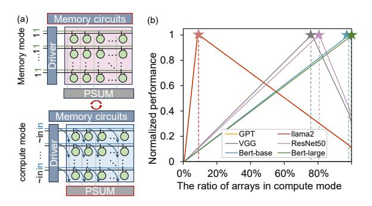
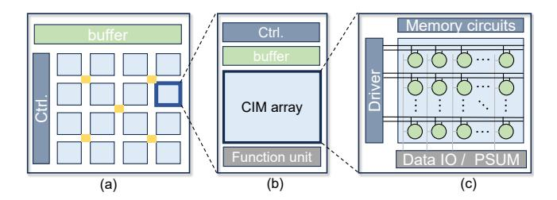
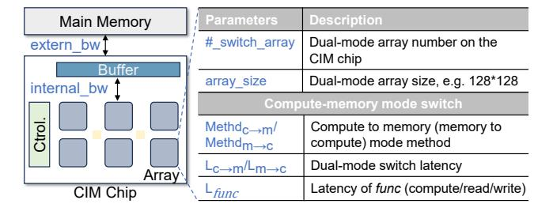

# 1 Introduction

The Computing-In-Memory (CIM) architecture is highly regarded for enabling in-situ computation [\[3,](#page-13-0) [5,](#page-13-1) [8,](#page-14-0) [9,](#page-14-1) [15,](#page-14-2) [38,](#page-15-1) [41\]](#page-15-2). CIM minimizes frequent data transfers and enhances the parallel execution of matrix multiply-and-accumulate (MAC) operations, resulting in notable performance improvements. Compared to conventional architectures, CIM significantly mitigates persistent memory wall problem [49] and demonstrates strong competitiveness in data-intensive applications especially deep neural network (DNN) inference [38, 43, 52].

To enhance efficiency and fully realize the potential of the CIM accelerators, researchers have explored various compilation optimization techniques, aimed at various CIM architectures such as resistant RAM and SRAM-based solutions [14, 16, 21, 33, 39, 44]. These compilation tools significantly reduce entry barriers for users adopting the CIM architecture and support the widespread deployment of CIM chips. Earlier compilation tools for CIMs assume that neural network weights are pre-loaded into memory. These tools formulate an optimized policy for weight mapping and devise a computation scheduling scheme across various operational granularities to maximize memory resource utilization and enhance computational performance. [3, 33, 39]. Although there have been significant improvements in compilation optimization techniques for CIM architecture, current methods still consider the memory and compute resources on the chip static, which does not accurately represent the modern advancements in CIM designs. In practice, many modern CIM designs feature dual-mode memory arrays that can dynamically switch between memory and compute modes [19, 24, 51, 53]. As depicted in Figure 1(a), the CIM array transitions between these modes by resetting the input driver. This dynamic functionality broadens the compiler's optimization possibilities for CIM mapping, enhancing DNN application performance. Previous compiler-level optimization efforts did not fully exploit these opportunities, missing out on the benefits of dual-mode CIM arrays.

Moreover, different real-world DNN architectures have distinct memory and computation resource requirements. Figure 1 (b) depicts the varying demands on the memory and computation resource of different DNN models (i.e., CNNs [22], LLaMA [45], GPT [6], etc.) to reach the optimal performance on the CIM chip. Convolutional neural networks (CNNs) have relatively high arithmetic intensity (FLOPs/ Memory OP) and demand a higher ratio of compute to memory resources on CIM. For instance, ResNet50 has an average arithmetic intensity of 66, and its performance reaches the highest point when the ratio of compute to memory resource reaches almost 80%. Thus, some typical CNNs require more CIM arrays working in compute mode, when they already have sufficient CIM arrays configured as the on-chip scratchpad memory for activation caching. In contrast, Transformerbased models typically have much lower arithmetic intensity. For instance, the generative model LLaMA 2 has an average arithmetic intensity of around 2 for single batch inference and Figure 1 (b) depicts that LLaMA 2 garners the best performance when the ratio of compute to memory in CIM arrays

**Figure 1.** (a) CIM switching between memory and compute mode by setting up control signals to the input driver; (b) Normalized performance variation with the ratio of arrays in compute mode changes. Please note that putting more CIM arrays in compute mode deprives them of the chance of working as scratchpad memory for storing and loading intermediate data, e.g. activations. CIM arrays in compute mode must store static data, i.e. pre-determined weights.

is about 10%, which means it is better to offer more on-chip random memory for activations and KV cache rather than to increase compute-power, given that it is almost impossible to cache all the massive parameters of large language models on a single CIM chip. Although this conclusion drawn from Figure 1 only makes sense for certain models and hardware configurations, like the on-chip memory space, main memory bandwidth, etc, it reveals a fact that it is not necessarily correct to assume all CIM arrays should be put at the compute mode as in prior compilation works. Moreover, the requirements for memory and compute CIM arrays of the same model may vary across different layers or stages of execution. Therefore, a compiler customized for dual-mode CIM that optimizes the memory and compute mode of the CIM array is significant.

In this work, we propose a novel CIM compiler that takes the CIM mode switch into account and co-adjusts the CIM working mode and the mapping of the DNN applications in the context of dual-mode CIMs. Specifically, for a given target CIM architecture and the neural network workload, the proposed compiler can determine the arrays' mode being the compute or memory, and the optimal allocation of those arrays. Once the mode-switch decision is made, the compiler also schedules operators on the respective arrays to achieve optimal performance.

However, to achieve this goal, we have to address the following two challenges: (1) **Exponential space expansion**: In dual-mode CIM, each CIM array can work in memory or compute mode. Consequently, the problems of array mode selection and weight mapping are entangled in the deployment of target DNNs, which constitutes a larger exploration space for the compiler. For instance, with *m* arrays in CIM,

there are  $2^m$  choices of the mode allocation during the compilation. It is proved that model scheduling for CIM is already a complicated problem with the optimization space about polynomial complexity, dual-mode CIM will face a  $2^m$  times larger space with an exponential level. Therefore, we have to formalize such a jointly optimized exploration space that combines the allocation and mapping decisions, along with a search strategy when designing our compiler. (2) Dualmode switching schedule: When scheduling each DNN operator in a dual-mode CIM, we should deliberately determine the mode of arrays as the number of arrays in different modes also affects the efficiency of the current operator and the scheduling of subsequent operators. Thus, the compiler for dual-mode CIM must account for the interdependence between array mode scheduling and weight mapping. The separate treatment of mapping and scheduling in previous compilers for CIM with fixed-mode arrays is insufficient for enhancing performance in dual-mode CIM architectures. Thus, we propose a holistic optimization framework that integrates DNN mapping and array mode scheduling for dual-mode CIMs.

To address these challenges, our approach at first provides the hardware abstraction of dual-mode CIM accelerators based on CIM-MLC [33] so that the dimension of CIM reconfiguration can be fused into the original mapping/scheduling space of CIM as a formalized optimization space. Second, to make the joint optimization problem tractable for modern large-scale neural networks, we employ a divide-andconquer two-step policy, co-optimizing the array mode switch, allocation, and mapping of neural networks. Given that CIM memory space often cannot accommodate the entire model on the chip, the network must be executed in segmented partitions in serial. This is a common trend with billionscale large language models. We first utilize dynamic programming (DP) to network segmentation. The overhead introduced by the array mode switch is taken into account when applying DP for global optimization. Afterward, we use mixed integer programming to automatically explore the optimization space for operator mapping with tunable hardware resources within each segment. The compiled results are then output in a meta-operator flow marked with memory-compute switch information.

Specifically, the main contributions of this work include:

 To support various DNNs including nowadays large language models, we introduce CMSwitch, a novel dual-mode-aware CIM compiler that leverages the mode switch capability of compute/memory of CIM arrays to meet diverse DNN application requirements. We formalized the joint-optimization problem of modeswitch, mapping, and scheduling for standalone CIM accelerators, and released the first compiler aware of this important CIM feature.

**Figure 2.** Hierarchical CIM architecture (a) CIM core with CIM arrays and the corresponding peripheral units; (b) CIM array and the corresponding peripheral units; (c) CIM array.

- We comprehensively consider the challenges and opportunities brought by mode switching. Without causing too much exploration overhead, we propose a two-step optimization strategy to make the compilation process converge at the optimal design point of the large joint design space. By formalizing the overhead and performance improvement introduced by CIM mode switch, we employ DP and MIP to determine the optimal network segment in temporal and allocate compute-memory resources in spatial.
- We evaluate the CMSwitch across a set of DNN benchmarks. Compared with state-of-the-art compilation works [33], CMSwitch achieves average inference speed improvement by 1.31×. We also verify CMSwitch for various workload scales, demonstrating robust dual-mode-aware compilation support for diverse DNN architecture demands. It is proved the proposed compiler shows especially great potential for popular large models that cannot be fitted into the on-chip memory.

### 2 Background

### 2.1 Computing-In-Memory Accelerator Architecture

As depicted in Figure 2 (a)-(c), independent CIM-based DNN accelerators are typically structured as hierarchical architecture comprising multiple CIM cores. Each core integrates a CIM array along with its peripheral buffer and circuitry. This design enables in-situ computation within the memory, thereby mitigating the data transfer bottlenecks commonly seen in conventional architectures that separate computation and memory. Prior researches [1, 3, 5, 8, 9, 15, 23, 25–27, 32, 37, 38, 41, 47] have proposed various CIM accelerators, providing robust support for high-performance computing and naturally aligning with large-scale parallel computing applications such as DNN inference.

**2.1.1 Dual Modes CIM Array.** The dual-mode CIM array can operate as both a memory and compute unit when applying a slight enhancement on the input or output drivers [2, 10, 18, 24, 42, 48, 51, 53].

As illustrated in Figure 3, switching between memory and compute modes of CIM arrays can be achieved by altering the

Figure 3. Dual-mode CIM Array.

array's driver inputs, as demonstrated by DynaPlasia [24]. This mode-switching functionality is controlled by modifying the input signals on the global lines. When the Global Input Activation line (GIA) and its complement (GIAb) are set to a high state (1), the array functions in memory mode, allowing standard memory read-write operations. Conversely, when the GIA and GIAb are configured as input activation (IA) and inverse of input activation IA (/IA), respectively, the array operates in compute mode, performing bit-series multiplication-addition operations.

2.1.2 CIM Compute Paradigm. When CIM arrays perform computations, they enable the multiply-accumulate (MAC) operations to be executed entirely within the array in parallel, as illustrated in the Figure 3 (right). This architecture inherently supports matrix-vector multiplication (MVM) and matrix-matrix multiplication (MMM). In the case of MVM, the matrix is mapped onto the CIM array, while the vector serves as the array input. The multiplication is performed within each cell, with accumulation occurring along the bitlines or at the output side, producing MVM results directly from the array. Many classic DNN operators, such as fully connected layers and convolutions, can be readily transformed into MMM or MVM operations. For instance, while convolutional kernels cannot be directly mapped onto the array, the convolution operations can be unrolled into an equivalent matrix-matrix multiplication (MMM). This equivalent MMM is subsequently mapped and executed on the CIM array, following the standard MMM procedure.

### 2.2 CIM Compilation Works for DNN

With the increasing attention on CIM, there has been a significant surge in efforts to develop a compilation optimization stack aimed at facilitating the deployment of DNN algorithms across various CIM architectures [3, 33, 39, 44].

Existing compilation optimization approaches for CIM predominantly emphasize scheduling optimizations, such as task mapping, resource allocation, and dataflow scheduling, to fully exploit the static on-chip resources of CIM chips, thereby reducing latency. For example, OCC [39], built upon MLIR, utilizes a specific ISA to support scheduling optimization for multiple operators. CIM-MLC [33] addresses the

**Figure 4.** (a) Existing typical CIM mapping method that treats all the CIM arrays as compute arrays; (b) Dual-mode-aware mapping method.

challenges posed by multi-level and heterogeneous program interfaces in CIM accelerators, implementing weight duplication and pipelining techniques tailored for various CIM computation modes. These compilation strategies alleviate the programming complexity of utilizing CIM processors, accelerate application deployment, and allow researchers to focus more on architecture design.

However, existing compilers overlook a crucial aspect: the dual-mode capability of CIM arrays, resulting in suboptimal performance. As shown in Figure 4, when taking the dual-mode feature of CIM arrays into account, the compiler can dynamically allocate compute and memory resources (b). Thus, it can enhance the DNN performance when keeping more data on the chip by switching the CIM arrays to memory mode. Instead, the traditional compiler has to move these data to off-chip memory, incurring extra latency.

In summary, the dual-mode capability of CIM arrays introduces a powerful mechanism for dynamically adjusting on-chip resources to meet the diverse computation and memory demands of various DNN workloads. By intelligently switching CIM arrays between compute and memory modes, we can flexibly allocate resources based on the specific requirements of different DNN inference tasks, ultimately optimizing performance.

#### 3 Motivation

This section describes the motivation behind developing a dual-mode-aware DNN compiler for CIM accelerators. We identify the diverse on-chip computing and memory requirements inherent in real-world DNNs. Additionally, we discuss the opportunities of meeting these application requirements through the optimization of CIM array mode configuration during compilation.

### 3.1 Insights into Diverse DNN Requirements

Variations among different network architectures. Mainstream neural networks exhibit diverse architecture designs, leading to varied hardware requirements [12, 13, 22, 29, 34, 35, 40, 45]. Figure 5 (a)(b) illustrates the normalized performance variation heatmap of Llama2 [45] and ResNet-50 [22] with changes in the number of arrays in compute/memory

**Figure 5.** (a)(b) Normalized performance variation with the changes of compute/memory array; (c) Arithmetic Intensity.

**Figure 6.** (a) Layer-specific arithmetic intensity of ResNet-50 [22]; (b)Arithmetic intensity of BERT-Large with different sequence lengths [12].

mode. We assume there is a total of 100 dual-mode CIM arrays on-chip, where the switchable CIM array is as Dynapalsis [24]. The memory and compute axes represent the number of CIM arrays in memory and compute mode, respectively. The vertical axis indicates the theoretical performance normalized to the optimal performance with the same amount of total arrays. Green indicates better performance, while dark blue indicates poor performance. Llama2 and ResNet-50 exhibit distinct preferences for hardware resource allocation, stemming from their differing arithmetic intensities. As illustrated in Figure 5(c), ResNet-50 has a significantly higher average arithmetic intensity compared to Llama2. Consequently, Llama2, with its lower arithmetic intensity, does not require extensive computing resources but necessitates increased on-chip memory to complete its operations. Thus, Llama2 demands more CIM arrays in memory mode to meet its computational needs. Conversely, ResNet-50, with its higher arithmetic intensity, benefits from greater compute resources to achieve optimal performance. Furthermore, Figure 5(c) indicates the varying arithmetic intensities across different models. Therefore, the dynamic adjustment of memory and compute resources in CIM is essential to provide optimal performance for diverse DNNs.

Layer-wise variations within the same network. Within the same neural network, different layers also have varying hardware demands due to factors such as input data size and network parameters, including weight kernel size. For example, as illustrated in the Figure 6(a), ResNet-50[22] comprises four distinct blocks, each containing three configurations of convolution layers. The arithmetic intensity of

these three layers varies significantly, ranging from below 100 FLOPs/MOP to over 700 FLOPs/MOP.

Variations on different workload scales. Transformerbased [46] NLP models, such as BERT [12], show dynamic resource requirements based on varying input and output sequence lengths. As illustrated in the Figure 6(b), the arithmetic intensity of the model fluctuates significantly with the input and output sequence length, varying from under 150 FLOPs/MOP to over 1000 FLOPs/MOP. Additionally, different computation stages within the models, such as fully connected (FC) layers and query-key-value (QKV) computations, display varying arithmetic intensities. For example, FC layers demonstrate much higher arithmetic intensity compared to QKV computations as the sequence length increases. As sequence length grows, more memory is needed to store intermediate states and longer contextual information, while additional computational resources are required to manage the increased complexity of the attention mechanism. Consequently, the demand for compute and memory resources dynamically adjusts with sequence length.

### 3.2 Opportunity of CIM Dual-Mode Switch

Given the diverse resource demands of various DNN architectures, layers, and workload scales, dynamic hardware resource allocation is crucial for optimizing model execution performance. A static compute/memory resource ratio is often insufficient to achieve optimal efficiency across different scenarios. Traditional compilation techniques typically struggle with inefficiencies due to their inability to adapt to fluctuating resource requirements. By leveraging the dualmode switching capability of CIM arrays, we can dynamically alternate between compute and memory modes, enabling CIM accelerators to more effectively accommodate the diverse needs of DNN workloads. Specifically, repurposing compute arrays into memory arrays allows CIM accelerators to expand on-chip memory resources, which is particularly beneficial for storing dynamically generated activations in DNNs. This flexibility can significantly boost overall system performance and energy efficiency by tailoring hardware configurations to the unique requirements of each DNN model.

To leverage this flexibility, we propose CMSwitch, a dual-mode-aware DNN compiler for CIM processors, ensuring that the dual-mode CIM arrays provide optimal performance for any given workload. In the following sections, we will introduce the workflow of CMSwitch, elaborating on the dual-mode-aware compilation optimization pass.

### 4 Dual-Mode-Oriented Compilation Stack

### 4.1 Overall Workflow

Figure 7 illustrates the workflow of CMSwitch, which takes user-defined hardware parameters and neural network applications as inputs. The neural network is initially converted

**Figure 7.** Overview of dual-mode-aware compilation process.

**Figure 8.** Dual-mode Enhanced Hardware Abstraction.

into ONNX format [4], lowering it to a computation graph expression. To integrate compute-memory mode switching into the compilation optimization space, we incorporate the dual-mode functionality of arrays in the hardware abstraction. This is achieved by introducing the methods and overheads associated with compute-memory mode switching into the hardware abstraction parameters.

During compilation optimization, to minimize application latency within the joint optimization space, CMSwitch develops a divide-and-conquer two-step policy. CMSwitch first decides network segmentation that accounts for dual-mode switch overheads, and then optimizes the dual-mode resource allocation and scheduling for operators within each segment. Through iterative exploration and optimization using Dynamic Programming (DP) and Mixed-Integer Programming (MIP), CMSwitch derives the globally optimal network segmentation schedule, along with the corresponding resource allocation and mapping results for each operator.

Furthermore, to effectively present our compilation results, we introduce meta-operators specifically designed for dual-mode switching. These meta-operators facilitate the output of compilation results that incorporate the compute-memory switch scheme. Upon obtaining the memory-compute mode switch plan offline, the actual dual-mode switch needs to be executed online with the support of the dual-mode CIM.

