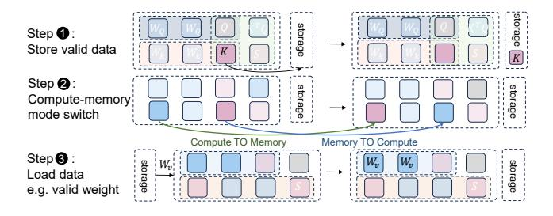
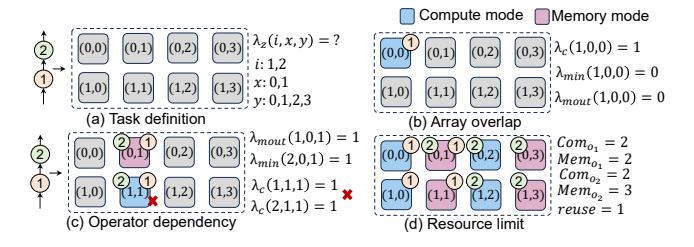
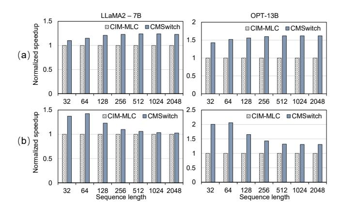

# 4.2 Dual-Mode Enhanced Hardware Abstraction (DEHA)

Hardware abstraction is crucial to providing essential hardware information to the compiler for the compilation process. As shown in the Figure 8, we incorporate the dual-mode parameter of the array and the related switch function into the hardware abstraction. Together with architecture parameters, this abstraction enables CMSwitch to access the

optimization space of the dual-mode CIM array and relevant architecture parameters.

**Dual-mode CIM architecture.** In abstracting the CIM architecture, we model the CIM chip hierarchically. Given our focus on optimizing the dual-mode CIM, we simplify the abstraction to include only two essential tiers: chip and array. At the finest granularity, our abstraction is at the CIM array level, which represents the smallest hardware unit capable of mode switching. Users are required to define parameters such as the number of dual-mode arrays, the array sizes, internal bandwidth, and external global bandwidth, all of which significantly influence the behavior and performance of the CIM chip.

**Dual mode switch.** During the compilation optimization process, it is crucial to consider both the functionality and overhead of the dual-mode switch to enable the compiler to balance the benefits of mode switching and explore optimal performance results. To facilitate the compilation process, it is essential to define the method and overhead of the compute-memory mode switch adopted by the target chip at the hardware abstraction stage. This may involve techniques such as altering the inputs of wordlines or bitlines. Additionally, the overhead of the compute-memory mode switch is assessed at the granularity of the switchable arrays. These parameters significantly impact subsequent compilation optimization solutions.

When CIM arrays operate in different modes, executing a single operation—such as activating an array for computation or data reading—may incur varying overheads. To account for this, we introduce an option in the hardware abstraction parameters to record the overhead of computation and memory operations. This approach ensures that the associated overheads of read-write and computation of arrays are considered during the compilation optimization process, thereby evaluating the impact of different modes on overall performance.

### 4.3 Dual-Mode-Aware Compilation Optimization

Based on the abstraction of the hardware architecture, we proposed the Dual-Mode Aware Compilation Optimization (DACO) to allocate the dual-mode CIM arrays for each CIM-supported operator, to minimize overall execution latency. This phase gets the ONNX-format DNN and hardware abstraction as input. We employ a divide-and-conquer two-step

<span id="page-6-0"></span>**Table 1.** Notations Used in Dual-mode Compilation.

| Variables - decide during optimization                      |                                                                                                                     |  |
|-------------------------------------------------------------|---------------------------------------------------------------------------------------------------------------------|--|
| $\lambda_{min}(i, x, y)$                                    | taking value 1 if CIM array $(x,y)$ is assigned to $O_i$ in memory                                                  |  |
|                                                             | mode as input buffer, 0 otherwise.                                                                                  |  |
| $\lambda_{mout}(i, x, y)$                                   | taking value 1 if CIM array $(x,y)$ is assigned to $O_i$ in memor                                                   |  |
|                                                             | mode as output buffer, 0 otherwise.                                                                                 |  |
| $\lambda_c(i, x, y)$                                        | taking value 1 if CIM array $(x,y)$ is assigned to $O_i$ in compute                                                 |  |
|                                                             | mode, 0 otherwise.                                                                                                  |  |
| $Mem_{O_i}$                                                 | the number of CIM array in memory mode that $O_i$ has. $Mem_{O_i} =$                                                |  |
|                                                             | $\sum_{x,y} \lambda_{min}(i,x,y) + \sum_{x,y} \lambda_{mout}(i,x,y)$                                                |  |
| $Com_{O_i}$                                                 | the number of CIM array in compute mode that $O_i$ has. $Com_{O_i} =$                                               |  |
|                                                             | $\sum_{x,y} \lambda_c(i,x,y)$                                                                                       |  |
| $Switch_{m \to c}$                                          | arrays from memory mode to compute mode for segment S'                                                              |  |
|                                                             | to S, $Switch_{m\to c} = \sum_{x,y} (\sum_{O_i \in S'} \lambda_m(i,x,y) \odot \sum_{O_j \in S} \lambda_c(j,x,y)),$  |  |
| -                                                           | where $\lambda_m(i, x, y) = \lambda_{min}(i, x, y) + \lambda_{mout}(i, x, y)$                                       |  |
| $Switch_{c \to m}$                                          | arrays from compute mode to memory mode for segment S' to                                                           |  |
|                                                             | $S, Switch_{m \to c} = \sum_{x,y} (\sum_{O_i \in S'} \lambda_c(i, x, y) \odot \sum_{O_i \in S} \lambda_m(j, x, y))$ |  |
| Constants - determine by application and CIM chip initially |                                                                                                                     |  |
| $IN_{O_i}/OUT_{O_i}$                                        | input data/output data of operator $O_i$                                                                            |  |
| $AI_{O_i}$                                                  | arithmetic intensity of operator $O_i$                                                                              |  |
| $N_{cim}$                                                   | the number of dual-mode switchable CIM array                                                                        |  |
| $OP_{cim}$                                                  | operation/cycle a CIM array can provide, $OP_{cim} \propto array\_size$                                             |  |
| $D_{cim}$                                                   | data/cycle a CIM array can provide in the memory mode, which                                                        |  |
|                                                             | is impacted by architecture design and user-defined topology.                                                       |  |
| $D_{main}$                                                  | data/cycle main memory and original on-chip buffer can provide,                                                     |  |
|                                                             | $D_{main} \propto extern\_bw + internal\_bw$                                                                        |  |

<span id="page-6-1"></span>

Figure 9. Illustration of Network Segment.

policy. First, dynamic programming (DP) is utilized to partition the network into multiple segments, taking into account the switching overhead between segments. Following segmentation, mixed linear programming (MIP) is applied to co-optimize the allocation of on-chip computing/memory resources and scheduling for operators, adhering to the constraint of total available resources. During this optimization process, the dual-mode CIM arrays are dynamically adjusted to either memory or compute mode based on the optimization objective. Finally, this phase outputs the network segmentation results along with the corresponding allocation of dual-mode CIM array in memory and compute mode for each segment. The notation we used for optimization space formalization in this section is summarized in Table 1.

**4.3.1 Dual-Mode-Aware Network Segment.** In the network segment step, we organize the network compute operators at the granularity of network segments, being allocated on the dual-mode CIM arrays holistically. Network segmentation offers two key benefits: 1) it reduces the optimization space from an exponential size, considering the entire number of operators, to a more feasible one, and 2) it facilitates the accommodation of real-world DNN networks that cannot

<span id="page-6-2"></span>

**Figure 10.** Three sources of inter-segment overhead.

fit entirely on the chip to be optimized on the dual-mode CIM. As shown in the Figure 9, taking the attention layer as an example, if we segment the attention process into two segmentations, we will execute them serially. The first segment maps to the hardware and executes, followed by the second segment after the first completes. Both of them will have their resource allocation plan. To further refine the segmentation search space, we employ a dynamic programming approach to optimize network latency in the context of scheduling network segments.

For a network *N* with *m* CIM-supportable operators (e.g., MVM and MMM), we first topologically sort these operators, denoted as  $O_1, O_2, ..., O_m$ , where  $O_i$  and  $O_j$   $(i, j \in \{1, 2, ..., m\})$ satisfy that if i < j, then  $O_i$  is completed no later than  $O_j$ . The dependency relationship between operators is denoted as W, where  $w_{i,j} \in W$  indicates that the output of  $O_i$  is input to  $O_i$ . The segments after segmentation are denoted as  $S_{i,j}$ , indicating that operators from  $O_i$  to  $O_j$  belong to the same segment  $S_{i,j}$ . For operators that cannot fit directly onto the CIM accelerator, we will partition them into smaller suboperators. This partitioning process uses a greedy strategy, with the partition granularity determined by the available on-chip resources. This approach ensures that each resulting sub-operator can be fully mapped onto the chip. Finally, we replace the original operator in the sorted operator list with these sub-operators, enabling efficient execution on the CIM accelerator. To minimize inference latency, the segmented network execution overhead includes both intra-segment execution latency and inter-segment mode-switch latency. Intra-segment latency. Within each segment, all operators are mapped to the CIM chip simultaneously. Therefore, optimization methods such as pipelining can be employed to minimize the overall latency within the segment. The introduction of dual-mode CIM arrays makes the intra-segment latency highly dependent on on-chip memory and computation resource allocation. To optimize the intra-segment overhead, we will detail the dual-mode-aware resource allocation algorithm in the following subsection. We denote the intra-segment latency with resource allocation plan A as  $T_{i,j}^{intra}(A)$  for  $S_{i,j}$ .

**Inter-segment latency.** Inter-segment latency encompasses the latency caused by switching CIM memory and computation modes and on-chip and off-chip data swapping. Specifically, as illustrated in Figure 10, the inter-segment mode switch mainly consists of three steps, storing the valid on-chip data to storage, performing the mode switch between the compute/memory, and loading data. We formalize the inter-segment latency based on the two adjacent segments,  $S_{k,i-1}$  with the resource allocation plan A' and  $S_{i,j}$  with the resource allocation plan A ( $k < i \le j$ ).

For step one: if segment  $S_{k,i-1}$  contains more memory arrays than  $S_{i,j}$ , and the output data from the segment  $S_{k,i-1}$  is needed for subsequent computations, this data must be written back to the main memory before switching this CIM arrays from memory mode to compute mode. We denote the data store latency as  $T_{i-1,i}^{wb}(A',A)$ , and it can be estimated according to the data transfer volume and the memory bandwidth. For data that can be processed in place and will not be reused, such as softmax results in attention, the corresponding CIM arrays can be directly switched from memory to compute mode without data write-back.

For the second step, when switching between memory and compute modes, if the required arrays differ between adjacent network segments, the dual-mode switch overhead must be considered. When the  $S_{k,i-1}$  uses arrays in compute mode while the  $S_{i,j}$  requires them in memory mode, the overhead of switching those arrays from compute mode to memory mode must be accounted for, and vice versa. The overhead  $T_{i-1,i}^{swc}(A',A)$  is detailed in the Eq. 1

<span id="page-7-0"></span>
$$T_{i-1,i}^{swc}(A',A) = L_{M \to C} \times Switch_{m \to c} + L_{C \to M} \times Switch_{c \to m}. \tag{1}$$

For the third step, as different segments process different operators, the weights stored in the compute arrays must be reloaded and rewritten. Each operator has unique weights, necessitating an update of the compute arrays' stored weights accordingly. The overhead  $T^{rw}_{i-1,i}(A',A)$  is shown in the Eq. 2:

<span id="page-7-1"></span>
$$T_{i-1,i}^{rw}(A',A) = \max_{O_i \in S_{i,i}} Com_{O_i} \times Latency\_write.$$
 (2)

Based on the intra- and inter-segment overhead, network segmentation can be formalized as the following dynamic programming problem. As shown in Eq. 3, we denote the best network segment solution with the corresponding resource allocation plan  $A^*$  as the  $L[m][A^*]$ . The total cost of the network from operator 1 to m is the sum of the costs of two segments: from 1 to i-1 and from i to m, plus the mode-switch latency between these segments. To reduce the solution space, any network segment exceeding the total on-chip resources is deemed invalid. If a segment requires more compute and memory arrays than the available on-chip resources, it must be further segmented during execution.

<span id="page-7-2"></span>
$$L[m][A^*] = \min_{1 \le i < m} \{ L[i][A'] + T_{i,m}^{intra}(A) + T_{i-1,i}^{inter}(A',A) \},$$

<span id="page-7-3"></span>

**Figure 11.** Constraints illustration for resource allocation.

where  $T_{i-1,i}^{inter}(A',A)$  equals to

<span id="page-7-4"></span>
$$T_{i-1,i}^{inter}(A',A) = T_{i-1,i}^{wb}(A',A) + T_{i-1,i}^{swc}(A',A) + T_{i-1,i}^{rw}(A',A).$$
 (4)

By traversing all potential choices and backtracking the segmentation plan according to Eq 3, we can efficiently find the optimal segmentation strategy, thereby minimizing execution time. This dynamic programming approach significantly reduces the search space complexity compared to exhaustive search methods.

### 4.3.2 Unified Dual-Mode Allocation with Scheduling.

In this section, we formalize the resource allocation and operator scheduling co-optimization problem as a Mixed-Integer Programming (MIP) problem to minimize the execution latency. For each network segment, the allocation optimization aims to determine the optimal modes of CIM arrays assigned to each operator. Operators within the segment are scheduled in the pipelined fashion to maximize computing parallelism. To capture the interdependence of compute and memory allocation and the scheduling for operators within a segment, we define specific objectives and constraints, where constraints dictate dual-mode CIM resources available for operators and objectives that optimize latency considering the pipeline structure, respectively. The details of our formulation are explained in the following contents.

Here we use the 2-d coordinate (x,y) to indicate the CIM arrays in the chip and use the  $\lambda_z(i,x,y),z\in\{min,mout,c\}$  to indicate the resources allocation and mapping for operator  $O_i$ , where min/mout means array in memory mode as input/output buffer, respectively, and c means array in compute mode. When the CIM array (x,y) assigned to  $O_i$  is in memory mode as input and output buffer,  $\lambda_{min}(i,x,y)=1$  and  $\lambda_{mout}(i,x,y)=1$ , otherwise they are 0. Similarly, when the CIM array (x,y) assigned to  $O_i$  is in compute mode,  $\lambda_c(i,x,y)=1$ . Our goal is to find the optimal  $\lambda_z(i,x,y)$  for each segment under the constraints imposed by the resource allocation and the objective related to the pipeline scheduling strategy.

**Constraints.** As the dual-mode resource space is defined, some optimization rules should be considered to include only the valid CIM array allocation solutions. Here, we use  $S_*$  to indicate any possible network segment.

1) Array overlap. A CIM array can be either memory or compute mode for an operator, but not both. Therefore, for

<span id="page-8-1"></span>

Figure 12. Example of MMM.

each CIM array (x, y), if it is allocated to operator  $O_i$ , only one of  $\lambda_{min}(i, x, y)$ ,  $\lambda_{mout}(i, x, y)$ , or  $\lambda_c(i, x, y)$  can be 1.

$$\forall O_i \in S_*, \forall x, y : \lambda_{min}(i, x, y) + \lambda_{mout}(i, x, y) + \lambda_c(i, x, y) \le 1.$$
 (5)

As shown in Figure 11(b), CIM array (0,0) is assigned to  $O_1$  in compute mode, so it can not be a memory array.

2) Operator dependency. If one operator's output  $O_i$  serves as the input of the next  $O_j$ , the output memory arrays of  $O_i$  can directly serve as the input memory arrays of  $O_j$ . Thus, a portion of the output memory buffer for  $O_i$  can be reused as an input memory buffer for  $O_j$ .

$$\begin{split} \forall O_i, O_j \in S_*, & \text{if } w_{i,j} \in W: \\ \sum_{x,y} \lambda_{mout}(i, x, y) \cdot \lambda_{min}(j, x, y) < \frac{OUT_{O_i} \cap IN_{O_j}}{array \ size}. \end{split} \tag{6}$$

As the example shown in Figure 11(c),  $O_1$ 's output is the input of  $O_2$ , where array (0, 1) assigned to  $O_1$  as output buffer can be input buffer of  $O_2$ .

Otherwise, there are no reused CIM resources between the adjacent operators.

$$\forall O_i, O_j \in S_*, w_{i,j} \notin W, z \in \{mout, min, c\} :$$

$$\sum_{x,y} \lambda_z(i, x, y) \cdot \lambda_z(j, x, y) = 0.$$
(7)

As shown in Figure 11(c), CIM array (1, 1) can not be compute array for operator  $O_1$  and  $O_2$  at the same time.

*3) Resource limit.* The total number of CIM arrays assigned to all operators must not exceed the available resources.  $H_{i,j}(x,y)$  denotes  $\lambda_{mout}(i,x,y) \cdot \lambda_{min}(j,x,y)$ .

$$\sum_{O_i \in S_*} (Mem_{O_i} + Com_{O_i}) - \sum_{i,j} \sum_{x,y} H_{i,j}(x,y) < N_{cim}.$$
 (8)

As shown in Figure 11(d), the allocated arrays are under the resource limit.

**Objective function.** Our objective is to optimize the allocation of arrays in memory or compute mode to minimize the execution latency of the network segment under a pipeline scheduling strategy. Through the pipeline, operators can execute in parallel. Thus, the latency of the segment can be approximated as the maximum execution time of any single operator within that segment. We denote the latency of  $O_i$  as  $L_{O_i}$  and get the following objective function:

<span id="page-8-2"></span>
$$\min \max L_{O_i}, \forall O_i \in S_*. \tag{9}$$

The system performance cost model for  $L_{O_i}$  estimates off-chip data access latency and on-chip computation latency based on the allocated compute and memory arrays. To quickly estimate the latency  $L_{O_i}$ , we develop a latency model as shown in Eq. 10. It is a function of the number of allocated compute and memory arrays ( $Com_{O_i}$  and  $Mem_{O_i}$ ).

When we allocate  $Com_{O_i}$  compute arrays for  $O_i$ , they support  $C = Com_{O_i} \cdot OP_{cim}$  computation amount per cycle, where  $OP_{cim}$  denotes the computation amount per cycle a CIM array can provide. When we allocate  $Mem_{O_i}$  memory arrays, they can access  $Mem_{O_i} \cdot D_{cim}$  data per cycle, where  $D_{cim}$  represents the data per cycle a CIM array can provide. Combined with the data from storage and the original buffer  $(D_{main})$ , the accessible data per cycle is  $Mem_{O_i} \cdot D_{cim} + D_{main}$ . Given the arithmetic intensity of  $O_i$  ( $AI_{O_i}$ ), this supports  $M = (Mem_{O_i} \cdot D_{cim} + D_{main}) \cdot AI_{O_i}$  computation amount. The smaller value between the *C* and *M* determines the effective computation amount per cycle.  $L_{O_i}$  can be estimated by the total computation amount  $(OP_{O_i})$  and the min(C, M). Therefore, when  $AI_{O_i}$  is large, it is preferable to allocate more compute arrays. Conversely, when  $AI_{O_i}$  is small, it is better to allocate more memory arrays.

<span id="page-8-0"></span>
$$L_{O_i} \propto \frac{OP_{O_i}}{\min(Com_{O_i} \cdot OP_{cim}, (Mem_{O_i} \cdot D_{cim} + D_{main}) \cdot AI_{O_i})}. \tag{10}$$

Taking matrix-matrix multiplication (MMM) as an example, as shown in Figure 12, for an operator  $O_i$ , the computation amount a CIM array can provide is:  $\frac{N\times K}{\lceil\frac{N}{array.size_h}\rceil\times \lceil\frac{K}{array.size_w}\rceil}.$  Meanwhile, N data can support  $N\times K$  MAC computations,

Meanwhile, N data can support  $N \times K$  MAC computations, which means  $AI_{O_i} = K$ . The total number of multiply - accumulate operations needed is  $OP_{O_i} = M \times N \times K$ .

Using the optimization solver Gurobi [20], we solve the most efficient memory/compute mode allocation for each network segment, thereby optimizing the overall performance of the dual-mode CIM processor.

Algorithm 1 summarizes the dual-mode-aware compilation optimization (DAMO) workflow, detailing the interaction between network segment and resource allocation. Once the network segment and CIM array allocation plans are established, we perform post-allocation optimization, such as weight duplication, commonly used in CIM compilation optimization [33], to further enhance kernel mapping.

### 4.4 Dual-mode Support in Meta-Operator (DMO)

Once the frontend optimization outputs the network segmentation and the allocation strategy of memory/compute resources, CMSwitch uses meta-operator flow to express the compilation result. To accommodate the diverse methods for performing these switches, we use a meta-operator flow rather than machine code for better generality. Additionally, it can be integrated into other backends [33]. The introduced meta-operators and their corresponding syntax are shown in Figure 13. We add the *CM.switch* operator, which supports two types, *TOM* and *TOC*, representing mode switching at the granularity of CIM arrays. When the meta-operator type is *TOM/TOC*, it means switching the *array<sub>addr</sub>* to memory/compute mode. When a CIM array is converted to memory mode, it is marked as a valid memory unit, effectively serving as an on-chip buffer. Alongside the new dual-mode

### <span id="page-9-0"></span>Algorithm 1 Summary of DACO.

- Input: Neural network N in ONNX format and CIM hardware abstraction.
- 2: **Output:** The network segment S and the corresponding dual-mode CIM array allocation  $A^*$  for each segment.

```
3: // Preprocess graph.
 4: (O_1, \ldots, O_m) \leftarrow \text{Flatten}(G)
5: // Run the network segment dynamic programming
6: L[0][\cdot] \leftarrow 0
7: for 1 \le i \le j \le m do
       //Impossible cases are skipped to reduce search space
       if min # of CIM array S_{i,j} required < N_{cim} then
9:
          // Run the resources allocation.
10:
          T_{i,j}^{intra}(A) \leftarrow MIP(S_{i,j}) according to Eq 9.
11:
12:
          T_{i,j}^{intra}(\cdot) \leftarrow \infty
13:
       end if
14:
       Compute T_{i-1,i}^{inter}(A',A) according to Eq 4.
15:
       L[j][A] \leftarrow \min(L[i][A'] + T_{i,j}^{intar}(A) + T_{i-1,i}^{inter}(A', A),
       L[j][A]
       S<sub>record</sub>.update(i,j)
17:
18: end for
19: L_{min} = \min L[m][A^*]
20: return backtrack(L, S_{record}, L_{min}) for network segment
```

```
<code> ::=<operators>* | parallel " { " <operators>* " } " 
 <operators> ::= <operators> * <CIM> * <MEMORY> * <SWC> * 
 < SWC > ::= CM.switch (<type>, arrayaddr) 
 <type> ::= TOM | TOC
```

plan S and corresponding  $A^*$ .

**Figure 13.** Syntax of dual-mode enhanced code generation.

switch meta-operators, we use standard operators to represent normal computation and memory access. Additionally, we use *parallel*{} to represent the network segment as operators in a segment will execute in parallel. Users can convert the meta-operator flow into ISA or machine code suitable for their specific CIM chips.

### 5 Evaluation

### 5.1 Setup

**Simulator.** For the functional simulation, we adopt the CIM-MLC functional simulator [33]. We use the functional simulator to execute the generated meta-operator flows within the CIM architecture. By comparing the execution result with the PyTorch framework [31], we verify the effectiveness of our compilation results. To evaluate execution latency, we built our simulator upon existing open-source simulators [7, 50], incorporating necessary modifications to simulate the dual-mode switch. We also modified the hardware configuration to align with the specifications of Dynaplasia [24], our target hardware.

Table 2. CIM Architecture Configuration.

<span id="page-9-2"></span>

| Parameter                             | Configuration                         |
|---------------------------------------|---------------------------------------|
| #_switch_array                        | 96                                    |
| array_size                            | $320 \times 320$                      |
| $buffer\_size$                        | 10 <i>KB</i> ×8                       |
| internal_bw                           | 32b/cycle                             |
| $Method_{c \to m} / Method_{c \to m}$ | change the input of global IA and IA' |
| $L_{c \to m} / L_{c \to m}$           | 1 cycle                               |

CIM architecture configuration. Our target CIM architecture configuration is based on Dynaplasia [24], a real CIM chip that supports the compute-memory mode switch. The main parameters of the architecture are listed in the Table 2. The CIM mode switch of Dynaplasia is achieved by altering the global wordline input. Consequently, the actual execution of the *CM.switch* operator at the runtime is setting the corresponding signal to the global wordline.

**Network benchmark.** To verify both the efficiency and generality of CMSwitch, we use various types of neural networks as our network benchmark. For convolution-based architecture, we use the classic MobileNet [36], ResNet [22], and VGG [40] series, tested on the ImageNet dataset[11]. For the Transformer-based architecture, we use the encode-only model BERT [12] and decode-only models OPT [54] and LLaMA 2 [45]. All models are quantized with 8-bit precision for weights and activations.

Baseline. To evaluate the benefits of dual-mode switching for application execution, we compare the compilation results of CMSwitch with existing CIM compilation works. We adopt three compilers with different optimization strategies as baselines to demonstrate the effectiveness: PUMA [3] (focusing on operator duplication and pipeline scheduling), OCC [39] (optimizing operator mapping via tiling and loop unrolling), and CIM-MLC [33] (employing multi-grained pipelining and operator duplication for diverse architecture). Our primary comparison metric is the execution latency of the compiled applications.

#### 5.2 End-to-End Performance

We first evaluated the end-to-end performance of CMSwitch, with the results presented in Figure 14. For transformer-based models, we set the sequence length to 64. Compared to the main baseline, state-of-the-art compilation work CIM-MLC [33], CMSwitch demonstrated performance improvements ranging from 1.02× to 1.25× (average 1.17×) for the encode-only BERT-large model. For the decode-only LLaMA2-7B model, CMSwitch yielded a performance gain of 1.13× to 1.30× (average 1.24×). For OPT-13B, CMSwitch outperformed the baseline by 1.20× to 2.03× (average 1.73×). For CNN models, CMSwitch delivered a performance boost of 1.06× to 1.23× for MobileNet, 1.07× to 1.23× for ResNet18, and 1.32× to 1.48× for VGG-16. Overall, CMSwitch achieved an average speedup of 1.31×, with a maximum improvement of 2.03× compared to CIM-MLC.

<span id="page-10-0"></span>

**Figure 14.** Speedup compared to the baselines. The red arrows with numbers highlight the speedup of CMSwith compared to the main baseline, CIM-MLC[33]. The red line highlights the Geomean bar of performance improvement over CIM-MLC.

The fundamental enhancement brought by CMSwitch lies in its ability to expand the compilation optimization space for CIM accelerators. By leveraging the dual-mode switchable capabilities of CIM, CMSwitch dynamically adjusts the balance between computation and memory resources based on the application's requirements, offering more flexible optimization options than all the baselines. This adaptability is particularly advantageous for DNN applications with substantial memory demands and varying arithmetic intensity.

Specifically, for large transformer-based benchmarks, where the hardware may be unable to fully map the weights, CM-Switch optimizes network segmentation by accounting for the overhead associated with switching between compute and memory modes. Meanwhile, combined with a tailored allocation of dual-mode CIM resources, CMSwitch allows some arrays to operate in memory mode. In contrast, prior compilation frameworks have not adequately considered this issue, leading to under utilization of hardware resources. Although acceleration benefits for certain CNNs may be less pronounced, the introduction of the resource-switching capabilities enables better handling of the diverse computational and memory demands across different CNN layers. CMSwitch's dual-mode-aware compilation optimization ensures more efficient handling of resource demands.

The results demonstrate CMSwitch's versatility across a variety of neural networks with differing hardware resource requirements. It effectively adjusts CIM array modes based on workload characteristics, consistently showing advantages across various batch sizes. This adaptability reflects CMSwitch's capability to optimally allocate compute and memory resources, ensuring performance acceleration at different scales and workloads.

### 5.3 Dual-mode Switch Result Demonstration

This section presents the allocation of compute/memory arrays after compilation. As shown in Figure 15, the dashed boxes show the network segment, and the pie charts show the proportion of compute/memory arrays allocated.

<span id="page-10-1"></span>

**Figure 15.** Resources allocation for applications.

For the convolution-based VGG16 (Figure 15(a)), the segmentation results divided the topologically sorted convolution operators 1-4 and 5-6 into two segments, while each of the remaining convolution operators was placed in its own segment. This segmentation aligns with intuitive expectations. Due to the increasing number of feature map channels in VGG, the earlier layers require fewer compute arrays for weight mapping compared to the later layers, making it feasible to group multiple operators into one segment for pipeline parallelism. Meanwhile, our MIP-based compute/memory allocation strategy provides customized hardware resource support for different network segments. As shown in the Figure 15(a), the compiled results allocate more compute arrays for the earlier convolutional operators, facilitating parallel computation of multiple operators. With fewer channels, the amount of data required to be loaded is relatively small, and the original on-chip buffer can support the data transfer needs, thus more arrays are used in compute mode. For the later network layers, especially the final convolutional layers, with more input channels, more data is needed in a single MAC computation. Therefore, our model tends to set some CIM arrays to memory mode, providing greater bandwidth for data retrieval.

For the transformer-based model OPT-6.7B, the allocation of compute/memory arrays for one layer is shown in the Figure 15 (b). In the standard matrix multiplication, like QKV

<span id="page-11-0"></span>

**Figure 16.** Effectiveness for various workload scales. The horizontal header indicates the model and the vertical header indicates the batch size. (top three rows) Visualization of the memory/compute allocation sensitivity across different sequence lengths for the transformer-based model. (last row) The number in red indicates the speedup compared to the CIM-MLC.

<span id="page-11-1"></span>

**Figure 17.** Effectiveness for generative models. (a) Fixed input sequence length; (b) Fixed output sequence length.

generation and feed-forward net (FFN), CMSwitch allocates 33%~67% CIM arrays in the memory mode based on the operators' demands. For example, the last FFN operator needs

more input data for each computation and is therefore allocated slightly more memory arrays. In contrast, for attention calculations, which consume data immediately after computation, more compute arrays are allocated. Moreover, after calculating the K value, some K data is stored on-chip as it owns some CIM array in memory mode. Once the respective CIM arrays switch from memory to compute mode,  $QK^T$  computations can proceed directly in place, aligning to minimize data transfer. This strategic allocation demonstrates CMSwitch's ability to optimize resource usage and improve performance effectively.

### 5.4 Effectiveness for Various Workload Scale

In this section, we analyze the impact of workload scale on the compilation results of CMSwitch. As depicted in Figure 16, we evaluate BERT-large, Llama 2-7B, OPT-6.7B, and OPT-13B with batch sizes ranging from 4 to 16 and input/output sequence lengths from 32 to 2048. Meanwhile, we visualize the memory/compute allocation sensitivity across

different sequence lengths in Figure 16 last row. The average proportion of arrays operating in memory mode across all segments serves as an indicator of the overall resource allocation strategy, though variations may occur within individual segments.

As shown in Figure 16, across various batch sizes, CM-Switch achieves an average performance improvement of 1.19× to 1.03 × over CIM-MLC for BERT when sequence lengths range from 32 to 256. For sequence lengths exceeding 512, CMSwitch demonstrates equivalent performance to CIM-MLC, a trend that remains consistent across different batch sizes. Furthermore, the last row of Figure 16 reveals that, as the sequence length increases, the average ratio of arrays in memory mode gradually decreases to zero. This trend aligns with the characteristics of BERT, where the arithmetic intensity increases with longer sequence lengths, necessitating a shift toward compute resources for the corresponding computations. Therefore, as the sequence length extends, CMSwitch's performance converges with that of CIM-MLC, as we adopt its kernel optimizations.

For generative models, across various batch sizes, CM-Switch yields average performance gains of 1.25× to 1.08× for LLaMA2-7B, 1.50× to 1.23× for OPT-6.7B, and 1.76× to 1.32× for OPT-13B. However, as sequence lengths extend to 512, the speedup diminishes, with fewer arrays operating in memory mode, after which performance stabilizes. For instance, when evaluating OPT-6.7B with a batch size of 8, and varying input and output sequence lengths from 32 to 2048, the speedups compared to CIM-MLC are 1.41×, 1.58×, 1.27×, 1.23×, 1.22×, and 1.22×, while the corresponding average memory mode array ratios decrease from 20.8% to 12.0%. As the input and output sequence lengths increase, the arithmetic intensity during the input processing grows, prompting more arrays to switch to compute mode. This shift reduces the dual-mode switching benefits, resulting in lower overall speedups compared to CIM-MLC, which statically configures all arrays in compute mode. To further assess the performance of CMSwitch for generative models during different inference stages, we use LLaMA2-7B and OPT-13B as benchmarks. We fix the input length at 128 and vary the output length from 32 to 2048, and vice versa, to observe the speedup. As shown in Figure 17, when the input length is fixed, CMSwitch achieves a performance improvement of 1.10× to 1.24× over CIM-MLC for LLaMA-2 7B and 1.43× to 1.62× for OPT-13B, with a nearly consistent speedup as the output sequence length increases. This consistency arises because the decode phase that generates the output sequence processes tokens incrementally, leaving the arithmetic intensity unaffected by changes in output length. Additionally, the varying memory space required by caching KV with longer output sequences benefits from dynamic mode switching. Conversely, when the output length is fixed, CMSwitch's performance diminishes as the input sequence length increases

<span id="page-12-0"></span>

**Figure 18.** Compilation overhead of different workloads. The number over the bar is the absolute number of compilation time (in s).

for both models, driven by the higher arithmetic intensity, which demands additional compute resources.

Evaluations with varying sequence lengths demonstrate that CMSwitch exhibits adaptability to diverse workload demands by allocating memory and compute resources efficiently, yielding customized compilation results. Moreover, CMSwitch better supports applications with dynamically changing on-chip memory requirements, as existing compilation works typically treat all arrays in compute mode, overlooking their potential use as scratchpads memory.

### 5.5 Cost and Scalability Analysis

**Dual-mode switch overhead.** In our evaluation, the dual-mode switch process introduces negligible overhead, contributing around 3% - 5% to the total execution time when providing considerable performance improvement. The dual-mode switch process takes time to configure the input drivers for the mode switch. This minimal overhead is attributable to the efficient design of the CIM chip, which ensures that the switch between compute and memory modes is both swift and seamless. Furthermore, the performance gains realized through our switching overhead-aware network segment strategy, which optimizes network segment scheduling, outweigh the minor switching costs. This evidence confirms that the dual-mode switch mechanism is a valuable consideration in the CIM compilation optimization process.

Scalability. After adjusting the hardware settings to the PRIME [9] architecture, we evaluated the performance of transformer-based networks. Compared to Dynaplasia, PRIME offers larger and more CIM arrays that can contain large network segments. However, PRIME has higher write overhead as it uses the ReRAM as the memory device. According to our assessment, compared to the CIM-MLC, we achieved speedups of 1.48× for Bert, 1.09× for Llama-7B, and 1.10× for OPT-13B. These results indicate that CMSwitch can provide performance improvements across different target hardware configurations. This adaptability demonstrates the robustness and efficiency of CMSwitch in leveraging the capabilities of various CIM accelerator architectures.

### 5.6 Compilation overhead

We compare the compilation time of CMSwitch with CIM-MLC to demonstrate CMSwitch's overhead. To reduce variability, each benchmark used in the end-to-end evaluation was compiled 20 times. As illustrated in Figure [18,](#page-12-0) CM-Switch's compilation time is approximately 2.8× to 6.3× longer than that of CIM-MLC, indicating a higher compilation overhead. This increase stems from an exponentially expanded compilation space, which introduces more opportunities for optimization. Given that the compilation process is a one-time operation, the extended duration is justified by the potential for substantial performance gains through a more thorough exploration of the optimization space. Regarding the sensitivity to compilation overhead, we observe that CNNs like ResNet18 and VGG16 require roughly 2.5× more compilation time compared to transformer-based models. This is attributed to the larger compilation space for CNNs, which feature approximately three times as many convolution types with diverse kernel sizes, whereas transformerbased models allow the compilation results of a single block to be reused across all layers. Consequently, the compilation space for transformers is relatively compact. Therefore, for the evaluated benchmarks, the compilation overhead scales almost linearly with the workload size, even as the optimization space expands. This linear scaling is achieved by leveraging techniques such as impossible-case pruning and non-enumerative solving methods by DP and MIP, which accelerate the exploration of the optimization space and effectively reduce potential overhead.

