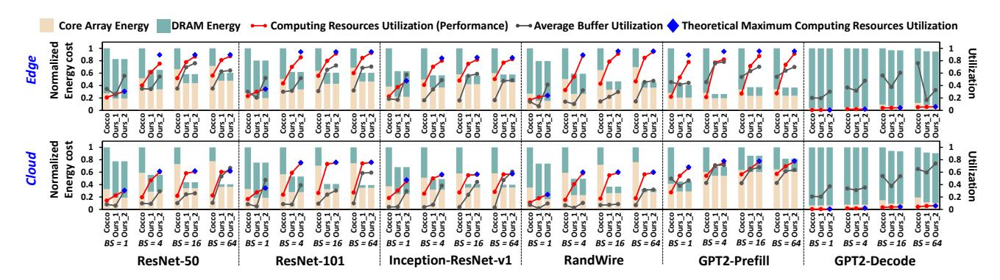
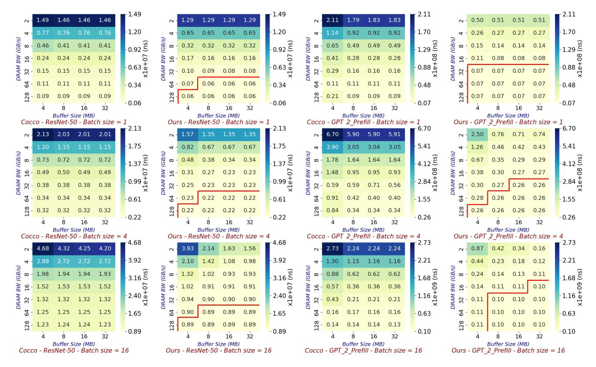

# *A. Experiment Setup*

*1) Hardware Configuration:* To comprehensively evaluate the effects of SoMa, we utilize both edge and cloud hardware platforms: we set the edge computing power to 16 TOPS (referencing Qualcomm Snapdragon 8 Gen 3's 15 TOPS [44] and Apple A15's 15.8 TOPS [4], A16's 17 TOPS [5]), and the cloud to 128 TOPS (referencing NVIDIA Orin's 138 TOPS [39] and TPU V4i's 136 TOPS [25]). Buffer and DRAM bandwidth are set to 8MB and 32MB, and 16GB/s and 128GB/s, respectively, based on our DSE results in Fig. 7. This configuration allows accelerators to achieve outstanding performance with reasonable hardware resources. We also thoroughly tested SoMa's performance under different buffer sizes and DRAM bandwidths (as shown in Fig. 7). The default process technology is TSMC 12nm, with an operating frequency of 1GHz. All unit energy costs for different operations required by the Evaluator (as introduced in Sec. V-D) are obtained from the actual RTL code synthesis and simulation during our accelerator development. The optimization goal is set as Energy1×Delay1 , as both energy costs and performance are crucial in inference accelerators [16], [22].

*2) Workload:* To comprehensively evaluate SoMa effects and analyze the trade-offs behind different DRAM communication scheduling schemes, we scale batch size from 1 to 64, covering latency-sensitive scenarios to throughputcentric scenarios as introduced in Sec. V-A. In our experiments, ResNet-50 [19], ResNet-101 [19], Inception-ResNetv1 (IRes) [47], Randwire [56] and GPT-2 [45] are chosen as workloads. ResNet-50 is chosen because it takes classical residual structures widely employed in many DNNs. ResNet-101 is chosen because it has a similar structure to ResNet-50 but with a larger number of layers. The Inception-ResNet-v1 and Randwire are selected to represent the DNNs with wider and more complex structures. GPT-2 is selected to represent language-processing DNNs. Since GPT-2 has various versions for different scenarios, we use GPT-2-Small with a token length of 512 (prefill 512 and decode the 513th) for the edge platform, and GPT-2-XL with a token length of 1024 (prefill 1024 and decode the 1025th) for the cloud platform.

Fig. 6. Overall Comparisons between Cocco and SoMa (Ours). Ours\_1 and Ours\_2 demonstrate how the efficient solution is progressively optimized through the first and second stages. Computing Resources Utilization equals to Util(Actual Evaluated Latency), where  $Util(t) = \text{Total Number of Operations in Network/(Peak Hardware Computing Power <math>\times$  t). Thus, the utilization can be viewed as a measure of performance. Average Buffer Usage is calculated as  $\sum_{Tile}(\text{Buffer Usage} \times \text{Computing\_Time}_{Tile})/\text{Total Comp Time}$ . The Theoretical Maximum Computing Resources Utilization (represented by Blue Diamonds) is used to measure the theoretical maximum optimization possible in the second stage. Specifically, it is  $Util(MIN\{\sum_{Tile} \text{Computing\_Time}_{Tile}, \sum_{Tensor} \text{DRAM\_Access\_Time}_{Tensor}\})$ , without considering dependencies (e.g.,  $Util(MIN\{(I_{A1} + ... + C_4)\})$ ) in Fig. 2). This means the theoretical optimization upper limit in the second stage is achieved when all DRAM tensors or computing tiles are continuously executed without stall. BS represents batch size. For the edge platform, the workload is GPT-2-Small, while for the cloud platform, it is GPT-2-XL.

ResNet-50 and GPT-2 are chosen as the default workloads for the discussion due to their representativeness and popularity in image and language processing, respectively.

3) Baseline: We select the SOTA Cocco scheduling framework [49] as our baseline, as it explores the layer-fusion space while adopting mainstream tiling and prefetch-and-delayed-storing strategies.

#### B. Overall Comparisons

Fig. 6 shows that after the first stage, SoMa, on average, improves  $1.82\times$  performance and reduces 37.3% energy costs compared to Cocco. The second stage, on average, further improves performance by  $1.16\times$  over the first stage. It can be observed that the schemes found in the second stage are very close to the theoretical maximum optimization value (blue diamonds), with an average difference of only 3.1%. Thus, after optimization through the two stages, the best-explored solution improves  $2.11\times$  performance and reduces 37.3% energy costs.

SoMa improves performance by  $2.15\times$ ,  $2.18\times$ ,  $2.01\times$ ,  $2.61\times$ ,  $2.55\times$  and  $1.14\times$  and reduces energy cost by 39.5%, 41.0%, 46.0%, 47.1%, 47.0%, and 3.1% on ResNet-50, ResNet-101, Inception-ResNet-v1, RandWire, GPT2-Prefill, and GPT2-Decode compared to Cocco, respectively. This demonstrates that SoMa can consistently improve performance and energy efficiency on various DNNs. However, compared to other networks, including GPT-2-Prefill, SoMa demonstrates almost no optimization effect in GPT-2-Decode, and the overall computational utilization remains extremely low. This is because the decode stage exhibits significantly lower compute density [43], with its latency primarily dominated by weight and KV cache loading. Moreover, another interesting phenomenon is that the computational utilization of GPT-2 does not increase linearly with the batch size; instead, the growth rate gradually diminishes. For instance, after SoMa optimization, the utilization rates for GPT-2-Small-Decode and GPT-2-XL-Decode across batch sizes of 1, 4, 16, and 64 are 0.66%, 2.03%, 4.26%, 5.84% and 0.60%, 1.90%, 4.13%, 5.83%, respectively. This is because, as the batch size grows, the increasing size of the KV cache becomes comparable to or even exceeds that of the weights, diminishing the benefits of further increases in batch size for improving compute density.

1) Analysis of the First Stage of SoMa: In the first stage of SoMa, we observe significant reductions in Core Array Energy and DRAM Energy by 34.8% and 44.3%, respectively. This reduction in Core Array Energy is mainly due to the flexibility of our approach in adjusting the Tiling Number during exploration, unlike Cocco's more conservative approach that selects each tile size based only on the basic parallelism requirements of the computing units [49] (detailed analysis and example can be found in Sec. VII-B1). Therefore, our approach often has fewer tiles within the buffer constraint (with an average total number of computing tiles per network being 7962 for Cocco and 751 for ours), with each tile being larger, allowing more optimization and reuse opportunities in the Core Array Scheduler. The decrease in DRAM Energy is because SoMa allows for a smaller number of LGs per network (an average of 2.5) compared to Cocco (an average of 13.0), meaning it can fuse more layers. The main reasons for this difference are: 1) Cocco's finer-grained tiles result in significant accumulated backtracking halo overlap costs when dealing with convolutional and pooling layers (as introduced in Sec. III-A and Fig. 2). 2) Our approach can use FLCs (with an average of 3.9 FLGs per network) instead of DRAM Cuts to free some weights (as introduced in Sec. IV-A1) and adjust the Tiling Number. Specifically, shuffling weights can save buffer space, enabling the fusion of more layers. Moreover, since different FLGs can have different Tiling Numbers, the FLC can switch the computing granularity between two FLGs without accessing DRAM (detailed analysis in Sec. VII-B1).

Fig. 7. Design Space Exploration over DRAM Bandwidth and Buffer Size for the 16TOPS Edge DNN Accelerator. We present the latency corresponding to the optimal schemes explored using Cocco and SoMa (Ours) under different networks, batch sizes, DRAM bandwidth, and buffer sizes. In the results of Ours, we highlighted the hardware configurations with the same minimum value (accurate to two decimal places) using a red envelope curve.

The performance improvement also largely stems from the above-analyzed factors, as coarser-grained tiles provide more on-chip reuse opportunities, better overlapping of computation, and GBUF access time, while Cocco may sometimes suffer from GBUF load and store stalls. Additionally, the significant reduction in DRAM accesses naturally reduces overall latency.

*2) Analysis of the Second Stage of SoMa:* The performance improvement brought by the second stage mainly comes from effectively exploiting the DRAM usage imbalance opportunities described in Sec. III-B. Specifically, by intelligently prefetching and delaying storing, many DRAM idle periods can be utilized, reducing computation stalls and DRAM bandwidth waste. In Sec. VII-B2, we demonstrate this optimization through a simple practical example.

