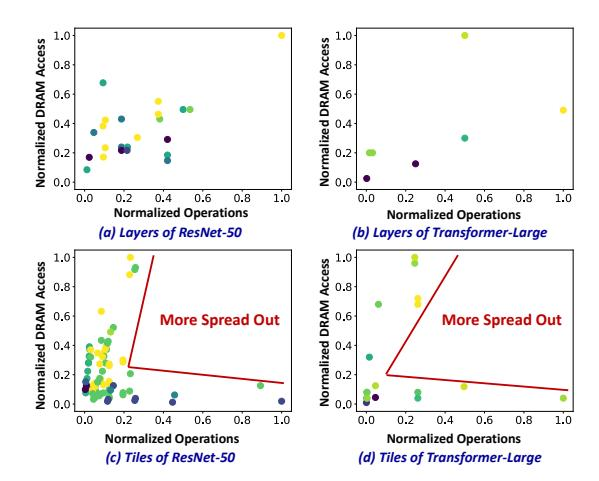

# *A. Layer Fusion*

Layer fusion is an important paradigm for using buffers to optimize DRAM communication [3], [37], [49], [59]. Fig. 2 illustrates the computation and DRAM access behavior of a simple three-layer network under layer fusion, where multiple fused layers are computed in a fine-grained manner sequentially, relying on on-chip buffers for switching fmaps. The optimization dimensions within this paradigm are numerous and complex, but have not been clearly depicted and analyzed. A straightforward optimization dimension is which layers to fuse, which affects both DRAM access savings and buffer occupancy. This is the primary focus of most existing studies [49], [59]. Another evident optimization dimension is the computing granularity of each fused layer group, i.e., the size of each computing tile (Fig. 2). This affects buffer occupancy, halo overlap overhead, and the effectiveness of intra-core optimizations (detailed analysis is in Sec. IV-A1).

Fig. 3. (a) and (b) show the normalized DRAM access and the normalized operation number for each layer in ResNet-50 and Transformer-Large, respectively (each point represents a layer). (c) and (d) show the normalized DRAM access and the normalized operation number for each smallest computing unit (Tile) of ResNet-50 and Transformer-Large, respectively, scheduled using the SOTA Cocco Framework (each point represents a Tile). *The darker the color, the more identical overlapped points there are*. The normalization method involves dividing the value of each point by the maximum value among all points (DRAM access and operations are independently normalized). We use the default edge accelerator and batch size 1, as introduced in Sec. VI-A

DeFENIS [37] has analyzed this dimension but has not jointly explored the above two dimensions. Most other studies address this dimension using heuristic rules [49], [59], overlooking optimization opportunities within this space. We can see that even these two dimensions lack systematic joint exploration, let alone additional dimensions (introduced in Sec. IV-A1) that have been overlooked by existing works.

