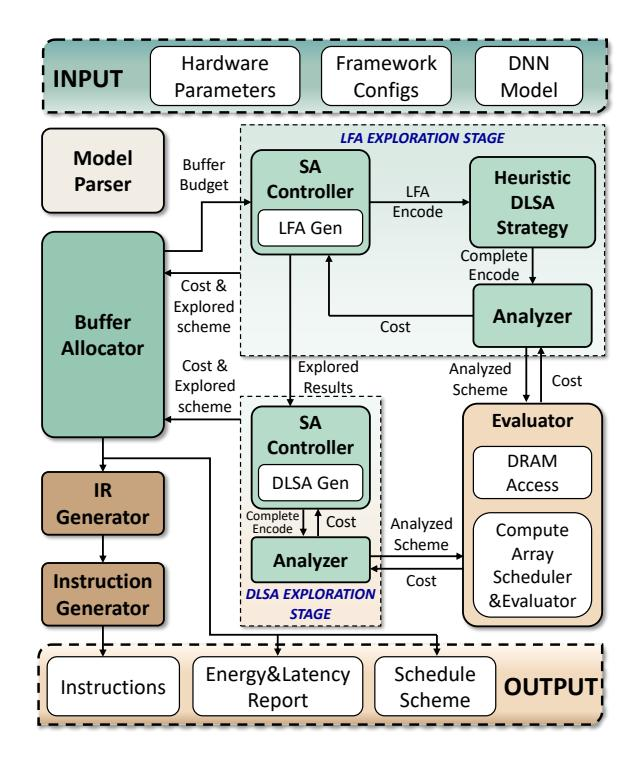

# A. SoMa Overview

As shown in Fig. 5, SoMa is an end-to-end DNN scheduling framework. SoMa takes as inputs: 1) hardware configuration, such as the number and organization of cores, DRAM bandwidth, buffer size, etc.; 2) framework configurations, such as the optimization goal and searching hyperparameters, etc.; 3) a DNN model description file generated by high-level frameworks like PyTorch After scheduling, SoMa outputs: 1) instructions; 2) reports on energy costs and latency; 3) a detailed scheduling scheme.

The optimization objective of SoMa is  $Energy^n \times Delay^m$ , where n and m are adjustable parameters that prioritize energy efficiency or performance according to different needs. Energy and Delay refer to the total energy costs and latency for processing a batch of samples, respectively. Thus, small

Fig. 5. SoMa Framework

batch sizes can evaluate SoMa's effectiveness in latencycentric scenarios, while larger batch sizes can be used for throughput-centric scenarios.

Fig. 5 shows that the key exploration process is governed by three main components: the Buffer Allocator, the LFA Exploration Stage, and the DLSA Exploration Stage. The Buffer Allocator controls the outermost iteration, each involving a complete two-stage top-down exploration. Based on the respective effects and buffer usage of the two stages in the previous iteration, the Buffer Allocator adjusts the buffer budget for the two stages competing for buffer usage in the current iteration. The two-stage top-down exploration involves separately varying and searching LFA and DLSA in each stage, with each stage using SA for independent searches.

The reason for using a two-stage search with a Buffer Allocator is that: 1) as analyzed in Sec. III-C, a single change in LFA can significantly impact DRAM tensors (e.g., adding or removing a DRAM Cut or changing the Tiling Number), thus previously optimized DLSA attributes may become suboptimal or even invalid. This makes it difficult to retain good solutions obtained by varying DLSA attributes while continuously varying LFA. 2) The two-stage exploration with a Buffer Allocator can produce strong synergistic effects. DRAM access has a significant impact on performance and energy costs. Therefore, we observe that the first stage's optimization tends to minimize fmaps-related DRAM access, which reduces the optimization difficulty and increases the potential for the second stage optimization. This is mainly because a) the large proportion of weights is beneficial for optimization, as weights have fewer dependency constraints and can be adjusted more freely, while fmaps have more complex dependencies with a narrower range of adjustments; b) more extensive layer fusion and reduced DRAM access result in purer compute time, providing greater optimization opportunities for the second stage. Therefore, we found that dividing the optimization into two stages can produce good synergistic effects. The only risk is that the first stage might occupy too much buffer space, excessively limiting the optimization space for the second stage. We address this potential risk through the Buffer Allocator.

The optimal results can be directly output from the Buffer Allocator as scheduling schemes and reports, or they can be converted into a more easily parsable intermediate representation (IR) through our IR Generator module. This IR can then be fed into the Instruction Generator module to generate actual instructions

