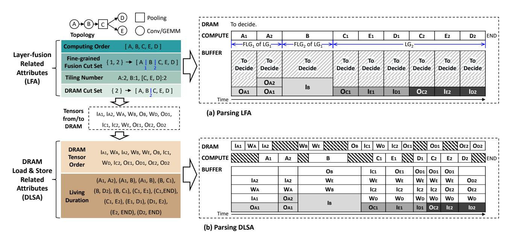

# *B. Prefetching and Delayed Storing*

Besides layer fusion, we have identified another optimization opportunity overlooked by existing literature: prefetching and delayed storing. We argue this paradigm also has great potential based on the following insightful observation.

As shown in Fig. 3(a) and (b), in modern DNNs, the DRAM access demand and computing requirements vary significantly across different layers. Unfortunately, after layer fusion, the variance in the memory access to computation ratio for each tile becomes even more pronounced (see Fig. 3(c) and (d)), which are more spread out along the axes compared to their counterpart in Fig. 3(a) and (b). This indicates a larger number of DRAM-access-intensive and compute-intensive tiles, with fewer tiles having balanced demands. Specifically, this is because, within a fused layer group, the first tile of each layer with weights needs to load weights (e.g., A1, B1, C1 in Fig. 2), which often results in high DRAM demand, corresponding to the points near the Y-axis in Fig. 3(c) and (d). The subsequent tiles do not need to load weights (e.g., A2, B2, C2 in Fig. 2). Additionally, many fmaps' DRAM access requirements are eliminated as a result of fusion (e.g., the ofmaps of Ai and Bi). Consequently, many tiles even have no DRAM access demand (e.g., B2, B3, B4), corresponding to the points near the X-axis in Fig. 3(c) and (d).

Fig. 4. Parsing an Example Encode of a Five-Layer Network into Actual Scheduling Schemes. The DRAM, COMPUTE, and BUFFER in the right part show the DRAM access, workload computation, and buffer usage, respectively. We use  $M_i$  to represent the *i*th tile of layer  $M_i$ , and  $I/O_{Mi}$  to represent the ifmaps and ofmaps of  $M_i$ .  $W_M$  represent the weights of layer  $M_i$ . In the BUFFER, blocks with the same background color represent the same data.

This severe imbalance between DRAM access and compute demands makes the overlap between DRAM access and compute under the traditional double-buffer strategy (prefetching data in the previous tile and storing data in the next tile) insufficient, especially in the context of layer fusion. For example, Fig. 2 shows the DRAM communication under the traditional double-buffer strategy. As seen, there is a waste of DRAM bandwidth, and the computing resources are severely stalled. To better demonstrate the severity and prevalence of this challenge, we analyze the workloads, batch sizes, and platforms in Sec. VI-A. With the SOTA Cocco Scheduling Strategy, the DRAM and computation utilization rates for the case in Fig. 2(c) are 52.69% and 62.64%, respectively, while in Fig. 2(d) they are 72.45% and 45.84%. These utilization are defined as the ratio of the sum of all DRAM tensors/computing tiles time to the total runtime. This result indicates that neither resource is fully utilized, leaving significant opportunities for overlap.

Based on the above observation and analysis, we find that controlling the timing of data prefetching and storing to utilize idle DRAM bandwidth and alleviate peak-time pressure has great potential. For example, suppose that there are two consecutive identical Layer-fusion Groups (LG and LG') (Fig. 2 shows LG, and LG' is not shown). By prefetching LG''s  $W_A', W_B'$ , and  $W_C'$  during the DRAM idle time corresponding to  $B_3, B_4$ , and  $C_4$  in LG, the computing stall at the start of LG' can be resolved. Additionally, starting to load  $I_{A3}$  and  $I_{A4}$  in LG earlier can also erase the stalls before  $A_3$  and  $A_4$  in LG. However, achieving precise and automatic control over prefetching and delayed storing is non-trivial. Clearly defining, thoroughly exploring, and understanding this paradigm is a significant challenge.

#### C. Combine Them Together

"Layer Fusion" and "Prefetching and Delayed Storing" are two optimization paradigms with complex interrelationships, which lie in two aspects. The first aspect lies in the fact that both optimization paradigms inherently trade buffer usage for DRAM communication optimization, leading to competition for buffer resources between the two. Additionally, the layer fusion choice affects DRAM communication requirements, which in turn impacts the optimization space of prefetching and delayed storing. Therefore, these two paradigms exhibit complex interactions within the DRAM Communication Scheduling Space. Efficiently and structurally exploring this space presents a major challenge. Addressing this challenge and gaining a deep understanding of these interactions form the key objectives of this paper.

#### IV. TENSOR-CENTRIC NOTATION

