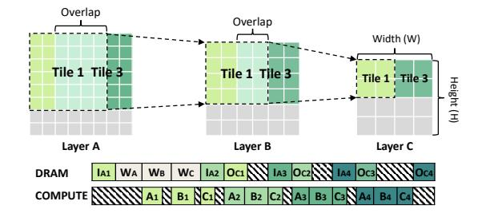

# II. HARDWARE BASIS

In this section, we introduce a generic large-scale DNN accelerator template (Fig. 1) and the corresponding abstract instruction system adopted in this paper, which represents many mainstream commercial DNN accelerators [6], [16], [24]–[26], [34], [38].

As shown in Fig. 1(a), the template primarily consists of DRAM, a Global Buffer (GBUF), and several cores. The GBUF is shared among all cores. As shown in Fig. 1(b), each core has private small buffers/register files (W L0, AL0, OL0) for rapid access by computing units. The PE Array is used for computing GEMM/Conv operations, and the Vector Unit is designed for computing other vector/scalar operations, such as element-wise addition, pooling, layer normalization, etc.

Although specific instructions vary significantly among these accelerators, they still share apparent common patterns. Based on these common patterns, we abstract three instructions: load, store, and compute. The "load" and "store" instructions refer to moving data from DRAM to the GBUF and from the GBUF to DRAM, respectively. The "compute" instruction refers to the operations performed on a tensor/vector. In accelerators, a tensor is often divided into smaller tensors, which are sequentially processed by the core group. Each small tensor is further split into smaller subtensors for parallel processing by the cores within the core group. The specific operations involved include loading ifmaps and weights from GBUF into the local buffer of each core, performing the computations, and then writing the computed ofmaps back to the GBUF. Since these instructions typically occur in sets and are synchronized, and as this study focuses on optimizing DRAM communication, we abstract them into a single "compute" instruction. In our DRAM-COMPUTE diagram (e.g., Fig. 4 Bottom), "load & store" instructions and "compute" instructions can be respectively represented by

Fig. 2. A Practical Layer-fusion Group (LG) Example

tensor blocks in the DRAM row and the COMPUTE row. The start and end of any instruction can serve as markers for the beginning of another instruction (Fig. 4 Right).

