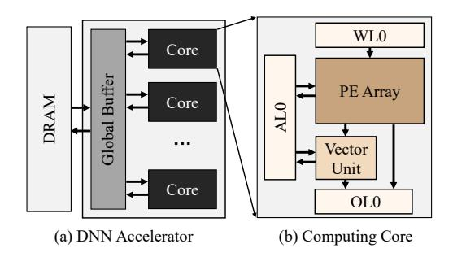

# SoMa: Identifying, Exploring, and Understanding the DRAM Communication Scheduling Space for DNN Accelerators

Jingwei Cai†, Xuan Wang‡§, Mingyu Gao†¶♠, Sen Peng‡§, Zijian Zhu†, Yuchen Wei†, Zuotong Wu‡§, and Kaisheng Ma†\*
Tsinghua University†, Xi'an Jiaotong University‡, IIISCT§, Shanghai AI Laboratory¶ Shanghai Qi Zhi Institute♠
Corresponding Author\*

{caijw21,gaomy,zhuzj23,weiyc22,kaisheng}@tsinghua.edu.cn, {xuanwang,3123353083}@stu.xjtu.edu.cn

Abstract—Modern Deep Neural Network (DNN) accelerators are equipped with increasingly larger on-chip buffers to provide more opportunities to alleviate the increasingly severe DRAM bandwidth pressure. However, most existing research on buffer utilization still primarily focuses on single-layer dataflow scheduling optimization. As buffers grow large enough to accommodate most single-layer weights in most networks, the impact of single-layer dataflow optimization on DRAM communication diminishes significantly. Therefore, developing new paradigms that fuse multiple layers to fully leverage the increasingly abundant on-chip buffer resources to reduce DRAM accesses has become particularly important, yet remains an open challenge.

To address this challenge, we first identify the optimization opportunities in DRAM communication scheduling by analyzing the drawbacks of existing works on the layer fusion paradigm and recognizing the vast optimization potential in scheduling the timing of data prefetching from and storing to DRAM. To fully exploit these optimization opportunities, we develop a Tensor-centric Notation and its corresponding parsing method to represent different DRAM communication scheduling schemes and depict the overall space of DRAM communication scheduling. Then, to thoroughly and efficiently explore the space of DRAM communication scheduling for diverse accelerators and workloads, we develop an end-to-end scheduling framework, SoMa, which has already been developed into a compiler for our commercial accelerator product. Compared with the stateof-the-art (SOTA) Cocco framework, SoMa achieves, on average, a 2.11× performance improvement and a 37.3% reduction in energy cost simultaneously. Then, we leverage SoMa to study optimizations for LLM, perform design space exploration (DSE), and analyze the DRAM communication scheduling space through a practical example, yielding some interesting insights. Moreover, SoMa has been open-sourced at https://github.com/SET-Scheduling-Project/SoMa-HPCA2025.

#### I. INTRODUCTION

In order to process a variety of tasks with better performance and accuracy, DNNs are rapidly becoming more complex and heavy [13], [14], [19], [41], [51]. Accelerators [23], [25], [26], [31], [34], [38] with more computing units, larger buffers, and higher memory bandwidth have been developed to accelerate these DNN workloads.

However, under modern semiconductor process, the rate of increase in DRAM bandwidth lags behind the rate of transistor density growth, which is a long-standing issue [46], [54]. This disparity is even more pronounced in DNN accelerators [46],

[60], which are more specialized and have a larger proportion of dedicated computing elements than traditional chips like CPU. Thus, DRAM communication is increasingly becoming a performance bottleneck in DNN computation [46], [60]. To mitigate this bottleneck, accelerators are equipped with increasingly larger on-chip buffers [18], [23], [25], [31], [34], [38], which provide opportunities to optimize DRAM communication by exploiting reuse opportunities in DNNs.

Several works leverage buffer resources to reduce DRAM accesses under the paradigm of "layer fusion" [3], [7], [8], [29], [33], [37], [49], [60]. This approach involves buffering the feature maps (fmaps) produced by earlier layers on-chip, allowing subsequent consuming layers to read them directly. This strategy avoids the overhead of first writing back to DRAM and then reading from it, thereby reducing DRAM access costs. This optimization paradigm holds immense potential; for instance, Cocco [49] achieved performance improvements ranging from 1.89% to 50.33% by merely exploring the option of which layers to fuse. Beyond this, there are numerous dimensions worth exploring under this paradigm, such as execution order and execution granularity. However, like Cocco, most existing studies [3], [37] have only focused on a small portion of this optimization space. Therefore, we believe that the complex optimization dimensions within the layer-fusion paradigm have yet to be clearly delineated or defined, much less thoroughly explored and understood in the context of the entire layer-fusion optimization space.

While reducing DRAM access is an important approach for optimizing DRAM communication, we identify another optimization approach that has been largely overlooked in the field of DNN scheduling: prefetching and delayed storing, i.e., adjusting the timing of fetching/storing data from/to DRAM to be sometime earlier/later. We focus on this approach and believe it has potential based on an insightful observation: in modern DNN networks, the ratio of DRAM bandwidth demand to computing demand varies significantly across different layers (see Fig. 3). After layer fusion, the overall ratio of DRAM bandwidth demand to computing demand for different tiles (computing unit) varies even more (see Fig. 3). This observation indicates that with the application of layer fusion, DRAM bandwidth usage during the entire computing

process becomes very uneven—sometimes leading to congestion due to high demand and sometimes causing bandwidth resource waste due to low demand. This motivates us to apply prefetching-and-delayed-storing techniques to alleviate the uneven DRAM communication load. However, choosing the appropriate timing for prefetching and storing is a nontrivial problem. Clearly defining, thoroughly exploring, and understanding this paradigm is a significant challenge.

"Layer Fusion" and "Prefetching and Delayed Storing" each have their own optimization spaces, but they are not independent and are intricately coupled. This is reflected in the following points: 1) both paradigms trade buffer usage for DRAM communication optimization, leading to competition for buffer usage, and 2) layer fusion affects the types and quantities of data that need to communicate with (i.e., prefetch from and store to) DRAM. Therefore, we define the complex space formed by these two paradigms as the DRAM Communication Scheduling Space.

After identifying the challenges and optimization potential of DRAM communication scheduling, we make the following contributions to identify, explore, and understand DRAM Communication Scheduling Space.

We first introduce a Tensor-centric Notation with two categories and a total of six attributes to encode the scheduling schemes in the DRAM Communication Scheduling Space; then we show how to parse each encoded scheme into actual hardware behaviors. Based on this notation, we define and illustrate the DRAM Communication Scheduling Space and the complex trade-offs behind it. Existing works can be described using our notation, representing only a small subset within the space we have defined. To the best of our knowledge, this work is *the first* to comprehensively define and analyze the DRAM Communication Scheduling Space.

To thoroughly and structurally explore the DRAM Communication Scheduling Space defined by the Tensor-centric notation, we develop an end-to-end framework, SoMa, which employs a Buffer Allocator, a two-stage simulated annealing (SA) exploration engine, and an accurate simulator to conduct a structured and efficient exploration of the space. We have successfully built a complete compilation flow based on SoMa, from model input to instruction generation, for an accelerator approaching mass production.

Then, we conduct extensive experiments on different workloads (including CNNs and LLMs), hardware configurations, and batch sizes, demonstrating an average of a 2.11× performance improvement and a 37.3% reduction in energy costs compared to the SOTA framework, Cocco. We analyzed the experimental performance of LLMs and uncovered several intriguing phenomena: (1): For the decode stage, the optimization potential of DRAM scheduling is minimal due to its extremely low compute density, which imposes a pure DRAM bandwidth demand on the accelerator. (2): For the decode stage, increasing the batch size does not consistently improve computational utilization. As the batch size grows, the increasing size of the KV cache becomes comparable to that of the weights, diminishing the benefits of further increases in

Fig. 1. DNN Accelerator Template

batch size for improving compute density. In addition, we use SoMa to explore and analyze the architectural design space, gaining some interesting insights. For example, with small batch sizes, DRAM bandwidth plays an irreplaceable role. However, with SoMa, the importance of the buffer becomes increasingly prominent as the batch size increases. Moreover, we present a practical execution graph comparison between Cocco and SoMa to enhance understanding of the trade-offs underlying the DRAM Communication Scheduling Space.

