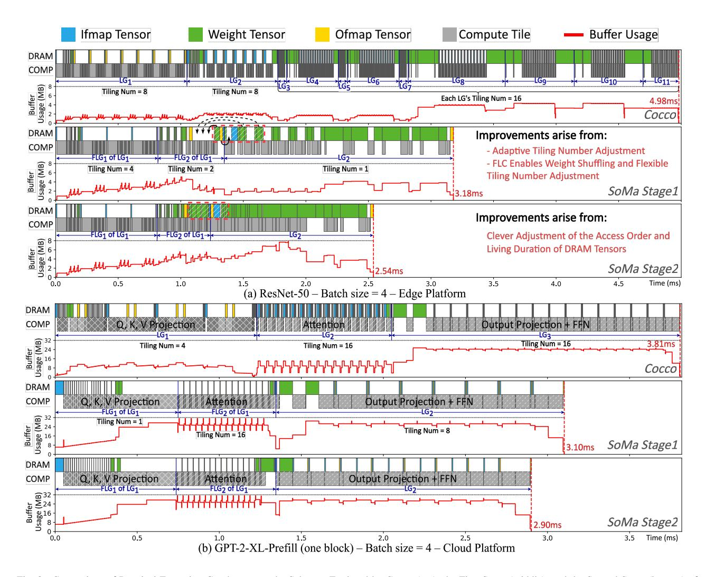

# size. However, the impact of buffer size becomes more significant as the batch size increases.

For small batch sizes (e.g., Ours-Batch size = 1 in Fig. 7), the greater influence of DRAM bandwidth is evident as increasing buffer size does not significantly reduce latency, even with SoMa. However, increasing DRAM bandwidth results in a noticeable reduction in latency. This is because: 1) the fmaps sizes are small, so a minimal buffer can almost entirely store data on-chip, making further increases in buffer size unnecessary; 2) weights need to be loaded regardless, but a small batch size means less computation, providing fewer opportunities for SoMa to use prefetching and delayed storing to hide data transfer times. Consequently, weight loading times can severely stall computation and dominate latency. Thus, increasing DRAM bandwidth can directly reduce this latency and significantly enhance overall performance.

As the batch size increases, the impact of buffer size becomes more significant, as evidenced by the greater reduction in latency with larger batch sizes when increasing buffer size (e.g., Ours-Batch size = 4 and 16 in Fig. 7). This is because: 1) the fmaps sizes increase, allowing a larger buffer to better exploit reuse opportunities; 2) additionally, with more computation, the longer computing times provide more opportunities for SoMa to use the buffer for prefetching and delayed storing to hide data transfer times.

Fig. 8. Comparison of Practical Execution Graphs among the Schemes Explored by Cocco (top), the First Stage (middle), and the Second Stage (bottom) of SoMa on default edge-side accelerator. We also point out all DRAM Cuts, FLCs, and their corresponding Tiling Numbers. In the running graph for one block of GPT-2-XL-Prefill, we have highlighted the main matrix multiplication layers, while certain element-wise layers (such as transpose, softmax, add, and layer normalization) are not explicitly marked. Q, K, and V represents Query, Key, and Value, respectively.

