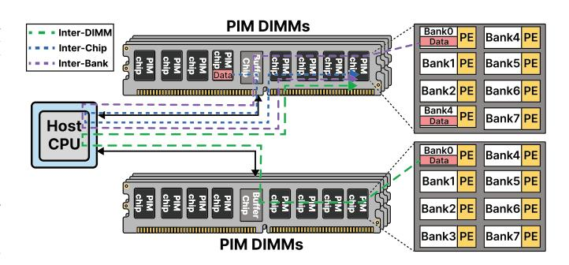

# *A. DIMM PIM Architectures*

Among various PIM solutions [24], [46], [53], [54], DIMMbased PIM architectures have gained significant attention in both academia and industry due to higher economic advantage and manufacturing feasibility [7], [62]. Compared to alternatives like HBM [54], DIMM-based solutions offer larger memory capacities, lower fabrication costs, and enhanced device compatibility. UPMEM PIM [24] is the first commercially available commodity processing-in-memory architecture. As illustrated in Figure 1, each UPMEM PIM DIMM adopts the form of a standard DDR4-2400 DIMM module. A PIM-server with UPMEM features a hierarchical architecture where each system can integrate up to 20 UPMEM DIMMs, with each DIMM containing two ranks of eight PIM chips. Every PIM chip incorporates eight independent 64MB DRAM banks, each directly coupled with a programmable DRAM processing unit (DPU). The DPU is a 32-bit scalar in-order core based on the RISC ISA. There are also two scratchpads, a 24KB instruction memory (IRAM) for program binary and a 64KB working memory (WRAM) for fast data access [24]. This DIMM PIM architecture is conducive to data-intensive workloads. The primary reason is the integration of DPUs onto DRAM chips, which facilitates the replacement of off-chip data transfers with low-power on-chip data movements.

However, as illustrated in Figure 1, a critical limitation exists in current DIMM-based PIM systems: there is no direct communication method between different PIM banks. Whether the communication occurs across banks within the same chip, between chips, or across ranks, all inter-PE data exchanges must be routed through the host CPU. Constrained by the narrow bandwidth of the memory channel between the host and DIMM PIM modules, this naive CPU forwarding mechanism limits the communication throughput and scalability of the PIM system. As a result, inter-PE communication has become a major bottleneck in DIMM PIM architectures.

Fig. 1. System-level overview of communication in DIMM-based PIM architectures. Existing systems lack direct inter-PE communication paths. Data exchanges across banks, chips, or ranks require host CPU forwarding.

### *B. Collective Communication on DIMM PIM architecture*

Collective communication is a fundamental mechanism for enabling efficient coordination in parallel computing systems. It typically involves orchestrated data exchanges and operations across multiple compute nodes, known as collective operations. Representative examples include Broadcast, All-Gather, All-Reduce, and Reduce-Scatter. For instance, an All-Reduce performs a reduction (e.g., sum) across distributed partial results from multiple PEs. These primitives allow PEs to efficiently coordinate complex data exchanges and computations, and are widely utilized in domains such as highperformance computing (HPC) [30], [55], [71], [85], machine learning [31], [73], [82], and graph processing [33], [34], [87]. As the number of PEs scales, the efficiency of collective communication becomes a key determinant of overall system performance and scalability.

While collective communication has been optimized for traditional distributed systems [9], [13], [78], these designs are generally based on the systems with hardware and protocol support [18], [20], [52], [72], making them not practical for PIM systems. Existing DIMM-based PIM architectures rely on host CPU forwarding to perform collective communication. Although this approach is simple to implement, it incurs frequent data transfers between PEs and the host CPU, resulting in significant overhead. This severely limits both the effective communication bandwidth and scalability of the system.

Recent research has explored hardware-based optimizations to mitigate these issues, such as introducing dedicated buses [77] or dedicated point-to-point links [86] to enable direct inter-PE communication. However, dedicated buses face signal integrity and timing challenges [86], which hinder their practicality. Similarly, dedicated links often suffer from limited scalability [19], [77] and still depend partially on CPU forwarding [76], [79], failing to completely eliminate CPU intervention. Therefore, enabling efficient, low-overhead, and scalable direct collective communication among PEs remains a critical challenge in current DIMM PIM architectures.

