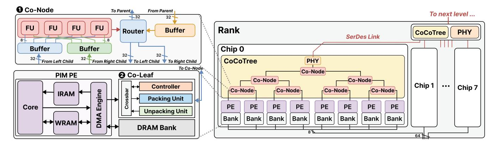
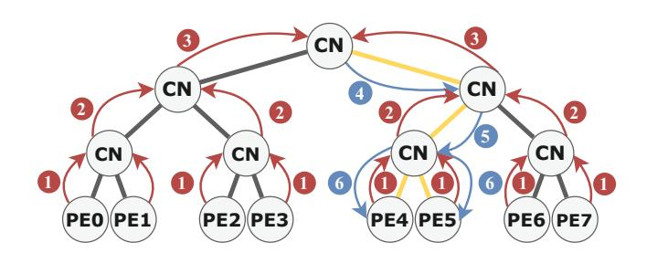
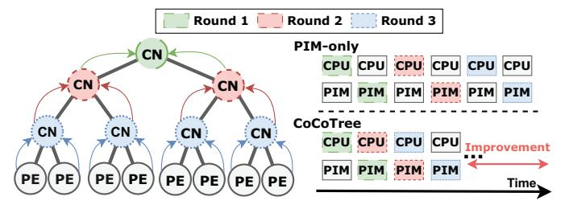

# *A. Overview*

As illustrated in Figure 4, our proposed scalable PIM architecture, named CoCoTree, leverages a hierarchical binary-tree structure to address the inter-PE communication bandwidth limitations in traditional DIMM-based PIM systems.

CoCoTree System Architecture: The system consists of the DIMM PIM and our tree-structured collective communication network, CoCoTree. In this work, we take UPMEM as a representative DIMM PIM platform. PIM processing elements (PEs) execute data-intensive computational tasks near memory, whereas the CoCoTree supports efficient collective communications among these PEs.

CoCoTree Network: The CoCoTree can be conceptually viewed as a perfect binary tree composed primarily of two types of components: ❶ Co-Node and ❷ Co-Leaf. Integrated within each bank-level PIM PE, Co-Leaf connects PIM PE to the CoCoTree network. Co-Nodes function as intermediate nodes performing data processing and forwarding operations. Specifically, data from PEs enters the CoCoTree through the Co-Leaf and ascends hierarchically through the network. Each Co-Node performs configured processing or forwarding until the data reaches the root node of the working subtree. Subsequently, the processed data is disseminated back down the tree to the target PEs to complete the collective communication.

The placement of Co-Node and Co-Leaf is strategically designed to maximize system performance and minimize wiring complexity. Co-Leafs are embedded inside each PIM PE for efficient data packing and unpacking, while Co-Nodes are arranged to form intra-chip binary trees. These chip-level trees are then connected via bi-directional SerDes links on the PCB to a dedicated rank-level CoCoTree, which can further be composed across multiple ranks into a DIMM-level CoCoTree, forming a hierarchical communication network for the PIM memory.

Co-Node: Each Co-Node is a lightweight, computationcapable, and configurable network switch with three interfaces connecting to parent, left-child, and right-child nodes. Co-Nodes receive upstream data from child nodes and execute reduction or forwarding based on configured settings, forwarding results upwards to parent nodes. Additionally, they manage downstream data received from parent nodes, selectively routing this data to the left, right, or both child nodes. Co-Nodes feature multiple Functional Units (FUs) to efficiently support low-overhead integer reductions of arbitrary byte-width and dynamically expandable data widths, especially beneficial for reduction operations.

Co-Leaf: The Co-Leaf functions as a bridge between PEs and Co-Nodes. It packs data from PEs into data packets that are compatible with Co-Nodes and transmits them accordingly. Co-Leaf also receives packets from Co-Nodes, unpacks and returns data back to the PE. In this work, we enhance existing PIM PEs by designating Co-Leaf as an additional target for DMA engines, enabling efficient PE-to-Co-Leaf data transfers. Inside each Co-Leaf, a packing unit and an unpacking unit are orchestrated by a local controller to provide efficient data packing and unpacking.

CoCoTree Communication Mechanism: CoCoTree adopts a lightweight packet-based communication mechanism. A twophase communication model is proposed to decouple control and data flow. CoCoTree utilizes data and command packets for computation and configuration phases, respectively. Detailed designs of the packet format and stream control are elaborated in subsequent sections.

### *B. Collective Operation Implementation*

CoCoTree supports a variety of collective communication operations, including broadcast, all-gather, all-reduce, and reduce-scatter, etc. These operations, which are essential in PIM systems, can be offloaded to the CoCoTree architecture and are efficiently executed through hierarchical routing and in-network computation within Co-Nodes, as well as data reassembly logic within Co-Leafs.

Point-to-point, multicast, and broadcast communications are all implemented via tree-based forwarding mechanisms within Co-Nodes, determined by the destination address. The primary difference among them lies in the routing strategy configured during the setup phase. In broadcast and multicast, data from the parent node is simultaneously forwarded to both child nodes, enabling efficient one-to-many distribution. In contrast, point-to-point communication selectively forwards data along a single path based on the encoded address. The all-gather operation is implemented as a pipelined series of broadcast stages, where each PE sequentially contributes its data to

Fig. 4. CoCoTree system architecture overview. It consists of **①** Co-Nodes for in-network computation and hierarchical data routing and **②** Co-Leafs embedded in each PE for packetization.

Fig. 5. Illustration of reduce operation using CoCoTree. (CN: Co-Node)

the subtree. This design avoids bandwidth contention and ensures scalability. Reduce, all-reduce, and reduce-scatter are implemented via tree-based reductions, leveraging the built-in functional units (FUs) in Co-Nodes. As shown in Table I, supported operations include sum, bitwise and/or/xor and unsigned min/max. All operations support arbitrary integer widths. The all-reduce operation first performs an upward reduction, then broadcasts the result downward. The reduce-scatter operation is realized as a multi-stage all-reduce with selective filtering at Co-Leafs to partition the final result.

Figure 5 illustrates a reduce example on CoCoTree, where data from 8 PEs is reduced (Steps ①-②-③) and broadcast to the target subtree (Steps ①-⑤-⑥).

### C. Pipelining

To further improve system performance and reduce the latency of collective communications, CoCoTree adopts a pipeline execution strategy that improves resource utilization across multiple communication rounds. This pipelining allows overlapping between computation and communication stages, enabling high throughput communication.

As illustrated in Figure 6, CoCoTree supports pipeline execution across Co-Nodes, allowing multiple collective communication operations to proceed concurrently at different levels of the hierarchy in the tree structure. Specifically, while the result of a previous communication round is still propagating through the upper levels of the tree, the next round can begin execution in a lower subtree. This hierarchical

Fig. 6. Pipeline parallelism across Co-Nodes(CN), Host CPU and PIM.

pipeline within the CoCoTree improves utilization of internal network bandwidth and maximizes throughput. Figure 6 highlights the pipeline parallelism between the host CPU and the CoCoTree interconnect, demonstrating the performance advantage over traditional PIM systems. In conventional PIM architectures, each collective operation requires host CPU forwarding, leading to serialization between CPU scheduling and PIM execution. In contrast, CoCoTree offloads collective communication to the CoCoTree, eliminating the need for host intervention. This allows the host CPU to prepare data for subsequent tasks while collective operations are still executing in the network, enabling parallel execution across CPU and PIM domains and improving overall system efficiency.

