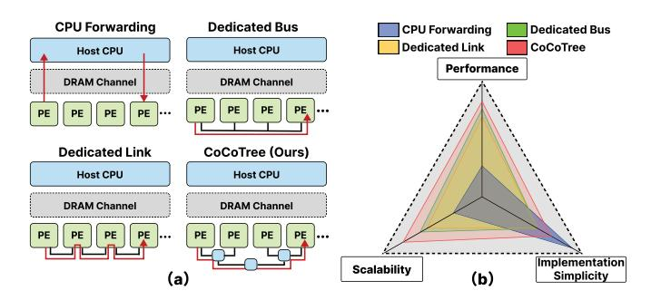

# *B. Analysis of Existing Inter-PE Communication Methods*

As shown in Figure 3, existing inter-PE communication mechanisms in DIMM PIM architectures can be categorized into three distinct approaches: CPU forwarding, dedicated bus, and dedicated link. Each approach exhibits fundamental limitations that constrain system scalability and performance.

(1) CPU Forwarding: CPU forwarding represents the predominant approach, where all inter-PE data transfers are processed and arbitrated through the host CPU. This approach incurs redundant PE-CPU-PE data movement and excessive host CPU overhead. The communication bandwidth is fundamentally constrained by the processing capability and memory bandwidth of the host CPU. While recent work [14] has proposed software-level communication API interfaces to improve efficiency, these approaches are still limited by host CPU bandwidth constraints. (2) Dedicated bus architectures. Previous work [19], [77] adopts multidrop bus architectures to implement broadcast-based direct inter-PE communication. While these approaches reduce CPU intervention, they face significant practical implementation challenges, including timing constraints, signal integrity, and limited scalability due to electrical loading effects [86]. The broadcast-only nature also restricts support for other collective operations. (3) Dedicated link interconnections. Recent research [76], [79], [86] designs dedicated physical links to support communication between PEs. However, [86] shows limited scalability due to high latency and network congestion

Fig. 3. (a) Current inter-PE communication mechanisms in DIMM PIM and (b) qualitative comparison of them.

under high communication loads, and the absence of dedicated hardware support for collective operations further limits their effectiveness. Additionally, [79] proposes a hardware-based bridge that does not provide direct bank-to-bank communication and still needs host CPU forwarding. PIMnet [76] provides a multi-tier interconnect but limits to 256 DPUs within a single memory channel. When DPUs across different channels require communication, PIMnet still relies on host forwarding, ultimately restricting system-level scalability.

These limitations highlight the urgent need for a scalable, low-overhead, collective communication architecture to eliminate host intervention and support efficient coordination among thousands of PEs within and across DIMM modules.

### IV. COCOTREE ARCHITECTURE OVERVIEW

