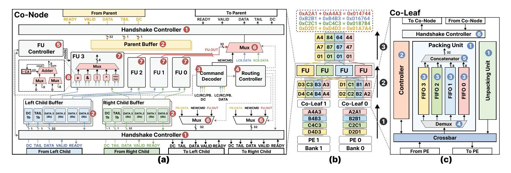
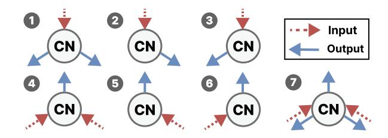
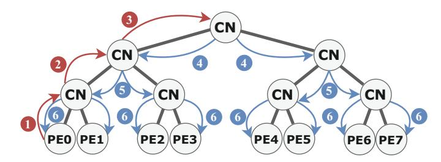

# *B. Co-Node Microarchitecture Design*

Co-Node serves as the fundamental building block of Co-CoTree, which supports configuring and directing data flows to designated destinations. As shown in Figure 8, each Co-Node integrates a configurable router, a set of functional units (FUs), and control logic to enable flexible inter-PE communication and support diverse collective operations. The details are as follows:

Routing and Control Logic: The *routing controller* (❹) governs the forwarding behavior for both upward and downward data transfers. As illustrated in Figure 9, by coordinating the data selector (❻) and handshake controller (❶), it supports three downward (a–c) and four upward (d–g) transfer modes, enabling a wide range of communication patterns.

The *FU controller* (❺) manages FUs (❼) to perform computational operations, including addition, bitwise AND/OR/XOR and unsigned min/max. These computational resources provide hardware acceleration for collective operations. During the

Fig. 8. (a) Detailed microarchitecture of Co-Node and (b) an example of data packing process for a reduce operation and (c) detailed microarchitecture of Co-Leaf.

configuration phase, each PE sends a command packet to configure the routing paths and FU function within the Co-Node. As shown in Figure 8(a), incoming packets are first processed by the handshake controller (❶) and buffered accordingly (❷). Packets from the left and right child nodes (or Co-Leaves) are placed into the corresponding child buffers, while packets from the parent Co-Node are stored in a dedicated parent buffer (PB). When the DC field in a packet is set to 0, it is identified as a configuration packet. The command decoder (❸) parses its command field and configures the routing and FU controllers by updating internal registers.

Functional Unit: The Functional Units (FUs) (❼) in the Co-Node support arbitrary byte-width integer and bitwise operations. Moreover, the FUs enable flexible integer reduction over various data types, such as 8/16/32/64 bits, and feature automatic overflow prevention via width adjustment. While this design supports integer and bitwise operations, floating-point computation can similarly be supported by incorporating an FPU module into the FU. The following discussion primarily uses integer operations as the main example.

During computation, each FU performs byte-granular processing on corresponding positions from the left and right child data packets. As depicted in Figure 8(a), the ith byte from each stream is fed to the dedicated functional unit F Ui, which performs operations such as sum or bit-wise operation. The result is written to the ith byte of the packet forwarded to the parent node. The FUs operate in a streaming manner. As each multi-byte data is split into a stream of byte-wise packets, their consistency must be maintained during FU processing. The design of FU incorporates consistency-aware flow control. For example, the adder (❽) includes a carry accumulator (CA) to propagate carry bits between adjacent bytes. At the end of a stream, a non-zero CA triggers a temporary stall, outputs an overflow byte, and resets the carry register before resuming normal operation. A similar mechanism is used in min/max, which utilizes comparison registers to track the source of the smaller/larger value. As illustrated in Figure 8(b), four pairs of 16-bit values are sent to a Co-Node configured for reduce

Fig. 9. Routing modes supported by Co-Nodes.

(Step ❷), resulting in the data expanded from 16 bits to 24 bits width due to dynamic expansion of the Co-Node (Step ❸).

### *C. Modularity Design*

CoCoTree architecture provides dual modularity: functional modularity and structural modularity.

Functional Modularity. Inspired by the modular instruction set architecture of RISC-V, CoCoTree modularizes its supported functionalities, which correspond to the operations executed by its Functional Units (FUs). As detailed in Table I, these currently include basic functions (B), data transfer (T), bitwise reduction (RB), unsigned integer arithmetic reduction (RSU), floating-point arithmetic reduction (RSF), unsigned integer min/max reduction (RCU), and floating-point min/max reduction (RCF). Leveraging the flexible and modular architecture of CoCoTree, both the data width and the types of FUs can be customized based on the data types prevalent in the workloads. Such functional modularity allows the architecture to achieve an optimal cost-performance trade-off and offer flexibility under different budget constraints.

Structural Modularity. CoCoTree matches the intrinsic hierarchy of a DIMM. There exists a hierarchical tree structure within a DIMM: each DIMM consists of one or more ranks, each rank contains multiple chips, and each chip comprises several banks. CoCoTree similarly possesses a hierarchical tree structure. As illustrated in Figure 4, in each chip on the rank, N Co-Leafs (N = 8 in this work) and N − 1 Co-Nodes

Fig. 10. Configuration and computation phases in CoCoTree communication. (CN: Co-Node)

