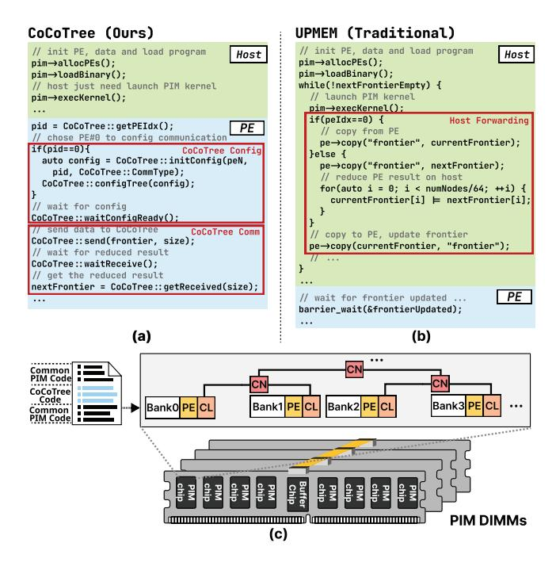

# D. Programming interface

To facilitate the utilization of CoCoTree, we introduce a flexible and user-friendly API for PIM-side kernels, enabling direct inter-PE collective communication. As illustrated in Figure 7(a)(b), we take the code segment for reducing the node bitmap frontier in Breadth-First Search (BFS) as an example to show the programming of CoCoTree. CoCoTree code is a part of the PIM kernel code, which is stored in the instruction scratchpad for each PE as shown in Figure 7(c). The API operates on a two-phase model: configuration and execution. First, a designated PE (e.g., PE#0 in the example) initiates the configuration phase by defining the parameters like the number of PEs and the operation type (e.g., ReduceOR), using CoCoTree::initConfig(). This configuration is then broadcast to the relevant PEs via

Fig. 7. (a) Code implementation in CoCoTree, with green and blue blocks denoting host-side and PE-side code, respectively. (b) Code implementation in conventional UPMEM. (c) The host pre-loads code of PIM kernel (including CoCoTree code) and data into each bank, like UPMEM.

CoCoTree::configTree(). All PEs synchronize at a barrier, CoCoTree::waitConfigReady(), to ensure the hardware is configured before proceeding. Once configured, the execution phase begins. Each participating PE injects its local data into the network using CoCoTree::send(). Co-CoTree performs the specified in-network computation (e.g., a bitwise OR reduction for a parallel BFS frontier). PEs then call CoCoTree::waitReceive() to wait for the completion, after which the final result can be retrieved via CoCoTree::getReceived().

Traditional PIM programming models implement such collective operations through a host-centric control flow: the host CPU orchestrates explicit DMA transfers to gather data, performs the required processing, and then transfers the results back to target PEs. It increases code complexity on both the host and PIM sides and shows poor performance on inter-PE communication. With CoCoTree, the programmer expresses the entire collective directly inside the PIM kernel using CoCoTree APIs, while the CoCoTree hardware handles routing, synchronization, and in-network computation.

