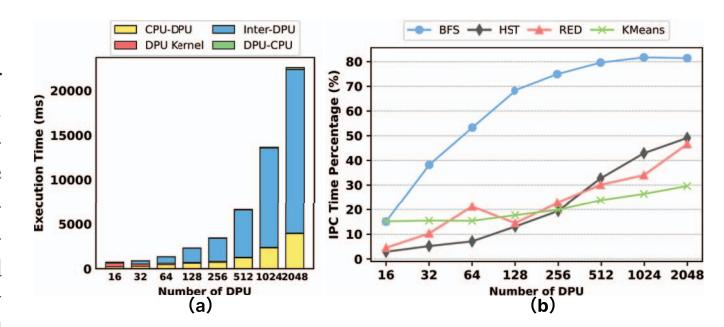

# III. MOTIVATION

### *A. The Scaling Bottleneck of Inter-PE Communication*

Although Processing-in-Memory (PIM) architectures offer significant acceleration for memory-bound applications by integrating compute capabilities into memory, commercial PIM systems (e.g., UPMEM) still suffer from limited scalability. This limitation stems primarily from the lack of efficient inter-PE communication support. To assess the severity of this bottleneck, we profile several memory-intensive benchmarks on a commercially available UPMEM platform. These workloads exhibit low compute-to-memory ratios and are ideal candidates for PIM acceleration. However, their execution involves substantial communication overhead—both between the host and the PEs, and among PEs themselves.

Figure 2(a) illustrates the detailed execution breakdown across varying PE counts for Breadth-First Search (BFS) [37] on the UPMEM. Inter-PE communication accounts for

Fig. 2. (a) Execution time breakdown of BFS and (b) performance scaling on UPMEM across increasing PE counts.

approximately 15.1% of total execution time at 16 PEs. This part surges to 81.7% when scaling to 1024 PEs and maintains this proportion as the number of PEs increases. For some other applications [37], as the number of PEs increases, communication overhead significantly increases and dominates execution time. This trend highlights the bottleneck introduced by the CPU-forwarding communication model. The inter-PE communication through CPU-forwarding is limited by the narrow bandwidth between the host and DIMM PIM, undermining the potential benefits of massive on-chip parallelism and high internal bandwidth in PIM. This mismatch between PIM parallel compute capabilities and its communication infrastructure necessitates a scalable, low-latency communication architecture tailored to inter-PE communication.

