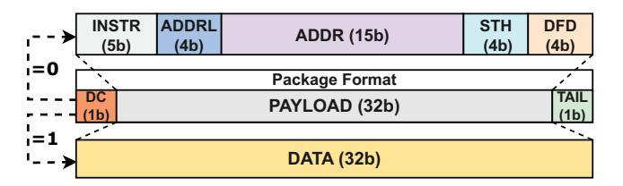
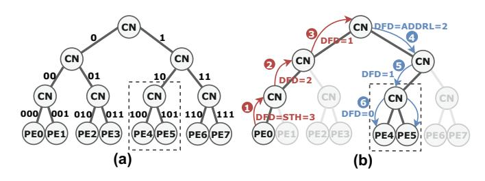
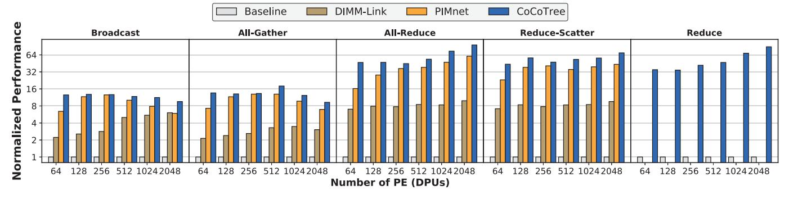
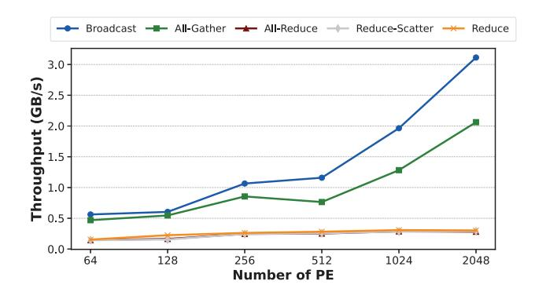
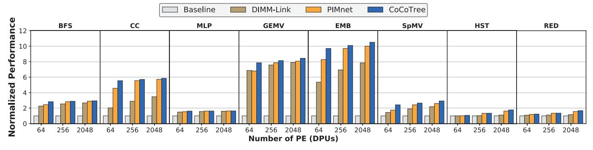
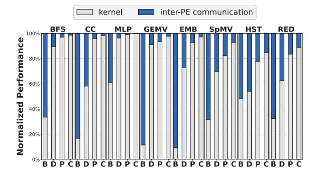
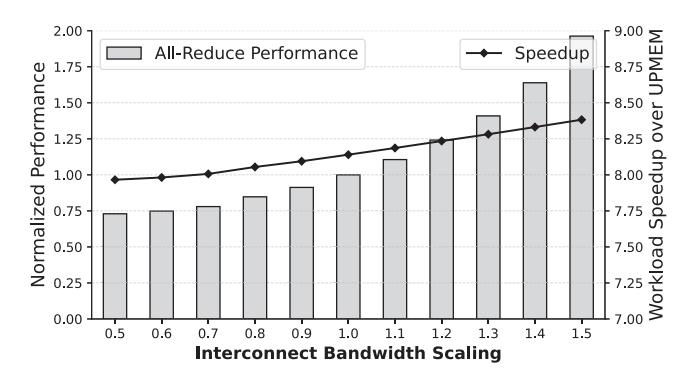
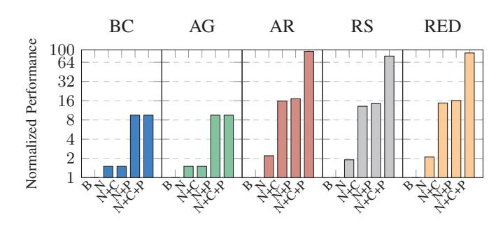

# TABLE I COCOTREE SUPPORTED INSTRUCTIONS

| Feat. | Name                                                                                                          | Explanation                                                                                                                        |  |  |
|-------|---------------------------------------------------------------------------------------------------------------|------------------------------------------------------------------------------------------------------------------------------------|--|--|
| В     | freeTree queryFeat                                                                                         | Release occupied Co-Nodes Query the features supported by Co-Nodes                                                              |  |  |
| T     | transfer                                                                                                      | P2P, Multicast, and Broadcast among PEs                                                                                            |  |  |
| RB    | redAnd redOr redXor                                                                                     | Parallel bitwise AND reduction across PEs Parallel bitwise OR reduction across PEs Parallel bitwise XOR reduction across PEs |  |  |
| RSU   | redSumU                                                                                                       | Parallel unsigned integer sum reduction across PE                                                                                  |  |  |
| RSF   | redSumF                                                                                                       | Parallel FP32 sum reduction across PEs                                                                                             |  |  |
| RCU   | redMaxU Parallel unsigned maximum reduction across PEs redMinU Parallel unsigned minimum reduction across PEs |                                                                                                                                    |  |  |
| RCF   | redMaxF redMinF                                                                                            | Parallel FP32 maximum reduction across PEs Parallel FP32 minimum reduction across PEs                                           |  |  |

are connected directly to form a chip-level binary tree. In each rank, M chips (M=8 in this work) are connected to a rank-level CoCoTree chip consisting of M-1 Co-Nodes via a bi-directional SerDes link. Similarly, at the next level, a comparable binary tree structure can be established through appropriate connection serial links as listed in Table II. Such LEGO-like composability and self-similar hierarchical organization provide CoCoTree with significant scalability, supporting collaborative processing across an expandable array of near-bank PEs.

### VI. CoCoTree Communication Mechanism

### A. Communication Workflow

CoCoTree adopts a two-phase communication model and decouples control flow and data flow into a *configuration phase* and a *computation phase*. The separate configuration phase eliminates redundant transmission of metadata like destination addresses and operation types, increasing bandwidth efficiency during the execution of collective operations.

Communication in CoCoTree is packet-based, with two distinct packet types: *command packets* and *data packets*. Prior to data transmission, a command packet must first be issued to configure the routers and functional units within each Co-Node of the designated (sub)tree. Once all relevant Co-Nodes are configured, Co-Leafs initiate data transmission from the PEs into the CoCoTree interconnect, where packets are routed through the network based on the established configuration.

Fig. 11. 32-bit CoCoTree Packet Format.

#### TABLE II INTERCONNECT LINK TYPE

| Level      | Link Type         | Reach | Bandwidth  |
|------------|-------------------|-------|------------|
| Rank-level | GRS [70] on PCB   | 80mm  | 25Gb/s/pin |
| DIMM-level | Ribbon Cable [28] | 500mm | 16Gb/s/pin |

Configuration Phase. During this phase, host CPU selects one PE to send a command packet to specify the communication pattern, collective operation type, and the participating PEs. As illustrated in Figure 10, the command packet first traverses upward to the local root of the designated tree (1-2-6), and is then broadcast downward to all nodes within the tree (1-5-6). Each Co-Node along this path parses the command and configures its internal routing and computation units accordingly. The simultaneous arrival of the command packet at all PEs acts as a synchronization barrier, triggering each PE to commence data transmission.

Computation Phase. During the computation phase, involved PEs will send data packets through the Co-Leafs to the CoCoTree, where the data will transfer upward through the Co-Nodes. At each node, data transmission or processing is performed. This process continues until the final results reaches the local root node. Figure 10 shows the computation phase of the CoCoTree for reduce operation. As the data ascends through the tree, configured FUs in each Co-Node perform a computation on the data from its left and right children, sending the partial result to its parent node until it ultimately reaches the root node (Steps 1-2-3). The configured routers in the Co-Nodes will then send the final aggregate result down to the designated destination (Steps 1-5-6), completing the collective communication.

### B. CoCoTree Packet and Protocol Design

CoCoTree adopts a lightweight, address-driven protocol that leverages the structural regularity of a perfect binary tree to achieve efficient routing and support the above communication mechanism. Figure 11 illustrates the 32-bit packet format used in CoCoTree. Each packet is categorized by the DC field, which distinguishes between data and command packets. Data packets carry payload as DATA and include a TAIL bit to indicate the end of a stream. Command packets specify operation modes or management instructions for CoCoTree, encoded in the INSTR field, as detailed in Table I. The ADDRL field indicates the bit-length of the destination address encoded in the ADDR field. ADDR identifies the target Co-Leaf node or subtree. The STH (Sub-Tree-Height) field defines the

Fig. 12. (a) Explanation of the ADDR field in the protocol and (b) routing decision in CoCoTree. (CN: Co-Node)

height of the target subtree, with  $2^{\text{STH}}$  PEs participating in the operation. By adjusting STH, the system can flexibly scale the degree of parallelism involved in a collective operation, allowing distinct PE groups to communicate independently and in parallel within their respective subtrees.

To facilitate destination resolution and forwarding, each packet also contains a DFD (Distance-From-Destination) field. DFD denotes the number of hops remaining to reach the target node. When a command packet is issued by a PE, the DFD is initialized to STH; if the command originates from the local root, DFD is modified to ADDRL. As the packet traverses each Co-Node, the DFD decrements by one. A DFD value of 1 signals arrival at the destination node, while a DFD value of 0 in the packet indicates that the packet has reached the designated subtree.

An example is shown in Figure 12(a). During the configuration phase, the ADDR field undergoes a left rotation at each Co-Node before being forwarded to child nodes. When DFD  $\neq 0$ , routing decisions are made based on the least significant bit (LSB) of the ADDR: a 0 directs the packet to the left child, and a 1 to the right child. Once the packet enters the target subtree (DFD = 0), it is broadcast to both child nodes simultaneously. Figure 12(b) illustrates this dynamic using a command packet with ADDR = b10 and ADDRL = 2, targeting the subtree that includes PE 4 and PE 5, and demonstrates how DFD evolves during routing.

### C. Stream Control

In order to support the flexible regulation of data packets flow among Co-Nodes, CoCoTree incorporates a handshakebased stream control inspired by the valid/ready handshake protocol in AXI4 [3]. In CoCoTree, each link between nodes is equipped with valid and ready handshake signals. The valid signal is asserted by the source node to indicate that a data packet is available on the channel, while the ready signal is driven by the destination node to indicate its ability to accept incoming data. A data transfer only occurs when both signals are asserted in the same cycle. The destination can temporarily stall the stream by deasserting ready, while the source can invalidate a transfer opportunity by lowering valid. Within the CoCoTree hierarchy, this fine-grained control allows each Co-Node to stall or resume packet flow based on local buffer availability and pipeline status, preventing data loss and avoiding unnecessary stalling across the network.

TABLE III SYSTEM CONFIGURATION.

| Configuration of Host Server |                             |  |  |  |
|------------------------------|-----------------------------|--|--|--|
| CPU Model                    | 2×Intel Xeon Silver 4216    |  |  |  |
| CPU Clock Frequency          | 2.2GHz                      |  |  |  |
| Number of Cores              | 32                          |  |  |  |
| Memory Capacity              | 256GB                       |  |  |  |
| Configuration of UPMEM PIM   |                             |  |  |  |
| DIMM Type                    | 20×UPMEM BC021B             |  |  |  |
| DPU Clock Frequency          | 350MHz                      |  |  |  |
| Total Number of PEs          | 2530                        |  |  |  |
| Memory Capacity              | 160GB                       |  |  |  |
| Memory Specification         | DDR4-2400                   |  |  |  |
| Parameter of Tools           |                             |  |  |  |
| UPMEM SDK                    | upmem-2023.2.0-Linux-x86_64 |  |  |  |
| Compiler                     | G++ 12.3.0                  |  |  |  |

Additionally, a tail signal is used signify the end of a data packet stream. The tail flag is asserted only when the final packet of a stream is transmitted, allowing the destination node to detect the end-of-transmission and trigger appropriate state transitions or processing. In hardware, there are Handshake Controllers (1, 3) to handle the stream control as shown in Figure 8(a)(c).

### VII. EVALUATION

### A. Evaluation Methodology

**Experiment Setup.** We implement the CoCoTree architecture in Chisel [8], a hardware construction language designed for agile hardware development, and then compile to Verilog. To evaluate the design, we integrate the RTL implementation with Verilator for cycle-accurate simulation, and we also develop an cycle-accurate simulator in C++ using the DPI-C interface for PIM workload simulation. This simulator is able to model the collective communication operations in CoCoTree and enables detailed performance analysis for PIM workload. Our PIM system configuration is based on a real-world commodity UPMEM DIMM PIM server. The system configuration is summarized in Table III.

**Baselines.** We evaluate both the performance of supported collective communication operations and the end-to-end performance of various PIM applications [37]. We compare CoCoTree against three representative DIMM PIM baselines: (1) Basic DIMM PIM (UPMEM), where collective communication operations are handled by the host CPU; (2) DIMM-Link, which introduces direct point-to-point links between DIMMs. However, DIMM-link is not optimized for inter-PE communication; and (3) PIMnet, which supports intrachannel collective operations via a multi-tier network. For PE number over 256 (a channel in UPMEM), PIMnet still needs host CPU forwarding. For fair comparison, the evaluation on basic DIMM PIM is directly executed on our UPMEM server configured as shown in Table III. The experimental results for DIMM-Link and PIMnet are obtained through simulation using reported link bandwidth from their papers.

**Benchmarks.** Table IV lists the benchmarks used in evaluation. Following previous research [35], [37], [67], we evaluate CoCoTree using a series of memory-intensive workloads: Breadth-First Search (BFS), Histogram (HST), Connected

Fig. 13. Performance comparison of different collective communication operations under varying PE counts across PIM communication architectures, results are normalized to UPMEM PIM baseline

### TABLE IV BENCHMARKING APPLICATIONS

| PIM Workload                        | Abbr. | Comm.          | Input/Config |
|-------------------------------------|-------|----------------|--------------|
| Breadth-First Search                | BFS   | All-Reduce     | rMat [12]    |
| Histogram                           | HST   | All-Reduce     | 1536 × 1024  |
| Reduction                           | RED   | Reduce         | 6.3M elems   |
| Multi-layer Perceptron              | MLP   | Reduce-Scatter | 256 × 256    |
| Matrix-vector multiplication        | GEMV  | Reduce-Scatter | 1024 × 64    |
| Sparse matrix-vector multiplication | SpMV  | Reduce-Scatter | rtn [35]     |
| Connected Component                 | CC    | All-Reduce     | rMat [12]    |
| Embedding Lookup                    | EMB   | Reduce-Scatter | RM2 [63]     |

Component (CC), Multi-layer Perceptron (MLP), General Matrix-vector multiplication (GEMV), Reduction (RED) from [37], Sparse Matrix-vector Multiplication (SpMV) [35], and Embedding Lookup (EMB) [67]. These workloads are selected since they are widely used to evaluate previous PIM architectures [37], [76], [86] and they involve heavy inter-PE communication, making them highly sensitive to the efficiency of collective communication operations. Collective communication in these applications has significant influence on overall execution performance. All programs on the host CPU are conducted with OpenMP enabeld.

### *B. Experimental Results Analysis*

*1) Collective Communication Performance Comparison:* We compare the throughput performance of CoCoTree against baseline PIM systems under various collective communication operations. Throughput is defined as the size of the larger communication operand (e.g., input side for *Reduce*) divided by the execution time. All experiments adopt the weak scaling setup, where each PE processes a fixed 8KB data. The evaluated collective operations include *Broadcast*, *All-Gather*, *Reduce*, *Reduce-Scatter*, and *All-Reduce*. Note that DIMM-Link and PIMnet architectures do not support native *Reduce* operations, and are therefore excluded from the *Reduce* throughput comparison.

As shown in Figure 14, we first evaluate the baseline UPMEM system. The throughput of *Broadcast* and *All-Gather* slightly increases with the number of PEs, but remains low even at 2048 PEs. Other evaluated collective operations show even lower throughput for all scales. These results indicate that inter-PE communication in current DIMM PIM has become a

Fig. 14. Collective communication throughput across varying PE counts of baseline UPMEM DIMM PIM

major performance bottleneck, highlighting the need for more efficient PIM communication architectures.

We then evaluate throughput under different PIM communication architectures, with results summarized in Figure 13. CoCoTree significantly improves the throughput across all collective operations. For *All-Reduce*, CoCoTree achieves up to 95.6× speedup and an average of 60.4× over the UPMEM baseline. For *Reduce* and *Reduce-Scatter* operations, it gains average speedup of 54.5× and 54.4×, respectively. Compared to DIMM-Link, CoCoTree offers an average 5.9× improvement, owing to its tree topology and in-network computation support. Against PIMnet, CoCoTree achieves comparable gains in Broadcast and *All-Gather* (1.4× on average), and larger improvements in *Reduce-Scatter* (1.5×) and *All-Reduce* (1.7×), where host intervention for inter-channel traffic in PIMnet limits scalability. These results demonstrate that Co-CoTree effectively enables high-throughput collective communication in DIMM PIM systems by offloading communication from the host CPU. Its benefits are most significant in multisource data fusion workloads such as *All-Reduce* and *Reduce-Scatter*.

*2) Scalability of Collective Communication:* To evaluate the scalability of CoCoTree in DIMM PIM systems, we scale the number of PEs from 64 to 2048 and measure the performance across selected collective communicaiton operations. The scalability for baseline UPMEM PIM system can be observed in Figure 14. For *Broadcast* and *All-Gather*, the

Fig. 15. Performance comparison between CoCoTree and baselines across PIM workloads, results are normalized to the UPMEM PIM baselines

throughput increases slowly with the number of PE, as these operations can leverage the broadcast and parallel transfer functions provided by the UPMEM SDK [24]. For other operations like *All-Reduce*, the lack of inter-PE communication support results in almost no throughput improvement regardless of scale, confirming that host CPU-forwarding limits the scalability.

Figure 13 illustrates the scalability of CoCoTree and baselines. CoCoTree maintains high speedups over the baseline across all scales, and the performance gap widens as the number of PEs increases. We attribute this to the computationcapable tree network of CoCoTree, which provides efficient and scalable communication. The hierarchical structure minimizes scaling cost and enables in-network computation via Co-Nodes during data transmission. DIMM-Link partially mitigates CPU bottlenecks by introducing dedicated inter-DIMM links and offloading communication tasks to NMP cores on buffer chips. While this improves scalability over the baseline, the increasing network scale causes performance to stagnate beyond 512 PEs. PIMnet further improves intrachannel communication by supporting direct data exchange among PIM banks. PIMnet still requires the host CPU for inter-channel coordination. This reliance limits the scalability when the number of PEs grows beyond a single channel.

*3) PIM Workloads Performance Analysis:* To evaluate the performance benefits of CoCoTree, we compare CoCoTree against the baselines on selected PIM workloads listed in Table IV. The results are shown in Figure 15. Basic DIMM PIM baseline is implemented on the UPMEM platform. For DIMM-Link, PIMnet, and CoCoTree, we replace the hostforwarding communication in UPMEM PIM with the collective communication supported by each PIM communication architecture.

Compared to the UPMEM baseline, CoCoTree significantly improves performance across all evaluated PIM workloads. For EMB and GEMV workloads, the *Reduce-Scatter* dominates the total execution time in the baseline system. By offloading the *Reduce-Scatter* to the hierarchical tree network, CoCoTree achieves up to 10.5× and 8.4× end-to-end speedup. Graph workloads such as BFS and CC rely on *All-Reduce* to synchronize graph node information across multiple PIM PEs. CoCoTree achieves up to 2.9× and 5.7× speedup,

Fig. 16. Execution time breakdown across benchmarks. (B: UPMEM host communication baseline, D: DIMM-Link, P: PIMnet, C: CoCoTree)

respectively. A greater performance improvement is observed in CC because it involves more communication than BFS. We achieve a speedup of up to 2.9× for SpMV by accelerating the *Reduce-Scatter* communication, which bypasses costly inter-PE communication through the host. MLP, HST, and RED all achieve a relatively modest end-to-end speedup of up to 1.6×, 1.8×, and 1.6×, respectively. This is because the effectiveness of communication optimizations is limited in these workloads, whether due to a high proportion of compute time (MLP) or fewer collective communication requirements (HST and RED).

Compared to DIMM-Link and PIMnet, CoCoTree delivers consistently comparable or higher performance across all workloads due to its more efficient and scalable collective communication support. For workloads at 2048 PEs, Co-CoTree achieves up to 1.7× and on average 1.3× speedup against DIMM-Link. Compared with PIMnet, CoCoTree achieves 1.1× speedup on average. Furthermore, Figure 15 also illustrates the scalability of these communication architectures on all evaluated applications. Experimental results show that for these real-world workloads, CoCoTree maintains scalability, and the performance improvement of CoCoTree remains stable and in several cases even slightly increases as the number of PEs increases from 64 to 2048.

*4) Time Breakdown Analysis:* To reveal how CoCoTree alleviates the communication bottleneck in DIMM PIM systems, we perform a detailed breakdown of the execution time across various workloads, quantifying the proportion of time spent on inter-PE communication. Figure 16 illustrates

Fig. 17. All-reduce performance and application-level acceleration across different interconnect bandwidth configurations.

the time breakdown for the real-world PIM workloads under different PIM communication architecture. In the baseline system, all collective communications are forwarded by the host CPU, making inter-PE communication the dominant source of overhead. For communication-intensive applications such as *CC*, inter-PE overhead accounts for up to 82.0% of the PIM execution time.

CoCoTree offloads both communication and computation onto a hierarchical hardware interconnect, significantly reducing the inter-PE communication fraction. Across all evaluated workloads, the IPC overhead is reduced to an average of 5.3%, and even falls below 0.5% in some certain benchmarks. This indicates communication is no longer the primary performance bottleneck in the CoCoTree system. Furthermore, since Co-CoTree performs *Reduce*, *Scatter*, and other collective operations directly within the network, it eliminates the overhead of additional WRAM–MRAM data copy and synchronization in PIMnet. Consequently, CoCoTree transforms inter-PE communication from a dominant and system-wide bottleneck into a minor overhead through architecture and protocol co-design.

- 5) Robustness Analysis Under Bandwidth Variation: To evaluate the robustness of CoCoTree under different interconnect link bandwidth configurations, we analyze the communication and application performance when varying link bandwidth. We measure the execution time of the All-Reduce and the end-to-end performance for GEMV application under different link widths. As shown in Figure 17, even if the interconnect bandwidth is reduced to 50%, CoCoTree can still achieves up to  $8.0\times$  speedup over baseline UPMEM PIM. This indicates that its efficiency does not rely on aggressive bandwidth provisioning, but instead stems from its concurrent and structurally optimized hierarchical tree design. Moreover, when bandwidth increases, CoCoTree continues to scale and delivers improved performance. It gains a 2.0× performance improvement in All-Reduce when bandwidth increases 50%. This demonstrates that the CoCoTree can further exploit additional communication resources.
- 6) Ablation Study: We conduct an ablation study to quantify the performance contribution of the components of Co-CoTree: (N) Tree network, (C) In-network Computation, and (P) Pipelining, on the (B) baseline DIMM PIM system. Figure

Fig. 18. Ablation study of CoCoTree components. All results are normalized to DIMM PIM Baseline. (B:Baseline, N:Tree Network, C:Compute, P:Pipeline, BC:Broadcast, AG:All-Gather, AR:All-Reduce, RS:Reduce-Scatter, RED:Reduce)

18 reports the normalized performance for five collective primitives at 2048 PEs.

We first examine the effect of the tree network alone. (N) The tree network (FUs disabled) provides a high-bandwidth path bypassing the host CPU, providing 1.5× speedup for Broadcast and All-Gather and  $1.9\times$  to  $2.2\times$  speedup for the rest operations. Adding in-network computation (N+C) significantly improves computation-heavy collective operations like All-Reduce, Reduce-Scatter and Reduce, achieving 14.5× speedup on average. Enabling in-network computation allows the system to offload operations into the tree and halve the traffic at each level. But FUs offer little benefit to computation-free collectives like Broadcast and All-Gather. Then, We find that Pipelining further improves performance by overlapping rounds, hiding network latency. With only the tree network and pipelining enabled (N+P), performance improves from  $9.5\times$  to  $17.2\times$  for evaluated collective communication operations. The full CoCoTree (N+C+P) consistently delivers the highest performance and the results have been shown in the collective communication performance comparison subsection. Overall, the ablation confirms that CoCoTree provides its best performance when the tree network, in-network computation, and pipelining are jointly employed.

7) Hardware Overhead Analysis: To evaluate the area and power characteristics of the CoCoTree architecture, we employ an open-source EDA flow utilizing Yosys [81] for RTL synthesis, iEDA [58] for physical implementation and place-and-route, both based on a 45nm technology (NanGate45). Previous study [24] has shown that DRAM process incurs larger area overhead than ASIC due to the reduced number of metal layers in DRAM technology. Therefore, we employ a scaling factor of 10 to evaluate the area overhead for DRAM process [24]. Our analysis focuses on the area and power overhead of Co-Leaf and Co-Node units. The results show that compared to the current commodity DIMM PIM bank [23], each Co-Leaf unit only brings 0.5% area overhead and 0.4% power consumption overhead.

Table V provides a breakdown of the area and power overhead contributed by various features. Each Co-Node unit supporting transfer, bitwise, and integer reduction (T, RB, RSU, RCU features) incurs an area overhead of 0.030mm2

and a power overhead of 1.36mW. Extending support to include floating-point operations (i.e. adding RSF, RCF features) increases the overhead to 0.076mm2 and 3.78mW. For an 8- PE tree interconnect on a single chip, the aggregated overhead for all Co-Nodes is 0.20mm2 and 9.76mW. We consider this hardware cost negligible, especially given the significant improvements in collective communication performance, and it does not compromise manufacturability. Notably, when Co-Nodes are deployed hierarchically within buffer chips or controllers, their overhead is marginal compared to the resources of these host components [45].

TABLE V AREA/POWER ANALYSIS OF CONODE ACROSS DIFFERENT FEATURE

| T | RB | RSU | RCU | RSF | RCF | Area/mm2 | Power/mW |
|---|----|-----|-----|-----|-----|----------|----------|
| ✓ |    |     |     |     |     | 0.018    | 0.70     |
| ✓ | ✓  | ✓   |     |     |     | 0.026    | 1.12     |
| ✓ | ✓  | ✓   | ✓   |     |     | 0.030    | 1.36     |
| ✓ | ✓  | ✓   | ✓   | ✓   |     | 0.071    | 3.52     |
| ✓ | ✓  | ✓   | ✓   | ✓   | ✓   | 0.076    | 3.78     |
| ✓ |    |     |     | ✓   | ✓   | 0.065    | 3.05     |

