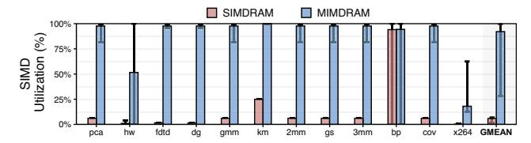
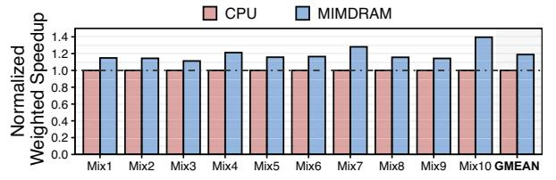

# 6. System Support for MIMDRAM

We envision MIMDRAM as a tightly-coupled accelerator for the host processor. As such, MIMDRAM relies on the host processor for its system integration, which includes ISA support (§6.1), instruction execution & data transposition (§6.2), and operating system support for address translation and data allocation & alignment (§6.3).

#### **6.1.** Instruction-Set Architecture

Table 1 shows the CPU ISA extensions that MIMDRAM exposes to the compiler.12 There are five types of instructions: (i) object initialization instructions, (ii) 1-input arithmetic instructions, (iii) 2-input arithmetic instructions, (iv) predication instructions, and (v) data movement instructions. The first three types of MIMDRAM instructions are inherited from the SIMDRAM ISA [101]. These instructions can be further divided into two categories: (i) operations with one input operand (e.g., bitcount, ReLU), and (ii) operations with two input operands (e.g., addition, division, equal, maximum). To enable predication, MIMDRAM uses the bbop\_if\_else instruction that SIMDRAM introduces, which takes as input three operands: two input arrays (src1 and src2) and one predicate array (select). We modify such instructions by including two new fields: (i) mat label (ML), which identifies groups of instructions that must execute inside the same DRAM mat, and (ii) vectorization factor (VF), which dictates how many scalar operands are packed within the vector instruction. These two new fields are automatically generated by MIMDRAM's compiler passes (§5).

Table 1: MIMDRAM ISA extensions.

| Type                                               | ISA Format                                                                                                                                |  |  |  |  |
|----------------------------------------------------|-------------------------------------------------------------------------------------------------------------------------------------------|--|--|--|--|
| Initialization 1-Input Arith. 2-Input Arith. | bbop_trsp_init addr, size, n, ML bbop_op dst, src, size, n, ML, VF bbop_op dst, src 1 , src 2 size, n, ML, VF |  |  |  |  |
| Predication Data Move                           | bbop_if_else dst, src1, src2, sel, size, n, ML, VF bbop_mov dst, dst_idx, src, src_idx, size, n                                           |  |  |  |  |

Data movement instructions allow the compiler to trigger inter-mat and intra-mat data movement operations. In a data movement instruction, dst and src represent the source and destination arrays; dst\_idx and src\_idx represent the first position of the first element inside the source and destination arrays to be moved; size represents the number of elements to move from source to the destination array; n represents the number of bits in each array element. MIMDRAM control unit automatically identifies the mat range the data movement instruction targets by calculating the distance between the source and destination arrays, taking into account the indexes and number of elements to move. In case the source and destination mats are the same, MIMDRAM control unit translates the data movement instruction into an LC-MOV command: otherwise, a GB-MOV command.

#### 6.2. Execution & Data Transposition

**Instruction Fetch and Dispatch.** MIMDRAM relies on the host CPU to offload *bbop* instructions to DRAM since they are part of the CPU ISA. Assuming that the host CPU consists of one or more out-of-order cores, MIMDRAM leverages the host

12MIMDRAM ISA extensions are vector-oriented by design. We did *not* use an existing ISA because we needed to define new fields for MIMDRAM that do *not* exist in current vector ISAs (e.g., mat label information). Instead, we propose to extend the baseline CPU ISA with MIMDRAM instructions since there is usually more than enough unused opcode space to support the extra opcodes that MIMDRAM requires [195, 196]. Extending the CPU ISA to interface with accelerators is a common approach [18, 61, 101, 197, 198].

processor's front-end to (*i*) identify and (*ii*) dispatch to MIM-DRAM control unit *only* independent *bbop*s. This simplifies the design of MIMDRAM control unit since no in-flight *bbop* instructions will have data dependencies. As a result, MIM-DRAM control unit can freely schedule μPrograms to the PUD SIMD engine as they arrive.

Data Coherence. Input arrays to MIMDRAM may be generated or modified by the CPU, and the data updates may reside only in the cache (e.g., because the updates have not yet been written back to DRAM). To ensure that MIMDRAM does not operate on stale data, programmers are responsible for flushing cache lines [199, 200] modified by the CPU. MIMDRAM can leverage coherence optimizations tailored to PIM to improve overall performance [38, 44].

MIMDRAM Transposition Unit. MIMDRAM transposition unit shares the same hardware components and functionalities as the SIMDRAM transposition unit [101], which includes: (*i*) *object tracker*, a small cache that keeps track of the memory objects used by *bbop* instructions; (*ii*) an *horizontal to vertical transpose* unit, which converts cache lines of memory objects stored in the object tracker from a horizontal to vertical data layout during a last-level cache (LLC) writeback; (*iii*) a *vertical to horizontal transpose* unit, which converts cache lines of memory objects stored in the object tracker from a vertical to horizontal data layout during an LLC read request; (*iv*) *store* and *fetch* units, which generate memory read/write requests using the transpose units' output data. One main limitation of the SIMDRAM transposition unit is that it needs to fill *at least* an entire DRAM row with vertically-laid out data before the execution of a *bbop*. Instead, MIMDRAM transposes only as much data as required to fill the segment of the DRAM row that the *bbop* instruction operates over. To do so, the MIMDRAM transposition unit adds information regarding the mat range a memory object operates to the object tracker.

## 6.3. Operating System Support

Address Translation. As SIMDRAM, MIMDRAM operates directly on physical addresses. When the CPU issues a *bbop* instruction, the instruction's virtual memory addresses are translated into their corresponding physical addresses using the same translation lookaside buffer (TLB) lookup mechanisms used by regular load/store operations.

Data Allocation & Alignment. MIMDRAM (as other PUD architectures [61, 62, 64, 65, 73–76, 79, 86]) requires OS support to guarantee that data is properly mapped and aligned within the boundaries of the bank/subarray/mat that will perform computation. Particularly, since PUD operations are executed in-situ, it is essential to enforce that memory objects belonging to the same *bbop* (and their dependent instructions) are placed together in the same DRAM mats. To achieve this functionality, we propose the implementation of a new data allocation API called pim\_malloc. The main idea is to allow the compiler to inform the OS memory allocator about the memory objects that must be allocated inside the same set of DRAM mats. The pim\_malloc API takes as input the *size* of the memory region to allocate (as a regular malloc instruction) and the *mat label* that the compiler generates (§5). Then, it ensures that *all* memory objects with the same *mat label* are placed together within a set

of DRAM mats that satisfies the target memory allocation size.

To allow the pim\_malloc API to influence the OS memory allocator and ensure that memory objects are placed within specific DRAM mats, we propose a new *lazy data allocation routine* (in the kernel) for pim\_malloc objects. This routine has three main components: (*i*) information about the DRAM organization (e.g., row, column, and mat sizes), (*ii*) the DRAM interleaving scheme, which the memory controller provides via an open firmware device tree [201];13 and (*iii*) a huge page pool for pim\_malloc objects (configured during boot time), which guarantees that virtual addresses assigned to a pim\_malloc object are contiguous in the physical address space and that DRAM mats are free whenever a pim\_malloc object is allocated. The allocation routine uses the DRAM address mapping knowledge to split the huge pages into different memory regions. Then, when an application calls the pim\_malloc API, the allocation routine selects the appropriate memory region that satisfies pim\_malloc. Internally, the pim\_malloc API operates using three main sub-tasks, depending on the order of the data allocation: (*i*) pim\_preallocate, for data pre-allocation; (*ii*) pim\_alloc, for the first data allocation; and (*iii*) pim\_alloc\_align, for subsequent aligned allocations.

- (*i*) Pre-Allocation. The first sub-task's role is to indicate the number of huge pages available for PUD allocations. We leave it to the user to provide the number of huge pages used for PUD operations because huge pages are scarce in the system.
- (*ii*) First Allocation. The second sub-task uses the *worst-fit allocation scheme* [206] to manage the allocation of memory regions in the huge page pool. The *key idea* behind this placement strategy is to optimize the remaining memory space after allocations to increase the chances of accommodating another process in the remaining space. For the first PUD memory allocation, the pim\_alloc sub-task simply scans an *ordered array* data structure (similar to the one used in the Linux Kernel buddy allocator algorithm [207], where each entry represents the number of memory regions in a single subarray) to select the subarray with the *largest* amount of memory regions available. If the requested memory allocation requires more than one memory region, MIMDRAM iteratively scans the *ordered array*, searching for the next largest memory region until the memory allocation is fully satisfied. Once enough space is allocated, pim\_alloc sub-task creates a new allocation object and inserts it in an *allocation hashmap*, which is indexed by the allocation's virtual address. The sub-task needs to keep track of allocations since it might need to find a memory region from the *same* subarray/mat when performing future *aligned allocations*.
- (*iii*) Aligned Allocation. After allocating a memory region for the first operand in a PUD operation, the user can use this memory region as a regular memory object. However, when allocating the remaining operands for a PUD operation, the

13The DRAM interleaving scheme can be obtained by reverse engineering the bit locations of memory addresses [202–205]. Even though typical DRAM interleaving does *not* take mats into account, it is relatively straightforward to reverse-engineer how a memory address is distributed across the DRAM mats in a DRAM module, since the mat interleaving is a function of the DRAM chip's organization. For example, in a DDR4 module with 8 chips, 16 mats per chip, and 4 HFFs per mat, a 64 B cache line is evenly distributed across all 128 total mats; i.e., the four least-significant bits of the cache line are placed in mat 0, chip 0, and the four most-significant bits of the cache line are placed in mat 15, chip 7. Our pim\_malloc API takes into account such mat interleaving.

pim\_malloc API needs to guarantee data alignment for all memory objects within the same DRAM subarray/mat. To this end, the third sub-task (pim\_malloc\_align) identifies a previously allocated memory region to which the current memory allocation must be aligned (based on the compiler-generated mat labels). The pim\_malloc\_align sub-task works in five main steps. First, it searches the allocation hashmap for a match with previously allocated memory regions. If a match is not found, the allocation fails. Second, if a match is found, the pim\_malloc\_align sub-task iterates through the identified previously-allocated memory regions. Third, for each memory region, the sub-task identifies its source subarray/mat address and tries to allocate another memory region in the same subarray/mat for the new allocation. Fourth, if the subarray/mat of a given memory region has no free region, the sub-task allocates a new memory region from another subarray/mat following the worst-fit allocation scheme. Since we use a worst-fit allocation scheme that always selects the *largest* number of memory regions available during memory allocation for the *first* operand of a PUD operation, we have a good chance of having a single subarray/mat holding memory regions for the remaining operands of a PUD operation. Fifth, since memory regions might come from different huge pages, we must perform re-mmap to map such memory regions into contiguous virtual addresses.

Mat Label Translation. To keep track of the mapping between mat labels and allocated mat ranges, MIMDRAM adds a small mat translation table alongside the page table. The table is indexed by hashing the mat label with the process ID. It stores in each entry the associated mat range that the memory allocator assigned to that particular mat label. When the CPU dispatches a bbop, the CPU (i) accesses the mat translation table to obtain the mat range assigned to the given bbop, and (ii) replaces the mat label with the mat range.

#### 7. Methodology

We implement MIMDRAM using the gem5 simulator [208] and compare it to a real multicore CPU (Intel Skylake [209]), a real high-end GPU (NVIDIA A100 [210]), and a state-of-the-art PUD framework (SIMDRAM [101]). In all our evaluations, the CPU code is optimized to leverage AVX-512 instructions [157]. Table 2 shows the system parameters we use. To measure CPU energy consumption, we use Intel RAPL [211]. We capture GPU kernel execution time that excludes data initialization/transfer time. To measure GPU energy consumption, we use the nvml API [212]. We implement SIMDRAM on gem5, taking into account that the latency of executing the back-toback ACTs is only  $1.1 \times$  the latency of  $t_{RAS}$  [61,62,65,73,74,76], and validate our implementation rigorously with the results reported in [101]. We use CACTI [213] to evaluate MIM-DRAM and SIMDRAM energy consumption, where we take into account that each additional simultaneous row activation increases energy consumption by 22% [61,101]. Our simulation accounts for the additional latency imposes by MIMDRAM's mat isolation transistors and row decoder latches (i.e., measured (using CACTI [213, 214]) to incur less than 0.5% extra latency for an ACT). We open-source our simulation infrastructure at https://github.com/CMUSAFARI/MIMDRAM.

**Real-World Applications.** We analyze 117 applications from

Table 2: Evaluated system configurations.

| Real Intel Skylake CPU [209]         | x86 [199], 16 cores, 8-wide, out-of-order, 4 GHz; L1 Data + Inst. Private Cache: 256 kB, 8-way, 64 B line; L2 Private Cache: 2 kB, 4-way, 64 B line; L3 Shared Cache: 16 MB, 16-way, 64 B line; Main Memory: 64 GB DDR4-2133, 4 channels, 4 ranks                                                                                                                                                                         |  |  |
|-----------------------------------------|---------------------------------------------------------------------------------------------------------------------------------------------------------------------------------------------------------------------------------------------------------------------------------------------------------------------------------------------------------------------------------------------------------------------------------------|--|--|
| Real NVIDIA A100 GPU [210]           | 7 nm technology node; 6912 CUDA Cores; 108 streaming multiprocessors, 1.4 GHz base clock; L2 Cache: 40 MB L2 Cache; Main Memory: 40 GB HBM2 [119, 120]                                                                                                                                                                                                                                                                          |  |  |
| Simulated SIMDRAM [101] & MIMDRAM | gem5 system emulation; x86 [199], 1-core, out-of-order, 4 GHz; L1 Data + Inst. Cache: 32 kB, 8-way, 64 B line; L2 Cache: 256 kB, 4-way, 64 B line; Memory Controller: 8 kB row size, FR-FCFS [215,216] Main Memory: DDR4-2400, 1 channel, 8 chips, 4 rank 16 banks/rank, 16 mats/chip, 1 K rows/mat, 512 columns/mat MIMDRAM's Setup: 8 entries mat queue, 2 kB bbop buffer 8 µProgram processing engines, 2 kB mat translation table |  |  |

seven benchmark suites (SPEC 2017 [164], SPEC 2006 [217], Parboil [218], Phoenix [161], Polybench [162], Rodinia [163], and SPLASH-2 [219]) to select applications that (i) are memorybound, and (ii) the most time-consuming loop can be autovectorized. From this analysis, we collect 12 multi-threaded CPU applications (as Table 3 describes) from different domains (i.e., video compression, data mining, pattern recognition, medical imaging, stencil computation), and their respective GPU implementations, when available. Our evaluated applications are: (i) 525.x264\_r (x264) from SPEC 2017; (ii) heartwall (hw), kmeans (km), and backprop (bs) from Rodinia; (iii) pca from Phoenix; and (iv) 2mm, 3mm, covariance (cov), doitgen (dg), fdtd-apml (fdtd), gemm (gmm), and gramschmidt (gm) from Polybench. 14 Since our base PUD substrate (SIMDRAM) does not support floating-point, we manually modify the selected floating-point-heavy auto-vectorized loops to operate on fixedpoint data arrays. 15 We use the largest input dataset available and execute each application end-to-end in our evaluations.

Table 3: Evaluated applications and their characteristics.

| Benchmark Suite | Application (Short Name)   | Dataset Size               | # Vector Loops | VF {min, max} | PUD Ops.† |
|--------------------|-------------------------------|-------------------------------|-------------------|------------------|--------------|
| Phoenix [161]      | ‡pca (pca)                    | reference                     | 2                 | {4000, 4000}     | D, S, M, R   |
| Polybench [162]    | 2mm (2mm)                     | NI = NJ = NK = NL = 4000      | 6                 | {4000, 4000}     | M, R         |
|                    | ‡ 3mm (3mm)        | NI = NJ = NK = NL = NM = 4000 | 7                 | {4000, 4000}     | M, R         |
|                    | covariance (cov)              | N = M = 4000                  | 2                 | {4000, 4000}     | D, S, R      |
|                    | doitgen (dg)                  | NQ = NR = NP = 1000           | 5                 | {1000, 1000}     | M, C, R      |
|                    | ‡ fdtd-apml (fdtd) | CZ = CYM = CXM = 1000         | 3                 | {1000, 1000}     | D, M, S, A   |
|                    | gemm (gmm)                    | NI = NJ = NK = 4000           | 4                 | {4000, 4000}     | M, R         |
|                    | gramschmidt (gs)              | NI = NJ = 4000                | 5                 | {4000, 4000}     | M, D, R      |
| Rodinia [163]   | backprop (bs)                 | 134217729 input elm.          | 1                 | {17, 134217729}  | M, R         |
|                    | heartwall (hw)                | reference                     | 4                 | {1, 2601}        | M, R         |
|                    | kmeans (km)                   | 16384 data points             | 2                 | {16384, 16384}   | S, M, R      |
| SPEC 2017 [164] | 525.x64_r (x264)              | reference input               | 2                 | {64, 320}        | A            |

†: D = division, S = subtraction, M = multiplication, A = addition, R = reduction, C = copy

Multi-Programmed Application Mixes. To measure system throughput and fairness, we *manually* create 495 application mixes by randomly selecting eight applications (from our group of 12 applications) for execution co-location. We classify each application mix into one of three categories: *low*, *medium*, and *high* vectorization factor (VF) mixes based on Fig. 3. In the *low* mix, the maximum VF of *all* eight applications is lower than 16K; in the *medium* mix, *at least* one application has a maximum vectorization factor between 16K (inclusive) and 64K; and in the *large* mix, *at least* one application has a maximum VF larger than 64K (inclusive).

14Several prior works [72, 128, 189, 220–223] show that our selected twelve workloads can benefit from different types of PIM architectures.

15We only modify the three applications from the Rodinia benchmark suite to use fixed-point operations. Prior works [128, 224, 225] also employ fixed-point for the same three Rodinia applications. The applications from Polybench can be configured to use integers; the auto-vectorized loops in 525.x264\_r use uint8\_t; pca uses integers. We do *not* observe an output quality degradation when employing fixed-point for the selected loops.

‡: application with independent PUD operations

Comparison to State-of-the-Art PIM Architectures. We compare MIMDRAM to two other state-of-the-art PIM architectures: DRISA [63] and Fulcrum [104]. DRISA is a combined PUM and PNM architecture that significantly modifies the DRAM microarchitecture and organization to enable bulk in-DRAM computation (e.g., by using 3T1C DRAM cells to execute in-situ bitwise NOR operations and by adding logic gates *near* the subarray's sense amplifiers). Fulcrum is a PNM architecture that adds computation logic *near* subarrays. Fulcrum's primary components are a series of shift registers (called walkers) that latch input/output DRAM rows and a narrow scalar ALU that executes arithmetic and logic operations. We model the DRISA 3T1C implementation and Fulcrum (i) using a DRAM module of equal dimensions (i.e., number of DRAM ranks, chips, banks, mats, rows, and columns) as the baseline DDR4 DRAM we use for SIMDRAM and MIMDRAM (see Table 2) and (ii) including all the changes that the DRISA 3T1C and Fulcrum architectures propose to the DRAM cell array and DRAM subarray.

#### 8. Evaluation

We demonstrate the advantages of MIMDRAM by evaluating (i) SIMD utilization and energy efficiency (i.e., performance per Watt) for single applications (§8.1); (ii) system throughput (in terms of weighted speedup [226–228]), job turnaround time (in terms of harmonic speedup [227,229]), and fairness (in terms of maximum slowdown [215,230-239]) for multi-programmed application mixes in comparison to the baseline CPU, GPU, and a state-of-the-art PUD architecture, i.e., SIMDRAM [101] (§8.2); (ii) area-normalized performance analysis for single applications and throughput analysis for multi-programmed application mixes in comparison to state-of-the-art PIM architectures, i.e., DRISA [63] and Fulcrum [104] (§8.3). In most of our analyses (§8.1–§8.2), to keep our analyses pure, we very *conservatively* allow MIMDRAM to use only a single DRAM subarray in a single DRAM bank for PUD computation. In §8.4, we perform a scalability analysis to evaluate MIMDRAM's performance when enabling *multiple* DRAM subarrays and banks for PUD computation, which reflects a more accurate evaluation of the true benefits of MIMDRAM and PUD. Finally, we evaluate MIMDRAM's DRAM and CPU area cost (§8.5).

## 8.1. Single-Application Results

Fig. 9 shows MIMDRAM's SIMD utilization and normalized energy efficiency (in performance per Watt) for all 12 applications. Values are normalized to the baseline CPU.

SIMD Utilization. We make two observations from Fig. 9a. First, MIMDRAM *significantly* improves SIMD utilization over SIMDRAM. On average across all applications, MIMDRAM provides 15.6× the SIMD utilization of SIMDRAM. This is because MIMDRAM matches the available SIMD parallelism in an application with the underlying PUD resources (i.e., PUD SIMD lanes) by using *only* as many DRAM mats as the maximum vectorization factor of a given application's loop. In contrast, SIMDRAM always occupies *all* available PUD SIMD lanes (i.e., entire subarrays) for a given operation, resulting in low SIMD utilization for applications without a very-wide vectorization factor. Second, we observe that SIMD utilization can vary considerably within an application. For example,

(a) SIMD utilization. Whiskers extend to the minimum and maximum observed data point values.

(b) CPU-normalized performance per Watt (left y-axis; bars) and performance (right y-axis; dots).

Figure 9: Single-application results for processor-centric (i.e., CPU and GPU) and memory-centric (i.e., SIMDRAM and MIMDRAM) architectures executing twelve real-world applications.

MIMDRAM's SIMD utilization for hw and bp goes from as low as 0.2% to as high as 100%. This happens because the SIMD parallelism for each vectorized loop in these applications changes at different execution phases. MIMDRAM can better adjust to the variation in SIMD parallelism (than SIMDRAM) due to its flexible design. We conclude that MIMDRAM greatly improves overall SIMD utilization for many applications.

Performance & Energy Efficiency. We make three observations from Fig. 9b. First, MIMDRAM significantly improves energy efficiency and performance over SIMDRAM. On average across all applications, MIMDRAM provides 14.3× the energy efficiency and 34× the performance of SIMDRAM. MIMDRAM's higher energy efficiency is due to three main reasons. (i) MIMDRAM parallelizes the computation of independent bbops in a single application loop across different mats, improving overall performance. MIMDRAM reduces execution time by 2.8× compared with SIMDRAM, on average across applications with independent *bbops* (i.e., pca, 3mm, and fdtd). (ii) MIMDRAM implements in-situ PUD vector reduction operations, while SIMDRAM requires the assistance of the CPU for vector reduction, increasing latency and energy consumption. MIMDRAM reduces execution time and energy consumption by  $1.6 \times$  and  $266 \times$  over SIMDRAM, on average across the applications with vector reduction operations (from our twelve applications, only fdtd and x264 do not require vector reduction operations). (iii) MIMDRAM activates only the necessary PUD SIMD lanes during an application loop's execution, significantly saving energy when the application has low SIMD utilization. MIMDRAM reduces energy consumption by 325× over SIMDRAM, on average across applications with a maximum vectorization factor lower than 65,536 (from our twelve applications, only bs exhibits a vectorization factor higher than 65,536). Second, MIMDRAM provides  $30.6 \times 6.8 \times$  the energy efficiency of CPU/GPU baselines. MIMDRAM's higher energy efficiency is due to its inherent ability to avoid costly data movement operations for memory-bound applications. Third, even though MIMDRAM improves performance (by  $3.1\times$ ,  $8.6\times$ ,  $1.1\times$ , and  $1.3\times$ ) compared to the baseline CPU for some applications (i.e., 2mm, cov, gs, and bp), it leads to performance loss compared to the baseline CPU and GPU on average across all applications. This is because, for some applications, the bulk parallelism available inside a *single* DRAM subarray and bank is insufficient to hide the latency of costly bit-serial operations (e.g., multiplication). We observe that enabling MIMDRAM in 16 DRAM banks and 64 subarrays (per bank) allows MIMDRAM to provide performance gains compared to the CPU and the GPU (see §8.4). We conclude that MIMDRAM is an energy-efficient and high-performance PUD system.

## 8.2. Multi-Programmed Workload Results

We evaluate SIMDRAM and MIMDRAM's impact on system throughput (in terms of weighted speedup [226-228]), job turnaround time (in terms of harmonic speedup [227, 229]), and fairness (in terms of maximum slowdown [215,230–239]) when executing applications concurrently. To provide a fair comparison, we introduce MIMD parallelism in SIMDRAM with bank-level parallelism (BLP) [14, 230, 240-242], where each SIMDRAM-capable DRAM bank can independently run an application. We evaluate four configurations of SIMDRAM where 1 (SIMDRAM:1), 2 (SIMDRAM:2), 4 (SIMDRAM:4), and 8 (SIMDRAM:8) banks have SIMDRAM computation capability. Fig. 10 shows the system throughput, job turnaround time (which measures a balance of fairness and throughput), and fairness that SIMDRAM and MIMDRAM provide on average across all application mixes. Values are normalized to SIMDRAM: 1. We make three observations.

Figure 10: Multi-programmed workload results for three types of application mixes: (a) low VF, (b) medium VF, and (c) high VF. VF stands for vectorization factor. SIMDRAM:X uses X DRAM banks for computation. Values are normalized to SIMDRAM:1. Whiskers extend to the minimum and maximum observed data point values.

First, MIMDRAM significantly improves system throughput, job turnaround time, and fairness compared with SIM-DRAM. On average, across all application groups, MIMDRAM achieves: (i)  $1.68 \times$  (min.  $1.52 \times$ , max.  $2.02 \times$ ) higher weighted speedup, (ii)  $1.33 \times$  (min.  $1.17 \times$ , max.  $1.72 \times$ ) higher harmonic speedup, and (iii) 1.32× (min. 0.95×, max. 2.29×) lower maximum slowdown than SIMDRAM (averaged across all four configurations). Second, MIMDRAM using a single subarray and single bank for computation, provides 1.68×, 1.54×, and 1.52× the system throughput of SIMDRAM using 2, 4, and 8 banks for computation, respectively. This happens because MIMDRAM (i) utilizes idle resources at DRAM mat granularity to execute computation as soon as a mat is available, thus reducing queuing time and improving parallelism; and (ii) reduces execution latency of a single application due to its concurrent execution of independent bbop instructions and support for PUD vector reduction. Third, even though MIM-DRAM achieves similar fairness compared with SIMDRAM:4 and SIMDRAM:8 for application mixes with low and medium VF, MIMDRAM's maximum slowdown is 15% (12%) higher

than SIMDRAM:8 (SIMDRAM:4) for application mixes with high VF. This is because in MIMDRAM (i) applications share the DRAM mats available inside a single DRAM bank and (ii) bbops are dispatched to execution using an online first fit algorithm. In this way, an application in a mix with high occupancy and execution latency penalizes an application with low occupancy and execution time, negatively impacting fairness. In contrast, such interference does not happen in SIM-DRAM:8 since each application is assigned to a different DRAM bank to execute at the cost of occupying eight banks instead of one. MIMDRAM's fairness can be further improved by (i) employing better scheduling algorithms that target quality-ofservice [229, 232, 234, 236, 240, 243] or (*ii*) using subarray-level parallelism (SALP) [14] and BLP [14, 230, 240-242] in MIM-DRAM, i.e., exploiting multiple subarrays and multiple banks for MIMDRAM computation (§8.4).16 We conclude that MIM-DRAM is an efficient and high-performance PUD substrate when the system concurrently executes several applications.

**CPU Multi-Programmed Workload Results.** We evaluate how MIMDRAM performance compares to that of a state-ofthe-art CPU when executing multiple applications. To do so, we randomly generate ten different application mixes, each containing eight applications out of our 12 applications. Then, we run each application mix in our baseline CPU (using multithreading) and in MIMDRAM and compute the achieved system throughput for each system (using weighted speedup). Fig. 11 shows the system throughput MIMDRAM achieves compared to the baseline CPU. We observe that MIMDRAM improves overall throughput by 19%. This is because MIMDRAM can parallelize the execution of the applications in each application mix across the DRAM mats in a subarray. In contrast, when executing each application mix, the baseline CPU often suffers from contention in its shared resources (e.g., shared cache and DRAM bus). We conclude that MIMDRAM is an efficient substrate for highly-parallel environments.

Figure 11: Multi-programmed workload results for ten application mixes. Values are normalized to the baseline CPU.

#### **8.3.** Comparison to Other PIM Architectures

Single-Application Results. We compare the performance of each PIM architecture and MIMDRAM. Since DRISA and Fulcrum use large additional area (i.e., 21% and 82% DRAM area overhead, respectively, over our baseline DDR4 DRAM chip) to implement PIM operations, we report area-normalized results (i.e., performance per area) for a fair comparison. We use the area values reported in both DRISA and Fulcrum's papers, scaled to the baseline DDR4 DRAM device we employ. We allow each mechanism to leverage the data parallelism available in each application by dividing the work evenly across DRISA's

 $^{16} \rm In$  our extended version [244], we provide multi-programmed workload results while exploiting SALP and BLP for MIMDRAM computation.

PIM-capable DRAM banks and Fulcrum's PIM-capable subarrays. Fig. 12 shows the normalized performance per area for all 12 applications. Values are normalized to MIMDRAM. We make two observations. First, MIMDRAM achieves the highest performance per area compared to DRISA and Fulcrum. On average across the 12 applications, MIMDRAM performance per area is  $1.18 \times /1.92 \times$  that of DRISA and Fulcrum. This is because although DRISA and Fulcrum achieve higher absolute performance than MIMDRAM (7.5× and 3.0×, respectively), such performance benefits come at the expense of very large area overheads. While MIMDRAM incurs small area cost on top of a DRAM array (1.11% DRAM area overhead, see §8.5), DRISA and Fulcrum incur significantly larger area costs. Second, for some applications (namely hw, dg, km, and x264), DRISA and Fulcrum achieve higher performance per area than MIMDRAM. We observe that such applications are dominated by multiplication operations, which are costly to implement using MIMDRAM's bit-serial approach. We conclude MIMDRAM is an area-efficient PIM architecture, which provides performance benefits compared to state-of-the-art PIM architectures for a fixed area budget.

Figure 12: Single-application results for different state-of-the-art PIM architectures.

**Multi-Programmed Workload Results.** Fig. 13 shows the system throughput, job turnaround time, and fairness that DRISA, Fulcrum, and MIMDRAM provide on average across all application mixes. We employ BLP in DRISA and MIMDRAM, and SALP [14] in Fulcrum to enable MIMD execution. We make two observations. First, all three PIM architectures achieve similar system throughput. On average across all application mixes and configurations, DRISA, Fulcrum, and MIMDRAM achieve 1.20×, 1.17×, and 1.19× the system throughput of *DRISA:1*, respectively. Second, when considering a *single* DRAM subarray for computation, MIMDRAM achieves 8% and 11% *higher* fairness than DRISA and Fulcrum, respectively.

