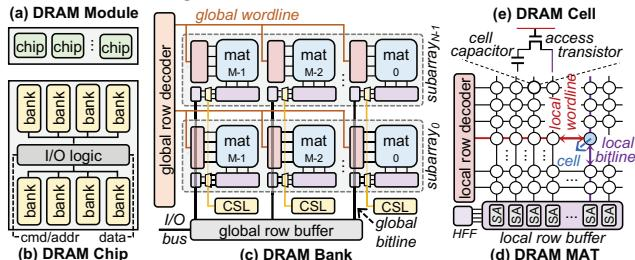
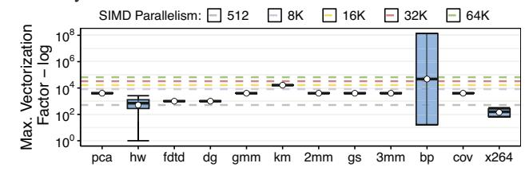
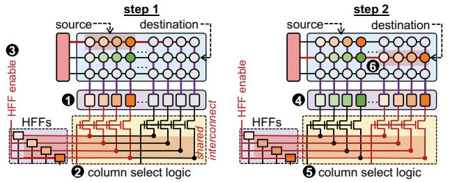
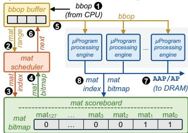
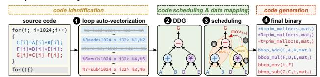

# MIMDRAM: An End-to-End Processing-Using-DRAM System for High-Throughput, Energy-Efficient and Programmer-Transparent Multiple-Instruction Multiple-Data Computing

Geraldo F. Oliveira† Ataberk Olgun† Abdullah Giray Yağlıkçı† F. Nisa Bostancı† Juan Gómez-Luna† Saugata Ghose‡ Onur Mutlu†

† ETH Zürich ‡ Univ. of Illinois Urbana-Champaign

Processing-using-DRAM (PUD) is a processing-in-memory (PIM) approach that uses a DRAM array's massive internal parallelism to execute very-wide (e.g., 16,384–262,144-bit-wide) data-parallel operations, in a single-instruction multiple-data (SIMD) fashion. However, DRAM rows' large and rigid granularity limit the effectiveness and applicability of PUD in three ways. First, since applications have varying degrees of SIMD parallelism (which is often smaller than the DRAM row granularity), PUD execution often leads to underutilization, throughput loss, and energy waste. Second, due to the high area cost of implementing interconnects that connect columns in a wide DRAM row, most PUD architectures are limited to the execution of parallel map operations, where a single operation is performed over equally-sized input and output arrays. Third, the need to feed the wide DRAM row with tens of thousands of data elements combined with the lack of adequate compiler support for PUD systems create a programmability barrier, since programmers need to manually extract SIMD parallelism from an application and map computation to the PUD hardware.

Our goal is to design a flexible PUD system that overcomes the limitations caused by the large and rigid granularity of PUD. To this end, we propose MIMDRAM, a hardware/software co-designed PUD system that introduces new mechanisms to allocate and control only the necessary resources for a given PUD operation. The key idea of MIMDRAM is to leverage finegrained DRAM (i.e., the ability to independently access smaller segments of a large DRAM row) for PUD computation. MIMDRAM exploits this key idea to enable a multiple-instruction multiple-data (MIMD) execution model in each DRAM subarray (and SIMD execution within each DRAM row segment).

We evaluate MIMDRAM using twelve real-world applications and 495 multi-programmed application mixes. Our evaluation shows that MIMDRAM provides 34× the performance, 14.3× the energy efficiency, 1.7× the throughput, and 1.3× the fairness of a state-of-the-art PUD framework, along with 30.6× and 6.8× the energy efficiency of a high-end CPU and GPU, respectively. MIMDRAM adds small area cost to a DRAM chip (1.11%) and CPU die (0.6%). We hope and believe that MIMDRAM's ideas and results will help to enable more efficient and easy-to-program PUD systems. To this end, we open source MIMDRAM at https://github.com/CMU-SAFARI/MIMDRAM.

#### 1. Introduction

Data movement between computation units (e.g., CPUs, GPUs) and main memory (e.g., DRAM) is a major performance

and energy bottleneck in current computing systems [1-20], and is expected to worsen due to the increasing data intensiveness of modern applications [21, 22]. To mitigate the overheads caused by data movement, several works propose processingin-memory (PIM) architectures [10, 17, 18, 23–117]. There are two main approaches to PIM [8, 9]: (i) processing-nearmemory (PNM) [10, 17, 18, 23–58, 104], where computation logic is added near the memory arrays (e.g., in a DRAM chip or at the logic layer of a 3D-stacked memory [118-120]); and (ii) processing-using-memory (PUM) [52, 59–103, 105, 121– 146], where computation is performed by exploiting the analog operational properties of the memory circuitry. There are two main advantages of PUM over PNM. First, PUM fundamentally eliminates data movement by performing computation in situ, while data movement still occurs between computation units and memory arrays in PNM. Second, PUM architectures exploit the large internal bandwidth and parallelism available inside the memory arrays, while PNM solutions are fundamentally bottlenecked by the memory's internal data buses.

PUM architectures can be implemented using different memory technologies, including SRAM [70,71,96–99], DRAM [52,61–67,69,73–76,78,79,83,85,86,88,125], emerging nonvolatile [59,60,68,77,81,82,90] or NAND flash [80,91–95]. Processing-using-DRAM (PUD) [52,61–67,69,73–76,78,79,83,85,86,88], in particular, enables the execution of different *bulk* operations in DRAM (i.e., PUD operations), such as (*i*) data copy and initialization [64,74,75,100], (*ii*) bitwise Boolean operations [52,61,63,67,69], (*iii*) arithmetic operations [63,66,69,88,101,125], and (*iv*) lookup table based operations [78,79,102,103,145].

PUD architectures commonly employ bit-serial computation [52,61,62,64,65,67,69,73–76,101,125], where they map each data element of a PUD operation to a DRAM column.1 A PUD architecture that leverages bit-serial computation effectively enables a very-wide single-instruction multiple-data (SIMD) execution model in DRAM, with a *large* and *rigid* computation granularity. The *large* computation granularity stems from the fact that bit-serial computation turns each one of the *many* DRAM columns in a DRAM subarray into a computing engine. For example, there are 16,384–262,144 DRAM columns in a DDR4 DRAM [147] subarray, and each can execute a *single* PUD operation over *multiple* data elements stored on the DRAM columns. The *rigid* computation granularity stems from the fact that the granularity at which DRAM rows

1We provide a detailed background on DRAM organization in §2.1.

are accessed dictates the computation granularity of a PUD operation. In commodity DRAM chips, all DRAM row accesses happen at a *fixed* granularity: the DRAM access circuitry addresses *all* DRAM columns in a DRAM row *simultaneously*. As such, *every* PUD operation operates simultaneously on *all* the 16,384 to 262,144 data elements (one per DRAM column) a DDR4 DRAM subarray stores, for example.

We highlight three limitations of state-of-the-art PUD architectures that stem from the *large* and *rigid* granularity of PUD's very-wide SIMD execution model. First, to sustain high *SIMD utilization* (i.e., the fraction of SIMD lanes executing a useful operation), each PUD operation needs to operate on a *large* amount of data. Unfortunately, not all applications have the required large amount of data parallelism to sustain high SIMD utilization in PUD architectures. Our analysis of twelve generalpurpose applications (compiled for a high-end CPU system) shows that the degree of SIMD parallelism an application has *varies* significantly, from as low as 8 to as high as 134,217,729 data elements per SIMD instruction (§3). Second, the large granularity of PUD execution makes it costly to implement interconnects that connect columns in a DRAM row. Such interconnects could allow for the implementation of PUD operations that require shifting data across DRAM columns, which is a common computing pattern present in vector-to-scalar reduction operations, e.g., sum += A[i]. This limits PUD operations to *only* parallel map operations (i.e., operations where an output data of the same dimension as the input data is produced by applying a computation independently to each input operand). A prior work [63] proposes modifications to the DRAM array to enable communication across DRAM columns. However, the interconnection network that this work proposes can lead to prohibitive area cost in commodity DRAM chips (i.e., 21% DRAM area overhead, see §8.3). Third, the need to feed a very-wide DRAM row with thousands of data elements combined with the lack of adequate compilation tools that can identify very-wide SIMD instructions in general-purpose applications and map such instructions to equivalent PUD operations create a *programmability barrier* for PUD architectures. In state-of-the-art PUD architectures [52,61–67,69,79,83,85,86,88,101,125], the programmer needs to *manually* extract a *large* and *fixed* amount of data-parallelism from an application and map computation to the underlying PUD hardware, which is a daunting task.

Our *goal* is to design a flexible PUD substrate that overcomes the three limitations caused by the large and rigid granularity of PUD execution. To this end, we propose MIMDRAM, a hardware/software co-designed PUD system that introduces the ability to allocate and control *only* the required amount of computing resources inside the DRAM subarray for PUD computation. The *key idea* of MIMDRAM is to leverage finegrained DRAM for PUD operations. Prior works on finegrained DRAM [148–155] leverage the hierarchical design of a DRAM subarray to enable DRAM row accesses with *flexible* granularity. A DRAM subarray is composed of multiple (e.g., 32–128) smaller 2D arrays of 512–1024 DRAM rows and 512–1024 columns, called *DRAM mats* [62, 65, 150, 156]. During a row access, the DRAM access circuitry *simultaneously* addresses *all* columns across *all* mats in a subarray, composing a *large* DRAM row of size [#columns\_per\_mat

× #mats\_per\_subarray]. Fine-grained DRAM modifies the DRAM access circuitry to enable reading/writing data from/to individual DRAM mats, allowing the access of DRAM rows with a smaller number of columns.

Inspired by fine-grained DRAM, we propose simple modifications to the DRAM access circuitry to enable addressing individual DRAM mats during PUD computation. Fine-grained DRAM for PUD computation brings four main advantages. First, by addressing individual DRAM mats, MIMDRAM better matches the granularity of a PUD operation to the available data-parallelism present in the application. Second, with fewer DRAM columns per PUD operation, MIMDRAM makes it feasible to implement low-cost interconnects inside a DRAM subarray, allowing for data movement *within* and *across* DRAM mats. Third, since the number of columns in a single DRAM mat is on par with the number of SIMD lanes in modern processors' SIMD engines (e.g., 512 SIMD lanes in AVX-51 SIMD engines2 [157]), MIMDRAM can leverage traditional compilers to map SIMD instructions to PUD operations. Fourth, MIM-DRAM leverages *unused* DRAM mats to *concurrently* execute *independent* PUD operations *across* DRAM mats in a *single* DRAM subarray. This enables the PUD substrate to execute a *not-so-wide* PUD operation in a subset of the DRAM mats and other independent PUD operations across the remaining DRAM mats within a single DRAM subarray, in a multiple-instruction multiple-data (MIMD) fashion [158–160].

MIMDRAM leverages fine-grained DRAM for PUD in hardware and software. On the hardware side, MIMDRAM proposes simple modifications to the DRAM subarray and includes new mechanisms to the memory controller that allow the execution of independent PUD operations across the DRAM mats in a single subarray. Concretely, MIMDRAM includes (*i*) latches, isolation transistors, and selection logic in the DRAM subarray's access circuitry to enable the execution of independent PUD operations in different DRAM mats; (*ii*) two different low-cost interconnects placed respectively at the local and global DRAM I/O circuitry, which enable communication across columns of a DRAM row at varying granularities and the execution of vector-to-scalar reduction in DRAM at low hardware cost. In the memory controller, MIMDRAM includes a new control unit that orchestrates the concurrent execution of independent PUD operations in different mats of a DRAM subarray. On the software side, MIMDRAM implements compiler passes to (*i*) automatically vectorize code regions that can benefit from PUD execution (called PUD-friendly regions); (*ii*) for such regions, generate PUD operations with the most appropriate SIMD granularity; and (*iii*) schedule the concurrent execution of independent PUD operations in different DRAM mats. We discuss how to integrate MIMDRAM in a real system, including how MIMDRAM deals with (*i*) data allocation within a DRAM subarray and (*ii*) mapping of a PUD's operands to guarantee high utilization of the PUD substrate.

We evaluate MIMDRAM's performance, energy efficiency, throughput, fairness, and SIMD utilization for twelve realworld applications from four popular benchmark suites (i.e., Phoenix [161], Polybench [162], Rodinia [163], and SPEC 2017 [164]) and 495 multi-programmed application mixes. Our evaluation shows that MIMDRAM provides 34× the performance,  $14.3 \times$  the energy efficiency,  $1.7 \times$  the throughput,  $1.3 \times$  the fairness, and  $18.6 \times$  the SIMD utilization of SIM-DRAM [101] (a state-of-the-art PUD framework); while providing  $30.6 \times$  and  $6.8 \times$  the energy efficiency of a high-end CPU and GPU, respectively. MIMDRAM's improvements are due to its ability to (i) maximize the utilization of the PUD substrate by *concurrently* executing independent PUD operations within each DRAM subarray, and (ii) allocate *only* the necessary resources (i.e., appropriate number of DRAM mats) for a PUD operation. MIMDRAM adds small area cost to a state-of-the-art DRAM chip (1.11%) and state-of-the-art CPU die (0.6%).

We make the following key contributions:

- To our knowledge, this is the first work to propose an endto-end processing-using-DRAM (PUD) system for generalpurpose applications, which executes operations in a multipleinstruction multiple-data (MIMD) fashion. MIMDRAM makes low-cost modifications to the DRAM subarray design that enable the *concurrent* execution of multiple independent PUD operations in a single DRAM subarray.
- We propose compiler passes that take as input unmodified C/C++ applications and, transparently to the programmer, (i) identify loops that are suitable for PUD execution, (ii) transform the source code to use PUD operations, and (iii) schedule independent PUD operations for concurrent execution in each DRAM subarray, maximizing utilization of the underlying PUD architecture.
- We evaluate MIMDRAM with a wide range of generalpurpose applications and observe that it provides higher energy efficiency and system throughput than state-of-the-art PUD, CPU, and GPU architectures.
- We open-source MIMDRAM at https://github.com/ CMU-SAFARI/MIMDRAM.

#### 2. Background

We first briefly explain the architecture of a typical DRAM chip.2 Second, we describe prior PUD works that MIMDRAM builds on top of.

## 2.1. DRAM Organization & Operation

**DRAM Organization.** A DRAM system comprises of a hierarchy of components, as Fig. 1 illustrates. A *DRAM module* (Fig. 1a) has several (e.g., 8–16) DRAM chips. A *DRAM chip* (Fig. 1b) has multiple DRAM banks (e.g., 8–16). A *DRAM bank* (Fig. 1c) has multiple (e.g., 64–128) 2D arrays of DRAM cells known as *DRAM mats*. Several DRAM mats (e.g., 8–16) are grouped in a *DRAM subarray*. In a DRAM bank, there are three global components that are used to access the DRAM mats (as Fig. 1c depicts): (i) a *global row decoder* that selects a row of DRAM cells *across* multiple mats in a subarray, (ii) a *column select logic* (CSL) that selects portions of the DRAM row based on the column address, and (iii) a *global sense amplifier* (i.e., global row buffer) that transfers the selected fraction of the data from the selected DRAM row through the *global bitlines*.

A *DRAM mat* (Fig. 1d) consists of a 2D array of DRAM cells organized into multiple *rows* (e.g., 512–1024) and multiple *columns* (e.g., 512–1024) [171–173]. A *DRAM cell* (Fig. 1e) consists of an *access transistor* and a *storage capacitor*. The

2We refer the reader to various prior works [14,16,61,62,64,150,155,165–170] for a more detailed description of the DRAM architecture.

source nodes of the access transistors of all the DRAM cells in the same column connect the cells' storage capacitors to the same *local bitline*. The gate nodes of the access transistors of all the DRAM cells in the same row connect the cells' access transistors to the same *local wordline*. Each mat contains (i) a *local row decoder* that drives the local wordlines to the appropriate voltage levels to open (activate) a row, (ii) a row of sense amplifiers (also called a *local row buffer*) that senses and latches data from the activated row, and (iii) helper flip-flops (HFFs) that drive a portion (e.g., 4 bit) of the data in the local row buffer to the global bitlines.

Figure 1: Overview of DRAM organization.

**DRAM Operation.** Three major steps are involved in serving a main memory request. First, to select a DRAM row, the memory controller issues an ACTIVATION (ACT) command with the row address. On receiving this command, the DRAM chip transfers all the data in the row to the corresponding local row buffer. Second, to access a cache line from the activated row, the memory controller issues a READ (RD) command with the column address of the request. Third, to enable the access of another DRAM row in the same bank, the memory controller issues a PRECHARGE (PRE) command with the address of the currently activated DRAM bank. This command disconnects the local bitline by disabling the local wordline, and the local bitline voltage is restored to its quiescent state.

## 2.2. Processing-Using-DRAM

**In-DRAM-Row Copy.** RowClone [64] enables copying a row *A* to a row *B* in the *same* subarray by issuing two consecutive ACT commands to these two rows, followed by a PRE command. This command sequence is called AAP [61].

**In-DRAM AND/OR/NOT.** Ambit [61, 62, 65, 73, 74, 76] shows that simultaneously activating *three* DRAM rows, via a DRAM operation called *triple row activation (TRA)*, can perform *in-DRAM* bitwise AND and OR operations. Ambit defines a new command called AP that issues a TRA followed by a PRE. Since TRA operations are destructive, Ambit divides DRAM rows into *three groups* for PUD computing: (*i*) the **D**ata group, which contains regular data rows; (*ii*) the **C**ontrol group, which consists of two rows (C0 and C1) with all-0 and all-1 values; and (*iii*) the **B**itwise group, which contains six rows designated for computation (four regular rows, T0, T1, T2, T3; and two rows, DCC0 and DCC1, of dual-contact cells for NOT).

**Generalizing In-DRAM Majority.** SIMDRAM [101] proposes a three-step framework to implement PUD operations. In the first step, SIMDRAM converts an AND/OR/NOT-based representation of the desired operation into an equivalent optimized MAJ/NOT-based representation. By doing so, SIMDRAM re-

duces the number of TRA operations required to implement the operation. In the second step, SIMDRAM generates the required sequence of DRAM commands to execute the desired operation. Specifically, this step translates the MAJ/NOT-based implementation of the operation into AAPs/APs. This step involves (i) allocating the designated compute rows in DRAM to the operands and (ii) determining the optimized sequence of AAPs/APs that are required to perform the operation. This step's output is a µProgram, i.e., the optimized sequence of AAPs/APs that will be used to execute the operation at runtime. Each μProgram corresponds to a different bbop instruction, which is one of the CPU ISA extensions to allow programs to interact with the SIMDRAM framework (see §6.1). In the third step, SIMDRAM uses a control unit in the memory controller to execute the bbop instruction using the corresponding µProgram. SIMDRAM implements 16 bbop instructions, including abs, add, bitcount, div, max, min, mult, ReLU, sub, and-/or-/xorreduction, equal, greater, greater equal, and if-else.

Fig. 2 illustrates how SIMDRAM executes a one-bit full addition operation using the sequence of row copy (AAP) and majority (AP) operations in DRAM. The figure shows one iteration of the full adder computation that computes  $Y_0 = A_0 +$ B0 + Cin. First, SIMDRAM uses a vertical data layout, where all bits of a data element are placed in a single DRAM column when performing PuD computation. Consequently, SIMDRAM employs a bulk bit-serial SIMD execution model, where each data element is mapped to a column of a DRAM row. This allows a DRAM subarray to operate as a PuD SIMD engine, where a single bit-serial operation is performed over a large number of independent data elements (i.e., as many data elements as the size of a logical DRAM row, for example, 65,536) at once. Second, as shown in the figure, each iteration of the full adder requires five AAPs  $(\mathbf{0}, \mathbf{0}, \mathbf{0}, \mathbf{0})$  and three APs  $(\mathbf{0}, \mathbf{0}, \mathbf{0})$  $\otimes$ ). A bit-serial addition of *n*-bit operands needs *n* iterations, thus (8n+2) APs and AAPs [101].

Figure 2: Full adder operation in SIMDRAM.

## 3. Motivation

The efficiency of state-of-the-art PUD substrates can be subpar when the SIMD parallelism that exists in an application is smaller than or not a multiple of the size of a DRAM row. To quantify the SIMD parallelism some real-world applications inherently possess, we profile the *maximum vectorization factor* of twelve real-world applications. The vectorization factor of a loop is the number of scalar operands that fit into a SIMD register [174,175]. We calculate the maximum vectorization factor by multiplying the vectorization factor of a single loop iteration and the loop's trip count [176]. We leverage modern compilers' loop auto-vectorization engines, which allows us to have an initial understanding of the SIMD parallelism that a large number of applications possesses.

For our analysis, we use (*i*) the LLVM compiler toolchain [177] (version 12.0.0) to *automatically* vectorize loops in the application, and (*ii*) an LLVM pass [178–180] that instruments each application's loop to, during execution, gather *dynamic* information about each vectorized loop, i.e., the loop trip count, execution count, execution time, and instruction breakdown [181]. We compile each application using the clang compiler [177], using the appropriate flags to enable the loop auto-vectorization engine and its loop vectorization report (i.e., -03 -Rpass-analysis=loop-vectorize -Rpass=loop-vectorize). We assume SIMDRAM [101] as the target PUD architecture.

Fig. 3 shows the distribution of maximum vectorization factors (y-axis) of all the vectorizable loops in an application (xaxis). We indicate different amounts of SIMD parallelism with horizontal dashed lines for reference. We make two observations. First, the maximum vectorization factor varies both within an application and across different applications. Our analysis shows maximum vectorization factors as low as 8 and as high as 134,217,729. Second, only a small fraction of vectorized loops have enough maximum vectorization factor (i.e., values above the green horizontal dashed line) to fully exploit the SIMD parallelism of SIMDRAM. On average, only 0.11% of all vectorized loops have a maximum vectorization factor equal to or greater than a DRAM row (i.e., greater than 65,536 data elements). We conclude that (i) real-world applications have varying degrees of SIMD parallelism; and (ii) these varying degrees of SIMD parallelism rarely take full advantage of the very-wide SIMD width of state-of-the-art PUD substrates.

Figure 3: Distribution of maximum vectorization factor across all vectorized loops. Whiskers extend to the minimum and maximum data points on either side of the box. Bubbles depict average values.

**Problem & Goal.** We observe that the rigid granularity of PUD architectures limits their efficiency (and thus their effective applicability) for many applications. Such applications would benefit from a variable-size SIMD substrate that can dynamically adapt to the varying levels of SIMD parallelism (i.e., different vectorization factors) an application exhibits during its execution. Therefore, our *goal* is to design a flexible PUD substrate that (i) adapts to the varying levels of SIMD parallelism present in an application, and (ii) maximizes the utilization of the very-wide PUD engine by concurrently exploiting parallelism across different PUD operations (potentially from different applications).

&lt;sup>3See §7 for the description of our applications and their dataset.

#### 4. MIMDRAM: A MIMD PUD Architecture

MIMDRAM is a hardware/software co-designed PUD system that enables fine-grained PUD computation at low cost and low programming effort. The key idea of MIMDRAM is to leverage fine-grained DRAM activation for PUD, which provides three benefits. First, it enables MIMDRAM to allocate only the appropriate computation resources (based on the maximum vectorization factor of a loop) for a target loop, thereby reducing underutilization and energy waste. Second, MIMDRAM can currently execute multiple independent operations inside a single DRAM subarray independently in separate DRAM mats. This allows MIMDRAM to operate as a MIMD PUD substrate, increasing overall throughput. Third, MIMDRAM implements low-cost interconnects that enable moving data across DRAM columns across and within DRAM mats by combining fine-grained DRAM activation with simple modifications to the DRAM I/O circuitry. This enables MIMDRAM to implement reduction operations in DRAM without any intervention of the host CPU cores.

#### 4.1. MIMDRAM: Hardware Overview

Fig. 4 shows an overview of the DRAM organization of MIMDRAM. Compared to the baseline Ambit subarray organization, MIMDRAM adds four new components (colored in green) to a DRAM subarray and DRAM bank, which enable (*i*) fine-grained PUD execution; (*ii*) global I/O data movement; and (*iii*) local I/O data movement.

**Fine-Grained PUD Execution.** To enable fine-grained PUD execution, MIMDRAM modifies Ambit's subarray and the DRAM bank with three new hardware structures: the *mat isolation transistor*, the *row decoder latch*, and the *mat selector*. At a high level, the *mat isolation transistor* allows for the independent access and operation of DRAM mats within a subarray while the *row decoder latch* enables the execution of a PUD operation in a range of DRAM mats that the *mat selector* defines.

First, the *mat isolation transistor* (① in Fig. 4) segments the global wordline connected to the local row decoder in each DRAM mat in a subarray. Second, the row decoder latch (ii) stores the bits from the global wordline used to address the local row decoder. Third, the mat selector ((iii)), shared across all DRAM mats in a subarray, asserts one or more mat isolation transistors. The mat selector enables the connection between the global wordline and the row decoder latches belonging to a range of DRAM mats. When issuing PUD operations, the memory controller specifies the logical address of the first and last DRAM mats that the PUD operation targets (called logical mat range). Internally, each DRAM chip (i) identifies whether any of its DRAM mats belong to the logical mat range and (ii) translates the logical mat range into the appropriate physical mat range, which is used as input for the mat selector. With these structures, different PUD operations can execute in different ranges of DRAM mats.

For example, to execute a TRA in only  $mat_0$ , MIMDRAM performs four steps: (i) when issuing a TRA, the memory controller sends, alongside the row address information, the logical  $mat\ range\ [mat\ begin\ , mat\ end] = [\#0\ ,\#0]$  to address  $mat_0$  (1) in Fig. 4); (ii) the  $mat\ selector$  (2) receives the logical mat range, translates it to the appropriate  $physical\ mat\ range$ , and raises the  $matline\ corresponding\ to\ mat_0$ , which asserts  $mat_0$ 's

mat isolation transistor (3) and connects the global wordline to  $mat_0$ 's row decoder latch; (iii) the bits of the global wordline used to drive  $mat_0$ 's local row decoder are stored in  $mat_0$ 's row decoder latch (4); (iv) finally,  $mat_0$ 's local row decoder drives the appropriate rows in  $mat_0$ 's DRAM array based on the value stored in the row decoder latch. From here, the DRAM row activation (and thus, PUD computation) proceeds as described in §2.1, only involving the DRAM rows in  $mat_0$ . Since the per-mat row decoder latch stores the local row address for a given row activation in a mat, the memory controller can issue a TRA to another DRAM mat while  $mat_0$  is being activated (5).

Figure 4: MIMDRAM subarray and bank organization. Greencolored boxes represent newly added hardware components.

Global I/O Data Movement. To enable data movement across different mats, MIMDRAM implements an *inter-mat interconnect* by slightly modifying the connection between the I/O bus and the global row buffer ( $\widehat{v}$ ) in Fig. 4). The inter-mat interconnect relies on the observation that the sense amplifiers in the global row buffer have *higher* drive than the sense amplifiers in the local row buffer [167, 182], allowing to directly drive data from the global row buffer into the local row buffer.4 To leverage this observation, MIMDRAM adds a 2:1 multiplexer to the input/output port of each set of *four* 1-bit sense amplifiers in the global row buffer. The multiplexer selects whether the data that is written to the sense amplifier set  $SA_i$  comes from the I/O bus or from the neighbor sense amplifier set  $SA_{i-1}$ .

To manage inter-mat data movement, MIMDRAM exposes a new DRAM command to the memory controller called GB-M0V (global I/O move). The GB-M0V command takes as input: (i) the logical mat range [mat begin, mat end], row address, and column address of the source DRAM row and column; and (ii) the logical mat range [mat begin, mat end], row address, and column address of the destination DRAM row and column. With the inter-mat interconnect and new DRAM command, MIMDRAM can move four bits5 of data from a source row and column (rowsrc, columnsrc) in  $mat_{M-2}$  to a destination row and column (rowdst, columndst) in  $mat_{M-1}$ , in a DRAM subarray with M DRAM mats. Once the memory controller receives a GB-M0V command, it performs three steps. First, the memory controller issues an ACT to the source row in  $mat_{M-2}$ , which loads the target DRAM  $row_{src}$  to  $mat_{M-2}$ 's local sense am-

&lt;sup>4Prior work [182] leverages the same observation to copy DRAM columns from one subarray to another.

&lt;sup>5The number of bits the inter-mat interconnect can move at once depends on the number of HFFs *already present* in a DRAM mat. We assume that each mat has four HFFs, as prior works suggest [150,151,155].

plifiers (@ in Fig. 4). Concurrently, the memory controller issues an ACT to the destination row in  $mat_{M-1}$ , which connects  $row_{dst}$  to  $mat_{M-1}$ 's local sense amplifiers. Second, the memory controller issues a RD with the address of the four-bit source column to  $mat_{M-2}$ . The column select command loads the fourbit  $column_{src}$  from  $mat_{M-2}$ 's local sense amplifiers to its HFFs, and  $mat_{M-2}$ 's HFFs drive the corresponding set of four one-bit sense amplifiers  $SA_{M-2}$  in the global row buffer (10). Third, the memory controller issues a WR with the address of the four-bit destination column to  $mat_{M-1}$ . Since the WR corresponds to a GB-MOV command, the multiplexer that connects  $mat_{M-1}$ 's HFFs to the global row buffer takes as input the added datapath coming from  $SA_{M-2}$  instead of the conventional datapath coming from the I/O bus ( $\odot$ ). As a result, the data stored in  $SA_{M-2}$ is loaded into  $SA_{M-1}$ , which in turn drives  $mat_{M-1}$ 's HFFs and local sense amplifiers (10). Once the four-bit column coming from  $row_{src}$  is written into  $mat_{M-1}$ 's local sense amplifiers, the local sense amplifiers finish the WR by restoring the local bitlines in  $mat_{M-1}$  to VDD or GND, thereby storing the four-bit column coming from columnsrc as a column of  $row_{dst}$  (②).

The conservative worst-case latency of a GB-MOV command (i.e., where the addresses of the source and the destination rows differ) is equal to  $t_{RAS} + t_{RELOC} + t_{WR} + t_{RP}$ ; where  $t_{RAS}$  is latency from the start of row activation until the completion of the DRAM cell's charge restoration,  $t_{RELOC}$  [182] is the latency of turning on the connection between the source and destination local sense amplifiers;  $t_{WR}$  is the minimum time interval between a WR and a PRE command, which allows the sense amplifiers to restore the data to the DRAM cells;  $t_{RP}$  is the latency between issuing a PRE and when the DRAM bank is ready for a new row activation.

**Local I/O Data Movement.** To enable data movement across columns *within* a DRAM mat, MIMDRAM implements an *intra-mat interconnect* (① in Fig. 4), which does *not* require any hardware modifications. Instead, it modifies the sequence of steps DRAM executes during a column access operation. There are two *key observations* that enable the intra-mat interconnect. First, we observe that the local bitlines of a DRAM mat *already* share an interconnection path via the HFFs and column select logic (as Fig. 5 illustrates). Second, the HFFs in a DRAM mat can latch and *amplify* the local row buffer's data [154, 167].

Figure 5: MIMDRAM intra-mat interconnect.

To manage intra-mat data movement, MIMDRAM exposes a new DRAM command to the memory controller called LC-MOV (local I/O move). The LC-MOV command takes as input: (i) the logical mat range [mat begin, mat end] of the target row, (ii) the row and column addresses of the source DRAM row and column; and (iii) the row and column addresses of the destination DRAM row and column. With the intra-mat interconnect and

new DRAM command, MIMDRAM can move four bits of data from a source row and column (rowsrc, columnsrc) to a destination row and column ( $row_{dst}$ ,  $column_{dst}$ ) in  $mat_M$ . Once the memory controller receives an LC-MOV command, it performs two steps, which Fig. 5 illustrates. In the first step, the memory controller performs an ACT-RD-PRE targeting rowsrc, columnsrc in  $mat_M$ . The ACT loads  $row_{src}$  to  $mat_M$ 's local sense amplifier (1) in Fig. 5). The RD moves four bits from  $row_{src}$ , as indexed by columnsrc, into the mat's HFFs by enabling the appropriate transistors in the column select logic (2). The HFFs are then enabled by transitioning the HFF enable signal from low to high. This allows the HFFs to *latch* and *amplify* the selected four-bit data column from the local sense amplifier (3). The PRE closes rowsrc. Until here, the LC-MOV command operates exactly as a regular ACT-RD-PRE command sequence. However, differently from a regular ACT-RD-PRE, the LC-MOV command does *not* lower the *HFF enable* signal when the RD finishes. This allows the four-bit data from columnsrc to reside in the mat's HFFs. In the second step, the memory controller performs an ACT-WR-PRE targeting rowdst, columndst in  $mat_M$ . The ACT loads  $row_{dst}$  into the mat's local row buffer (4), and the WR asserts the column select logic to columndst, creating a path between the HFFs and the local row buffer (3). Since the HFF enable signal is kept high, the HFFs will not sense and latch the data from  $column_{dst}$ . Instead, the HFFs overwrite the data stored in the local sense amplifier with the previously four-bit data latched from columnsrc. The new data stored in the mat's local sense amplifier propagates through the local bitlines and is written to the destination DRAM cells (**6**).

The *conservative worst-case latency* of an LC-MOV command (i.e., where the addresses of the source and the destination rows differ) is equal to  $2 \times (t_{RAS} + t_{RP}) + t_{RELOC} + t_{WR}$ .

4.1.1. PUD Vector Reduction. We describe how MIMDRAM uses the inter-mat and intra-mat interconnects to implement PUD vector reduction. To do so, we use a simple example, where MIMDRAM executes a vector addition followed by a vector reduction, i.e., out+=(A[i]+B[i]). We assume that DRAM has only two mats, and the data elements of the input arrays A and B are evenly distributed across the two DRAM mats, as Fig. 6 illustrates. MIMDRAM executes a vector reduction in three steps. In the first step, MIMDRAM executes a PUD addition operation over the data in the two DRAM mats (1), storing the temporary output data C into the same mats where the computation takes place (i.e.,  $C = \{C[0]_{mat0}, C[1]_{mat1}\}$ ). In the second step, MIMDRAM issues a GB-MOV to move part of the temporary output C[0] stored in *mat*0 to a temporary row tmp in  $mat_1$  (tmpmat 1  $\leftarrow$  C[0]mat 0) via the inter-mat interconnect (**2**-(3), four bits (i.e., four data elements) at a time. MIMDRAM iteratively executes step 2 until all data elements of C[0] are copied to mat1. In the third step, once the GB-MOV finishes, MIMDRAM executes the final addition operation, i.e. tmp + C[1], in mat1. The final output of the vector reduction operation is stored in the destination row out in  $mat_1$  (4).

Once the vector reduction operation finishes, the temporary output array stored in  $mat_1$  holds as many data elements as the number of DRAM columns in a mat (e.g., 512 data elements). MIMDRAM allows reducing the temporary output vector further to an output vector with *four* data elements using

the intra-mat interconnect. The process is analogous to that employed during the 512-element vector reduction: MIMDRAM uses the intra-mat interconnect and the LC-MOV command to implement an adder tree inside a single DRAM mat.6

Figure 6: An example of a PUD vector reduction in MIMDRAM.

## 4.2. MIMDRAM: Control & Execution

To enable MIMDRAM to execute in a MIMD fashion, we need to efficiently (*i*) *encode* and *communicate* information regarding the target DRAM mats (i.e., the target mat range) in a *timely* manner (i.e., respecting DRAM timing parameters) while (*ii*) *orchestrating* the execution of independent PUD operations across the DRAM mats of a DRAM subarray. To do so, we take a *conservative* design approach: we aim to integrate MIMDRAM in commodity DRAM chips by providing an implementation (*i*) *compatible* with existing DRAM standards and (*ii*) that does *not* add new pins to a DRAM chips.

Encoding MAT Information. MIMDRAM needs a compact way to encode the target mat information, since a DRAM module often contains many DRAM mats. To solve this issue, MIMDRAM only allows a PUD operation to be executed in a *physically contiguous* set of DRAM mats.7 In this way, when executing the DRAM commands (i.e., ACTs and PREs) that realize a PUD operation, the memory controller only needs to provide the *first* and *last* (*logical*) mats an ACT target. Then, MIMDRAM internally decides which (*physical*) mats fit into the provided mat range. To do so, MIMDRAM implements a simple *chip select logic* and *mat identifier logic* inside the I/O circuitry of each DRAM chip. The *chip select logic* and *mat identifier logic* take as input the *logical mat range* and output (*i*) if DRAM mats placed in a chip belong to the mat range, and (*ii*) the physical mat range. In case a DRAM mat placed in a chip belongs to the mat range, the DRAM chip queues the physical mat range in the *mat queue* (which we describe later in this section). The *physical mat range* is used as input for the *mat selector* (see Fig. 4). Since there are up to 128 DRAM mats in a DDR4 module [183], MIMDRAM uses 14 bits to encode the logical mat range (7 bits each for *mat begin* and *mat end*, each), from which (*i*) the three most significant bits are used to identify the target DRAM chip and (*ii*) the four least significant bits are used to identify individual mats. The *chip select logic* and *mat identifier logic* comprise simple hardware elements: four comparators, two 2-input AND gates, two 2:1 multiplexers, and a 3-bit *chip id register* in each DRAM chip.

Communicating MAT Information. MIMDRAM needs to communicate to the DRAM chip information regarding the target mats during a PUD operation. However, it is challenging

to communicate the mat information alongside an ACT due to the narrow DRAM command/address (C/A) bus interface, since the memory controller uses most of the available pins during a row activation for row address and command communication.8 Our *key idea* to solve this issue is to overlap the latency of communicating the mat information to DRAM with the latency of DRAM commands in a μProgram in two ways: (*i*) ACT–ACT overlap, and (*ii*) PRE–ACT overlap. The first case (ACT–ACT overlap) happens when issuing a row copy operation (AAP). In this case, the mat information required by the second ACT is transmitted immediately *after* issuing the first ACT, exploiting the delay between two activations. The mat information is buffered once it reaches DRAM. The second case (PRE–ACT overlap) happens when issuing the first ACT in a row copy operation or the ACT in a TRA. We notice that (*i*) the first ACT command in an AAP/AP is *always* preceded by a PRE (due to a previous AAP/AP, or due to a previous DRAM request), and (*ii*) a PRE does *not* use the row address pins, since it targets a DRAM bank (not a DRAM row). Thus, MIMDRAM uses the row address pins during a PRE that immediately precedes the first ACT in an AAP/AP command sequence to communicate the mat information.9

Timing of MAT Information. MIMDRAM needs to communicate the mat information *before* a respective ACT in a μProgram. Communicating the mat information immediately *after* the memory controller issues the ACT would open the *entire* DRAM row (instead of only the relevant portion of the DRAM row). To solve this issue, we devise a simple queuingbased mechanism for partial row activation. Our mechanism relies on the fact that the execution order of ACTs and PREs in a μProgram is *deterministic*. 10 Thus, we can add to each DRAM command in an AAP/AP the information about when the DRAM circuitry should propagate the mat information. MIM-DRAM leverages this key idea by adding a *mat queue* to the I/O logic of each DRAM chip and adding extra functionality to the existing ACT and PRE commands to control the mat queue: (*i*) ACT-enqueue issues an ACT to row\_addr in the first DRAM clock cycle and enqueues [mat\_begin,mat\_end] in the second DRAM clock cycle; (*ii*) PRE-enqueue issues a PRE to bank\_id and enqueues [mat\_begin,mat\_end]; (*iii*) ACT-dequeue issues an ACT to row\_addr and dequeues from the mat queue.

Orchestrating MAT Information. MIMDRAM needs to execute different PUD operations concurrently. To this end, we implement a control unit inside the memory controller on the CPU die, which Fig. 7 illustrates. MIMDRAM leverages SIM-DRAM control unit to translate each *bbop* instruction into its

9If there are insufficient pins in the DDRx interface to communicate mat information (e.g., as in DDR5 [185]), MIMDRAM utilizes multiple DRAM C/A cycles to propagate the mat information. For example, in DDR5, MIMDRAM still performs PRE-ACT overlap, communicating the mat information in two cycles. Note that an extra cycle does *not* impact MIMDRAM's performance, since in a PRE-ACT command sequence, the PRE still needs to wait for the completion of the ACT for more than two DRAM C/A cycles.

10To realize a PUD operation, the memory controller *must* respect the order in which ACT and PRE commands are specified in the μProgram. Therefore, during PUD execution, ACTs and PREs in a μProgram cannot be reordered, and the behavior of the μProgram is thus deterministic. If the memory controller is performing maintenance operation to a DRAM bank, the AAP/AP commands of a PUD operation wait until the maintenance operation finishes.

6The number of GB-MOV and LC-MOV commands issued depends on the bit-precision of the input operands [101].

7In §6.3, we describe how we enforce physically contiguous mat allocation.

8There are 27 C/A pins in a DDR4 chip [184], from which only three pins are *not* used during an ACT command.

corresponding μProgram and adds extra circuitry to (*i*) schedule each μProgram based on its target mats and (*ii*) maintain multiple μProgram contexts. MIMDRAM control unit consists of four main components. First, *bbop buffer*, which stores *bbops* dispatched by the host CPU. Second, *mat scheduler*, which schedules the most appropriate *bbop* to execute depending on the *bbop*'s mat range and current mat utilization. Third, *mat scoreboard*, which tracks whether a given mat is being used by a *bbop* instruction. The *mat scoreboard* stores an *M*-bit *mat bitmap* that keeps track of which mats are currently in use, where *M* is the number of mats in the DRAM module. The *mat scoreboard* can index a range of positions in the *mat bitmap* using a *mat index*. Fourth, several (e.g., eight) μ*Program processing engines*, each of which translates a *bbop* into its respective μProgram and controls the *bbop*'s execution.

Figure 7: MIMDRAM control unit in the memory controller.

MIMDRAM control unit works in four steps. In the first step, MIMDRAM control unit enqueues an incoming bbop instruction dispatched by the host CPU (**1** in Fig. 7) in the *bbop* buffer. In the second step, the mat scheduler scans the bbop buffer from the oldest to the newest element. Then, the mat scheduler employs an online first fit algorithm [186] to select a bbop to be executed. For each bbop in the bbop buffer, the algorithm: (i) extracts the mat range information encoded in the *bbop* (2), which is used to index the *mat scoreboard* (3); (ii) reads the mat bitmap to identify whether the mats belonging to the bbop's mat range are currently free or busy (4); (iii) in case the mats are free, the mat scheduler writes a new mat bitmap to the mat scoreboard, indicating that the given mat range is now busy, selects the current bbop to be executed by allocating and copying the bbop to a free µProgram processing engine (5), and removes the current bbop from the bbop buffer (6); (iv) in case the mats belonging to the bbop's range are busy, the mat scheduler reads the next available bbop from the bbop buffer and repeats (i)-(iii). In the third step, one or multiple µProgram processing engines execute their allocated bbop, issuing AAPs/APs to the DRAM chips (**1**). The μProgram processing engine is responsible for maintaining the timing of AAP/AP commands. In our design, we avoid the need to maintain state for all DRAM mats in a DRAM module individually by: (i) only allowing a PUD operation to address a contiguous range of DRAM mats, which share state as they execute the same sequence of ACT-PRE commands and (ii) limiting the number of concurrent PUD operations to the number of μProgram processing engines available in the control unit. In the fourth step, when a µProgram processing engine finishes executing, it frees its allocated mats by correspondingly updating the mat bitmap in the mat scoreboard (8) and notifies the CPU that the execution of the bbop instruction is done.

## 5. MIMDRAM: Software Support

To ease MIMDRAM's programmability, we provide compiler support to transparently map SIMD operations to MIMDRAM. Fig. 8 illustrates MIMDRAM's compilation flow, which we implement using LLVM [177]: we take a C/C++ application's source code as input, perform three transformations passes, and output a binary with a mix of CPU and PUD instructions.

Figure 8: MIMDRAM's compilation flow.

**Pass 1: Code Identification.** The first pass is responsible for code identification. Its goal is to identify (i) loops that can be successfully auto-vectorized and (ii) the appropriate vectorization factor of a given vectorized loop. The code identification pass takes as input the application's LLVM intermediate representation (IR) generated by the compiler's front-end. It produces as output an optimized IR containing SIMD instructions that will be translated to bbop instructions. We leverage the native LLVM's loop auto-vectorization pass [187] to identify and transform loops into their vectorized form (1) in Fig. 8). 11 We apply two modifications to LLVM's loop auto-vectorization pass. First, instead of using a cost model to choose the vectorization factor that leads to the highest performance improvement compared to a scalar version of the same loop, we always select the *maximum* vectorization factor for the loop. This is important because the native cost model takes into account the hardware characteristics of a target CPU SIMD engine (i.e., number of available vector registers, SIMD width of the target execution engine, the latency of different SIMD instructions), which are not representative of our MIMDRAM engine with a variable SIMD width. Second, we modify the code generation routine for a given vectorized loop. Concretely, for a given vectorized loop, we identify and remove memory instructions related to each arithmetic SIMD operation (i.e., load/store instructions that manipulate vector registers) since PUD operations directly manipulate the data stored in DRAM; thus, there is no need to explicitly move data into/out SIMD registers.

Pass 2: Code Scheduling & Data Mapping. The second pass is responsible for *code scheduling and data mapping*. Its goal is to improve overall SIMD utilization by allowing the distribution of independent PUD instructions across DRAM mats. Since PUD instructions operate directly on the data stored in DRAM, the DRAM mat where the data is allocated determines the efficiency and utilization of the PUD SIMD engine. If operands of independent instructions are distributed across different DRAM mats, such instructions can be executed concurrently. Likewise, operands of dependent instructions are mapped to the same DRAM mat. In that case, intermediate data that one instruction produces and the next instruction consumes do *not* need to be moved across different DRAM mats, improving energy efficiency. Leveraging these observations, the code scheduling

11Prior works [188, 189] also leverage modern compilers' loop autovectorization engines to generate instructions to processing-near-memory (PNM) architectures equipped with SIMD engines.

pass takes as input all *bbop* instructions the code identification pass generates and outputs new *bbop* instructions containing metadata regarding their mat location (i.e., *mat label*). The code scheduling pass works in two steps.

In the first step, the code scheduling pass creates a datadependency graph (DDG) of the vectorized instructions (2). Each node represents a bbop instruction, incoming edges represent input, and outgoing edges represent output of the bbop. In the second step, the code scheduling pass takes as input the DDG and employs a data scheduling algorithm to distribute bbop instructions across DRAM mats (3). The data scheduling algorithm traverses the DDG in topological order to respect dependencies between bbop instructions using a depth-first search (DFS) kernel, which is a common algorithm for topological ordering [190, 191], and performs three operations. First, the algorithm traverses the *left* nodes in the DDG, assigning a single mat label i to nodes in the left path (**3**-**a**). Second, when the algorithm reaches a leaf node, it traverses the right sub-tree in the DDG. In this case, the algorithm assigns a new *mat label j* to the nodes in the *right* path in the sub-tree (**3**-**6**). Third, once the algorithm visits all the nodes in the right sub-tree, it returns to the parent node of the sub-tree. Since the parent node has already been visited when descending into the left path, the left and right sub-tree nodes will be assigned to different mats while having data dependencies across them (as indicated by the parent node). In this case, the algorithm creates a data movement bbop instruction (see §6.1) to move the output produced by the right sub-tree from *mat label j* to *mat label i* (**3**-**a**). This process repeats until the algorithm visits all nodes in the DDG.

**Pass 3: Code Generation.** The third pass is responsible for (i) data allocation and (ii) code generation. It takes as input the LLVM IR containing both CPU and bbop instructions (with metadata) and produces a binary to the target ISA (4). To implement data allocation, the code generation pass first identifies calls for memory allocation routines (e.g., malloc) associated with operands of bbops and replaces such memory allocation routines with a specialized PIM memory allocation routine (i.e., pim\_malloc, see §6.3). pim\_malloc receives as input the mat label assigned to its associated bbop instruction. Second, the pass inserts a bbop\_trsp\_init instruction right after each pim\_malloc call for each memory object that is an input/output of a bbop instruction. This instruction registers the memory object in MIMDRAM's transposition unit (§6.2). Similar to the pim\_malloc call, the bbop\_trsp\_init instruction receives as input the *mat label* assigned to its associated *bbop* instruction. To implement code generation, we modify LLVM's X86 backend to identify bbop instructions and generate the appropriate assembly code. In case the application uses parallel primitives (e.g., OpenMP pragmas [192]) to parallelize outermost loops, the code generation pass interacts with the underlying runtime system to statically distribute bbop instructions from innermost loops across the available DRAM mats in a subarray, i.e., mats with unassigned mat labels. This allows MIMDRAM to execute in a single-instruction multiple-thread (SIMT) [193, 194] fashion for manually parallelized applications.

