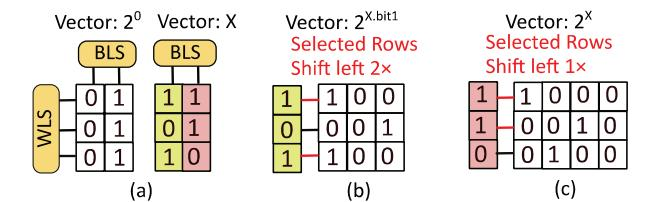

# *A. ASADI Architecture*

Figure 17 (a) presents the architecture of ASADI, comprising of multiple *Decoder processing elements* (De-PE) and *Encoder processing elements* (En-PE). The En-PE and De-PE have the same components, allowing a De-PE to operate as

Fig. 16. (a) Vector 20 and vector *x*, (b) Shift operation of bit1, (c) Shift operation of bit0

Fig. 17. (a) Overall ASADI architecture, (b) Details of one En-PE, (c) Details of the analog module, (d) Details of the digital module

an En-PE when it receives the weight matrices of an Encoder. ASADI possesses a single *input and output* (I/O) interface to receive input sequences. The number of En-PE and De-PE is equivalent to the number of Encoders and Decoders in the Transformer models. This structure is well-suited for scaling up to larger models requiring more Encoders and Decoders, as we can configure multiple ASADI chips, with a small number of off-chip transfers between them.

Figure 17 (b) illustrates the En-PE's details, which are composed of several Tiles equal to the number of attention heads. Each Tile consists of two analog modules, one digital module, and one microcontroller. The first analog module performs the linear layers before multi-head attention to generate matrices *Q*, *K*, and *V*. The digital module utilizes matrices *Q*, *K*, and *V* to execute the multi-head attention operation and generate matrix *Z*. The second analog module conducts the feed-forward layer after the multi-head attention. The microcontroller performs three functions: controlling the data transfers between the analog and digital modules, managing the compression and decompression of the sparse mask matrix, as depicted in § III, and sending four types of control signals to the analog and digital modules, i.e., *S*×*V* signals, *Q*×*K*T signals, linear layer signals, and softmax signals. The ReRAM array performs the corresponding in-situ operations based on the type of control signals.

Figure 17 (c) and (d) present the details of the analog and digital modules, respectively. The analog module consists of read-only ReRAM arrays that store the weight matrices of the linear layers. In contrast, the digital module comprises write-enable ReRAM arrays that store the matrices *Q*, *K*, *V*, and *S* generated during runtime. The analog module's *input register* (IR) caches the input embeddings from the previous layer, while the *output register* (OR) caches the output of the *vector-matrix multiplication* (VMM) operations. The digital module's IR caches the control signals of the bit-line and word-line selectors, while the OR caches the output voltage when performing in-situ computing (similar to the row buffer in DRAM). The S&A unit and ADC in Figure 17 (c) and (d) function similarly to Figure 4 (a).

## B. ASADI Dataflow

Cross-Encoder Dataflow: The input sequences are processed by ASADI in batches, which allows sequences of any length to be included in the same batch if there is enough memory. We use only one En/De-PE for one Encoder/Decoder layer. To introduce a dataflow between Encoders/En-PEs, two batches and two Encoders/En-PEs are used as an example. The first Encoder/En-PE processes the first batch and generates the output. While the first Encoder/En-PE processes the second batch, the output of the first batch is sent to the second Encoder/En-PE.

Intra-Encoder Dataflow: The dataflow within one Encoder consists of three phases, as illustrated in Figure 17 (b). In phase **1**, the embeddings within the same batch are sequentially transferred to the analog module for VMM operation, which generates the matrices Q, K, and V. Once created, the Q, K, and V matrices of one embedding are written to the digital module. Therefore, once the analog module has processed the embeddings, the generated matrices are stored in the digital module. In phase 2, the digital module performs the in-situ  $Q \times K^{\mathsf{T}}$ ,  $S \times V$ , and softmax operations to generate the output matrix Z. All the intermediate matrices and the output matrix Z are stored in the same digital module due to the in-situ computing nature. In phase 3, the matrix Z is sequentially read and sent to the second analog module to perform the feed-forward layer. The output of the feed-forward layer is then sent to the next Encoder.

