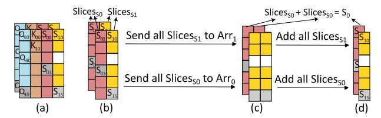

# B. In-situ $O \times K^{\mathsf{T}}$

**High-level motivations.** Figure 11 (a) illustrates the SD-DMM between dense matrices Q and K. Figure 11 (b) presents the SDDMM computation paradigm with the CSR format of matrix M. The  $\bigcirc$  iteration involves the first row of matrix M, controlling the 0-th row of matrix Q to calculate with the 0-th and 3-rd rows of matrix K (red arrows in Figure 11 (b)). Similarly, the  $\bigcirc$  iteration depicts the calculation between matrices Q and K (green arrows). Since the  $\bigcirc$  and  $\bigcirc$  iterations share the 0-th row of matrix K, they must be executed serially. The CSR format takes five iteration with only two valid computing in each iteration.

Figure 11 (c) demonstrates the SDDMM computation paradigm using the DIA format of matrix M. In the ① iteration, DI0 controls the vector multiplication between matrices Q and K (red arrows in Figure 11 (c)). In the ② iteration, DI-1 controls the calculation marked by the green arrows. The SDDMM results can be obtained with only two DIA iterations with five valid computing each iteration.

**Quantitative analysis.** In the above example, the diagonal locality is  $2.5\times$  greater than the row locality. Consequently, each round of DIA-wise iteration has  $2.5\times$  valid computing than the row-wise iteration, leading to less number of iterations. Since all iterations are executed sequentially, the DIA-wise computation paradigm saves  $2.5\times$  latency compared to the CSR-wise computation paradigm. For real-world sparse attention, like Longformer, the DIA-wise computation paradigm can achieve a time saving of  $7.5\times$ .

**Details of computation paradigm.** Figure 12 (a) displays the mapping of matrices Q and K. Specifically, we store two dimensions of matrices Q and K on two ReRAM arrays. For instance, Arr0 stores  $Q_0$  and  $K_0$ , Arr1 stores  $Q_1$  and  $K_1$  (line

Fig. 13. (a) Two slices of  $Q_0 \times K_0$  and  $Q_1 \times K_1$ , (b) We refer the slices of  $DI_0$  as  $Slices_{S0}$  and  $DI_{-1}$  to  $Slices_{S1}$ , (c) All  $Slices_{S0}$  and  $Slices_{S1}$  are transferred to the same ReRAM array, (d) Results of DIA-based S matrix

1 of Alg. 2). We will use  $Q_0$  and  $K_0$  in Arr0 as an example, while the second dimension processes the same.

