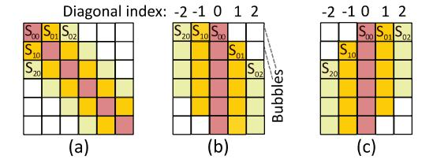
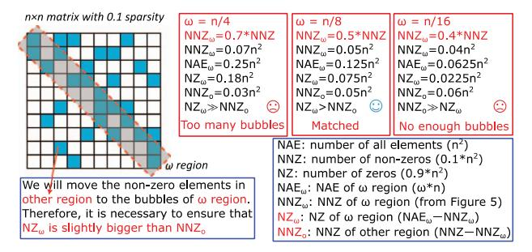

# B. Sparse Compression Methods

The most common compression methods currently used are *compress sparse row* (CSR), *compress sparse column* (CSC), and *coordinate format* (COO). Figure 3 (b) illustrates the CSR format of the sparse mask matrix as shown in Figure 3 (a). The column index list stores the column coordinates of each non-zero value, the value list stores all non-zero values using row-wise storage, and the row pointer list stores the index of the value list of the first non-zero element in each row. Figure 3 (c) presents the DIA format of Figure 3 (a), where the value lists store the elements in the diagonals and the *diagonal index* (DI) stores the diagonal index of each diagonal, for example, the center-most diagonal index is '0'.

#### C. In-situ Computing

Several hardware architectures are capable of performing in-situ computing, including ReRAM, *Phase Change Memory* (PCM) [38], *Spin-Transfer Torque RAM* (STT-RAM) [34], and Modified DRAM [2]. This paper focuses solely on ReRAM. ReRAM has the ability to perform two types of in-situ calculations: analog in-situ computing [4] and digital in-situ computing [12]. Figure 4 (a) illustrates the storage of each bit of the weight matrix in a separate ReRAM array. By activating the *driver* (DRV) using the corresponding bits of the input vector, the *vector-matrix multiplication* (VMM) operation can be directly obtained in the *sample and hold* (SH) unit and the *analog-digital converter* (ADC). Finally, the result of the multi-bit VMM operation is obtained by combining all the

Fig. 4. (a) Analog in-situ computing of ReRAM arrays, (b) Digital in-situ computing of ReRAM arrays

Fig. 5. The distribution of non-zero elements in Sanger [22] with various  $\omega$  (four bars), and the ratio of on-chip PE runtime to overall PIM chip runtime (broken lines).

bits using a shift adder. Figure 4 (b) shows that vec#A and vec#B are stored in the same ReRAM array, and the bit-wise activation of the bit lines can directly obtain the results of A + B in different areas of the same array.

## D. Motivation

Observation#1: Diagonal locality is prevalent in both static and dynamic sparse attention. As shown in Figure 2 (a), static sparsity naturally follows a diagonal distribution. To demonstrate the diagonal locality in dynamic sparsity, we reproduced the configurations of Sanger [22] as reported in their paper. First, we count the total number of non-zero elements in the sparse attention score matrix S, referred to as NNZ. Then, we count the number of non-zero elements in the central  $\omega$  diagonals of the S matrix ( $\omega = \frac{n}{16}, \frac{n}{8}, \frac{n}{4}$ , and  $\frac{n}{2}$ ), referred to as  $NNZ_{\omega}$  (*n* refers to the sequence length,  $n \le 512$ ). Finally, we use Figure 5 to present the results of  $\frac{NNZ_{\omega}}{NNZ}$ . When  $\omega = \frac{n}{8}$ , over 50% of the non-zero values are distributed in the central  $\omega$  diagonals area. The data density of the  $\omega$  diagonals area is  $7 \times$  greater than that of other areas. The reason for diagonal locality is that a word or pixel is more closely associated with its neighboring words or pixels at the application level. SparseBERT [33] reveals that various of sparse attention have good diagonal locality.

Observation#2: Current PIM-based sparse attention accelerators have high on-chip communication overhead. To validate this, we run the sparse attention of Sanger on the HBM-based PIM architecture provided by Ramulator-PIM [14]. In Figure 5, the broken lines indicate the ratio of on-chip PE runtime to the overall PIM chip runtime. Our experimental results demonstrate that on-chip PEs remain idle for over 40% of PIM chip runtime. The reason for this is that each on-chip PE of the PIM architecture can only efficiently access its local memory, while cross-bank and cross-rank memory access rely on the memory controller and system bus, which is significantly slower than local access. As a result, cross-

Fig. 6. (a) Sparse S matrix ( $\omega = 5$  and n = 6) without bubbles, (b) Bubble-free DIA compression, (c) Decompressed DIA format

bank and cross-rank transfers increase system-bus contention and cause PE idleness.

**Our goal:** Observation#1 motivates us to design a new matrix multiplication computation paradigm to efficiently support the DIA format, thus serving as our software design motivation. Additionally, Observation#2 motivates us to design ASADI, aiming to support the diagonal locality while minimizing on-chip transfers using in-situ computing.

## III. COMPRESSION FORMAT

We refer to diagonals with all non-zero elements as bubble-free diagonals, whereas diagonals contain zero values are referred to as bubble-containing diagonals. In this regard, we introduce two DIA-based compression method for sparse matrices consisting of bubble-free and bubble-containing diagonals, respectively.

#### A. Classic Bubble-free DIA

Figure 6 (a) illustrates the sparse mask matrix of Longformer, which exclusively consists of bubble-free diagonals. Figure 6 (b) depicts the classic DIA format of the sparse mask matrix, where we store each diagonal along one column and values with the same column coordinates in the same row. Figure 6 (c) showcases the decompressed DIA format of the sparse mask matrix, where we store the values with the same row coordinates in the same row. Compared with Figure 6 (a), Figure 6 (c) has fewer bubbles because the decompressed format in Figure 6 (c) lost some information, which will not affect the correctness of ASADI performing DIA-based SpMM and SDDMM (more details in Section IV).

**Advantages.** The row-based storage format can reach the row locality  $(\frac{\omega}{2}+1,\omega)$  with diagonal window size  $\omega$ . The DIA-based format can achieve the diagonal locality with  $(n-\frac{\omega}{2},n)$ . More non-zero in the same memory column means better locality. If we assume that  $\omega=\frac{n}{8}$ , DIA format can get more than  $7.5\times$  locality than row-based storage with the DIA lower bound  $(\frac{15n}{16})$  divided by row-wise upper bound  $(\frac{n}{8})$ .

## B. Bubble-containing DIA

Figure 7 (a) displays the sparse mask matrix of Sanger, which contains many bubble-containing diagonals. As shown in these grey cells, some non-zero values are distributed away from the central  $\omega=3$  diagonals with poor diagonal locality. To enhance the diagonal locality of dynamic sparse attention, we propose bubble-containing DIA format as follows.

Fig. 7. (a) Sparse *S* matrix with bubbles, (b) Bubble-free DIA compression, (c) Bubble-containing DIA compression, (d) Decompress non-central diagonals, (e) Decompress central diagonals

Fig. 8. Details to calculate  $NZ_{\omega}$  and  $NNZ_{\sigma}$ 

We first choose  $\omega=3$  central diagonals and use the bubble-free process compressing them to the DIA format shown in Figure 7 (b). Next, we move the elements (grey cells in Figure 7 (a)) not belonging to the  $\omega$  diagonals to the nearest diagonal, maintaining their original column coordinates. Since this operation changes the row coordinates of the grey cells, we use an additional row index list ( $R_d$ ,  $R_o$ ) to record the original row coordinates of the grey cells.  $R_d$  represents the row coordinates of grey cells in the DIA format, while  $R_o$  represents the row coordinates of grey cells in the original sparse mask matrix. After the two phases in Figure 7 (b) and (c), diverse sparse matrices with good diagonal locality can be compressed into their DIA format. Figure 7 (c) shows the DIA format of Figure 7 (a). If there are not enough bubbles to store the grey cells, we will store them in a new diagonal.

The decompression of the DIA format in Figure 7 (c) is presented in Figure 7 (d) and (e). Figure 7 (d) will decompress the grey cells by first locating their position in the  $R_d$  list and then moving all grey cells to new columns while maintaining their row index from the  $R_o$  list. Figure 7 (e) decompresses the  $\omega$  diagonals in accordance with Figure 6 (c).

