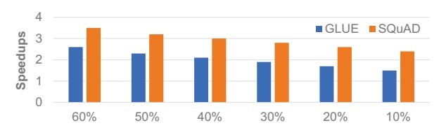

# D. Latency and Energy Breakdown of ASADI

This section provides a breakdown of the latency and energy consumption of ASADI into six parts: *on-chip transfer* (OCT), *linear layer* (Linear), multiplication between Q and  $K^{\mathsf{T}}$  (QK), Softmax, multiplications between S and V (SV), and the *controller* (CTRL). The area and memory breakdown are presented in Table I.

Latency breakdown. Figure 22 depicts that the OCT and CTRL make up a small fraction of the latency, which is less than 4%, supporting the goal of ASADI to reduce on-chip communication and peripheral circuits. The in-situ Softmax operation takes up approximately 5% of the latency, while the QK and SV operations take up more than 80%. As analyzed in Section V-C, the time complexity of multi-head attention is constant because all tokens are processed in parallel. However, performing the multi-head attention requires more than 105 bit-wise operations. The ratio of linear layers increases as the sequence length grows, as the time complexity of the

Fig. 23. ASADI energy breakdown

Fig. 24. The impact of diagonal locality

linear layer is O(n) as described in Section V-C. However, this phenomenon does not imply that the linear layer is a bottleneck for ASADI. This is because the memory capacity of the linear layer is fixed while the memory capacity of the attention layer grows with the sequence length.

Breakdown of energy consumption. The breakdown of ASADI's energy consumption is illustrated in Figure 23. The digital module, consisting of Softmax, QK, and SV, accounts for more than 98% of the total energy consumption. The energy is mainly consumed by the voltage drivers during calculations and read/write. This is because the digital module requires a large memory space and operates in a space-for-time mode. While the parallel operation of all ReRAM rows reduces latency, it increases the energy consumed per second, namely power. This is evident in Table I, where the digital module's power is significantly higher than other components. The linear layer accounts for approximately 1%, while the CTRL accounts for less than 1% of the energy consumption due to their smaller area.

#### E. Other Analysis

**Impact of diagonal locality.** As discussed in Section II-D, diagonal locality is the fundamental principle behind the design of ASADI. To study its impact, we artificially construct a sparse mask matrix with six different diagonal localities, ranging from 60% to 10%. Here, the term 60% has the same meaning as the  $\frac{NNZ_{\omega}}{NNZ}$  value discussed in Section II-D. We evaluate the performance of ASADI on the BERT model with the GLUE and SQuAD datasets, using speedups to the baseline platform as the metric. The experimental results, depicted in Figure 24, indicate a clear performance degradation as diagonal locality decreases. We identify two reasons for this phenomenon. First, a lower diagonal locality leads to more bubbles in the DIA format and reduces parallelism in the ReRAM arrays. Secondly, a lower diagonal locality increases the complexity of the decompression operation, which results in more on-chip transfers. Although the compression phase is done during pre-processing, the ASADI calculation involves a decompression phase, as shown in Figure 10 (g).

Fig. 25. The impact of sparsity

**Impact of sparsity.** In this section, we present experiments that investigate the impact of sparsity on the performance of ASADI. We evaluate six pruning threshold configurations ranging from  $1.5\tau$  to  $4\tau$  and measure ASADI's performance on the GLUE and SQuAD datasets using speedups relative to the baseline platform. Figure 25 illustrates the experimental results, which demonstrate a clear performance degradation as sparsity ( $\tau$ ) increases. This is due to the increased bubbles in the DIA format caused by the higher sparsity. More bubbles will increase the ratio of invalid computations, which in turn decreases ASADI's performance. To mitigate this, we suggest reducing  $\omega$  to either  $\frac{n}{16}$  or  $\frac{n}{32}$  when processing sparse attention with high sparsity (< 1%). By concentrating non-zero values on a few diagonal lines in the center, bubbles are reduced, and the ratio of ASADI's valid computations are improved.

Scalability analysis. Supporting long sequences with sparse attention accelerators is critical. We do not conduct specific scalability experiments since our datasets already contain sequences of various lengths. Figure 18 shows that ASADI achieves linearly increased speedups compared to the baseline when processing longer sequences. Because ASADI's latency grows linearly while baseline's latency grows quadratically with sequence length. The *overall latency (OL)* is related to the *latency of one iteration (LOI)* and the *number of iterations (NI)*, i.e.,  $OL = LOI \times NI$ . Taking length-1K and length-8K sequences as an example, ASADI takes the same LOI for length-1K and length-8K sequences. The NI of length-8K is  $8 \times$  of length-1K because the  $\omega$  of length-8K is  $8 \times$  of length-1K. For the PIM baseline, both the NI and LOI increase as sequence length increase, indicating quadratic increasing.

