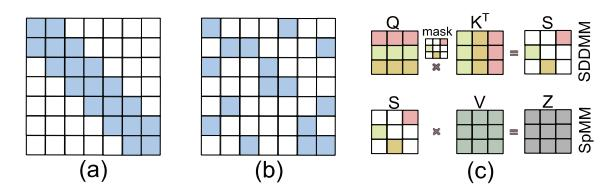

# I. INTRODUCTION

Transformer-based neural network models have made significant progress in achieving accuracy in *Natural Language Processing* (NLP) [3], [7], [21] and *Computer Vision* (CV) [9], [39], [40]. Self-attention among input tokens is the crucial distinction of transformer-based models from traditional *Convolutional Neural Network* (CNN) and *Recurrent Neural Network* (RNN) models. While the quadratic complexity of self-attention with respect to the number of tokens ensures the accuracy of inference, it causes a high computational complexity. Researchers propose sparse-attention [3], [6], [46] to reduce computing complexity by eliminating the weak connections between tokens, based on the observation that most tokens are weakly connected to others. However, the random distribution of non-zero values introduces additional memory access overhead, which limits system performance.

Existing solutions primarily use software-hardware codesign to reduce random memory access. Researchers have proposed architecture designs better suited to sparse-attention on variety of hardware platforms, such as GPU [3], [7], [35], FPGA [8], [17], [45], *Application Specific Integrated Circuit* (ASIC) [10], [22], [26], and *processing-in-memory* (PIM)-based [18], [43], [47] sparse attention accelerators. In software, current accelerators follow the same basic principles: processing as many non-zero elements in the same row/column as possible to improve data reuse and reduce random access. However, our experimental results show that sparse attention is poorly localized to rows or columns. Instead, the non-zero values of sparse attention distribute along center diagonals. Current accelerators cannot efficiently exploit diagonal locality due to the lack of a DIA-based computation paradigm.

In hardware, the computation of Transformer produces a significant number of intermediate matrices. Even the most advanced PIM architectures must transfer these intermediate matrices from on-chip memory to the computation unit. Onchip transmission increases dramatically with increasing sequence length, which leads to a large amount of cross-bank and cross-rank communications. These communications share the same memory controller and set of *control and address* (C/A) buses, making the memory controller a bottleneck and significantly increasing C/A bus conflicts. *Processing-usingmemory* (PUM) architectures [4], [12], [19], [31] perform insitu computation, processing tasks directly in the memory cells where the data is stored and thereby avoiding extensive on-chip data transfers. Emerging in-situ computing hardware *Resistive Random Access Memory* (ReRAM) [1] attracts lots of attention for its non-volatile, row-wise parallelism, high density and low energy consumption. We choose ReRAM as the default insitu computing platform. Nevertheless, the in-situ computing approach presented in this paper can be easily applied to other in-situ computing hardwares.

Given the existing landscape, we introduce ASADI, a novel sparse attention accelerator that utilizes a co-design approach with DIA-based in-situ computing. To support various sparse attention models, we design a novel compression method that can efficiently compress various sparse attention to DIA format. Our proposed software component includes DIAbased computation paradigms for sparse matrix multiplication, utilizing inherent diagonal locality. On the hardware side, we present an innovative sparse attention accelerator that supports our DIA-based computation paradigm and utilizes highly parallel in-situ computing. Our contributions can be summarized as follows:

- We observe the prevalence of diagonal locality in various sparse attention mechanisms and devise a new compression method to further enhance the diagonal locality.
- To exploit this diagonal locality, we propose DIA-based sparse matrix computation paradigm and conduct quantitative comparisons with the CSR computing paradigm.
- To support our new DIA-based paradigm, we present a

Fig. 1. End-to-end Transformer

comprehensive architecture and dataflow utilizing in-situ computing, which we refer to as ASADI.

 We conduct experiments on sufficient models and datasets, and the results indicate that ASADI exhibits superior performance and energy efficiency.

## II. BACKGROUND AND MOTIVATION

## A. Transformer and Sparse Attention

Figure 1 illustrates the operational process of an end-to-end Transformer, which consists of multiple layers of Encoders and Decoders. Each Encoder and Decoder is comprised of multi-head attention and feed-forward layers. The multi-head attention follows a three-phase implementation. First, the input sequence with n tokens is embedded into a matrix  $X \in \mathbb{R}^{n \times d}$  (n refers to sequence length, and d refers to model dimension). Next, matrix X undergoes the general matrix multiplication (GEMM) operation ( $\mathbf{O}(nd^2)$ ) with three weight matrices,  $W_O$ ,  $W_K$ , and  $W_V$ , to obtain the matrices Q (query), K (key), and V(value). In the second phase, matrix Q undergoes the GEMM operation ( $\mathbf{O}(dn^2)$ ) with matrix  $K^{\mathsf{T}}$  to yield the attention score matrix  $\tilde{S} \in \mathbb{R}^{n \times n}$ . Subsequently, a softmax function is applied to the attention score matrix  $\tilde{S}$  to obtain the matrix S. In the final phase, matrix S undergoes a GEMM operation ( $O(dn^2)$ ) with matrix V to obtain the output matrix.

Both the second and third phases have quadratic complexity  $\mathbf{O}(dn^2)$  that grows with the sequence length, making it challenging for multi-head attention scaling to long sequences. The quadratic complexity comes from the full connection between input tokens. Researchers [3], [22], [26] identity many connections in self-attention as weak connections, which can be eliminated to increase the execution efficiency with a slight loss of accuracy, namely sparse attention. According to the sparsity pattern Yes/No related to the input sequence, researchers [22] divide sparse attention into two main categories, i.e., static sparsity (No) and dynamic sparsity (Yes).

Static sparsity involves pre-determining the sparse mask matrix before receiving the input sequence, and several static sparsity mechanisms use the same block-based pruning method [3], [5], [44]. Figure 2 (a) demonstrates sparse mask matrix of sliding window sparse-attention in Longformer [3]. In contrast, *Dynamic sparsity* employs a quantization phase to determine the sparse mask matrix [22], [26], and Figure 2 (b) displays the sparse mask matrix used in Sanger [22]. Both

Fig. 2. (a) Sparse mask matrix ( $\omega = 3$  and n = 7) of Longformer [3], (b) Sparse mask matrix of Sanger [22], (c) Examples of SDDMM and SpMM.

Fig. 3. (a) An example of sparse mask matrix, (b) CSR format, (c) DIA format

static and dynamic sparsity mechanisms can convert the *dense-dense matrix multiplication* (DDMM) operation  $S = Q \cdot K^T$  to a *sampled dense-dense matrix multiplication* (SDDMM) operation, as the sparsity of the sparse mask matrix is similar to the score matrix S in Figure 2 (c). The DDMM operation  $Z = S \cdot V$  can then be converted to a *sparse-dense matrix multiplication* (SpMM) operation. Figure 2 (c) illustrates the SpMM operation, which is a GEMM operation between a sparse matrix S and a dense matrix V.

