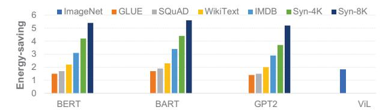
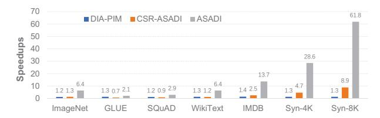

# VII. EVALUATION

## *A. Performance and Energy Efficiency*

Figure 18 displays the speedups achieved by ASADI in comparison to the PIM baseline. ASADI yields a 6.4× speedup when processing the ViL model on the ImageNet dataset. The ViL model has only one bar because it is a CV model that only runs ImageNet dataset. When processing the BERT model, ASADI demonstrates speedups from 2.3× to 63.7× on GLUE, SQuAD, WikeText, IMDB, Syn-4K, and Syn-8k datasets. For the BART model, ASADI has 1.9× to 60.1× speedups on all datasets. For the GPT2 model, ASADI shows speedups from 2.1× to 61.7× on all datasets. In all benchmarks, ASADI surpasses the PIM baseline's performance because ASADI uses full-flow in-situ computation for sparse attention, which significantly reduces on-chip random access. The PIM baseline uses near-memory computation, where the on-chip logic units need to random access many cross-bank data. ASADI outperforms the PIM baseline by only 2.1× on the GLUE dataset, primarily because the GLUE dataset has small sequence lengths, allowing the PIM baseline to distribute input sequences evenly to each bank, achieving high computing parallelism with minimal cross-bank transfers.

In the case of longer sequences, the performance gap between ASADI and the PIM baseline widens. This gap arises due to two factors: the decrease in performance of the PIM baseline and the increase in performance of ASADI. The PIM's performance decline results from the fixed number of banks, or PEs, which do not increase with sequence length. Longer sequences cause local PEs to access more cross-bank data, further constraining PE parallelism. Conversely, ASADI functions as an accelerator with full-flow in-situ computing, utilizing minimal memory for processing short sequences. As explained in Section V-C, each row of ASADI operates in parallel for in-situ calculations. Longer sequences increase the amount of ReRAM rows, namely PEs, that hold data in ASADI, thereby enhancing overall parallelism.

Figure 19 illustrates the energy savings achieved by ASADI over the PIM baseline. Processing the ImageNet dataset on the ViL model, ASADI achieved 1.8× energy savings. For the BERT, BART, and GPT2 models, ASADI produced energy savings of 1.5× to 5.2× when processing GLUE, SQuAD, WikiText, IMDB, Syn-4K, and Syn-8k datasets. Across all datasets, ASADI demonstrated higher energy efficiency than

Fig. 19. Energy efficiency comparison between ASADI and PIM baseline

Fig. 20. Speedups of ASADI and its sister systems compared with PIM baseline

the PIM baseline. The energy savings of ASADI, compared to the PIM baseline, are mainly due to the reduced data transfers between on-chip memory and PEs. With increasing sequence length, ASADI is capable of reducing more on-chip transfers, which results in more energy savings.

