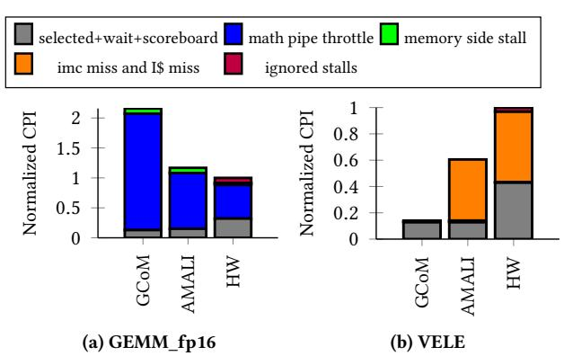
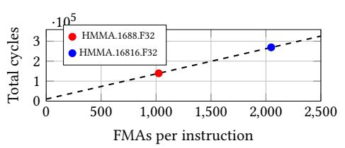
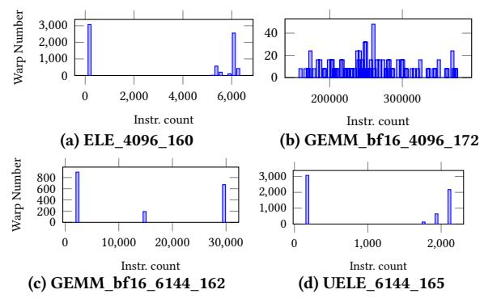
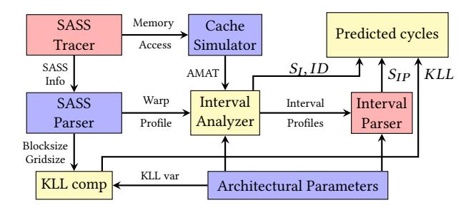

# 1 Introduction

Due to the unprecedented performance of large language models (LLMs), LLM inference has rapidly swarmed into a large number of applications such as OpenAI ChatGPT [\[40\]](#page-12-0) and Github Copilot [\[16\]](#page-12-1). Moreover, it is projected that LLM inference applications would keep surging in the near future [\[7\]](#page-12-2). These applications largely rely on modern GPUs with special support such as tensor cores for LLMs to achieve high performance (e.g., higher tokens/s, shorter TTFT - time to first token, and TBT - time between tokens).

With the rapid evolving of LLM inference applications, it is of utter importance to have tools quickly identifying the performance bottleneck of LLM inference on modern GPUs with deep insights. Such tools shed light on GPU micro-architecture enhancement and performance optimization of LLM inference applications. In fact, in AI (Artificial Intelligence) era, the speed for performance evaluation is more important than accuracy in the early design stage of GPU

architecture, because it evolves rapidly in the last decade, driven by the fast evolving machine learning (ML) workloads [52].

Performance evaluation tools for GPU architecture can be roughly classified into two categories: cycle-accurate simulators [9, 13, 17, 18, 28, 30, 43, 50, 52, 57] and analytical models [8, 21-25, 29, 47, 55, 56, 60], both are indispensable. Cycle-accurate GPU simulators are accurate but extremely slow. Moreover, these simulators can not provide easily understood insights because of their complexity. In contrast, GPU analytical models are orders of magnitude faster than cycle-accurate simulators but with lower accuracy. Furthermore, analytical models can provide easily understood as well as deep insights. For instance, besides predicting the total cycles taken by a GPU kernel, an analytical model can build a cycles-per-instruction (CPI) stack to help computer architects find the bottleneck of the kernel on various GPU architectures easily by showing the percentages of various stall events in its execution [24, 56]. As aforementioned, GPU architects need fast performance evaluation tools more in the AI era. We therefore focus on studying GPU analytical models and hope existing ones can successfully work for LLM inference.

However, we find existing GPU analytical models [21–25, 29, 55, 56] fall short of modeling LLM inference performance on modern GPUs with enough accuracy, because of two reasons. First, these models inappropriately or even do not model the micro-architecture enhancements including tensor cores, immediate constant cache, and instruction caches of modern GPUs. Second, these models do not consider the characteristics of LLM inference which is significantly different from traditional ML workloads and other GPU applications. As a result, as applying the state-of-the-art (SOTA) analytical model, GCoM, on LLM inference, the error is significantly high (e.g., 127.6%) compared to real GPU hardware (, see Section 6), which is unacceptable.

To address these issues, we propose AMALI, an analytical model, to model LLM inference on modern GPUs with enough accuracy. We carefully analyze modern GPU architectures, as well as LLM inference characteristics and come up with three innovations. First, by analyzing how tensor cores work with specific instructions such as HMMA, we propose an instruction modifier and throughput based tensor core model by precisely capturing the math pipe throttle stalls, facilitating accurately modeling the performance of the heavily used GEMM (general matrix multiplication) operations in LLM inference.

Second, we model the immediate constant cache and instruction cache by designing micro-benchmarks to measure kernel launching latency. This launching latency is exactly the stalls caused by the immediate constant cache misses and instruction cache misses. As such, this innovation significantly improves the accuracy of our analytical model compared to real GPU hardware.

Finally, we find that the warp distribution used by the SOTA GPU analytical model, GCoM [29], does not reflect the characteristics of LLM inference applications. We therefore propose to leverage warp instruction distribution to build a multi-warp model to model the LLM inference application on GPUs.

In particular, the main contribution of this paper is as follows.

 We develop a tensor core model to accurately capture the math pipe throttle stalls caused by tensor cores across various data types and tensor sizes.

Figure 1: An overview of Ampere GPU micro-architecture.

- We model the stalls caused by immediate constant cache misses and instruction cache misses, by developing microbenchmarks to measure kernel launch latency.
- We model the instruction distribution of warps of LLM inference to enhance the kernel cycle prediction.
- By putting it all together, we build a model named AMALI to predict the kernel cycles of a LLM inference.
- We validate AMALI against NVIDIA A100 GPU by using several typical LLM inference applications. The experimental results show that AMALI achieves a MAPE of 23.59%, indicating a significant improvement over GCoM's MAPE of 127.56% in total cycle prediction of a kernel.
- We showcase that AMALI can be used to explore GPU architecture design space by designing the tensor core capability of H100. The results show that AMALI accurately predicts the end-to-end performance improvements (e.g., kernel cycles) with the enhanced tensor core capability.

The rest of the paper is organized as follows. Section 2 describes the background of this paper. Section 3 depicts the baseline GPU analytical model and our motivation. Section 4 elaborates our AMALI analytical model. Section 5 presents the experimental setup. Section 6 provides the experimental results and analysis. Section 7 introduces the related work and Section 8 concludes the paper.

#### 2 Background

#### 2.1 GPU Architectures

Without loosing generality, we employ NVIDIA GPUs (Graphics Processing Unit) to introduce GPU architecture. Figure 1 shows the Ampere GPU architecture [1, 11, 39]. As can be seen, a GPU consists of a number of streaming multi-processors (SM) connected by an on-chip interconnection network. To buffer data between SMs and memory, a L2 data cache is designed between the global as well as constant memory, and the interconnection network.

Each SM consists of a L1 cache/shared memory and several subcores. The L1 cache/shared memory is shared among the sub-cores. Note that the L1 cache and shared memory in a SM share the same hardware which a part of it can be configured as L1 cache and the other part as shared memory. Each sub-core contains a warp scheduler, register files, a constant cache, a set of CUDA cores, and a set of tensor cores. The warp scheduler selects a warp, which contains a number (e.g., 32) of threads executing in a lock-step manner, to execute when the warp is ready. In each cycle, the warp scheduler issues an instruction from the selected warp. If the operand of the instruction is not ready, the warp scheduler suspends the warp and selects another warp to execute by employing a certain

scheduling policy such as loosely round robbin(LRR) [31, 38] or greedy then oldest [45].

Tensor cores are customized compute units that can perform one matrix-multiply-and-accumulate on  $4 \times 4$  matrices per clock cycle. This significantly accelerates GEMM computation like  $C = A \times B + C$ . A and B are  $m \times k$  and  $k \times n$  matrices, respectively; C is the accumulator matrix. Tensor cores are therefore crucial components for LLM inference and other AI workloads.

To program tensor cores, typical instructions are:

$$HMMA.16816.F32, R0, R108, R140, R0$$
 (1)

The instruction name 'HMMA' represents half-matrix multiply add, which indicates the input is half-precision. These instructions contain modifiers which locate after the dot symbols and influence instruction behavior. The first modifier, such as 16816 or 1688, denotes the tensor size of these instructions. For example, 16816 represents the input tensors A and B are  $16 \times 8$  and  $8 \times 16$  matrices, respectively. 1688 represents  $16 \times 8$  (A) and  $8 \times 8$  (B) input matrices. The second modifier such as F32 shown in expressions (1) and (2) denotes the data type of the accumulator tensor.

Each tensor core instruction shown in expressions (1) and (2) contains four registers. R0 is the register used to store the accumulator/result matrix (C); the register R108 or R180 stores the input matrix A and R140 or R196 stores B. Note that these registers are shared by all the threads in a warp. In contrast, for CUDA cores, each thread in a warp can only access its own register, rather than the ones of other threads. In other words, the threads in a warp running on tensor cores access registers in a per-warp scheme while those on CUDA cores access registers in a per-thread scheme. The behavior of each thread with the per-warp scheme is non-deterministic whereas that of each thread with the per-thread scheme is deterministic.

Moreover, NVIDIA GPUs have a small constant memory (e.g., 64KB) to hold constant variables like *warp id*, *block id*, and other data structures such as arrays. Constant memory is a part of global memory, and has a constant cache as shown in Fig.1. In a constant cache miss, it takes the memory read time (e.g., hundreds of cycles) to get data from the constant memory. In a constant cache hit, the data can be attained as fast as a register file access [38]. Note that not only the *ld* instructions can explicitly access constant memory but also other instructions can *implicitly* access it. For example, the instruction *IMAD.MOV.U32 R1, RZ, RZ, c[0x0][0x28]* accesses the constant memory since the memory address is with a special symbol 'c', indicating the address is in constant memory [37].

#### 2.2 CUDA Programming model

Compute Unified Device Architecture (CUDA) [15] is a programming model designed for NVIDIA GPUs and it allows programmers to write GPU functions using C style functions, called kernels. CUDA designs an execution model named SIMT (single instruction multiple threads) to execute kernels with a three-level hierarchy. The lowest level is thread which executes GPU instructions (e.g., SASS instructions). 32 threads are organized as a warp which executes in a lock-step manner. The upper level is thread block which contains a number of threads or warps. The highest level is called grid which consists of a number of thread blocks. This three-level

hierarchy is convenient to manage a large number of threads or to program cubic graphics with three dimensions (e.g., x, y and z).

### 2.3 Large Language Model

Transformer [14, 34, 51] based large language models (LLM) have been used in a wide range of applications such as OpenAI Chat-GPT [40] and Copilot [16]. The Transformer block consists of two critical components: multi-head attention and the feed-forward neural network. The core computations of both parts are the General Matrix Multiplication (GEMM) operations, which are executed on GPUs using Tensor Cores for optimized computational efficiency.

In the multi-head attention mechanism, the input data is projected into multiple scaled dot-product attentions in parallel. This involves computing query, key (K), and value (V) matrices for each attention head through linear transformations (which are essentially matrix multiplications). The feed-forward block follows the attention mechanism and consists of two linear layers with a non-linearity (such as ReLU) between them. These operations are highly suited for execution on Tensor Cores.

LLM inference typically consists of two stages: prefill and decode. The prefill stage receives requests (also called prompts) consisting of tokens and processes them in parallel. The decode stage outputs responses in an auto-regressive manner. To accelerate the token generation, the computation of K and V matrices is cached and called KV cache. Longer prompts require larger KV cache.

A popular software framework for LLM inference includes Pytorch [41, 46], CUDA [15] and other layers such as vLLM [54]. Typically, model implementation is written in Pytorch and the GEMM implementation is written in CUDA. Pytorch provides facilities to call CUDA APIs conveniently. A LLM inference may call thousands of CUDA kernels from Pytorch codes.

#### 2.4 Stall classification

Identifying stalls is extremely important to analyze the performance bottleneck of an application on a given GPU. GSI [2] classifies the stalls into seven categories and the SOTA GPU analytical model GCoM [29] employs this classification: 1) **idle stalls** caused by not enough threads/instructions to execute, 2) **control stalls** (Ctrl) caused by kernel code divergence (icache misses), 3) **synchronization stalls** (Sync) incurred by thread barriers, 4) **memory data stalls** (MemData) due to pending memory loads, 5) **memory structural stalls** (MemStruct) due to unavailable load/store ports, 6) **compute data stalls** (ComData) caused by the operands of an instruction not been produced by other instructions yet; 7) **compute structural stalls** (ComStruct) due to the unavailable required compute resources. This classification employs a view on general processors, which does not accurately reflect NVIDIA GPU-specific features such as constant memory.

In contrast, NVIDIA's profiling tool Nsight Compute (NCU) [36] provides a GPU-specific stall classification based on warp status, as shown in Table 1. **math pipe throttle** occurs when a warp is waiting for an available execution pipeline to execute; **no instructions** can happen due to instruction cache misses; **imc miss** indicates stalls caused by immediate constant cache misses; just to name a few. The "not modeled" stalls shown in Table 1 were not modeled by previous GPU analytical models [21–25, 29, 55, 56]. In

fact, building models based on these GPU specific stalls makes an analytical model more accurate than using the stall classification from a general processor view.

#### **Baseline Model and Motivation**

#### **Baseline Model**

To model the GPU performance, prior studies [24, 29, 55, 56] build GPU analytical models with enhanced interval analysis. In fact, interval analysis is a powerful tool successfully used for CPU performance modeling [27]. It splits the execution of a thread into several intervals with time boundary when stalls occur. But this is not enough to accurately model GPU performance. The GPU analytical model MDM [56] therefore enhances the interval analysis by considering the memory stalls caused by the memory resource contention during the memory access from L1 cache to device memory. GCoM [29] further considers the computing resources contention, detailed architecture of modern GPUs (e.g., four sub-cores in a SM and sectored L1 D Cache), and the imbalance of workload based on MDM, improving the model accuracy and in turn becoming the SOTA GPU analytical model.

Since our GPU analytical model is based on GCoM, we first briefly introduce GCoM and take it as our baseline. GCoM generally employs a hierarchical modeling approach (from SM to sub-core and then to sub-core components such as L1 D Cache) to model the cycles consumed by a CUDA kernel, so called kernel cycles. Since a CUDA kernel is typically launched with specified thread block and grid dimensions, it therefore runs on a number of SMs in parallel. GCoM models the kernel cycles of such a CUDA kernel as the arithmetic mean of the cycles consumed by the CUDA kernel on all the active SMs at the highest level, as equation (3) shows.

$$C^{kernel} = (\sum_{i=0}^{numSMs-1} C_i)/numSMs$$
 (3)

with Ckernel the kernel cycles of a CUDA kernel, numSMs the number of active SMs running the kernel, and  $C_i$  the cycles consumed by the CUDA kernel running on the  $i^{th}$  SM.

To model  $C_i$ , GCoM firstly models the cycles consumed by the kernel on each sub-core ( $subC_i$ ), at the next level of the hierarchy shown in Figure 1, as a sum of the active and idle cycles. The idle cycles are incurred by the the load imbalance among the sub-cores and therefore GCoM models it as the difference between the active cycles of the current sub-core and those of the longest running sub-core in the same SM. The active cycles, on the other hand, may be influenced by data dependencies, as well as long latency memory accesses. GCoM thus models the active cycles of a sub-core as equation (4) shows.

$$subC_{j}^{active} = subC_{j}^{base} + SubCS_{j}^{ComData} + subCS_{j}^{MemData} \quad (4)$$

with  $subC_i^{active}$  the active cycles consumed by the kernel on the  $j^{th}$  sub-core,  $subC_{j}^{base}$  the cycles used to execute the warp instructions of the kernel on the  $j^{th}$  sub-core without any hazard,  $SubCS_i^{ComData}$  the stalled cycles caused by data (e.g., operand) hazards, and  $subCS_j^{MemData}$  the stalled cycles incurred by long-latency memory accesses. As such, GCoM calculates  $C_i$  with equation (5),

$$C_{i} = \left(\sum_{j=0}^{numSubcs-1} subC_{j}\right)/numSubcs + S_{i}$$
 (5)

with numSubcs the number of sub-cores in the  $i^{th}$  SM and  $S_i$  the stalled cycles of the  $i^{th}$  SM.

The modeling of  $S_i$  in GCoM goes to the lowest level of the hierarchy shown in Figure 1, considering the L1 D Cache misses caused memory stalls; on the other hand, it also considers the compute resource contention incurred stalls, as well as memory resource contention caused stalls. Equation (6) shows the  $S_i$  model.

$$S_i = S_i^{comStruct} + S_i^{memStruct} + S_i^{MSHR} + S_i^{NoC} + S_i^{DRAM}$$
 (6)

with  $S_i^{comStruct}$  the compute resource contention caused stalls,  $S_i^{memStruct}$  the memory resource contention incurred stalls,  $S_i^{MSHR}$ MSHR (miss status/handler registers) contention caused stalls,  $S_i^{NoC}$ the network on chip contention caused stalls, and  $S_i^{DRAM}$  the LLC misses caused the memory access latencies. Note that the last three items in equation (6) are modeled by MDM [56] whereas GCoM models the left two items.

We now introduce how GCoM models  $S_i^{comStruct}$  and  $S_i^{memStruct}$ . Since resource contention directly influences the cycles used to issue warp instructions, GCoM firstly models the issue cycles. To this end, it firstly determines the active sub-cores when there are a number of concurrently-executing warps, as equation (7) shows.

$$numActSCs(x) = min(x, numSubcs)$$
 (7)

with x the number of concurrently-executing warps and numSubcs the number of sub-cores in a SM. Subsequently, GCoM models the maximum issue cycles in the  $k^{th}$  interval, the issue cycles as compute resources are sufficient in the  $k^{th}$  interval, the issue cycles to the  $m^{th}$  functional unit (FU) in the  $k^{th}$  interval, and the issue cycles to the L1 D Cache in the  $k^{th}$  interval as equations (8), (9), (10), and (11) show, respectively.

$$C_k^{\text{IssueMax}}(x) = \max_{m \in \text{FU}} \left\{ C_k^{\text{IssueBase}}(x), C_{k,m}^{\text{Issue}}(x), C_{k,\text{L1}}^{\text{Issue}}(x) \right\}$$
(8)

$$C_k^{\text{IssueBase}}(x) = \frac{I_k \cdot x}{\text{numActSCs}(x) \cdot \text{IssueRate}}$$
(9)

$$C_{k}^{\text{IssueBase}}(x) = \frac{I_{k} \cdot x}{\text{numActSCs}(x) \cdot \text{IssueRate}}$$
(9)
$$C_{k,m}^{\text{Issue}}(x) = \frac{I_{m} \cdot II_{m} \cdot x}{\text{numActSCs}(x) \cdot \text{IssueRate}}$$
(Im \le Ik) (10)

$$C_{k,\text{L1}}^{\text{Issue}}(x) = \left[\frac{b_k}{B_k^{\text{L1}}}\right] \times x \tag{11}$$

with x the number of concurrently-executing warps in the  $k^{th}$  interval, numActSCs the number of active sub-cores in a SM, IssueRate the warp instruction issue rate,  $I_k$  the number of warp instructions in the  $k^{th}$  interval of the representative warp,  $I_m$  the number of warp instructions dispatched to the  $m^{th}$  FU,  $II_m$  the initiation interval of the  $m^{th}$  FU,  $b_k$  the amount of L1 D Cache accesses incurred by the representative warp, and  $B_k^{L1}$  the effective L1 D Cache bandwidth in the  $k^{th}$  interval.

Finally, GCoM models the stalls caused by compute resource contention by equation (12)

$$S^{ComStruct}(x) = \sum_{k \in intervals} \left( C_{k,m}^{Issue}(x) - C_{k}^{IssueBase}(x) \right)$$
 (12)

Table 1: The stall event classification in Nsight compute; For simplicity, we omit several types of stalls:Synchronization and control-related stalls that prior work considers negligible, including warpgroup\_arrive, barrier, membar, branch\_resolving, sleeping and misc. Additional stalls with minimal impact: not\_selected, drain and dispatch\_stall

| Stall type         | Description                                                                                                       | Classification in prior work     |
|--------------------|-------------------------------------------------------------------------------------------------------------------|----------------------------------|
| selected           | Warp was selected by the micro scheduler and issued an instruction.                                               | Base in single warp model        |
| wait               | Warp was stalled waiting on a fixed latency execution dependency.                                                 | ComData                          |
| long_scoreboard    | Warp was stalled waiting for a scoreboard dependency on a L1TEX (local global surface texture) operation.         | MemData for global memory access |
| short_scoreboard   | Warp was stalled waiting for a scoreboard dependency on a MIO (memory input/output) operation (not to L1TEX).     | MemData for share memory access  |
| math_pipe_throttle | Warp was stalled waiting for the execution pipe to be available.                                                  | ComStruct                        |
| tex_throttle       | Warp was stalled waiting for the L1 instruction queue for texture operations to be not full.                      | MemStruct                        |
| lg_throttle        | Warp was stalled waiting for the L1 instruction queue for local and global (LG) memory operations to be not full. | MemStruct                        |
| mio_throttle       | Warp was stalled waiting for the MIO (memory input/output) instruction queue to be not full.                      | MDM                              |
| no_instructions    | Warp was stalled waiting to be selected to fetch an instruction or waiting on an instruction cache miss.          | not modeled                      |
| imc_miss           | Warp was stalled waiting for an immediate constant cache (IMC) miss.                                              | not modeled                      |

When  $C_{k,\mathrm{L1}}^{\mathrm{Issue}}$  becomes  $C_k^{\mathrm{IssueMax}}(x)$ , GCoM employs equation (13) to model the memory contention caused stalls.

$$S^{MemStruct}(x) = \sum_{k \in intervals} \left( C_{k,\text{L1}}^{\text{Issue}}(x) - C_k^{\text{IssueBase}}(x) \right) \quad (13)$$

#### 3.2 Prior Work Limitations

After briefly introducing the GPU analytical model GCoM, we now analyze its limitations.

Limitation #1: Initiation interval modeling inappropriately models tensor cores. As shown in equation (10), GCoM needs to use initiation interval ( $II_m$ ) of the  $m^{th}$  FU to calculate the issue cycles to the  $m^{th}$  FU in the  $k^{th}$  interval ( $C_{k,m}^{Issue}(x)$ ). The initiation interval denotes elapsed cycles between issuing two operations of the same type of FU [20]. The initiation intervals of different types of FU may be different. Prior GPU analytical models [8, 29, 48, 60] including GCoM [29] use it to model the computing resource contention, as equation (14) shows.

$$initiation\_interval = \frac{warp\_size}{functional\_unit\_lanes}$$
 (14)

with warp\_size the number of threads in a warp which is typically 32 and functional\_unit\_lanes the number of FUs of a sub-core.

As such, initiation interval actually models the throughput of a FU [20], because it can be calculated as the reciprocal of the elapsed cycles between two continuous computing results from the FU. When <code>functional\_unit\_lanes</code> is less than <code>warp\_size</code>, computing resource contention occurs and the warp scheduler takes the same number of cycles as the initiation interval to issue a warp instruction. This approach works well for modeling CUDA cores, where

thread contention occurs as threads in a warp compete for access to computing resource, namely CUDA cores.

However, this works poorly for tensor cores. When threads run on CUDA cores, each warp thread only accesses its own registers to execute instructions. In contrast, when threads run on tensor cores, all threads in warp share the same register file as described in Section 2. This allows the threads to work together to perform operations like matrix multiplications(e.g. HMMA instruction) in a unified way, rather than individually. As such, this makes the initiation interval of tensor cores can be significantly less than the number calculated as (14).

We conduct experiment to confirm this analysis by comparing the math pipe throttle stalls defined in NCU against the computing resource contention modeled by GCoM using initiation interval when we run Llama2-7B inference on RTX 3090. Figure 2a shows the results. As can be seen, GCoM significantly overestimates the math pipe throttle stalls caused by resource contention of the GEMM kernel in Llama2-7B inference compared to the those occurred on the real hardware. This overestimation arises because the initial interval estimation for the tensor cores is too large relative to the real situation.

Limitation #2: Ignoring instruction modifiers does not lead to accurate modeling for tensor cores. Existing GPU analytical models [8, 29, 48, 60] including GCoM [29] do not consider the instruction modifiers such as data type (e.g., F32). This might be acceptable for CUDA core instructions but unacceptable for tensor core instructions because tensor size modifiers influence the performance of tensor core instructions significantly. To confirm this, we firstly develop micro-benchmarks to measure the performance of

Figure 2: CPI stack constructed by GCoM and AMALI compared to hardware(HW) with a NVIDIA RTX3090

Figure 3: Total cycles of the HMMA instruction with modifiers 16816 and 1688

tensor core instructions. Subsequently, we utilize cuAssembler [12] to modify the SASS trace of our micro-benchmark by altering only the instruction modifier of HMMA, tensor size, from 16816 to 1688 while keep other factors such as the modifier *F*32 and instruction count unchanged. Figure 3 shows that the number of FMAs (floating multiply-add) per HMMA instruction with modifier 16816 doubles that of the instruction with modifier 1688. The same applies to the total cycles taken by HMMA with modifiers 16816 and 1688.

This indicates that the cycles per instruction (CPI), which can be treated as throughput, of an HMMA with 16816 is double that of an HMMA with 1688. The reason is as follows. An HMMA with 16816 performs  $16 \times 8 \times 16 = 2048$  FMAs while that with 1688 performs  $16 \times 8 \times 8 = 1024$  FMAs. The FMAs per cycle is a design parameter of a GPU tensor core. For example, each tensor core of A100 GPU is designed to perform  $8 \times 4 \times 8 = 256$  FMAs [39] in a single cycle. Therefore, an A100 tensor core needs 8 and 4 cycles to execute an HMMA with 16816 and the one with 1688, respectively. That is, the CPI of HMMA with 16816 is 8, which is double that with 1688 (CPI=4). In summary, both our experiments and theoretical analysis show that modifiers significantly influence the throughput of tensor core instructions and in turn we must take modifiers into account as we model the throughput of tensor cores, see Section 4.7.

Limitation #3: Constant cache modeling does not consider implicit constant memory accesses and instruction cache modeling is ignored. We find the *imc\_miss* (immediate constant cache misses) defined by NCU may be caused by not only explicit but also implicit constant memory accesses. Existing GPU analytical models [8, 29, 48, 60] including GCoM [29] model constant memory access by leveraging explicit load and store instructions (e.g., *LDC* and *STC*). However, constant memory is also heavily accessed by

Figure 4: Imc cache miss stall and no instruction stall refer to kernel cycles in Llama2 inference

Figure 5: Distribution of instruction number. In this study, we use the notation {name}\_{length}\_{id} to denote a kernel, where name is the abbreviation of the kernel's name, length represents the prompt's length in terms of token count and id identifies the specific kernel index.

implicit instructions. Expression (15) shows an example. As can be seen, the constant memory address c[0x0][0x28] is encoded as an operand of the instruction by using the symbol "c". Ignoring these instructions makes the modeling of immediate constant cache inaccurate.

$$IMAD.MOV.U32R1, RZ, RZ, c[0x0][0x28]$$
 (15)

On the other hand, prior models do not model instruction cache miss either, making them inaccurate for modeling the *no\_instruction* stalls defined in NCU. As shown in Fig.2b, GCoM fails to account for stalls caused by constant cache misses and instruction cache misses. As a result, it significantly underestimates the cycles of the VELE kernel during Llama2-7B inference.

Moreover, Figure 4 shows the sum of stalled cycles caused by immediate constant cache misses and instruction cache misses can be a high ratio (e.g. 70%) in the CPI stack, indicating they can not be ignored in GPU analytical models.

Limitation #4: Existing GPU analytical models do not consider the warp characteristics of LLM inference. GPU analytical models [8, 29, 48, 60] including GCoM [29] employ K-means to select a representative warp to represent all the warps in a CUDA kernel. Prior studies claim that this approach is accurate enough [24, 29, 56]. This might be true for kernels from Rodinia [10] and Parboil [49] benchmark suites. However, we find that the warp execution flows in a CUDA kernel of LLM inference applications are significantly different, as Figure 5 shows.

A couple of interesting observations can be made here. For one, different CUDA kernels in a LLM inference have significantly different number of warps, from tens to thousands. This is because LLMs consists of more operators than DNNs. Taking GEMM as an example, GEMMs in one LLM application are significantly more heterogeneous than those in a traditional DNN such as RNN [42]. For example, the GEMMs in the attention layer of LLMs are generally memory-bound while those in FFN layers are compute-bound. In contrast, the GEMMs in one DNN are generally compute-bound as shown in [42]. Moreover, the dimension of the GEMMs in LLM might be dramatically different. For instance, the  $bs \times seq\ lth$  (bs - batch size, seq1th - sequence length) corresponds to the M of a GEMM  $M \times k \times N$  in an LLM inference. In the prefill stage, suppose the  $seq_lth$  is 32,768 and bs is 4, then M is 131,072. In the decode stage, the seq\_lth is always 1 because of the auto-regressive manner and the bs can still be 4, then M is only 4. That is, the M of the GEMM  $M \times k \times N$  of the prefill stage is 32,768 times of the M of the decode stage!.

Second, the number of instructions in some warps is dramatically different from that of other warps in the same CUDA kernel. Taking the kernel <code>ELE\_4096\_160</code> as an example, each of 3,000 warps only contain several hundreds of instructions, as the left bar in Figure 5a shows. In contrast, the right highest bar in Figure 5a shows that each of 2,800 warps in the same kernel contains more than 6,000 instructions. Finally, the warp instruction number difference of some kernels such as <code>GEMM\_bf16\_4096\_172</code> is extremely large, from less than 100,000 to more than 600,000.

In summary, such significant difference in warp instruction number in the same CUDA kernel in LLM inference makes using one representative warp to represent all the warps of a CUDA kernel infeasible. However, for interval analysis, using one representative warp is *required*. We address this extreme challenge in Section 4.9.

### 4 The AMALI Model

To address the above limitations in the case of running LLM inference on modern GPUs, we propose a novel GPU analytical model dubbed AMALI. It predicts the total cycles consumed by a CUDA kernel of a LLM inference application.

#### 4.1 Overview

Figure 6 shows an overview of AMALI. As can be seen, it consists of six components: SASS Tracer, SASS Parser, Cache Simulator, Interval Analyzer, Interval Parser, and KLL comp (kernel launching latency). The SASS Tracer collects instruction traces and related information of CUDA kernels. The Cache Simulator simulates the cache behavior based on the memory access traces obtained by the SASS Tracer. The SASS Parser extracts required information from SASS traces. The Interval Analyzer partitions the execution of a warp into intervals. The Interval Parser leverages the produced intervals to build models to predict cycles consumed by a kernel. KLL comp computes launching latency of a CUDA kernel.

To use AMALI, we need to know the architecture parameters of a GPU. To this end, we develop micro-benchmarks and we follow the pointer chase method, as described in [4, 33], to measure the latency and throughput of FUs and the memory system.

Figure 6: An overview of AMALI. SASS - CUDA assembly instruction. AMAT - Average Memory Access Time. KLL - Kernel Launch Latency.  $S_I$  - Results of interval analyzer. ID - Instruction Divergence.

#### 4.2 SASS Tracer

It is developed based on the GPU instrumentation tool NVBit [53] to collect SASS instruction traces and the related information of CUDA kernels. In detail, it collects instruction names, instruction modifiers, the registers an instruction uses, memory accessing addresses, grid size, thread block size, consumed shared memory size, consumed register file size, warp IDs, and SM IDs. Previous works [3, 19, 29, 60] have demonstrated that modeling with the SASS offers greater accuracy than PTX, so our SASS Tracer focuses on collecting information of SASS instructions.

#### 4.3 SASS Parser

Our SASS Parser extracts required information such as grid size and thread block size from the traces produced by the SASS Tracer. Since a representative warp is required for interval modeling, we leverage the SASS Tracer to constructs a single-warp representation based on the FUs used by each warp, encoding each warp as a vector. To this end, the SASS Parser applies k-means clustering, following an approach similar to GCoM [29] and GPUMech [24] and capture the *selected stall* events defined in NCU. Note that each warp is scheduled to a sub-core by using the scheme  $sub-core\_id = warp\_id\%4$ , as described in [26].

#### 4.4 Cache Simulator

The Cache Simulator simulates the cache behavior by using the memory access addresses obtained by the SASS Tracer in conjunction with the specified GPU architecture configuration parameters. The goal of the cache simulation is to determine the Average Memory Access Times (AMATs). The AMATs and FUs latency are then used in interval analysis, as detailed in [27], to segment the execution of a warp into discrete intervals.

