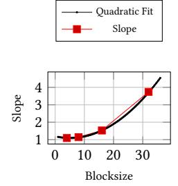

# 4.5 Interval Analyzer

Our Interval Analyzer leverages the AMATs produced by the Cache Simulator and the warp profile obtained by the SASS Parser to partition the execution of a warp into discrete intervals. We now discuss how to match the stall events of data dependency in the interval analysis. First of all, AMALI estimates the total cycle of an kernel by using equation (16).

$$C = S_I + S_{IP} + KLL + ID \tag{16}$$

(a) KLL values with different gridsize, each color corresponding to a blocksize

(b) Slopes with different block-

Figure 7: KLL values with different gridsize and slopes with different blocksize

where C is the estimated cycles of a kernel.  $S_I$  and  $S_{IP}$  represent the stalls captured by the Interval Analyzer and Interval Parser, respectively. KLL means the kernel launching latency and ID denotes the idle cycles caused by instruction divergence. At the beginning, AMALI models the *selected stalled* cycles as the number of instructions issued by the representative warp, as equation (17) shows:

$$S_{Selected} = I_{warp}/IssueRate$$
 (17)

where  $I_{warp}$  is the number of instructions in the representative warp and  $S_{Selected}$  is the stalled cycles of the stall type 'selected' as Table 1 shows.

We adopt the traditional interval analysis method [24, 27] in our Interval Analyzer to model data dependencies caused by the global or shared memory access and computing instructions. For every instruction, we mark the end cycle of it. For a global memory instruction, the end cycle of it is the current cycle plus AMAT. For share memory instruction, the end cycle is the current cycle plus share memory access cycles depending on load/store [1].

For instructions executed on CUDA cores, AMALI models their performance based on fixed latency from architectural parameters. In contrast, the latency of tensor core instructions is characterized by throughput based on modifiers including data type and tensor size (, seeing the details in Section 4.7). When the data that an instruction uses are not immediately available, a stall interval is inserted until the instruction can be issued. The result of interval analysis is computed by using equation (18).

$$S_{I} = S_{Selected} + S_{wait} + S_{short\_scoreboard} + S_{long\_scoreboard}$$
 (18)

with  $S_I$  the predicted cycles of the interval,  $S_{wait}$  the stalled cycles due to data dependency of computing instructions,  $S_{short\_scoreboard}$  the stalled cycles caused by shared memory, and  $S_{long\_scoreboard}$  stalled cycles incurred by global memory.

For a stalled interval, AMALI captures the stall reasons, which are categorized into computing, shared memory access, or other memory access stalls. The Interval Analyzer then analyzes these information of the representative warp to get the three stalled cycles:  $S_{wait}$ ,  $S_{short\_scoreboard}$  and  $S_{long\_scoreboard}$ . The sum of them can be calculated by equations (19) and (20).

$$S_i = \sum_{k \in \text{intervals}} S_k \cdot P(i, flag[k])$$
 (19)

Figure 8: Cycle per token in Llama2-7B inference

$$P(x,y) = \begin{cases} 1 & \text{if } x = y \\ 0 & \text{otherwise} \end{cases}$$
 (20)

where i and flag[k] denote interval stall reasons, which can be include wait, long\_scoreboard, or short\_scoreboard. flag[k] denotes the stall reason of the  $k^{th}$  interval and  $S_k$  means the length in cycles of the  $k^{th}$  stall interval. Note that x = y indicates the stall reasons are the same.

#### 4.6 Interval Parser

Our Interval Parser captures math\_pipe\_throttle, lg\_throttle, tex\_throttle and mio\_throttle. We employ equation (21) to compute the sum of these stalled cycles:

$$S_{IP} = S_{math\_pipe} + S_{lg} + S_{mio}$$
 (21)

where  $S_{IP}$  is the resulted cycles by the Interval Parser.  $S_{math\_pipe}$ ,  $S_{lg}$ , and  $S_{mio}$  represent the math pipe throttle, lg throttle, and mio throttle caused stall cycles, respectively.

To calculate the first two of the three "throttle" caused stall cycles, we use the core modeling approach of GCoM [29], as equations (22) and (23) show.

$$S_{math\ pipe} = S^{ComStruct}$$
 (22)

$$S_{lq} = S^{MemStruct}$$
 (23)

where the  $S^{ComStuct}$  and  $S^{Memstruct}$  are the stalled cycles caused by the computing and memory structure hazards, respectively. The  $S_{math\_pipe}$  denotes the stalled cycles caused by the computing resource hazard while  $S_{lg}$  represents the stalled cycles incurred by the L1 D Cache access contention.

For the last "throttle" cased stalled cycles (mio\_throttle), AMALI uses the MDM to model the memory side contentions which are  $S_{MSHR}$ ,  $S_{NoC}$  and  $S_{DRAM}$ , as equation (24) shows.

$$S_{mio} = S^{MSHR} + S^{NoC} + S^{DRAM}$$
 (24)

where  $S_{mio}$  denotes the stalled cycles caused by memory contention.  $S^{MSHR}$ ,  $S^{NoC}$  and  $S^{DRAM}$  are the MSHRs, NoC and DRAM contentions incurred stalled cycles, respectively.

### 4.7 Tensor Core Modeling

Unlike previous studies [24, 29, 56] model CUDA core performance without considering instruction modifiers, AMALI takes the instruction modifiers into account for modeling the tensor core performance. In fact, AMALI uses the throughput obtained from microbenchmarks along with modifiers to model tensor core, as equation (25) shows.

$$II_{TC} = \frac{\text{FMA\_count}}{\text{TP}_{\text{dt}}}$$
 (25)

where  $II_{TC}$  means initiation interval for tensor cores based on the current HMMA instruction.  $FMA\_count$  means the FMA flops of

the instruction, which is influenced by the modifier. means the peak throughput in FMA operations per cycle (FMAs/cycle) based on the datatype . In fact, FMAs/cycle is a design parameter for tensor cores. is used to replace the in equation [\(10\)](#page-3-8) to predict the issue cycles on the tensor cores in an interval. The is actually the latency of a tensor core instruction, which can be denoted by equation [\(26\)](#page-8-3).

$$L_{\rm TC} = II_{\rm TC} \tag{26}$$

where is the latency of a single tensor core instruction which is used in interval analysis.

