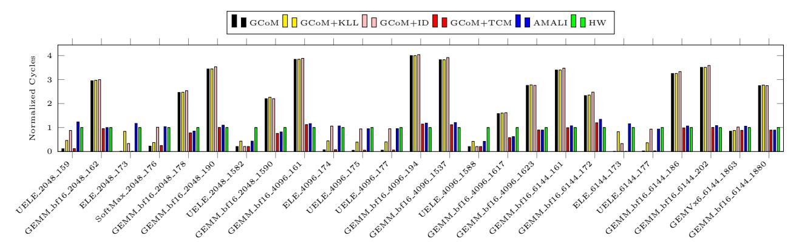
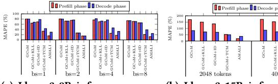
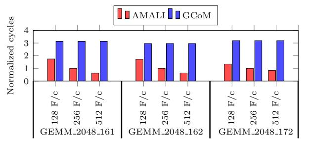

# 6.1 Determining the Token Count for Testing

Due to the large size of the per-token tracing file, we can not evaluate AMALI on a single GPU machine with too many tokens. But how many tokens we need to test in our experiment? We determine it by observing the time between tokens with different number of input and output tokens. Figure [8](#page-7-11) shows that subsequent tokens executed with the same count of cycles after the first generated token. This result allows us to test only the first two tokens. The first token inference is the prefill phase and the second is the decode phase. Following previous work [\[29\]](#page-12-12), we utilized the NCU to measure the \_\_\_. metric over 10 times, averaging

Figure 9: The kernel cycle predicted by GCoM and AMALI and the ground truth captured on hardware(HW). GCoM+KLL - GCoM is extended with Kernel Launch Latency modeling. GCoM+ID - GCoM with warp Instruction Distribution modeling. GCoM+TCM - GCoM with Tensor Core Modeling.

the results to obtain a reliable ground truth of elapsed cycles for a kernel execution.

### 6.2 Determining the coefficients $\alpha$ , $\beta$ , and $\gamma$

We develop micro-benchmarks to determine the coefficients  $\alpha$ ,  $\beta$ , and  $\gamma$  used in equation (28). On A100,  $\alpha$ ,  $\beta$ , and  $\gamma$  are 0.0036, 0.0366 and 1.1891, respectively. On different GPUs, they might be different.

### 6.3 AMALI Accuracy

We first use the mean absolute percentage error (MAPE) to evaluate the accuracy of AMALI on the highly frequently executed, as well as relatively long kernels in Llama-8B inference on A100. We also evaluate how our individual extension beyond GCoM improves the accuracy: tensor core modeling (TCM), kernel launch latency modeling (KLL), and warp instruction distribution (ID). Figure 9 shows the results. A couple of interesting findings can be made here. For one, AMALI achieves significantly higher accuracy compared to GCoM thanks to the correct modeling on tensor cores, kernel launch latency, and warp instruction distribution.

Second, for GEMM kernels, the throughput based tensor core modeling (TCM) of AMALI is the main contributor for its high accuracy. In contrast, GCoM uses the modeling approach for CUDA cores to model the tensor cores, which is unreasonable and results in high overestimate of these kernel cycles. Last but not least, for element-wise operations (ELE\_...) which use CUDA cores, GCoM significantly underestimates the cycles taken by them. In contrast, AMALI accurately predict their cycles thanks to the modeling of kernel launch latency (KLL) and warp instruction distribution (ID). Figure 10 shows that, for GEMM kernels, TCM demonstrates the most significant improvement, whereas for ELE kernels, the KLL optimization is most effective. Overall, AMALI achieves a MAPE of 17.84% in predicting GEMM kernels and 27.29% for ELE kernels, whereas GCoM records MAPE of 183.95% and 77.81%, respectively. In summary, the average MAPE of GCoM for these kernels is 127.6% while that for AMALI is only 23.5%.

Next, we evaluate the end to end performance prediction accuracy of AMALI using Llama3-8B with different prompt lengths from 128 tokens to 6144 tokens. Figure 11 shows the results. As can

Figure 10: MAPE comparison for GEMM and ELE

Figure 11: MAPE comparison for Llama3-8B inference with different prompt lengths (tokens)

be seen, AMALI achieves significantly lower MAPEs than GCoM for all the experimented prompt lengths, and KLL, ID, as well as TCM all reduce the MAPEs of GCoM but with different levels. In the prefill phase, AMALI achieves a MAPE of 15.56%, while GCoM shows significantly higher error of 163.68%. Similarly, in the decode phase, AMALI maintains better performance with a MAPE of 34.90%, while error of GCoM remains as high as 82.29%. Moreover, GCoM shows significantly higher MAPEs for the prefill phase than those for the decode phase with the same long prompt (e.g., > 1024 tokens). This is because the prefill with long prompts involves significantly larger GEMMs than those for decode, GEMMs execute on tensor cores, but GCoM does not model tensor cores accurately. In contrast, for both prefill and decode, AMALI achieves significantly low MAPEs for all the prompt lengths thanks to the accurate tensor core modeling.

Moreover, we evaluate how AMALI performs with different batch sizes using Llama3-8B inference with a 256-token prompt.

- different batch sizes
- (a) Llama3-8B inference across (b) Llama3-15B inference with different prompt lengths

Figure 12: MAPE comparison for Llama3-15B inference with different prompt lengths (tokens) and Llama3-8B inference across different batch sizes with a 256-token prompt

As Figure 12a shows, AMALI is still the best among the experimented analytical models. This indicates that AMALI works well for different batch sizes of LLM inferences.

In addition, we evaluate AMALI with larger LLMs which can perform a sort of extreme stress testing for a Hardware. To this end, we build a model named Llama-15B based on Llama2-13B with data type of BF16. The memory capacity requirement for the weights of this model and the KV cache for 4096 tokens approaches 80GB of our A100 GPU. Figure 12b shows the results. As can be seen, AMALI still achieves the lowest MAPEs among all the experimented analytical models. This indicates that AMALI can predict the performance of different LLM inference models accurately.

Next, we compare the performance prediction accuracy predicted by MDM, GCoM and AMALI using Llama3-8B inference with different prompt lengths. Figure 13 shows the results. As can be seen, AMALI, MDM, and GCoM achieve the lowest, second lowest, and highest MAPEs, respectively. AMALI achieves the lowest MAPEs as expected because it accurately models the tensor core throughput, warp instruction distribution, and kernel launch latency. However, it is counter-intuitive that GCoM shows higher MAPEs than MDM because GCoM extends MDM with compute-core modeling. Nevertheless, this is true and the reason is as follows. GCoM accurately models CUDA cores and uses the same approach to model tensor cores while the performance of tensor cores is dramatically different from that of CUDA cores. On the other hand, MDM does not model CUDA cores, neither tensor cores, which does not have the computing errors. This results in even higher errors of GCoM than MDM's errors when GCoM predicts the performance of LLM inference which heavily uses tensor cores.

Finally, we compare the accuracy of MDM, GCoM, and AMALI by using non-LLM applications: CONV and GEMM from Deep-Bench [35], and BP, B+ tree, DWT, and PF from Rodinia [10]. Figure 14 shows the results. As can be seen, for convolution and other non-GEMM kernels, GCoM and MDM both show high accuracy but AMALI achieves higher accuracy thanks to the constant and icache cache modeling and warp instruction distribution modeling. For GEMM and the like kernels, AMALI shows significantly higher accuracy than MDM and GCoM because AMALI accurately models the tensor cores.

### 6.4 Design Space Exploration

AMALI's FMAs/cycle (throughput) based tensor core modeling enables accurate performance predictions across different tensor core throughput settings. In fact, FMAs/cycle can be a design parameters for NVIDIA GPU tensor cores, and newer generation of

Figure 13: MAPE comparison for Llama 3-8B inference with different prompt lengths (tokens) for MDM, GCoM, AMALI

Figure 14: MAPE comparison for CONV and GEMM in Deep-Bench and backprop, B+tree, Discrete wavelet transform and Path finder in Rodinia

tensor cores may have higher FMAs/cycle. Figure 15 compares the kernel cycle predictions between AMALI and GCoM with 128, 256, and 512 FMAs/cycle. As can be seen, AMALI predicts less cycles consumed by all the GEMM kernels when the tensor cores have higher FMAs/cycle (e.g., 512). In contrast, GCoM predicts the same cycles with variant tensor core capabilities, which is wrong. This is because GCoM uses the modeling approach for CUDA cores to model tensor cores, which can not reflect the impact of tensor cores with different FMAs/cycle on the overall kernel performance.

We further employ AMALI to explore the tensor core throughput design by using it to predict the performance of five GEMM kernels from DeepBench [35] and compare the predictions against the measured performance on A100 and H100. The FMAs/cycle of tensor cores for A100 and H100 are 256 and 512, respectively. We take them as the tensor core throughput design values in AMALI to predict the cycles consumed by the five kernels running on A100 and H100. Higher tensor core throughput is expected to produce lower math\_pipe\_throttle and in turn less kernel cycles.

Figure 16 shows that the math\_pipe\_throttle of a kernel on H100 is only half of that of the same kernel on A100, and in turn higher performance on H100. (The left and right adjacent bars in one block partitioned by the red dash lines denotes the consumed cycles of the same kernel running on A100 and H100, respectively). This is because the tensor core throughput of H100 is double that of A100. This indicates that AMALI can accurately evaluate impact of a design parameter on a special stall events. Moreover, compared to the measured kernels cycles, the prediction error of AMALI can be as low as 1.03% and the maximum error does not exceed 23%. The average errors are only 8.2% and 13.2% on A100 and H100, respectively. These results indicate AMALI is accurate enough for GPU design space exploration in early stages.

#### 6.5 Discussions

We propose instruction divergence to reduce the influence of warp instruction imbalance in a kernel. It is unreasonable to model cycles

Figure 15: Kernel cylces predicted by AMALI and GCoM with varying FMAs per clk per tensor core:128, 256, 512

by selecting the largest warp of a kernel as the representative warp. Interval analysis assumes all warps as the same warp, so using the largest warp as representative will occur enormously over estimation. So we only model the issued instruction number difference between the warps, which shows high accuracy. But there is still a room to further improve the accuracy by studying better strategy to model the warp instruction number divergence.

