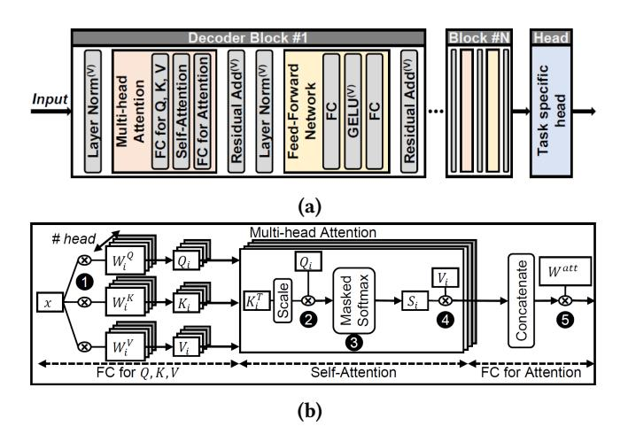
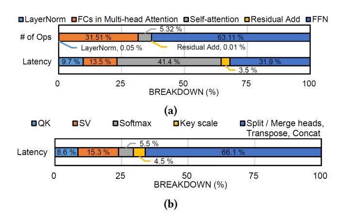

# 1 Introduction

Transformer [44], BERT [9], and GPT [40] have been widely used for natural language processing (NLP) services at datacenters. Although GPUs are commonly used to accelerate the inference of deep learning models, GPUs are less effective in handling transformer models because of multi-head attention and inference stages that are memory-bound [19]. To address the limitations of GPU for transformer models, many recent works [13, 14, 35, 45] have proposed to accelerate multi-head attention through dedicated accelerators and algorithmic changes; however, these prior work do not fully address the challenges of end-to-end inference acceleration. Recently, DFX [19] proposed an FPGA-based appliance that is designed for memory-bound transformer inference stages; however, it is sub-optimal for the compute-bound stages in end-to-end inference.

One of the main challenges in accelerating end-to-end inference of transformer-based large language models (LLMs) is their diverse characteristics, which exhibit a broad range of computational intensities. For example, GPT includes complex vector operations, multi-head attention, and fullyconnected (FC) layers that present both compute-bound matrix-matrix multiplication as well as memory-bound matrixvector multiplication. Consequently, to accelerate end-to-end inference of LLMs, hardware must be capable of efficiently handling all these diverse operations.

Neural processing units (NPUs) [6, 22, 24] have been widely proposed to accelerate deep neural networks (DNNs). However, NPUs are often limited by memory-bound operations even when high-bandwidth memory is utilized. In comparison, processing-in-memory (PIM) [8, 30, 31] minimizes data movement by enabling computation near memory and provides higher effective memory bandwidth. Recent PIM chips [30, 31] are effective "domain-specific" memory as they accelerate memory-bound operations by guaranteeing full internal memory bandwidth utilization for processing units in memory on domain-specific kernels. However, computebound operations such as matrix-matrix computations or complex vector operations are not efficient on PIM because of the limitations of DRAM technology that is highly areaconstrained.

To address the challenges of end-to-end LLM inference, we propose an NPU-PIM architecture that provides the benefit of both a domain-specific accelerator (i.e., NPU) as well as a domain-specific memory (i.e., PIM), effectively supporting a broad range of arithmetic intensities in LLMs. In particular, we propose IANUS – Integrated Accelerator based on NPU-PIM Unified Memory System. 1 To the best of our knowledge, this is one of the first works that integrate

a commercial NPU with a commercial PIM memory to enable a domain-specific system architecture. Previously proposed PIM-based systems view PIM as an "accelerator" [8, 25, 27, 32] and employ a partitioned memory system that uses the dedicated memory for the xPU (e.g., GPU, CPU) and the PIM accelerator memory. This leads to inefficient memory capacity usage as shared data between xPU and PIM tend to be duplicated in both memories for optimal performance. This is especially problematic for LLM where parameters of FC layers represent a large portion of data that need to be shared between the NPU and the PIM.

In light of these challenges, we propose a unified memory system where PIM memory also serves as the main memory for the NPU. This approach removes the need for any data duplication and movement of shared data. However, the unified memory system in an NPU-PIM system introduces new challenges as PIM computations and normal memory accesses cannot be performed concurrently. In this work, we propose a novel PIM Access Scheduling (PAS) that includes not only scheduling of PIM computations and normal memory accesses but also mapping of the workload on the NPU-PIM architecture with a unified memory system. The challenges of PIM computation in a unified memory system include memory resource conflict with normal memory accesses as well as data dependencies from computations performed on the NPU. Thus, PAS takes into account both resource conflicts and data dependencies between the NPU and PIM to fully exploit the parallelism across the different resources. We also demonstrate the proof-of-concept of IANUS by prototyping the system with an FPGA. In summary, the key contributions of this work include the following.

- 1. Architecture: We propose IANUS, a novel heterogeneous architecture that combines a dedicated hardware accelerator (NPU) with a specialized memory (PIM), to accelerate operations with diverse characteristics in the end-to-end LLM inference.
- 2. Unified Memory System & PIM Access Scheduling: Identifying about 90% of model parameters shared between the NPU and PIM in the LLM, we propose a unified memory system where the memory for the NPU and the PIM memory is shared to efficiently utilize the memory capacity. We also propose PIM Access Scheduling (PAS) that manages the challenges of the unified memory system with effective workload mapping and scheduling. Through a detailed simulation of IANUS, IANUS with PAS achieves 6.2× and 3.2× speedup in GPT-2 compared to the A100 GPU and the state-ofthe-art prior work (DFX [19]), respectively.
- 3. System integration and FPGA prototyping: To demonstrate the feasibility of IANUS, we build an integrated system including a commercial NPU, commercial PIM chips, and an FPGA-based PIM controller.

1 IANUS is a Roman god with two faces that represented the middle ground between both concrete and abstract dualities. The IANUS architecture in this work shares similarities as it represents a "middle ground" architecture between NPU and PIM architectures.

**Figure 1.** (a) Structure of GPT with vector operations marked with (V) and (b) multi-head attention mechanism shown in detail.

## 2 Background

#### 2.1 Transformer-based LLMs

NLP usually consists of two stages: input token summarization stage (*summarization*) and output token generation stage (*generation*). While the *summarization* stage processes all input tokens collectively, the *generation* stage deals with one generated token per stage. In text generation tasks, the *summarization* stage initially handles all inputs, followed by the *generation* stage processing each produced token.

Transformer-based LLMs, such as BERT and GPT, use multiple encoder or decoder blocks, followed by a task-specific head (Figure 1a). Each block consists of multi-head attention module, feed-forward network (FFN) module, layer normalization [3], and residual addition [15]. During the summarization stage, FC layers typically operate as matrix-matrix multiplication with multiple input tokens, while in the generation stage, they perform matrix-vector multiplication with a single token. The multi-head attention mechanism is depicted in Figure 1b. Input tokens (x) are multiplied with weight matrices to generate query (Q), key (K), and value (V) (1). In the generation stage, new K and V are concatenated with previous ones. For self-attention, Q, K, and V are splitted into multiple heads to compute attention scores (2), probabilities (3), and outputs (4) within each head. Finally, the outputs of each head are merged and processed by the following FC layer (6).

#### 2.2 Platforms for DNN Inference

**Domain-specific Accelerators**: DNN accelerators [2, 5, 17, 24, 28, 34, 37] mainly focus on accelerating convolution computation. Therefore, these accelerators often face bandwidth bottlenecks during the LLM's *generation* stage, primarily involving matrix-vector multiplication. To tackle this problem, DFX [19], an FPGA-based appliance, maximizes bandwidth

**Figure 2.** *Generation* stage of GPT-2 XL (a) Latency and FLOPs breakdown of decoders. (b) Latency breakdown of self-attention. Results are obtained using an A100 GPU.

utilization by designing peak FLOPS to match the memory bandwidth. However, while providing significant benefits on the *generation* stage, the benefits of DFX on the *summarization* stage are small because of limited FLOPS.

**Processing-in-Memory**: PIM refers to the technology of implementing processing units inside memory to accelerate specific workloads or save energy consumption. Recently, PIM based on commercial DRAMs have been announced (Accelerator-in-Memory (AiM) [27, 31], HBM-PIM [30, 32], and UPMEM-PIM [8]). They are suitable for memory-intensive workloads by utilizing all- or half-bank parallelism. As a result, they are considered promising solutions for *generation* stages of LLMs because LLMs include matrix-vector multiplication in *generation* stage.

#### 3 Motivations

In this section, we show the diverse computation requirements of LLMs and present challenges in designing the accelerator system for their end-to-end inference. This motivates the need for a heterogeneous architecture that combines a domain-specific *accelerator* with high compute capability and a domain-specific *memory* with high memory bandwidth. We also demonstrate the motivation of a unified main memory organization in an NPU-PIM system for LLMs.

## 3.1 Diverse Computational Requirements of LLMs

The generation and the summarization stages exhibit different computational characteristics as the generation stage of LLMs is often memory-bound with matrix-vector operations while summarization stage is compute-bound with matrix-matrix operations. While compute-bound components are well-matched to compute accelerators (e.g., NPU, GPU), memory-bound operations are not. For example, when generating two tokens with 512 input tokens, the generation

stage requires 512× fewer FLOPs compared to the summarization stage. However, the execution time of the generation stage is 88.5% of the summarization stage on A100 GPU. As shown in Figure 2a, FCs and FFNs in the generation stage that consist of matrix-vector multiplications account for 45.4% of the total latency and are well-matched to be accelerated by PIM. In comparison, the summarization stage shows an even greater reliance on FCs and FFNs, which mainly employ matrix-matrix multiplications, thereby necessitating a compute accelerator (e.g., NPU) for effective acceleration. Thus, in this work, we propose a heterogeneous accelerator that integrates both an NPU with a PIM to address the diverse computation requirements in LLMs.

In addition, LLMs also include vector operations such as layer normalization and non-computing operations such as matrix transposition. As shown in Figure 2a, layer normalization and residual addition represent 13.2% of the total latency while representing less than 0.06% of the total FLOPs, raising a need for a dedicated vector processing unit. Additionally, a significant portion of self-attention latency in the decoder is attributed to non-computing operations within the self-attention, as in Figures 2a and 2b. Among operations in self-attention that accounts for 41.4% of the total decoder latency, non-computing operations occupy 66.1% of the total self-attention latency. This substantial impact of non-computing operations highlights the necessity for a domain-specific accelerator with flexible data manipulation.

#### 3.2 Partitioned vs. Unified Memory Systems in LLMs

Systems using commercial PIM [8, 25, 27, 32] with CPU or GPU typically employ a partitioned main memory system where some main memory is dedicated for PIM accelerator's memory while the remaining memory is used by the host (i.e., CPU or GPU). This approach can maximize parallelism as both PIM and the host can access their own memory. However, partitioned memory can be problematic if there is significant sharing of data between the host and the PIM accelerator as the same data need to be duplicated across both memories to maximize the parallelism. Without duplicating data, substantial data transfers between two memories are necessary, potentially deteriorating performance.

In LLMs, the parameters of FC layers need to be shared between the NPU and the PIM since they are utilized both in the matrix-matrix and matrix-vector computation. Since the FC parameters constitute a large fraction of data required for inference (e.g., 91% in GPT-2), using a partitioned memory in the NPU-PIM system for LLMs results in inefficient usage of the memory. As a result, we employ a unified memory organization where the PIM is used as the main memory for both the PIM accelerator and the NPU – resulting in approximately 2× reduction in memory footprint compared to partitioned memory system.

However, a unified memory presents new challenges, compared to the partitioned memory system, as the PIM memory

is responsible for both "normal" memory accesses from the NPU as well as the PIM computation and these two steps cannot be executed in parallel. As naïve scheduling for memory operations that just views PIM computations as normal memory accesses does not consider the data dependency between PIM computations and other computations and thus cannot exploit available parallelism across the NPU and the PIM. In this work, we propose PIM Access Scheduling that manages not only the scheduling of memory commands but also workload mapping across the NPU and the PIM accelerator.

