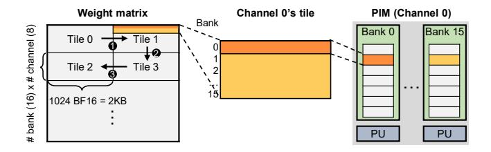
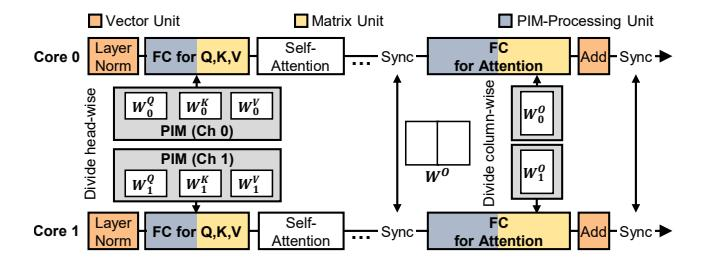

# 4 IANUS Architecture

To accelerate the end-to-end inference of transformer-based LLMs, we introduce IANUS (Integrated Accelerator based on NPU-PIM Unified Memory System) that integrates NPU and PIM (Figure 3). However, maximizing the utilization of both NPU and PIM is a challenge, as PIM must function as either a PIM or the main memory for the NPU. To this end, we need to carefully design a command scheduler, PIM control unit, PIM memory controller, and network-on-chip (NoC).

#### 4.1 NPU Architecture

Command Scheduler: The command scheduler is responsible for checking dependencies between each command and the status of each unit and sending commands to each unit. When a command has no dependency and the corresponding unit is in an IDLE state, the scheduler pushes the command into the "issue" queue of the unit, and the unit executes it. On the other hand, the command is pushed into the "pending" queue. Upon completion of execution, the scheduler resolves the dependencies between the command and the others.

Computation Units: NPU comprises two computing units: the matrix unit (MU) and the vector unit (VU). The MU is built on a systolic array [26] of 128×64 processing elements to effectively accelerate matrix-matrix multiplication, such as FC layers. To enable efficient pre- or post-processing, the MU also supports operations such as scaling and bias addition. The VU features 16 very long instruction word (VLIW) processors [11]. As it is designed to manage vector operations and general purpose operations that the MU cannot efficiently perform, the VU supports element-wise addition, layer normalization [3], masking, and non-linear activation functions such as softmax [4] and GELU [18].

Scratch-pad Memories: The activation scratch-pad memory (AM) and the weight scratch-pad memory (WM) supply data to the computing units. The WM provides weights, scales, and biases to the matrix unit. The AM serves as a data storage or provider for both computing units, typically addressing input or activation data. The AM adopts a transposed structure and data format relative to the WM to fully exploit the benefits of the matrix unit's systolic array, as illustrated in Figure 3. To enhance the throughput of computation units, direct-memory-access (DMA) units (light blue


Figure 3. (Left) Architecture of a core in NPU. (Middle) PIM architecture. (Right) Overall architecture of IANUS.

boxes in Figure 3) employ an entry-wise scheme to load or store data in scratch-pad memories, where the entry refers to the data granularity offered to computing units.

PIM control unit and PIM memory controller: Orchestrating multiple PIM chips is not trivial as it requires a significant amount of PIM commands. This requirement may lead to substantial scheduling overhead for the command scheduler. Furthermore, the efficiency of PIM computation diminishes if a standard memory command is inserted in the middle of multiple PIM commands for a single operation, such as a matrix-vector multiplication. Considering that, we propose a macro PIM command for scheduling. One macro command encapsulates multiple micro PIM commands necessitated for an operation.

To facilitate PIM operations with macro command, we develop a PIM control unit (PCU) and PIM memory controller (PIM MC), as in Figure 3. When one macro PIM command becomes a ready state, the command scheduler forwards it to the PCU. Then, the scheduler forces unissued DMA commands related to the off-chip memory to be in the wait state to ensure uninterrupted PIM execution. Lastly, PCU decodes the macro PIM command into multiple micro PIM commands and forwards these to the PIM MC via the NoC.

The PIM MC supports both PIM commands and normal memory commands. Like conventional memory controllers, PIM MC also tracks the state of each bank and generates appropriate commands following strictly defined timing constraints as well as newly introduced states and timing constraints of PIM operations. When all micro PIM commands in one macro PIM command end, the completion signal forwards to the command scheduler to enable DMA commands associated with the off-chip memory.

**Network-on-chip:** Our NoC works as the interconnect between NPU and PIMs and supports all-to-all connections between every core in NPU and PIMs. As a result, when PIMs work as the main memory, any core can access any PIM channel. Additionally, NoC also transfers PIM commands from the PIM control unit to the PIM memory controller. To maximize the performance of PIM operation, NoC enables the broadcasting of PIM commands to every PIM memory



**Figure 4.** Data allocation and tiling scheme for a matrix-vector multiplication in PIM.

controller and simultaneous PIM operation across all PIM channels.

#### 4.2 PIM Architecture

We design PIM architecture based on the commercial PIM called AiM [27, 31], since AiM i) exploits true all-bank parallelism, ii) is designed to accelerate end-to-end matrix-vector multiplication and activation functions in DRAM, and iii) is based on commodity DRAM (GDDR6), making it costeffective and practical. Similar to the AiM architecture, processing units (PUs) are implemented at each bank and a global buffer is implemented at the peripheral circuit in our PIM architecture. The global buffer is shared with every PU and stores an input vector, often reused multiple times when processing matrix-vector products. On the other hand, large data with low reusability such as weight matrix, often read just once during matrix-vector product, are stored at each bank. Each PU, associated with each bank, includes a set of multipliers, an adder tree, an accumulator for Multiply-Accumulate (MAC) operation, and a special function unit for activation function. With all the structures above, our PIM exploits true all-bank parallelism efficiently, enabled by all-bank simultaneous activation and computation.

## 5 Transformer-aware Design

IANUS employs NPU-PIM architecture to support operations with diverse computational requirements. We describe how our design accelerates these operations.

| Conventional address mapping | Row            | Bank     | Col_M       | Channel  | Col_L     | Offset         |
|------------------------------|----------------|----------|-------------|----------|-----------|----------------|
| IANUS's address mapping      | Row            | Channel  | Ban         | k C      | olumn     | Offset         |
| addioco mapping              | - Tile index - | Row inde | x in a tile | <u> </u> | olumn ind | lex in a tile— |

**Figure 5.** Comparison of conventional DRAM address mapping (top) [21] and IANUS's DRAM address mapping (bottom) with the mapping of tile shown in Figure 4. 'Col\_M/L' denote the most and least significant column bits.

#### 5.1 Data Allocation of FC Layers for PIM Operation

We employ PIM architecture to accelerate matrix-vector multiplication, the operation of FC layers in *generation* stages. We consider data allocation and tiling that maximize the performance of PIM. Figure 4 shows an example of our approach for the weight matrix of an FC layer. As depicted, the weight matrix is divided into tiles and each tile consists of 16 (number of banks per channel) × 8 (number of channels for IANUS) rows and up to 1024 columns (number of elements in one DRAM row). Each row in the tile is allocated to the same DRAM row address of each bank and each channel, since PIM can perform simultaneous all-channel and all-bank parallel operations. While the effective tiling scheme depends on the workload, this figure illustrates row-major tiling, sliding tiles on the same rows at first.

#### 5.2 Address mapping

The DRAM address mapping of IANUS, compared with conventional address mapping, is shown in Figure 5. IANUS employs an address mapping of (MSB) Row-Channel-Bank-Column (LSB). The key difference in IANUS address mapping, compared to conventional mapping, lies in maximizing PIM computation performance through PIM-aware tile (shown in Figure 4) placement. By using the row address bit as the MSB corresponding to the index of a tile, data within a single tile share the same row address, while each tile is assigned to a different row address. This ensures that row conflicts do not occur during operations related to a single tile. Additionally, using the column address bit as the LSB ensures that operations on all elements of a single row within a tile are handled by one PE for the completion of related MAC in one bank. Placing channel and bank address bits between the row and column address bits allows each row within a tile to be distributed across different channels and banks. This enables the PIM to concurrently compute all rows within a tile by leveraging channel and bank parallelism, thereby maximizing the throughput of PIM computations.

However, our address mapping has a limitation in that it is different from typical address mappings for diverse server-class workload mixes. These conventional mappings place adjacent data across different channels to sustain streaming bandwidth across multiple channels [21]. To achieve this, typical mappings tend to position the channel address bit at a lower bit, as shown in Figure 5. Nevertheless, in IANUS,

our address mapping results in minor performance overhead compared to typical mappings. This is because each core in NPU is mainly responsible for two unique PIM channels, enabling IANUS to utilize multiple channels in parallel for normal memory access.

#### 5.3 Data Manipulation in Self-Attention

**Key Transposition:** The transpose operation requires data transfer between on-chip and off-chip memory without dedicated hardware, potentially delaying PIM operations due to the off-chip memory use. We address this issue by executing transposition within the on-chip. Considering an entry-wise data transfer and transposed data formats between two scratch-pads, moving data from the activation scratch-pad (AM) to the weight scratch-pad (WM) via DMAs performs the partial transpose operation. It doesn't entirely transpose data due to the different entry sizes of the two scratch-pads. Specifically, the entry size of the AM is twice that of the WM. Therefore, we first incorporate a streaming buffer and path between DMAs of two scratch-pads for on-chip data movement. We then implement weight interleaving within the matrix unit, enabling access to the WM entry with a specific stride. As this approach solely manages the WM entry, it doesn't incur any latency overhead.

**Splitting** / **Merging Attention Heads**: Splitting and merging attention heads occupy a large portion of the latency of self-attention at a GPU due to the data transactions for data reordering. Our compiler avoids such data movement by carefully defining and generating activation scratch-pad addresses of input and output data in the command. For instance, when generating commands for the FC operation that produces Q, the compiler generates as many commands as the number of heads. The compiler then assigns a distinct output address for each command, guiding the matrix unit to store Q in the scratch-pad in a split manner. Hence, no data reordering overhead is required. Similarly, the compiler ensures consecutive output addresses of each head's SV command for merging attention heads.

#### 5.4 Vector Operations in Vector Unit

**Layer Normalization:** We employ a two-phase approach considering the limited vector unit's (VU) own memory. Initially, VU calculates the mean and variance of the tokens. Subsequently, it proceeds to normalize the values.

**Masked Softmax:** We combine masking and softmax [4] within a single kernel. Each mask is stored as a 1-bit bitmap, reducing data movement and memory usage. In softmax, we subtract the max value for stability instead of the large value.

**GELU:** For the GELU activation [18], VU uses a lookup table (LUT) approximation, widely employed due to its accuracy and performance [19, 50]. GELU activation is also supported in PIM by reserving some DRAM rows inside PIM as LUT for the activation function and linearly interpolating data from the LUT with additional circuitry.



**Figure 6.** Workload mapping and execution flow, featuring intra-layer parallelism and attention head parallelism. For simplicity, only one attention head is shown. The mapping of operations in self-attention is detailed in Section 6.2.

```
Algorithm 1 Mapping algorithm of FC layers.
```

```
Input/Output: CMDs (ordered commands)Params: n (number of input tokens), T (tile size of MU)Define: VU, MU, PIM, DMA (analytical model of units)
```

```
1: for i, cmd in CMDs do
         if cmd.type == MU_{FC} then
2:
3:
             prev\_cmd \leftarrow CMDs[i-1]
             // Check prefetching
 4:
             if prev\_cmd.type == VU then
 5:
                  t_{prefetch} \leftarrow VU(n, prev\_cmd.dim)
 6:
             w_{cfg} \leftarrow cmd.weight\_cfg
7:
             // Consider column-tiling and pipelining for MU
8:
 9:
             w_{load} \leftarrow DMA_{weight}(w_{cfg}.row, T)
             mu_{tile} \leftarrow MU_{FC}(n, w_{cfq}.row, T)
10:
             mu_{unpipe} \leftarrow mu_{tile} + w_{load}
11:
             mu_{pipe} \leftarrow w_{cfg}.col/T \times \max(w_{load}, mu_{tile})
12:
             mu_{total} \leftarrow mu_{unpipe} + mu_{pipe} - t_{prefetch}
13:
14.
             // Calculate PIM time
             pim_{time} \leftarrow n \times PIM(w_{cfq}.row, w_{cfq}.col)
15:
             if pim_{time} < mu_{total} then
16:
                  Replace CMDs[i].type with PIM
17:
```

