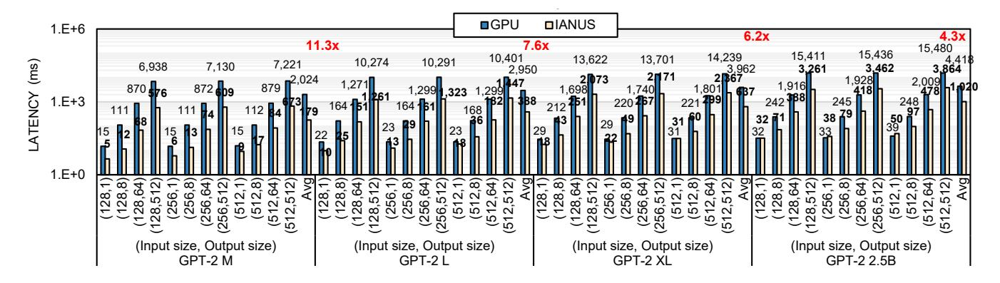
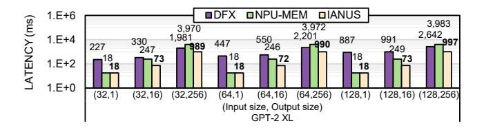
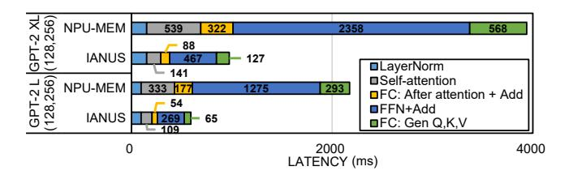
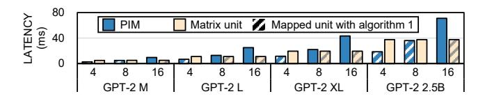
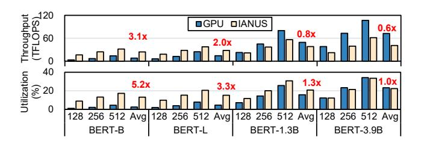
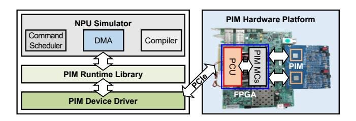

# 7 Evaluations

## 7.1 Methodology

To evaluate the performance of IANUS, we developed a cycle-accurate in-house simulator to model IANUS. The simulator integrates an NPU simulator based on a commercial NPU [1, 20, 41] as well as a PIM simulator modeled after the real PIM chip, AiM [27, 31]. Both the NPU and the PIM simulator are validated against their respective real hardware counterparts within a 5% error margin. An overview of the key simulation parameters is summarized in Table 1. In addition, we modeled the new components added to enable IANUS, including the PIM control unit (PCU), and modified the memory controller to support both PIM commands and normal memory commands. To avoid latency overhead from the PCU, we designed its operations to be pipelined with PIM computations. Our simulator also provides statistics on energy consumption. It measures the dynamic energy consumed by cores in NPU, PIM operations, and standard

Figure 8. Inference latency of various GPT-2 models on A100 GPU and IANUS.

**Table 3.** Network configuration details.

|      | Name      | Embedding dimension | Head dimension | # Heads | # Blocks | # Params | Workload               |  |
|------|-----------|---------------------|-------------------|---------|----------|----------|------------------------|--|
|      | В         | 768                 | 64                | 12      | 12       | 110M     | Question- answering |  |
| BERT | L 1.3B | 1024                | 64                | 16      | 24       | 340M     |                        |  |
|      |           | 2048                | 64                | 32      | 24       | 1.3B     | U                      |  |
|      | 3.9B      | 2560                | 64                | 40      | 48       | 3.9B     | (QA)                   |  |
| GPT  | M         | 1024                | 64                | 16      | 24       | 345M     | Language               |  |
|      | L         | 1280                | 64                | 20      | 36       | 762M     | modeling               |  |
|      | XL        | 1536                | 64                | 24      | 48       | 1.5B     | (LM)                   |  |
|      | 2.5B      | 1920                | 96                | 20      | 54       | 2.5B     | (LIVI)                 |  |

DRAM operations. Based on prior analysis [27], we assume that the power consumption of PIM computing operations is  $3\times$  of that for DRAM read operations.

We compare the performance of IANUS against a GPU, state-of-the-art prior work (DFX [19]), as well as the NPU without PIM memory. For the GPU, we utilize an NVIDIA A100-SXM-80GB GPU [38] with Pytorch 2.0 and CUDA Toolkit 11.8. GPU-optimized source codes from Huggingface [47] and Megatron-LM [43] are used. The latency of the models is measured using the torch.cuda.Event API. DFX [19] is a multi-FPGA appliance specifically designed to accelerate the generation stage of GPT models. We assume a DFX with 4 FPGAs that can support GPT-2 XL model. We also compare IANUS with a baseline commercial NPU [1, 20, 41] (the same NPU used in IANUS) without PIM, but with standard GDDR6 memory (NPU-MEM). It shares identical specifications with IANUS in Table 2 except for the internal memory bandwidth and features a peak throughput of 184 TFLOPS. IANUS is identical to NPU-MEM, except that standard GDDR6 memory is replaced with PIM based on AiM [27, 31]. Each PIM chip achieves a peak throughput of 1 TFLOPS with 32 processing units utilizing 1024 GB/s internal memory bandwidth at peak. The specifications of each architecture are summarized in Table 2.

We evaluate two notable transformer-based LLMs, BERT [9] and GPT [40] with the BF16 [46] data type, which maintains the accuracy of the full-precision model. The configurations and tasks of each model are presented in Table 3. We exploit a GPT-2 XL model with its attention heads reduced

from 25 to 24, whose accuracy was validated in [19], to optimize parallelism. We assess the end-to-end performance of models with input sizes of 128, 256, and 512 tokens. For the GPT-2, we use output sizes of 1, 8, 64, and 512 tokens. These sizes represent the typical user request ranges for NLP services in datacenters [39]. Due to the time overhead associated with gathering inputs from multiple users, current datacenters prefer running the model with non-batched input [12, 19]; therefore, we evaluate our work using a batch size of 1.

#### 7.2 Performance Results

End-to-end Inference Latency: To guarantee a fair comparison, we measure the average latency over more than 30 iterations, ensuring each is conducted under identical load conditions for different architectures. Moreover, only the stabilized latencies are considered for the following evaluations. Figure 8 presents the end-to-end latency of GPT-2 models on the GPU and IANUS and the speedup that IANUS achieves. The result shows that IANUS achieves a 4.3× speedup compared to the GPU for the 2.5B model on average. For the workload with significantly more output tokens than input tokens, i.e., (128,512), IANUS demonstrates 12.0×, 8.1×, and 6.6× lower latency than the GPU for the GPT-2 M, L, and XL models, respectively. These substantial speedups originate from the guaranteeing high utilization of PIM's internal bandwidth of 4096 GB/s for matrix-vector multiplication in generation stage. Moreover, on average, IANUS takes about 5.7 ms per token for generation stages of the GPT-2 2.5B model with configuration (128,64), while the GPU takes about 29.9 ms.

As in Figure 9, we conduct a comparison of the GPT-2 XL's latency among IANUS, NPU-MEM, and DFX with four FP-GAs [19] that achieve state-of-the-art performance in GPT-2. Input and output token sizes for the comparison are derived from [19]. IANUS achieves a 49.3× speedup compared to DFX for the (128,1) configuration. IANUS and NPU-MEM present similar performance for this configuration, as the PIM in IANUS operates as a standard GDDR6 except for the

**Figure 9.** Inference latency of GPT-2 XL on DFX [19], NPU-MEM, and IANUS.

**Figure 10.** Latency breakdown of GPT-2 L and XL's *generation* stages for IANUS and NPU-MEM.

**Figure 11.** Dynamic energy of IANUS and NPU-MEM, normalized to IANUS with GPT-2 M.

LM head. Considering the *generation* stage, DFX achieves 6.9 ms to generate one token for the (64,256) configuration. Meanwhile, IANUS generates a token in 3.8 ms for the same configuration, achieving a speedup of 1.8× compared to DFX. Without the benefits of PIM, NPU-MEM takes 15.5 ms. To this end, IANUS achieves an average speedup of 3.2× compared to DFX, while NPU-MEM attains 0.8× speedup.

Latency Breakdown: To investigate the impact of using PIM, we measure the latency of operations in the decoder for NPU-MEM and IANUS in the generation stages of GPT-2 L and XL. As residual additions are executed with FCs and FFN using a pipelining scheme, we collectively measure their latency. As in Figure 10, IANUS reduces the execution time of two FCs from 890 ms to 215 ms for the GPT-2 XL model, achieving a speedup of 4.1× compared to NPU-MEM. Since the FFN has a four times larger weight size compared to the two FCs, it achieves a higher speedup of 5.1 times. IANUS also achieves a speedup of 4.3 times for self-attention without offloading any operation in self-attention. This speedup originates from prefetching previously generated keys and values instead of the weight for generating Q, K, and V by offloading FC for Q, K, and V generation to PIM. To this end, IANUS achieves speedups of 4.0× and 3.6× for GPT-2 XL and L models, respectively, compared to NPU-MEM.

**Figure 12.** Performance evaluation of the FC mapping algorithm across different GPT-2 models as the number of input tokens are varied from 4, 8, to 16.

**Energy efficiency:** Figure 11 presents dynamic energy consumption of IANUS and NPU-MEM for GPT-2 models where input and output token sizes are set to 256 and 512, respectively. The energy values are normalized to the dynamic energy consumed by IANUS with GPT-2 M. By offloading FC layers of the generation stage to PIM, IANUS achieves a 10.5-13.4× reduction in energy consumption for normal memory operations across all models. The energy consumption for computation of cores in NPU is also decreased by a factor of 6.3-10.2×. The reduction in energy consumption for cores' computation and normal memory operations tends to increase as the model size expands. Meanwhile, IANUS is responsible for the energy consumption from PIM operations. As a result, IANUS attains a 3.7×, 3.6×, 3.9×, and 4.4× improvement in energy-efficiency compared to NPU-MEM for GPT-2 M, L, XL, and 2.5B, respectively. Despite its larger model size, GPT-2 L exhibits a smaller energy efficiency improvement compared to GPT-2 M due to its embedding dimension size of 1280, which results in twice the number of row activations than GPT-2 M's size of 1024 for PIM computation. It is important to note that energy efficiency in a real system can be better than our estimation as we do not consider static energy consumption tied to speedup and energy consumption by PHY and off-chip data movement, significantly related to normal memory access.

FC Mapping Algorithm: To evaluate the correctness of Algorithm 1, we estimate the performance of GPT models when FC mapped to PIM and matrix unit on various input token sizes and compared it to the result of Algorithm 1. As illustrated in Figure 12, Algorithm 1 is effective in the case with small input sizes and chooses the appropriate computation unit on various model sizes and input token sizes. Specifically, Algorithm 1 achieves about 94% accuracy on average across GPT models for all input sizes from four to sixteen. When executing FC layers in PIM, execution time is proportional to the input token size as PIM sequentially repeats matrix-vector multiplication as much as the input token size. On the other hand, the matrix unit shows similar performance across 4, 8, and 16 input tokens thanks to the capability of processing 128 tokens in parallel. Therefore, the matrix unit achieves better performance for large input token sizes. Another factor for workload mapping is the embedding size of the model. As the global buffer and row size of PIM is 2KB (= 1024 BF16), models with multiples of 1024

**Figure 13.** Performance comparisons between unified and partitioned memory systems and the impact of mapping-aware scheduling. Dashes in the bar border indicate the system type. Colors represent mapped units of  $QK^T$  and SV. The pattern indicates the application of scheduling.

can fully utilize the benefits of PIM. As a result, PIM shows higher performance than the matrix unit at an input size of 8 for GPT-2 M (embedding size of 1024) and GPT-2 2.5B (1920, nearly  $2\times1024$ ). With Algorithm 1, we achieve an average speedup of  $1.4\times$  and  $1.2\times$  when compared to mapping FC to PIM and the matrix unit, respectively.

Unified vs. Partitioned Memory System: We evaluate two systems, one with a partitioned memory and the other with a unified memory (IANUS). Both systems have the same total memory capacity. The partitioned system employs an 8 GB capacity, split evenly with 4 GB to standard DRAMs for the NPU and another 4 GB to PIMs for their processing units. The unified system utilizes 8 GB exclusively for PIMs.

We assess GPT-2 models with a (256,512) configuration in each system. In the partitioned system, all FC parameters, shared between PIMs and NPU, are duplicated in two memory types to avoid performance overhead caused by data movement between standard DRAMs and PIMs. However, only for the 2.5B model, all FC parameters cannot be stored in PIMs or DRAMs due to capacity limitations, resulting in partial duplication of parameters. To optimize performance, the matrix unit handles the FC operations of unduplicated parameters. For a fair comparison, we implement scheduling for the partitioned system that maximizes the benefits from parallel executions of NPU and PIM. We also map the  $QK^T$ and SV to the matrix unit to fully exploit gain from scheduling. As in Figure 13, the concurrent execution of NPU's DRAM accesses and PIM computations results in an average 1.3× speedup through scheduling in the partitioned system.

For GPT-2 M-XL models, IANUS—a unified memory system— (the rightmost bar for each model) outperforms the scheduled partitioned memory system by 1.4-1.6× speedup, as in Figure 13. These speedups result from the doubled PIM throughput of IANUS, enabled by utilizing twice as many PIMs. It should be noted that each memory of the partitioned system stores all parameters for these models. For the GPT-2 2.5B model, IANUS shows a larger performance improvement due to the performance overhead in the partitioned system, stemming from the data movement of unduplicated parameters. Similar to performance trends in other models, IANUS achieves a 1.5× speedup in GPT-2 2.5B compared to the partitioned

**Figure 14.** Throughput and compute utilization of the BERT models on A100 GPU and IANUS.

system with sufficient memory capacity that stores all FC parameters in each memory type.

Mapping-aware Scheduling: Figure 13 demonstrates the performance enhancement through mapping of  $QK^T$ and SV operations and corresponding scheduling in multihead attention. As in the figure, scheduling for the mapping of  $OK^T$  and SV to PIM results in an average performance boost of 7% across all models compared to naïve scheduling. When  $QK^T$  and SV operations are mapped to the matrix unit, a reduction in computation time for these operations leads to superior performance than the case of scheduling with PIM mapping for all models except GPT-2 2.5B. For the GPT-2 2.5B model, which has a larger head dimension size of 96 than other models, the loading time for the previously generated keys and values increases. This loading time is not required when  $QK^T$  and SV are mapped to PIM, thus reducing the benefits gained through matrix unit mapping. However, through effective scheduling, we attain a performance improvement of 24% for GPT-2 2.5B. Consequently, mapping-aware scheduling yields an average performance improvement of 34%.

Throughput and Compute Utilization: Figure 14 presents the throughput and utilization of the IANUS and the GPU for BERT models. In IANUS, only the matrix unit and vector unit of the NPU are utilized for computation, excluding PIM. By managing complex data manipulation in self-attention through on-chip data movement, IANUS attains  $3.1\times$  and  $2.0\times$  higher average throughput for BERT-B and L, respectively, despite having  $1.4\times$  lower peak FLOPS than the GPU.

As the FLOPs increase with model size, IANUS's throughput becomes less than the GPU due to its limited peak FLOPS. However, IANUS achieves 5.2×, 3.3×, 1.3×, and 1.0× higher average utilization for BERT-B, L, 1.3B, and 3.9B compared to the GPU. This enhanced utilization is attributed to the efficient execution of vector operations with the vector unit in addition to the benefits gained from self-attention.

**Sensitivity Study of Design Parameters:** We conduct sensitivity studies on the number of cores in NPU and PIM chips. To show the sensitivities of NPU and PIM computation capabilities, we keep memory bandwidth the same as the baseline while varying the number of cores and PIM chips.

**Figure 15.** Sensitivity studies for *summarization*-only (256,1) and *generation*-dominant cases (256,512). Results are normalized to 4 cores and 4 PIMs.

**Figure 16.** System prototype of IANUS (PCU: PIM Control Unit).

We present two *summarization*-only (256,1) and *generation*-dominant (256,512) cases for comprehensive analysis with GPT-2 L to isolate the impacts from reduced on-chip memory or PIM capacity. As shown in Figure 15, the fewer cores result in slowdowns for both cases due to the decreased intra-layer and attention-head parallelism, and *summarization*-only case suffers more as NPU executes all but one computation (LM head). On the other hand, PIM's computation capability affects the *generation*-dominant case as many portions as FC operations executed in PIMs account for.

