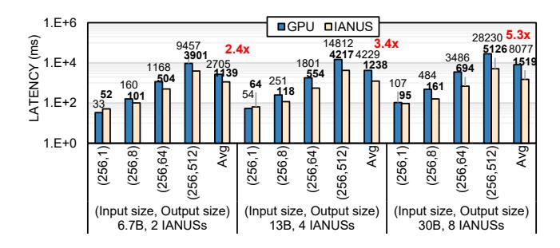

# 7.3 IANUS System Prototyping

We develop a system prototype of IANUS to validate feasibility as shown in Figure 16. Our prototype is based on commodity Xilinx FPGA board (VCU118) [48] to evaluate real PIM chips, GDDR6-AiM [27, 31], through FMC connector [29]. As shown, the PIM control unit (PCU) and PIM memory controllers (PIM MCs) are implemented on FPGA whereas we leverage our both functionally and cycle-accurate NPU simulator as the NPU of IANUS is too big to fit in a single FPGA. When PIM macro commands are ready to be executed in the NPU, they are dispatched to PCU through the PCIe interface by the PIM runtime library and device driver. Next, these macro commands are converted into corresponding micro commands and are transferred to PIM through PCU and PIM MCs. DMA commands from the NPU simulator are also transferred to PIM with a similar scheme. To validate the functionality of a system prototype for IANUS, we evaluate the accuracy of our system using pretrained models of GPT-2 [40] on the WikiText-2 dataset. Our system prototype achieves perplexity scores of 30.92 and 22.60, 19.39, and 17.48 for GPT-2 Base (117M), M, L, and XL, respectively, achieving similar perplexity scores as the full-precision models.

**Table 4.** Network configurations of larger LLMs.

|  |     | # Params | Embedding dimension | Head dimension | # Heads | # Blocks | Workload |
|--|-----|----------|---------------------|-------------------|---------|----------|----------|
|  |     | 6.7B     | 4096                | 128               | 32      | 32       | Language |
|  | GPT | 13B      | 5120                | 128               | 40      | 40       | modeling |
|  |     | 30B      | 7168                | 128               | 56      | 48       | (LM)     |

**Figure 17.** Inference performance scalability for larger LLMs with multiple IANUS devices. The results are compared to a single A100 GPU.

#### 8 Discussion

#### 8.1 Scalability Analysis

Given the limited memory capacity of IANUS compared to modern GPUs, the memory capacity of IANUS needs to be scaled to run larger LLMs. The memory (PIM) capacity of IANUS can be expanded in two ways: 1) increase the amount of PIM per NPU, or 2) scale the number of IANUS devices. The first approach can be achieved by adding more PIM controllers or employing a clamshell configuration of GDDR6 devices [36]. However, this approach requires modifications to the IANUS architecture. In this work, we leverage the second approach to analyze the scalability of IANUS.

The larger LLMs used in our scalability analysis are summarized in Table 4. For each model, the number of IANUS devices is selected to provide sufficient memory capacity to support the model – i.e., two, four, and eight IANUS devices are used to support the GPT 6.7B, 13B, and 30B models, respectively. The multiple IANUS devices are assumed to be interconnected through PCIe 5.0  $\times$ 16 host interface. To maximize parallelism across IANUS devices, both intra-layer parallelism and attention head parallelism are exploited among devices.

As shown in Figure 17, multiple IANUS devices provide average speedups of  $2.4\times$ ,  $3.4\times$ , and  $5.3\times$  across respective models, compared to a single A100 GPU, which has sufficient memory capacity for the larger LLMs. Multiple IANUS devices not only provide additional memory capacity but also increase effective memory bandwidth with extra PIM capability. For larger LLMs, the key system component that impacts overall performance is the memory bandwidth. This is because the proportion of FC layers in LLMs, which are bottlenecked by memory bandwidth, increases as the size of the

**Figure 18.** Strong scaling of IANUS on the GPT 6.7B model.

LLMs grows. Leveraging the PIM's internal memory bandwidth, the effective memory bandwidth of IANUS reaches approximately 2.4 TB/s, 9-10× higher than external memory bandwidth of GDDR6 memories. Thus, with two IANUS devices, the total effective bandwidth is 4.8 TB/s, which is approximately 2.4× higher than the A100 memory bandwidth (2039 GB/s). This difference in memory bandwidth nearly matches the observed performance benefits of two IANUS devices over the A100 GPU. However, scaling the number of IANUS devices comes at the cost of communication overhead between IANUS devices compared to a single GPU. As a result, the performance benefits with four and eight IANUS devices do not match the theoretical memory bandwidth difference; however, there is still significant speedup compared to a single A100 GPU.

Strong scaling of IANUS is shown in Figure 18, using the 6.7B model with a 256:64 token configuration. As described earlier, the additional IANUS devices provide higher effective memory bandwidth and result in performance gain –  $2.5\times$  performance improvement when the number of IANUS is increased by 4×. While the performance of IANUS improves with extra devices, linear speedup is not obtained because of the communication overhead between multiple devices. A multi-IANUS device system presents new opportunities for optimizing communication across the devices but we leave such exploration as part of future work.

### 8.2 Cost Analysis

Providing a fair cost comparison between two different system architectures (e.g., HBM memory with interposer vs GDDR6-based PIM memory) is a challenge since many factors impact cost. However, prior work has shown how thermal design power (TDP) can approximate total cost of ownership (TCO) in datacenters [23]. Therefore, we use TDP for the cost comparison. The TDP of A100 GPU is estimated at 400 W [38] while the TDP of IANUS is conservatively assumed to be 120 W, based on estimates from the NPU [1, 20, 41] and PIM [27, 31] components. Using the performance/TDP metric for the cost-efficiency evaluation, configurations of two, four, and eight IANUS devices yield improvements in costefficiency of 3.9×, 2.7×, and 2.1× over the single A100 GPU for the 6.7B, 13B, and 30B models, respectively. For each comparison, the performances of IANUS devices and the GPU for the performance/TDP metric are measured with a 256:64 input-to-output token ratio. While the cost-efficiency benefits of IANUS devices are evident, they diminish as the

number of IANUS devices increases. The cost efficiency of IANUS can potentially be enhanced by leveraging PIM chips with higher memory capacity and/or more PIM chips connected to a single NPU.

#### 9 Related Works

**Domain-specific accelerators:** Various hardware accelerators have been proposed to accelerate transformer models. TurboTransformer [10] executes BERT variants effectively by operation fusion and pipelining. Unfortunately, this approach suffers from severe under-utilization in text generation workloads. Several accelerators [13, 14, 35, 45, 49] focus on multi-head-attention mechanisms only, requiring additional hardware to handle other operations such as layer normalization. Meanwhile, IANUS utilizes integrated both NPU and PIM to accelerate end-to-end inference of LLMs.

PIM accelerator: Utilizing large in-memory bandwidth, PIM architectures reduce massive data movement between DRAMs and a host [16, 25, 30–33]. McDRAM [42] presents near-memory structures and a horizontal arrangement of data within memory banks. TransPIM [51] introduces the first memory-based accelerator for end-to-end inference of transformers. However, it only achieves an average throughput of 734 GOPS due to area and power constraints. Chopim [7] employs a unified memory system between the near-data accelerator and the host. Unlike Chopim, which focuses on homogeneous kernels, IANUS targets heterogeneous kernels that require scheduling to optimize performance.

#### 10 Conclusion

We propose IANUS, an integrated accelerator based on NPU-PIM unified memory system, that fully exploits the benefits of NPU and PIM to accelerate end-to-end inference in transformer-based LLMs. To overcome the challenges posed by a unified memory system with PIM, we propose *PIM Access Scheduling* that maps workload across both the NPU and PIM while scheduling both PIM and normal memory commands. IANUS results in 6.2× and 3.2× speedup in comparison to GPU and DFX-based solutions for the GPT-2 model, highlighting the potential of such hybrid architectures. To demonstrate the feasibility of IANUS, we constructed an FPGA prototype system based on a commercial NPU and real PIM chips.

