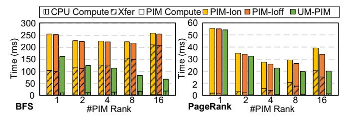
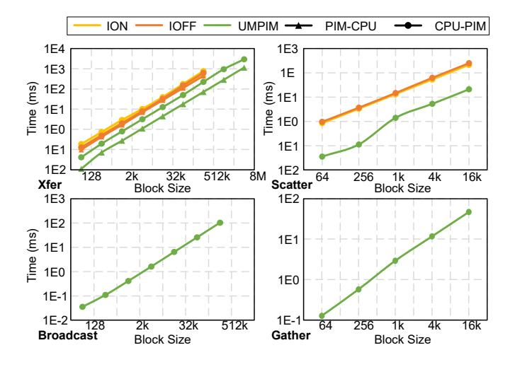
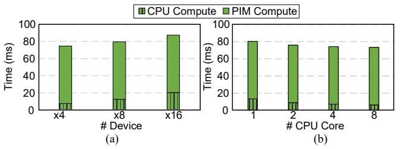

# *A. Experiment Setup*

Baselines. We compare UM-PIM with CPU system and two PIM system baselines. The system configurations are summarized in TABLE III. The DRAM configuration is from commercial DRAM PIM – UPMEM [14]. The bank number is fewer than a standard DDR4 because of additional PIM units. We adopt identical hardware configurations for all three architectures, except half of the DRAM channel sockets are plugged in with PIM DRAMs in UM-PIM and PIM systems. CPU system's global memory interleaving is switched on. (PIM-Ion) switch on the global memory interleaving and use software to translate address and re-layout data with CPU software [6]. (PIM-Ioff) switch off the global memory interleaving of rank and channel level, and use software to do the address translation and data re-layout of the rest of DRAM hierarchies, like that in [14]. Both the two PIM systems reserve

TABLE IV CPU AND PIM BENCHMARKS.

CPU Workloads [27] (MPKI is from [69])

| Benchmark                            | MPKI Benchmark                  |  | MPKI Benchmark              |              |                        | MPKI         |
|--------------------------------------|------------------------------------|--|--------------------------------|--------------|------------------------|--------------|
| lbm dealII                        | 0.55 mcf 0.09 xalancbmk   |  | 0.92 0.13                   | sjeng GCC |                        | 0.13 0.03 |
| PIM Workloads                        |                                    |  |                                |              |                        |              |
| Benchmark                            | Parameter                          |  | Benchmark                      |              | Parameter              |              |
| BFS [24]                             | #node: 196608 sparsity: 5e-5    |  | SCAN-RSS [24] SCAN-SSA [24] |              | len: 8M len: 8M     |              |
| PR [4]                               | Kronecker gen. #node: 8k Deg:12 |  | SEL [24] HST-S [24]         |              | len: 32M len: 1.5M  |              |
| MLP [24] neuron: 16k layers: 3 |                                    |  | NW [24]                        |              | bins: 256 size: 64k |              |
|                                      |                                    |  |                                |              |                        |              |

a physical address space for PIM units. UM-PIM provides two address mappings for the two memory pages, by configuring the memory controllers, as presented in section IV-A1.

UNI [24] len: 256M WFA [16] len: 20k×110 TC [4] #node: 8k Deg:12 RL [23] iter: 100

Simulation. The performance of the three systems is evaluated with the GEM5 simulator [52] under X86 ISA and integrating Ramulator2 [53] for DRAM modelling. We modify the address mapping in Ramulator2 and add the latency of the added circuit model (RCL, ATM, RC) to the corresponding hierarchy. The chunk-based non-interleaved address mapping alias of UM-PIM, and reserved PIM memory space for PIM systems, are abstracted as a NUMA node in the /dev directory of the GEM5 simulator. The driver for CPU accessing the reserved memory space is ported from UPMEM Driver [63]. PIM units' performance is measured with the real-world UPMEM DPUs [14] and the PIM task latency is inserted into the PIM-task launch point of the CPU host program to get the overall computing time. The logic circuit used in RCL, ATM, and RC is derived through Synopsys Design Compiler with TSMC 90nm technology library at the frequency of 2.4GHz, and the buffer array used in RC is simulated with CACTI 7.0 [3]. The DRAM interface is estimated with CACTI-IO [34]. The software data transfer functions of current PIM systems we use in the CPU host program, including address translation and data re-layout, are from UPMEM Software Development Kit (SDK) [63].

Benchmarks. The benchmarks for evaluating the three architectures are divided into two categories. 1) *CPU workloads.* CPU workloads only run on the CPU side for evaluating the impact of different memory interleaving strategies in the three architectures. We select 6 benchmarks from SPEC CPU 2006 [27]. 2) *PIM workloads.* In PIM workloads, the CPU offloads memory-intensive program segments to PIM units, and other segments are executed by the host CPU. We select 12 benchmarks from PRIM [24], GAP [4], AiM [16] and PIM-ML [23]. All the benchmarks and parameters are summarized in TABLE IV.

Fig. 12. Performance degradation of CPU workloads on UM-PIM and PIM system compared to CPU system.

Fig. 13. Computing time of PIM workloads on PIM systems and UM-PIM.

#### B. CPU Workloads

Fig. 12 shows the result of CPU workloads, on the CPU system, PIM-Ioff, and UM-PIM. Compared to the CPU system, PIM-Ioff has a performance degradation of 88.2%, 83.8%, and 74.2% for 2, 4, and 8 CPU cores over the benchmarks. For *lbm* on 8 CPUs, the performance of the PIM system is only 22% of that of the CPU system. While for UM-PIM, the performance degradation is less than 0.1% for the benchmarks. This is because the address interleaving of CPU pages can guarantee CPU bandwidth. The hardware module for determining page type, RCL, has an ignorable impact on overall performance. The Cache Miss per 1000 Instructions (MPKI) of the benchmarks are summarized in TABLE IV. For *lbm* and *mcf*, which have a higher MPKI, PIM-Ioff's non-interleaved address mapping has a significant, over 40% degradation on the performance for 8 CPUs. When the number of CPUs increases from 2 to 8, the performance degradation of lbm on the PIM system decreases from 64.3% to 22.4%. This also indicates that UM-PIM guarantees the possibility of using PIM units to accelerate computation in multi-core systems.

#### C. PIM Workloads

Fig. 13 depicts the computing time and breakdown of PIM workloads on UM-PIM and PIM systems. All the values are normalized to PIM-Ion in each benchmark. We use 1 CPU thread, and PIM units from all the 16 ranks are enabled. We suppose that the data are loaded to PIM memory space or PIM pages initially by DMA, and this initialization time is not contained in Fig. 13. We divide the overall computing time into three parts: CPU computing, data transfer (Xfer), and PIM unit computing. Data transfer time includes the data movement between CPU and PIM memory spaces before and after offloading PIM tasks. UM-PIM do not contain data transfer time as the CPU can directly access PIM pages, and

Fig. 14. Computing time of PIM workloads with different PIM unit numbers.

1 PIM Rank contains 64 PIM units.

its CPU computing time includes accessing PIM pages. UM-PIM can reduce the CPU computing and data transfer time by 4.93× on average compared to PIM-Ioff. This results in 1.96× speedup of the whole workload on average. This reduction is mainly due to the reduced memory copy and efficient address mapping and data re-layout. Moreover, 9 of the 12 benchmarks can utilize the efficient inter-PIM unit communication APIs. The other 3 benchmarks (BFS, PageRank, and NW) cannot utilize the APIs as their data arrangement is sparse and is not moved as whole blocks. This significantly reduces the latency of these two steps. PIM-Ioff reduces 29.6% data transfer time on average compared to PIM-Ion because of the simpler address translation and data re-layout function processed by software. This also explains why some designs turn off the global interleaving to ensure the efficiency of PIM tasks. For benchmarks with a large number of fine-grained transmissions (NW, BFS, and SEL in Fig. 3 (a)), UM-PIM can obtain a higher speedup on CPU compute time (8.52x, 4.60x and 10.65x). This is because the fixed overhead of every data transfer is eliminated.

Fig. 14 shows the computing time of *BFS* and *PageRank* with a different number of PIM units. When more PIM units are used, the amount of data transfer between PIM units increases significantly. This results in an increase in computation time despite using more PIM units. While for UM-PIM, the lower data transferring overhead makes this impact less obvious. The two benchmarks can better benefit from the increased parallelism of the PIM unit.

### D. Data Transfer

Fig. 15 plots four data transfers of the three architectures, including three inter-PIM-unit data transferring APIs (scatter, gather, broadcast). Xfer indicates data transfers between PIM and CPU memory spaces in PIM systems. For UM-PIM, this means data transfer between CPU and PIM pages. Results show that UM-PIM can achieve 3.61×/2.69× and 8.28×/6.54× improvement compared to PIM-Ion/Ioff counterpart for CPU-PIM and PIM-CPU data transferring. UM-PIM can achieve 9.84×/12.6×/7.90× speedup for scatter/broadcast/gather compared to PIM-Ioff. For PIM systems, inter-PIM-unit data transfer requires two data transfers, including one PIM-CPU and one CPU-PIM. In contrast, UM-PIM only needs to do one memory copy from the source PIM unit to the destination PIM unit. Moreover, UM-PIM also benefits from more efficient data access and the broadcast mode of RC.

Fig. 15. Time of Data transfer and inter-PIM-unit data transfer APIs.

Fig. 16. Speedup of UM-PIM compared to PIM-Ion with different interleave methods.

#### E. Influence of Memory Interleaving Methods

We compare the benefits of UM-PIM compared to PIM-Ion when the CPU adopts more complex interleaving, as illustrated in Fig. 16. We select 5 address mapping configurations from [64]. Each configuration is designated as Ii, representing the No. i address mapping listed in Table II from [64]. The baseline **Simple** is the address mapping of PIM-Ion summarized in TABLE III. Compared to **Simple**, the complex address interleaving systems require more software overhead for address translation and data re-layout. However, with UM-PIM, the address mapping process for PIM pages stands independent of that for CPU pages. Consequently, the overhead associated with PIM page address mapping remains unaffected by changes in CPU page address mapping.

## F. Area

PCL occupies a mere  $0.031 \ mm^2$ , which is a negligible amount for  $1 \ cm^2$  DRAM chip area [14]. RCL, ATM, and GC contribute  $0.72 \ mm^2$  additional area to the RCD chip. RC occupies  $0.21 \ mm^2$ , which is significantly smaller than the DRAM data buffer with an area of  $100 \ mm^2$ .

## VII. DISCUSSION

Benefits for Offloading Decision Algorithms in PIM Compilers. Recent works utilize compilers to decide whether a program segment is good to be offloaded to PIM units. They mainly consider the offloading overhead [15], [67] and the

Fig. 17. (a) Overall computing time and (b) proportion of offloaded program segment of two architectures with different offloading overhead.

Fig. 18. BFS computing on UMPIM with different (a) DRAM device numbers and (b) CPU core numbers.

memory intensity [7], [25], [67]. For UM-PIM, benefits from the low offloading overhead, we can offload more programs to PIM units to make PIM units function better. We test the GAP Benchmark Suite [4] with the offload model in [15] and optimization algorithm in [67]. Fig. 17 compares the proportion of PIM to the overall computing time between UM-PIM and PIM-Ioff. With a lower offload overhead, UM-PIM can offload 7.8% more program segments on average to PIM units across the benchmarks. This results in a 1.13× speedup. This indicates that UM-PIM can let the PIM systems better utilize the benefit of PIM units.

Adapt to System Configurations. UM-PIM can adapt to systems with different DRAM device numbers, bank numbers, and host CPU numbers. For different DRAM device numbers, only RC's design hyper-parameter needs to be modified. For example, on an x4 DRAM (4 devices per rank), RC has 4 SBs and each SB contains 4 16-byte cells. Compared to x8, RC in x4 has a shorter re-layout period. It takes only 4 BLs to fill RC. As RC is located on DRAM rank, manufacturers can customize RC according to device number. Fig. 18 (a) depicts the BFS's computing time under different device numbers. Fewer device number leads to a better speedup of CPU computing. For DRAM with a different bank number, the address mapping recorded in the memory controller's TAD1 needs to be modified according to the number. Moreover, the API also needs to be modified according to the bank and device number, because the nested loop order of communication API is decided by hardware configuration. The hardware configuration can be obtained from the OS and does not need users to manually set it up. For multi-thread CPU programs, as CPU threads share the same virtual memory space, UM-PIM's memory management and address mapping remain unchanged. Fig. 18 (b) depicts the BFS's computing time with different CPU core numbers. The trend of CPU compute time is the same as a normal multi-threaded program.

For HBM and LPDDR, their hierarchy does not have a device level. Therefore, there is no need for ATM and RC circuits that carry out device-level data re-layout and address mapping. The data transfer overhead in HBM is not as severe as that in DIMM-based DRAM because of the lack of a device level. According to our experiment, software latency on address translation in HBM is only 9% of the summation of address translation and data re-layout latency on DDR4. Therefore, the overall overhead of data transfer is only 37% of that on DDR4. On PIM workloads, our approach is expected to achieve 1.8× speedup on CPU compute time. The communication API is still effective because traversal order still has an impact on performance. Thus, our solution demonstrates excellent scalability on HBM and LPDDR, further enhancing its applicability and potential.

## VIII. RELATED WORK

PIM. Processing-in-memory integrates computing units into memory hierarchies, including cache [17], [59], [66], DRAM memory (DDR [11], [37], [39], [44], HBM [41], [43]), and SSD [40]. In addition to utilizing memory devices already widely used in computers, some work has been done to design accelerators based on emerging storage technologies with computational potential [8], [61].

PIM units are often distributed in memory modules to increase the overall bandwidth. Since there is no direct line connection between memory modules, the data exchange between PIM units is costly. Some works are devoted to improving the efficiency of data transfer between PIM units [11], [18], [62], [72], [73]. However, due to the large number of PIM cores inside the DIMM, the overhead of implementing efficient point-to-point communication inside the DIMM is still extremely high. Another route is to design a rational task division mechanism to reduce the number of communications [36], [47]. SynCron [21] improves the synchronization mechanism to reduce communication.

Chopim [9] proposes element-wise tensor operations with DIMM DRAM with PIM units on the device level. They turn on memory interleaving, and each PIM unit is visible to one or several segments of one memory page. They set up address mapping of the system so that the same offset in a memory page is mapped to the same bank. During computing, they align the beginning address of two tensors to memory pages so that the elements on the same position are mapped to the same PIM units' device. Although neighboring elements are not on the same device, this does not affect the calculation. All PIM units can do element-wise operations on the two tensors within one offloading. Therefore, memory interleaving can coexist with element-wise operation PIMs. For other operations, for example, GEMM [41], PIM units have to be visible to a contiguous block of data. They utilize software for re-layout resulting in a large overhead. Therefore, efficient dynamic address mapping and data re-layout are urgently needed on existing general-purpose commercial PIMs.

Unified Memory. Unified Memory brings together the memory spaces for both the CPU and GPU instead of isolating [56]. The data transfer overhead is hidden by hardware instead of making software wait for the transfer [2], [35].

## IX. CONCLUSION

In this work, we propose UM-PIM, a PIM architecture with uniform memory space for both CPU and PIM units. PIM and CPU memory pages, which have different address layouts, co-exist in the memory space. UM-PIM benefits from the interleaved CPU memory space and the saved data transfer between CPU and PIM units. We present dual-track memory management and a dynamic address mapping method to support the two kinds of memory pages. We also propose a hardware-software co-design method to accelerate CPU access to PIM pages. Results show that compared to CPU system, UM-PIM exhibits a negligible performance degradation compared to current PIM systems. For PIM-specific tasks, UM-PIM can reduce CPU time by 4.93×, translating to a 1.96× overall speedup.

## ACKNOWLEDGMENT

We sincerely thank our shepherd and the anonymous reviewers for their comments and suggestions to improve the paper. We also thank Huan Zhou for improving the figures.

## REFERENCES

- [1] S. Aga, N. Jayasena, and M. Ignatowski, "Co-ml: A case for collaborative ml acceleration using near-data processing," in *Proceedings of the International Symposium on Memory Systems*, ser. MEMSYS '19. New York, NY, USA: Association for Computing Machinery, 2019, p. 506–517. [Online]. Available: https://doi.org/10.1145/3357526.3357532
- [2] A. A. Awan, C.-H. Chu, H. Subramoni, X. Lu, and D. K. Panda, "Ocdnn: Exploiting advanced unified memory capabilities in cuda 9 and volta gpus for out-of-core dnn training," in *2018 IEEE 25th International Conference on High Performance Computing (HiPC)*, Dec 2018, pp. 143–152.
- [3] R. Balasubramonian, A. B. Kahng, N. Muralimanohar, A. Shafiee, and V. Srinivas, "Cacti 7: New tools for interconnect exploration in innovative off-chip memories," *ACM Trans. Archit. Code Optim.*, vol. 14, no. 2, jun 2017. [Online]. Available: https://doi.org/10.1145/3085572
- [4] S. Beamer, K. Asanovic, and D. A. Patterson, "The GAP benchmark suite," *CoRR*, vol. abs/1508.03619, 2015. [Online]. Available: http: //arxiv.org/abs/1508.03619
- [5] A. Boroumand, S. Ghose, M. Patel, H. Hassan, B. Lucia, R. Ausavarungnirun, K. Hsieh, N. Hajinazar, K. T. Malladi, H. Zheng, and O. Mutlu, "Conda: Efficient cache coherence support for near-data accelerators," in *2019 ACM/IEEE 46th Annual International Symposium on Computer Architecture (ISCA)*, June 2019, pp. 629–642.
- [6] D. Chen, H. He, H. Jin, L. Zheng, Y. Huang, X. Shen, and X. Liao, "Metanmp: Leveraging cartesian-like product to accelerate hgnns with near-memory processing," in *Proceedings of the 50th Annual International Symposium on Computer Architecture*, ser. ISCA '23. New York, NY, USA: Association for Computing Machinery, 2023. [Online]. Available: https://doi.org/10.1145/3579371.3589091
- [7] D. Chen, H. Jin, L. Zheng, Y. Huang, P. Yao, C. Gui, Q. Wang, H. Liu, H. He, X. Liao, and R. Zheng, "A general offloading approach for neardram processing-in-memory architectures," in *2022 IEEE International Parallel and Distributed Processing Symposium (IPDPS)*, May 2022, pp. 246–257.
- [8] P. Chi, S. Li, C. Xu, T. Zhang, J. Zhao, Y. Liu, Y. Wang, and Y. Xie, "Prime: A novel processing-in-memory architecture for neural network computation in reram-based main memory," in *2016 ACM/IEEE 43rd Annual International Symposium on Computer Architecture (ISCA)*, June 2016, pp. 27–39.

- [9] B. Y. Cho, Y. Kwon, S. Lym, and M. Erez, "Near data acceleration with concurrent host access," in *2020 ACM/IEEE 47th Annual International Symposium on Computer Architecture (ISCA)*, May 2020, pp. 818–831.
- [10] J. Choi, D. Jung, and J. H. Ahn, "A study in identifying memory address interleaving of x86 servers," in *ITC-CSCC: International Technical Conference on Circuits Systems, Computers and Communications*, 2015, pp. 559–560.
- [11] J. Cong, Z. Fang, M. Gill, F. Javadi, and G. Reinman, "Aim: Accelerating computational genomics through scalable and noninvasive accelerator-interposed memory," in *Proceedings of the International Symposium on Memory Systems*, ser. MEMSYS '17. New York, NY, USA: Association for Computing Machinery, 2017, p. 3–14. [Online]. Available: https://doi.org/10.1145/3132402.3132406
- [12] G. Dai, Z. Zhu, T. Fu, C. Wei, B. Wang, X. Li, Y. Xie, H. Yang, and Y. Wang, "Dimmining: Pruning-efficient and parallel graph mining on near-memory-computing," in *Proceedings of the 49th Annual International Symposium on Computer Architecture*, ser. ISCA '22. New York, NY, USA: Association for Computing Machinery, 2022, p. 130–145. [Online]. Available: https://doi.org/10.1145/3470496.3527388
- [13] Q. Deng, L. Jiang, Y. Zhang, M. Zhang, and J. Yang, "Dracc: A dram based accelerator for accurate cnn inference," in *Proceedings of the 55th Annual Design Automation Conference*, ser. DAC '18. New York, NY, USA: Association for Computing Machinery, 2018. [Online]. Available: https://doi.org/10.1145/3195970.3196029
- [14] F. Devaux, "The true processing in memory accelerator," in *2019 IEEE Hot Chips 31 Symposium (HCS)*, 2019, pp. 1–24.
- [15] A. Devic, S. B. Rai, A. Sivasubramaniam, A. Akel, S. Eilert, and J. Eno, "To pim or not for emerging general purpose processing in ddr memory systems," in *Proceedings of the 49th Annual International Symposium on Computer Architecture*, ser. ISCA '22. New York, NY, USA: Association for Computing Machinery, 2022, p. 231–244. [Online]. Available: https://doi.org/10.1145/3470496.3527431
- [16] S. Diab, A. Nassereldine, M. Alser, J. Gomez Luna, O. Mutlu, ´ and I. El Hajj, "A framework for high-throughput sequence alignment using real processing-in-memory systems," *Bioinformatics*, vol. 39, no. 5, p. btad155, 03 2023. [Online]. Available: https: //doi.org/10.1093/bioinformatics/btad155
- [17] C. Eckert, X. Wang, J. Wang, A. Subramaniyan, D. Sylvester, D. Blaauw, R. Das, and R. Iyer, "Neural cache: Bit-serial in-cache acceleration of deep neural networks," *IEEE Micro*, vol. 39, no. 3, pp. 11–19, May 2019.
- [18] M. Gao, G. Ayers, and C. Kozyrakis, "Practical near-data processing for in-memory analytics frameworks," in *2015 International Conference on Parallel Architecture and Compilation (PACT)*, Oct 2015, pp. 113–124.
- [19] M. Gao, J. Pu, X. Yang, M. Horowitz, and C. Kozyrakis, "Tetris: Scalable and efficient neural network acceleration with 3d memory," in *Proceedings of the Twenty-Second International Conference on Architectural Support for Programming Languages and Operating Systems*, ser. ASPLOS '17. New York, NY, USA: Association for Computing Machinery, 2017, p. 751–764. [Online]. Available: https://doi.org/10.1145/3037697.3037702
- [20] M. Ghasempour, A. Jaleel, J. D. Garside, and M. Lujan, ´ "Dream: Dynamic re-arrangement of address mapping to improve the performance of drams," in *Proceedings of the Second International Symposium on Memory Systems*, ser. MEMSYS '16. New York, NY, USA: Association for Computing Machinery, 2016, p. 362–373. [Online]. Available: https://doi.org/10.1145/2989081.2989102
- [21] C. Giannoula, N. Vijaykumar, N. Papadopoulou, V. Karakostas, I. Fernandez, J. Gomez-Luna, L. Orosa, N. Koziris, G. Goumas, and ´ O. Mutlu, "Syncron: Efficient synchronization support for near-dataprocessing architectures," in *2021 IEEE International Symposium on High-Performance Computer Architecture (HPCA)*, Feb 2021, pp. 263– 276.
- [22] H. Gupta, M. Kabra, J. Gomez-Luna, K. Kanellopoulos, and O. Mutlu, ´ "Evaluating homomorphic operations on a real-world processing-inmemory system," in *2023 IEEE International Symposium on Workload Characterization (IISWC)*, Oct 2023, pp. 211–215.
- [23] J. Gomez-Luna, Y. Guo, S. Brocard, J. Legriel, R. Cimadomo, G. F. ´ Oliveira, G. Singh, and O. Mutlu, "Evaluating machine learningworkloads on memory-centric computing systems," in *2023 IEEE International Symposium on Performance Analysis of Systems and Software (ISPASS)*, April 2023, pp. 35–49.
- [24] J. Gomez-Luna, I. E. Hajj, I. Fernandez, C. Giannoula, G. F. Oliveira, ´ and O. Mutlu, "Benchmarking a new paradigm: Experimental analysis

- and characterization of a real processing-in-memory system," *IEEE Access*, vol. 10, pp. 52 565–52 608, 2022.
- [25] R. Hadidi, L. Nai, H. Kim, and H. Kim, "Cairo: A compiler-assisted technique for enabling instruction-level offloading of processing-inmemory," *ACM Trans. Archit. Code Optim.*, vol. 14, no. 4, dec 2017. [Online]. Available: https://doi.org/10.1145/3155287
- [26] N. Hajinazar, G. F. Oliveira, S. Gregorio, J. a. D. Ferreira, N. M. Ghiasi, M. Patel, M. Alser, S. Ghose, J. Gomez-Luna, and O. Mutlu, "Simdram: ´ A framework for bit-serial simd processing using dram," in *Proceedings of the 26th ACM International Conference on Architectural Support for Programming Languages and Operating Systems*, ser. ASPLOS '21. New York, NY, USA: Association for Computing Machinery, 2021, p. 329–345. [Online]. Available: https://doi.org/10.1145/3445814.3446749
- [27] J. L. Henning, "Spec cpu2006 benchmark descriptions," *SIGARCH Comput. Archit. News*, vol. 34, no. 4, p. 1–17, sep 2006. [Online]. Available: https://doi.org/10.1145/1186736.1186737
- [28] M. Hillenbrand, "Physical address decoding in intel xeon v3/v4 cpus: A supplemental datasheet," *Karlsruhe Institute of Technology, Tech. Rep.*, 2017.
- [29] M. Hillenbrand, M. Gottschlag, J. Kehne, and F. Bellosa, "Multiple physical mappings: Dynamic dram channel sharing and partitioning," in *Proceedings of the 8th Asia-Pacific Workshop on Systems*, ser. APSys '17. New York, NY, USA: Association for Computing Machinery, 2017. [Online]. Available: https://doi.org/10.1145/3124680.3124742
- [30] K. Hsieh, S. Khan, N. Vijaykumar, K. K. Chang, A. Boroumand, S. Ghose, and O. Mutlu, "Accelerating pointer chasing in 3d-stacked memory: Challenges, mechanisms, evaluation," in *2016 IEEE 34th International Conference on Computer Design (ICCD)*, Oct 2016, pp. 25–32.
- [31] M. Item, G. F. Oliveira, J. Gomez-Luna, M. Sadrosadati, Y. Guo, ´ and O. Mutlu, "Transpimlib: Efficient transcendental functions for processing-in-memory systems," in *2023 IEEE International Symposium on Performance Analysis of Systems and Software (ISPASS)*, April 2023, pp. 235–247.
- [32] B. Jacob, D. Wang, and S. Ng, "Dram memory controller," in *Memory Systems: Cache, DRAM, Disk*. Elsevier Science, 2010, ch. 13. [Online]. Available: https://books.google.co.jp/books?id=SrP3aWed-esC
- [33] B. Jacob, D. Wang, and S. Ng, "Dram memory system organization," in *Memory Systems: Cache, DRAM, Disk*. Elsevier Science, 2010, ch. 10. [Online]. Available: https://books.google.co.jp/books?id=SrP3aWed-esC
- [34] N. P. Jouppi, A. B. Kahng, N. Muralimanohar, and V. Srinivas, "Cactiio: Cacti with off-chip power-area-timing models," in *2012 IEEE/ACM International Conference on Computer-Aided Design (ICCAD)*, Nov 2012, pp. 294–301.
- [35] J. Jung, D. Park, Y. Do, J. Park, and J. Lee, "Overlapping host-to-device copy and computation using hidden unified memory," in *Proceedings of the 25th ACM SIGPLAN Symposium on Principles and Practice of Parallel Programming*, ser. PPoPP '20. New York, NY, USA: Association for Computing Machinery, 2020, p. 321–335. [Online]. Available: https://doi.org/10.1145/3332466.3374531
- [36] H. Kang, Y. Zhao, G. E. Blelloch, L. Dhulipala, Y. Gu, C. McGuffey, and P. B. Gibbons, "Pim-tree: A skew-resistant index for processing-inmemory," *Proc. VLDB Endow.*, vol. 16, no. 4, p. 946–958, dec 2022. [Online]. Available: https://doi.org/10.14778/3574245.3574275
- [37] L. Ke, U. Gupta, B. Y. Cho, D. Brooks, V. Chandra, U. Diril, A. Firoozshahian, K. Hazelwood, B. Jia, H.-H. S. Lee, M. Li, B. Maher, D. Mudigere, M. Naumov, M. Schatz, M. Smelyanskiy, X. Wang, B. Reagen, C.-J. Wu, M. Hempstead, and X. Zhang, "Recnmp: Accelerating personalized recommendation with near-memory processing," in *2020 ACM/IEEE 47th Annual International Symposium on Computer Architecture (ISCA)*, May 2020, pp. 790–803.
- [38] L. Ke, X. Zhang, J. So, J.-G. Lee, S.-H. Kang, S. Lee, S. Han, Y. Cho, J. H. Kim, Y. Kwon, K. Kim, J. Jung, I. Yun, S. J. Park, H. Park, J. Song, J. Cho, K. Sohn, N. S. Kim, and H.-H. S. Lee, "Near-memory processing in action: Accelerating personalized recommendation with axdimm," *IEEE Micro*, vol. 42, no. 1, pp. 116–127, Jan 2022.
- [39] H. Kim, H. Park, T. Kim, K. Cho, E. Lee, S. Ryu, H.-J. Lee, K. Choi, and J. Lee, "Gradpim: A practical processing-in-dram architecture for gradient descent," in *2021 IEEE International Symposium on High-Performance Computer Architecture (HPCA)*, 2021, pp. 249–262.
- [40] J. Kim, M. Kang, Y. Han, Y.-G. Kim, and L.-S. Kim, "Optimstore: In-storage optimization of large scale dnns with on-die processing," in *2023 IEEE International Symposium on High-Performance Computer Architecture (HPCA)*, Feb 2023, pp. 611–623.

- [41] S. Kim, S. Kim, K. Cho, T. Shin, H. Park, D. Lho, S. Park, K. Son, G. Park, and J. Kim, "Processing-in-memory in high bandwidth memory (pim-hbm) architecture with energy-efficient and low latency channels for high bandwidth system," in *2019 IEEE 28th Conference on Electrical Performance of Electronic Packaging and Systems (EPEPS)*, Oct 2019, pp. 1–3.
- [42] Y. Kwon, K. Vladimir, N. Kim, W. Shin, J. Won, M. Lee, H. Joo, H. Choi, G. Kim, B. An, J. Kim, J. Lee, I. Kim, J. Park, C. Park, Y. Song, B. Yang, H. Lee, S. Kim, D. Kwon, S. Lee, K. Kim, S. Oh, J. Park, G. Hong, D. Ka, K. Hwang, J. Park, K. Kang, J. Kim, J. Jeon, M. Lee, M. Shin, M. Shin, J. Cha, C. Jung, K. Chang, C. Jeong, E. Lim, I. Park, J. Chun, and S. Hynix, "System architecture and software stack for gddr6-aim," in *2022 IEEE Hot Chips 34 Symposium (HCS)*, Aug 2022, pp. 1–25.
- [43] Y.-C. Kwon, S. H. Lee, J. Lee, S.-H. Kwon, J. M. Ryu, J.-P. Son, O. Seongil, H.-S. Yu, H. Lee, S. Y. Kim, Y. Cho, J. G. Kim, J. Choi, H.-S. Shin, J. Kim, B. Phuah, H. Kim, M. J. Song, A. Choi, D. Kim, S. Kim, E.-B. Kim, D. Wang, S. Kang, Y. Ro, S. Seo, J. Song, J. Youn, K. Sohn, and N. S. Kim, "25.4 a 20nm 6gb function-in-memory dram, based on hbm2 with a 1.2tflops programmable computing unit using bank-level parallelism, for machine learning applications," in *2021 IEEE International Solid- State Circuits Conference (ISSCC)*, vol. 64, 2021, pp. 350–352.
- [44] Y. Kwon, Y. Lee, and M. Rhu, "Tensordimm: A practical near-memory processing architecture for embeddings and tensor operations in deep learning," in *Proceedings of the 52nd Annual IEEE/ACM International Symposium on Microarchitecture*, ser. MICRO '52. New York, NY, USA: Association for Computing Machinery, 2019, p. 740–753. [Online]. Available: https://doi.org/10.1145/3352460.3358284
- [45] D. Lee, J. So, M. AHN, J.-G. Lee, J. Kim, J. Cho, R. Oliver, V. C. Thummala, R. s. JV, S. S. Upadhya, M. I. Khan, and J. H. Kim, "Improving in-memory database operations with acceleration dimm (axdimm)," in *Proceedings of the 18th International Workshop on Data Management on New Hardware*, ser. DaMoN '22. New York, NY, USA: Association for Computing Machinery, 2022. [Online]. Available: https://doi.org/10.1145/3533737.3535093
- [46] B. Li, J. Yin, A. Holey, Y. Zhang, J. Yang, and X. Tang, "Trans-fw: Short circuiting page table walk in multi-gpu systems via remote forwarding," in *2023 IEEE International Symposium on High-Performance Computer Architecture (HPCA)*, Feb 2023, pp. 456–470.
- [47] C. Lim, S. Lee, J. Choi, J. Lee, S. Park, H. Kim, J. Lee, and Y. Kim, "Design and analysis of a processing-in-dimm join algorithm: A case study with upmem dimms," *Proc. ACM Manag. Data*, vol. 1, no. 2, jun 2023. [Online]. Available: https://doi.org/10.1145/3589258
- [48] F. Liu, N. Yang, H. Li, Z. Wang, Z. Song, S. Pei, and L. Jiang, "Spark: Scalable and precision-aware acceleration of neural networks via efficient encoding," in *2024 IEEE International Symposium on High-Performance Computer Architecture (HPCA)*. IEEE, 2024, pp. 1029– 1042.
- [49] F. Liu, W. Zhao, Z. Wang, Y. Chen, X. Liang, and L. Jiang, "Era-bs: Boosting the efficiency of reram-based pim accelerator with fine-grained bit-level sparsity," *IEEE Transactions on Computers*, 2023.
- [50] F. Liu, W. Zhao, Z. Wang, Y. Zhao, T. Yang, Y. Chen, and L. Jiang, "Ivq: In-memory acceleration of dnn inference exploiting varied quantization," *IEEE Transactions on Computer-Aided Design of Integrated Circuits and Systems*, vol. 41, no. 12, pp. 5313–5326, 2022.
- [51] Y. Liu, X. Zhao, M. Jahre, Z. Wang, X. Wang, Y. Luo, and L. Eeckhout, "Get out of the valley: Power-efficient address mapping for gpus," in *2018 ACM/IEEE 45th Annual International Symposium on Computer Architecture (ISCA)*, 2018, pp. 166–179.
- [52] J. Lowe-Power, A. M. Ahmad, A. Akram, M. Alian, R. Amslinger, M. Andreozzi, A. Armejach, N. Asmussen, S. Bharadwaj, G. Black, G. Bloom, B. R. Bruce, D. R. Carvalho, J. Castrillon, L. Chen, ´ N. Derumigny, S. Diestelhorst, W. Elsasser, M. Fariborz, A. F. Farahani, P. Fotouhi, R. Gambord, J. Gandhi, D. Gope, T. Grass, B. Hanindhito, A. Hansson, S. Haria, A. Harris, T. Hayes, A. Herrera, M. Horsnell, S. A. R. Jafri, R. Jagtap, H. Jang, R. Jeyapaul, T. M. Jones, M. Jung, S. Kannoth, H. Khaleghzadeh, Y. Kodama, T. Krishna, T. Marinelli, C. Menard, A. Mondelli, T. Muck, O. Naji, ¨ K. Nathella, H. Nguyen, N. Nikoleris, L. E. Olson, M. S. Orr, B. Pham, P. Prieto, T. Reddy, A. Roelke, M. Samani, A. Sandberg, J. Setoain, B. Shingarov, M. D. Sinclair, T. Ta, R. Thakur, G. Travaglini, M. Upton, N. Vaish, I. Vougioukas, Z. Wang, N. Wehn, C. Weis, D. A. Wood, H. Yoon, and E. F. Zulian, "The gem5 simulator: ´

- Version 20.0+," *CoRR*, vol. abs/2007.03152, 2020. [Online]. Available: https://arxiv.org/abs/2007.03152
- [53] H. Luo, Y. C. Tugrul, F. N. Bostancı, A. Olgun, A. G. Ya ˘ glıkc¸ı, , and ˘ O. Mutlu, "Ramulator 2.0: A Modern, Modular, and Extensible DRAM Simulator," 2023.
- [54] I. Micron Technology, "Ddr4 sdram," https://www.micron.com/-/ media/client/global/documents/products/data-sheet/dram/ddr4/8gb ddr4 sdram.pdf, 2021.
- [55] Nvidia, "Nvidia collective communication library (nccl) documentation," https://docs.nvidia.com/deeplearning/nccl/user-guide/docs/usage/ p2p.html, 2020.
- [56] NVIDIA, "Nvidia," https://docs.nvidia.com/cuda/cuda-c-programmingguide/index.html#unified-memory-programming, 10 2023.
- [57] A. Olgun, J. G. Luna, K. Kanellopoulos, B. Salami, H. Hassan, O. Ergin, and O. Mutlu, "Pidram: A holistic end-to-end fpga-based framework for processing-in-dram," *ACM Trans. Archit. Code Optim.*, vol. 20, no. 1, nov 2022. [Online]. Available: https://doi.org/10.1145/3563697
- [58] P. Pessl, D. Gruss, C. Maurice, M. Schwarz, and S. Mangard, "Drama: Exploiting dram addressing for cross-cpu attacks," in *Proceedings of the 25th USENIX Conference on Security Symposium*, ser. SEC'16. USA: USENIX Association, 2016, p. 565–581.
- [59] A. K. Ramanathan, G. S. Kalsi, S. Srinivasa, T. M. Chandran, K. R. Pillai, O. J. Omer, V. Narayanan, and S. Subramoney, "Look-up table based energy efficient processing in cache support for neural network acceleration," in *2020 53rd Annual IEEE/ACM International Symposium on Microarchitecture (MICRO)*, Oct 2020, pp. 88–101.
- [60] V. Seshadri, D. Lee, T. Mullins, H. Hassan, A. Boroumand, J. Kim, M. A. Kozuch, O. Mutlu, P. B. Gibbons, and T. C. Mowry, "Ambit: In-memory accelerator for bulk bitwise operations using commodity dram technology," in *Proceedings of the 50th Annual IEEE/ACM International Symposium on Microarchitecture*, ser. MICRO-50 '17. New York, NY, USA: Association for Computing Machinery, 2017, p. 273–287. [Online]. Available: https://doi.org/10.1145/3123939.3124544
- [61] A. Shafiee, A. Nag, N. Muralimanohar, R. Balasubramonian, J. P. Strachan, M. Hu, R. S. Williams, and V. Srikumar, "Isaac: A convolutional neural network accelerator with in-situ analog arithmetic in crossbars," in *Proceedings of the 43rd International Symposium on Computer Architecture*, ser. ISCA '16. IEEE Press, 2016, p. 14–26. [Online]. Available: https://doi.org/10.1109/ISCA.2016.12
- [62] W. Sun, Z. Li, S. Yin, S. Wei, and L. Liu, "Abc-dimm: Alleviating the bottleneck of communication in dimm-based near-memory processing with inter-dimm broadcast," in *2021 ACM/IEEE 48th Annual International Symposium on Computer Architecture (ISCA)*, June 2021, pp. 237–250.
- [63] UPMEM, "The upmem dpu toolchain upmem dpu sdk 2023.2.0 documentation," https://sdk.upmem.com/2023.2.0/, 2023.
- [64] M. Wang, Z. Zhang, Y. Cheng, and S. Nepal, "Dramdig: A knowledgeassisted tool to uncover dram address mapping," in *2020 57th ACM/IEEE Design Automation Conference (DAC)*, July 2020, pp. 1–6.
- [65] X. Wang, J. Yang, Y. Zhao, X. Jia, R. Yin, X. Chen, G. Qu, and W. Zhao, "Triangle counting accelerations: From algorithm to in-memory computing architecture," *IEEE Transactions on Computers*, vol. 71, no. 10, pp. 2462–2472, Oct 2022.
- [66] Z. Wang, J. Weng, S. Liu, and T. Nowatzki, "Near-stream computing: General and transparent near-cache acceleration," in *2022 IEEE International Symposium on High-Performance Computer Architecture (HPCA)*, April 2022, pp. 331–345.
- [67] Y. Wei, M. Zhou, S. Liu, K. Seemakhupt, T. Rosing, and S. Khan, "Pimprof: An automated program profiler for processing-in-memory offloading decisions," in *2022 Design, Automation & Test in Europe Conference & Exhibition (DATE)*, March 2022, pp. 855–860.
- [68] Y. Xiao, X. Zhang, Y. Zhang, and R. Teodorescu, "One bit flips, one cloud flops: Cross-vm row hammer attacks and privilege escalation," in *Proceedings of the 25th USENIX Conference on Security Symposium*, ser. SEC'16. USA: USENIX Association, 2016, p. 19–35.
- [69] F. Zeng, L. Qiao, M. Liu, and Z. Tang, "Memory performance characterization of spec cpu2006 benchmarks using tsim," *Physics Procedia*, vol. 33, pp. 1029–1035, 2012, 2012 International Conference on Medical Physics and Biomedical Engineering (ICMPBE2012). [Online]. Available: https://www.sciencedirect.com/science/article/pii/ S1875389212014824
- [70] F. Zhang, S. Angizi, and D. Fan, "Max-pim: Fast and efficient max/min searching in dram," in *2021 58th ACM/IEEE Design Automation Conference (DAC)*, Dec 2021, pp. 211–216.

- [71] J. Zhang, M. Swift, and J. J. Li, "Software-defined address mapping: A case on 3d memory," in *Proceedings of the 27th ACM International Conference on Architectural Support for Programming Languages and Operating Systems*, ser. ASPLOS '22. New York, NY, USA: Association for Computing Machinery, 2022, p. 70–83. [Online]. Available: https://doi.org/10.1145/3503222.3507774
- [72] M. Zhang, Y. Zhuo, C. Wang, M. Gao, Y. Wu, K. Chen, C. Kozyrakis, and X. Qian, "Graphp: Reducing communication for pim-based graph processing with efficient data partition," in *2018 IEEE International Symposium on High Performance Computer Architecture (HPCA)*, Feb 2018, pp. 544–557.
- [73] Z. Zhou, C. Li, F. Yang, and G. Sun, "Dimm-link: Enabling efficient inter-dimm communication for near-memory processing," in *2023 IEEE International Symposium on High-Performance Computer Architecture (HPCA)*, Feb 2023, pp. 302–316.