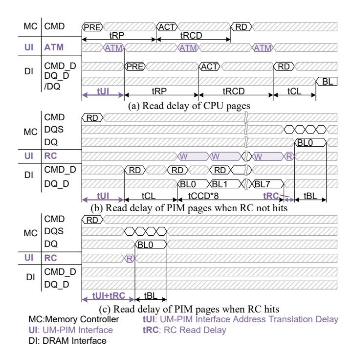

# C. Data Re-layout

In CPU systems, cache line size is designed to be an integer multiple of DRAM burst size. Suppose both the cache line size and DRAM burst size are 64 bytes and the bitwidth of DRAM is 64-bit. Within each burst, the DRAM interface accesses 8 bytes from each device to fully utilize the devicelevel parallelism. For example, as illustrated in Fig. 8, a burst consists of data 00, 10, ..., 70, thereby distributing each cache line across all devices within a rank. However, in PIM chunks, a consecutive 64-byte range is mapped to the same device. For instance, a PIM chunk's cache line comprises data 01, 02, ..., 07. Accessing a complete cache line requires 8 bursts, with each device providing 64 bytes of data. The remaining 7×64 bytes, however, remain unused, resulting in a wastage of memory bus bandwidth and requiring CPU intervention to filter out these unused cache lines. Therefore, we propose to add an RC module to filter the contiguous 64 bytes on the DRAM side, preserving memory bus bandwidth and mitigating the need for CPU involvement.

RC. The RC circuits are placed between the memory bus and the data signal line of the DRAM interface and is integrated into the DIMM buffer [38]. With a burst length of 8 and a bit width of 64, each RC contains eight subbuffers (SB), each consisting of 8 cells that store 8B data, as depicted in Fig. 8 (a). Fig. 8 (b) shows an example of reading a cache line from the third DRAM device (DE=3), and Fig. 9 (b) depicts the timing. The ATM circuit converts the column address *CO* from the memory controller into the real column address *CO*\_D. Note that the lower 3 bits of

Fig. 9. Timing of UM-PIM interface.

 $CO\_D$  are zero, as mentioned in section IV-A2. After that, the CG generates 8 burst access (BL) commands from column  $CO\_D$  to  $CO\_D+7$ . At the end of each burst, the MUX1 of every SB is selected by the BL number. That means the 64 bytes of  $i^{\rm th}$  burst are write to the  $i^{\rm th}$  SB ( $i=0,\ldots,7$ ). After the 8 BLs, the SBs are filled up. Then DE signal is used to select MUX2 and the  $3^{\rm rd}$  cells of each SB are pushed to the memory bus and transferred to the CPU side.

The RC enables fast data re-layout and filtering on the DRAM side without the participation of the CPU. However, it does not prevent DRAM from reading out redundant bytes and storing them in RC. We adopt a delayed update scheme to improve the possibility of making use of the redundant bytes already fetched in the RC. Fig. 9 (c) shows the timing when data is already fetched into RC. When accessing data from PIM chunks, CG first checks whether the data is already fetched in RC by comparing the row, bank, and column addresses. If the data is already fetched, then CG can directly initiate the burst transfer by reading from RC which saves tCL time. In section V we further describe how to best utilize RCs in software.

Since PIM units from different DRAM devices do not have shared memory, the broadcast operation is widely used when CPUs divide PIM tasks. We provide a broadcast mode in RC to reduce the amount of data transferred from the CPU. The broadcast mode is shown in Fig. 8 (b). In broadcast mode, the 64 bytes are written to every cell of the sub-buffers. After that, the 64 bytes are immediately written back to DRAM devices. Broadcast mode can save the memory bandwidth because only one burst is transferred and the same data block is avoided to be transferred multiple times.

TABLE II DRAM-PIM INSTRUCTION EXTENSION.

| Command   Parameter |           | description                         |  |  |  |
|---------------------|-----------|-------------------------------------|--|--|--|
| ACN                 | Chunk No. | Append chunk number to RCL & PCL    |  |  |  |
| CCL                 | -         | Clear RCL & PCL                     |  |  |  |
| CRC                 | -         | Write data in RC back to DRAM banks |  |  |  |
| BCM true/false      |           | Set/Unset RC broadcast mode         |  |  |  |

| Scatter (a)  PIM 0  PIM 1  PIM 2  PIM 3  PIM 3  PIM 0  PIM 0  PIM 1  PIM 0  PIM 1  For 1 in range(len/64): for p in range(#pim): memcpy(src[p,1], dest[p,1], 64)  For 1 in range(len/64): for p in range(#pim):                                                                                                                                                                                                                                                                                                                                                                                                                                                                                                                                                                                                                                                                                                                                                                                                                                                                                                                                                                                                                                                                                                                                                                                                                                                                                                                                                                                                                                                                                                                                                                                                                                                                                                                                                                                                                                                                                                               |         |
|-------------------------------------------------------------------------------------------------------------------------------------------------------------------------------------------------------------------------------------------------------------------------------------------------------------------------------------------------------------------------------------------------------------------------------------------------------------------------------------------------------------------------------------------------------------------------------------------------------------------------------------------------------------------------------------------------------------------------------------------------------------------------------------------------------------------------------------------------------------------------------------------------------------------------------------------------------------------------------------------------------------------------------------------------------------------------------------------------------------------------------------------------------------------------------------------------------------------------------------------------------------------------------------------------------------------------------------------------------------------------------------------------------------------------------------------------------------------------------------------------------------------------------------------------------------------------------------------------------------------------------------------------------------------------------------------------------------------------------------------------------------------------------------------------------------------------------------------------------------------------------------------------------------------------------------------------------------------------------------------------------------------------------------------------------------------------------------------------------------------------------|---------|
| for p in range(#pim): memcpy(src[p,1], dest[p,1], 64)  PIM 3  PIM 0  PIM 1  For l in range(len/64): for p in range(#pim): memcpy(src[p,1], dest[p,1], 64)                                                                                                                                                                                                                                                                                                                                                                                                                                                                                                                                                                                                                                                                                                                                                                                                                                                                                                                                                                                                                                                                                                                                                                                                                                                                                                                                                                                                                                                                                                                                                                                                                                                                                                                                                                                                                                                                                                                                                                     |         |
| PIM 0 PIM 1 PIM 0 PIM 1 PIM 0 PIM 1 PIM 0 PIM 1 PIM 1 PIM 1 PIM 1 PIM 1 PIM 1 PIM 1 PIM 1 PIM 1 PIM 1 PIM 1 PIM 1 PIM 1 PIM 1 PIM 1 PIM 1 PIM 1 PIM 1 PIM 1 PIM 1 PIM 1 PIM 1 PIM 1 PIM 1 PIM 1 PIM 1 PIM 1 PIM 1 PIM 1 PIM 1 PIM 1 PIM 1 PIM 1 PIM 1 PIM 1 PIM 1 PIM 1 PIM 1 PIM 1 PIM 1 PIM 1 PIM 1 PIM 1 PIM 1 PIM 1 PIM 1 PIM 1 PIM 1 PIM 1 PIM 1 PIM 1 PIM 1 PIM 1 PIM 1 PIM 1 PIM 1 PIM 1 PIM 1 PIM 1 PIM 1 PIM 1 PIM 1 PIM 1 PIM 1 PIM 1 PIM 1 PIM 1 PIM 1 PIM 1 PIM 1 PIM 1 PIM 1 PIM 1 PIM 1 PIM 1 PIM 1 PIM 1 PIM 1 PIM 1 PIM 1 PIM 1 PIM 1 PIM 1 PIM 1 PIM 1 PIM 1 PIM 1 PIM 1 PIM 1 PIM 1 PIM 1 PIM 1 PIM 1 PIM 1 PIM 1 PIM 1 PIM 1 PIM 1 PIM 1 PIM 1 PIM 1 PIM 1 PIM 1 PIM 1 PIM 1 PIM 1 PIM 1 PIM 1 PIM 1 PIM 1 PIM 1 PIM 1 PIM 1 PIM 1 PIM 1 PIM 1 PIM 1 PIM 1 PIM 1 PIM 1 PIM 1 PIM 1 PIM 1 PIM 1 PIM 1 PIM 1 PIM 1 PIM 1 PIM 1 PIM 1 PIM 1 PIM 1 PIM 1 PIM 1 PIM 1 PIM 1 PIM 1 PIM 1 PIM 1 PIM 1 PIM 1 PIM 1 PIM 1 PIM 1 PIM 1 PIM 1 PIM 1 PIM 1 PIM 1 PIM 1 PIM 1 PIM 1 PIM 1 PIM 1 PIM 1 PIM 1 PIM 1 PIM 1 PIM 1 PIM 1 PIM 1 PIM 1 PIM 1 PIM 1 PIM 1 PIM 1 PIM 1 PIM 1 PIM 1 PIM 1 PIM 1 PIM 1 PIM 1 PIM 1 PIM 1 PIM 1 PIM 1 PIM 1 PIM 1 PIM 1 PIM 1 PIM 1 PIM 1 PIM 1 PIM 1 PIM 1 PIM 1 PIM 1 PIM 1 PIM 1 PIM 1 PIM 1 PIM 1 PIM 1 PIM 1 PIM 1 PIM 1 PIM 1 PIM 1 PIM 1 PIM 1 PIM 1 PIM 1 PIM 1 PIM 1 PIM 1 PIM 1 PIM 1 PIM 1 PIM 1 PIM 1 PIM 1 PIM 1 PIM 1 PIM 1 PIM 1 PIM 1 PIM 1 PIM 1 PIM 1 PIM 1 PIM 1 PIM 1 PIM 1 PIM 1 PIM 1 PIM 1 PIM 1 PIM 1 PIM 1 PIM 1 PIM 1 PIM 1 PIM 1 PIM 1 PIM 1 PIM 1 PIM 1 PIM 1 PIM 1 PIM 1 PIM 1 PIM 1 PIM 1 PIM 1 PIM 1 PIM 1 PIM 1 PIM 1 PIM 1 PIM 1 PIM 1 PIM 1 PIM 1 PIM 1 PIM 1 PIM 1 PIM 1 PIM 1 PIM 1 PIM 1 PIM 1 PIM 1 PIM 1 PIM 1 PIM 1 PIM 1 PIM 1 PIM 1 PIM 1 PIM 1 PIM 1 PIM 1 PIM 1 PIM 1 PIM 1 PIM 1 PIM 1 PIM 1 PIM 1 PIM 1 PIM 1 PIM 1 PIM 1 PIM 1 PIM 1 PIM 1 PIM 1 PIM 1 PIM 1 PIM 1 PIM 1 PIM 1 PIM 1 PIM 1 PIM 1 PIM 1 PIM 1 PIM 1 PIM 1 PIM 1 PIM 1 PIM 1 PIM 1 PIM 1 PIM 1 PIM 1 PIM 1 PIM 1 PIM 1 PIM 1 PIM 1 PIM 1 PIM 1 PIM 1 PIM 1 PIM 1 PIM 1 PIM 1 PIM 1 PIM 1 PIM 1 PIM 1 PIM 1 PIM 1 PIM 1 PIM 1 PIM 1 PIM 1 PIM 1 PIM 1 PIM 1 PIM 1 PIM 1 |         |
| PIM 0 PIM 0 PIM 1 For 1 in range(len/64):                                                                                                                                                                                                                                                                                                                                                                                                                                                                                                                                                                                                                                                                                                                                                                                                                                                                                                                                                                                                                                                                                                                                                                                                                                                                                                                                                                                                                                                                                                                                                                                                                                                                                                                                                                                                                                                                                                                                                                                                                                                                                     |         |
| Broadcast For 1 in range(len/64):                                                                                                                                                                                                                                                                                                                                                                                                                                                                                                                                                                                                                                                                                                                                                                                                                                                                                                                                                                                                                                                                                                                                                                                                                                                                                                                                                                                                                                                                                                                                                                                                                                                                                                                                                                                                                                                                                                                                                                                                                                                                                             |         |
| Broadcast                                                                                                                                                                                                                                                                                                                                                                                                                                                                                                                                                                                                                                                                                                                                                                                                                                                                                                                                                                                                                                                                                                                                                                                                                                                                                                                                                                                                                                                                                                                                                                                                                                                                                                                                                                                                                                                                                                                                                                                                                                                                                                                     |         |
|                                                                                                                                                                                                                                                                                                                                                                                                                                                                                                                                                                                                                                                                                                                                                                                                                                                                                                                                                                                                                                                                                                                                                                                                                                                                                                                                                                                                                                                                                                                                                                                                                                                                                                                                                                                                                                                                                                                                                                                                                                                                                                                               |         |
| (b) PIM 2                                                                                                                                                                                                                                                                                                                                                                                                                                                                                                                                                                                                                                                                                                                                                                                                                                                                                                                                                                                                                                                                                                                                                                                                                                                                                                                                                                                                                                                                                                                                                                                                                                                                                                                                                                                                                                                                                                                                                                                                                                                                                                                     |         |
| PIM 3 PIM 3                                                                                                                                                                                                                                                                                                                                                                                                                                                                                                                                                                                                                                                                                                                                                                                                                                                                                                                                                                                                                                                                                                                                                                                                                                                                                                                                                                                                                                                                                                                                                                                                                                                                                                                                                                                                                                                                                                                                                                                                                                                                                                                   |         |
| PIM 0                                                                                                                                                                                                                                                                                                                                                                                                                                                                                                                                                                                                                                                                                                                                                                                                                                                                                                                                                                                                                                                                                                                                                                                                                                                                                                                                                                                                                                                                                                                                                                                                                                                                                                                                                                                                                                                                                                                                                                                                                                                                                                                         |         |
| Gather PIM 1 for 1 in range(len/64):                                                                                                                                                                                                                                                                                                                                                                                                                                                                                                                                                                                                                                                                                                                                                                                                                                                                                                                                                                                                                                                                                                                                                                                                                                                                                                                                                                                                                                                                                                                                                                                                                                                                                                                                                                                                                                                                                                                                                                                                                                                                                          |         |
| for p in range(#pim):  (c) PIM 2 memcpy(dest[p,1], src[p,1], 64)                                                                                                                                                                                                                                                                                                                                                                                                                                                                                                                                                                                                                                                                                                                                                                                                                                                                                                                                                                                                                                                                                                                                                                                                                                                                                                                                                                                                                                                                                                                                                                                                                                                                                                                                                                                                                                                                                                                                                                                                                                                              |         |
| PIM 3 4                                                                                                                                                                                                                                                                                                                                                                                                                                                                                                                                                                                                                                                                                                                                                                                                                                                                                                                                                                                                                                                                                                                                                                                                                                                                                                                                                                                                                                                                                                                                                                                                                                                                                                                                                                                                                                                                                                                                                                                                                                                                                                                       |         |
| PIM 0 for l in range(len/64): for br in range(#bank):                                                                                                                                                                                                                                                                                                                                                                                                                                                                                                                                                                                                                                                                                                                                                                                                                                                                                                                                                                                                                                                                                                                                                                                                                                                                                                                                                                                                                                                                                                                                                                                                                                                                                                                                                                                                                                                                                                                                                                                                                                                                      |         |
| All-Gather PIM 1 for dr in range(8):                                                                                                                                                                                                                                                                                                                                                                                                                                                                                                                                                                                                                                                                                                                                                                                                                                                                                                                                                                                                                                                                                                                                                                                                                                                                                                                                                                                                                                                                                                                                                                                                                                                                                                                                                                                                                                                                                                                                                                                                                                                                                          |         |
| (d) PIM 2 for bw in range(#bank):                                                                                                                                                                                                                                                                                                                                                                                                                                                                                                                                                                                                                                                                                                                                                                                                                                                                                                                                                                                                                                                                                                                                                                                                                                                                                                                                                                                                                                                                                                                                                                                                                                                                                                                                                                                                                                                                                                                                                                                                                                                                                             |         |
| PIM 3 for dw in range(8): memcpy(dest[bw, dw, (br*8+dr                                                                                                                                                                                                                                                                                                                                                                                                                                                                                                                                                                                                                                                                                                                                                                                                                                                                                                                                                                                                                                                                                                                                                                                                                                                                                                                                                                                                                                                                                                                                                                                                                                                                                                                                                                                                                                                                                                                                                                                                                                                                     | \*c±11  |
| □⊕ src[br, dr, 1], 64)                                                                                                                                                                                                                                                                                                                                                                                                                                                                                                                                                                                                                                                                                                                                                                                                                                                                                                                                                                                                                                                                                                                                                                                                                                                                                                                                                                                                                                                                                                                                                                                                                                                                                                                                                                                                                                                                                                                                                                                                                                                                                                        | , 3.1], |
| PIM 0 for i in range(I):                                                                                                                                                                                                                                                                                                                                                                                                                                                                                                                                                                                                                                                                                                                                                                                                                                                                                                                                                                                                                                                                                                                                                                                                                                                                                                                                                                                                                                                                                                                                                                                                                                                                                                                                                                                                                                                                                                                                                                                                                                                                                                      |         |
| General PIM 1 for j in range(J):                                                                                                                                                                                                                                                                                                                                                                                                                                                                                                                                                                                                                                                                                                                                                                                                                                                                                                                                                                                                                                                                                                                                                                                                                                                                                                                                                                                                                                                                                                                                                                                                                                                                                                                                                                                                                                                                                                                                                                                                                                                                                              |         |
| Traversal PIM 2 dest[i,j,]=f(src1[i,j,],                                                                                                                                                                                                                                                                                                                                                                                                                                                                                                                                                                                                                                                                                                                                                                                                                                                                                                                                                                                                                                                                                                                                                                                                                                                                                                                                                                                                                                                                                                                                                                                                                                                                                                                                                                                                                                                                                                                                                                                                                                                                                      |         |
| (e) Src2[i,j,],)                                                                                                                                                                                                                                                                                                                                                                                                                                                                                                                                                                                                                                                                                                                                                                                                                                                                                                                                                                                                                                                                                                                                                                                                                                                                                                                                                                                                                                                                                                                                                                                                                                                                                                                                                                                                                                                                                                                                                                                                                                                                                                              |         |

Fig. 10. Inter-PIM-unit communication and CPU traversal on the results of the PIM computation.

#### D. Instruction Support

In this subsection, we present the instructions to support CPU management on DRAM-side address mapping and data arrangement. They are summarized in TABLE II. Note that these instructions are not extended in the CPU core, but use MMIO [14] to configure and interact with the UM-PIM interface. The ACN and CCL instructions are responsible for managing the RCL and PCL, respectively. ACN appends a 9-bit CPN item to PCL and RCL when a new PIM chunk is allocated. On the other hand, CCL clears the chunk lists when the program is terminated. The CRC and BCM instructions are used to manage the RC. CRC flushes data in RC to DRAM banks, to avoid desynchronization problems caused by the delayed update strategy. Instruction BCM sets RC into broadcast mode.

