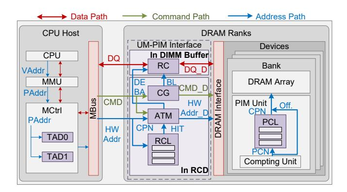
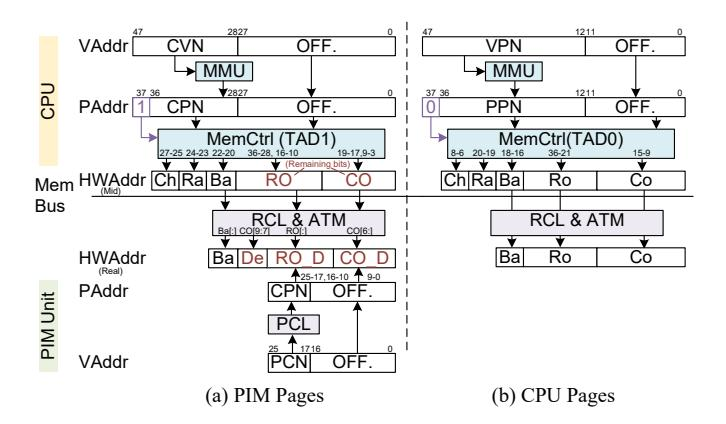

# IV. HARDWARE SUPPORT

In this section, we present UM-PIM's hardware support for UM-PIM. For CPU-side address mapping and data re-layout, we configure the memory controller on the CPU side through BIOS and insert hardware modules, i.e. UM-PIM interface, between the DRAM interface and the memory bus. In UM-PIM interface, Rank Chunk List (RCL), Address Translation Module (ATM), and Command Generator (CG) are responsible for address mapping and are integrated into the Registered Clock Driver (RCD) chip. While Re-layout Cache (RC) is for data re-layout and is located in the DIMM buffer chip [38]. For PIM address translation, we introduce a hardware module, PCL inside memory banks and near the PIM unit.

Fig. 6. UM-PIM architecture.

Fig. 7. Address mapping path for PIM and CPU pages.

