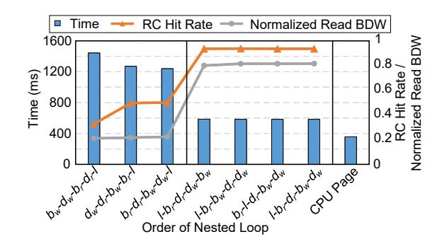

# V. SOFTWARE SUPPORT FOR UM-PIM

In this section, we provide API support for memory management and some specific memory access modes. We present the impact of data traversal order on the CPU side performance. After that, we summarize a principle that can optimize the efficiency of RC data utilization. We also provide APIs for

some specific data transferring between PIM units, i.e. scatter, broadcast, and gather.

#### A. Memory Allocation

For CPU pages, we keep the *malloc()* function in glibc unchanged. For PIM pages, we define a *malloc\_pim(len)* API. This API allocates a block of memory with length *len* for all PIM units. When malloc\_pim API is called, it first decides how many chunks should be allocated according to *len*. After that, the chunks are allocated through system call *mmap()* and mark the chunks as THP through *madvise()*. Since the modern system generally supports demand paging, the CPU needs to access at least one byte from the chunk to make sure that a physical huge page is allocated in DRAM. PIM units cannot handle page fault, therefore, syscall *mlock()* is called to prevent PIM chunks from being swapped out. Finally, it inquires /*proc/pid/pagemap* in Linux to get the PAddr of the chunk and extract CPN from it. The CPN is appended to RCL by sending ACN instruction to UM-PIM interface.

#### B. Speed Distinction of Different Nested Loop Order

After PIM units process all their local data, the computation switches to CPUs for the next computations. This switch mainly occurs in the following situations. First, due to the streamlined design of the PIM units, some complex functions (e.g. transcendental functions [31] [14]) cannot be efficiently calculated on the PIM units. These operations have to be transited to CPUs for calculation. Second, data result interaction between PIM units is required in parallel computing models, e.g. fork-join, after every time period. In either case, the results of the PIM units are traversed by CPUs. The order of traversal on PIM units' results has a considerable impact on the RC hit rate, and results in the distinction on DRAM bandwidth. For example, if we continuously traverse the results in the PIM unit on a single device with configuration in Fig. 2, 8× redundant data are read from DRAM. Although we use RC to filter data to prevent the memory bus from transferring redundant data, this does not change the fact that the bandwidth of a single DRAM traversal operation itself is still only 1/8. We still need a more reasonable traversal order to better utilize the data that has been fetched in RC.

We use a simple example, all-gather, to illustrate the effect of traversal order on access performance. All-Gather reads a block of data from every PIM unit, joins them, and broadcasts to every PIM unit. The loop is shown in Fig. 10 (d). The loop traverses each data block based on the bank, device address, and offset of each data block written. There are 5 nested loops. Where l represents the offset inside the data block,  $b_r$  and  $b_w$  represent the bank address (including channel and rank) of the read and write.  $d_r$  and  $d_w$  represent the read and write device addresses. In each loop, there is a read access and write access. The read operation access from the  $b_r$  bank,  $d_r$  device, and the device address offset is  $l + addr_r$ . Where  $addr_r$  represents the start offset of the reading block. The write operation access from the  $b_w$  bank,  $d_w$  device, and the device offset is  $addr_w + addr_r$ .

Fig. 11. Time, RC hit rate, and read bandwidth (normalized to CPU Page) of all-gather on 8 PIM ranks with different order of nested loop. The data block size is 1024. Left: the order disobeys at least one rule. Middle: the order obeys all the rules. Right: An all-gather operation on CPU pages.

 $(b_r \times 8 + d_r) \times s + l$ . Where  $addr_w$  represents the start offset of the reading block, and s is the block size.

To better utilize the data loaded into RC, we need to keep the traversal on the device address ( $d_r$  and  $d_w$ ) to be the innermost loop. The loop order should satisfy the following conditions. First, for read access, the loop  $b_r$  and l should be outside the loop of  $d_r$ . Second, for write access, the loop l,  $b_r$ , and  $d_r$  should be outside the loop  $d_w$ . Fig. 11 depicts the total time of the all-gather procedure under different orders of nested loop. The simulation setup is described in section VI-A. We can see that the nested loop orders that obey the rule are faster than the others achieve better RC hit rates and result in a higher DRAM read bandwidth. As a result, their overall time is relatively low, and are close to the all-gather operation on CPU pages (only about  $1.6 \times$  slower than CPU pages). General traversal can also use this strategy to improve the access bandwidth on PIM pages (Fig. 10 (e)).

#### C. High-level APIs for Inter-PIM Units Data Transfer

We provide several high-level APIs for some widely-used inter-PIM-unit communication operations whose performances are incredibly affected by RC hit rate. Due to the significant cost of communication between PIM units, existing PIM systems often adopt a fork-join computing mode [14], [41], [45]. Therefore, we adopt communication modes from NCCL [55]. We present the order of nested loop for these modes to better utilize RC hit.

**Scatter.** Scatter reads a contiguous block of data from one DRAM bank, divides it into multiple sub-blocks, and scatters the sub-blocks to every DRAM bank. Therefore, we can place the writings of bursts into the same location of every device into adjacent iterations. Fig. 10(a) presents a scatter of 4 PIM units. The outermost loop l is on the offset of each data block. In each loop, a burst length of data is read from each block, and written to the destination PIM bank. Every rank's RC can buffer the written data of banks from 8 devices and write to the banks together. The RC's locality is fully utilized.

**Broadcast.** Broadcast reads a block of data from one DRAM bank and writes it to all the DRAM banks. Fig. 10(b) depicts a broadcast from PIM 0. Before the broadcast oper-

TABLE III SYSTEM CONFIGURATION

Host CPU Processor 8-Core O3CPU @3.2GHz L1I/L1D 32kB / 32kB, Assoc: 8 L2 / L3 1MB Assoc: 16 / 22MB, Assoc: 22 Cache Line 64 B DRAM DIMM DRAM DDR4-2400, 8×8, 8GB/Rank Ba / De / Ro / Co 8 / 8 / 131072 / 1024 Timing Param. [54] tBURST=3.32ns tRCD=tCL=tRP=14.16ns tRAS=32ns tRRD=3.32ns tXAW=13.328ns tRFC=350ns tWR=15ns tWTR=5ns tXS=340ns tRTP=7.5ns tRTW=tCS=1.666ns tREFI=7.8us PIM Units PIM Unit UPMEM DPU [14] @500MHz, 16 Tasklets Num 64 Per Rank, at Bank level System Configuration CPU System 8 DRAM Channels ×4 Ranks Addr Map: Ro-Ra-Ba-Co-Ch PIM System 1 {4 DRAM Channels, 4 PIM Channels} ×4 Ranks (PIM-Ion) Addr Map: Ro-Ra-Ba-Co-Ch PIM System 2 {4 DRAM Channels, 4 PIM Channels} ×4 Ranks (PIM-Ioff) Addr Map: Ch-Ra-Ro-Ba-Co UM-PIM {4 DRAM Channels, 4 PIM Channels} ×4 Ranks

ation, all the RCs are set to broadcast mode. The outermost loop l is also on the data block offset. For each l, 64-byte data are read from PIM 0's block and write these data to every PIM bank. The broadcast mode of RC can fully utilize the write bursts by writing to all the devices in parallel.

Gather. Gather is a reverse operation of scatter, by reading a block of data from every DRAM bank, gathering them, and writing to one DRAM bank. Like in scatter, the outermost loop l is also on the offset of each data block. In Fig. 10(c), PIM 0 gathers the data from every bank. Similar to Scatter, the RC's locality can be fully utilized as data with the same offset l are read in adjacent iterations.

