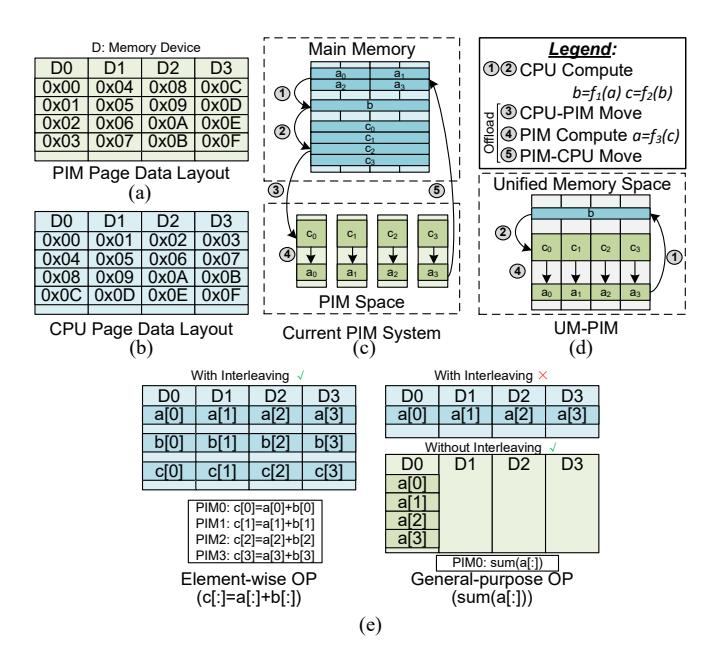
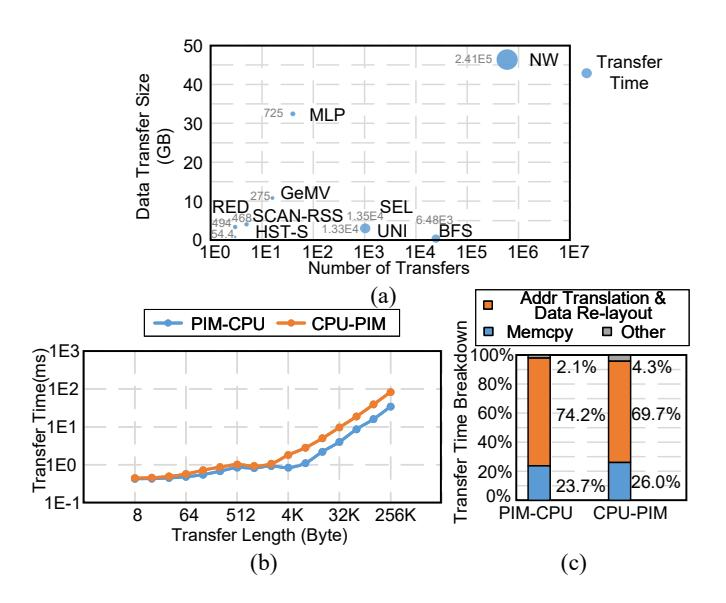
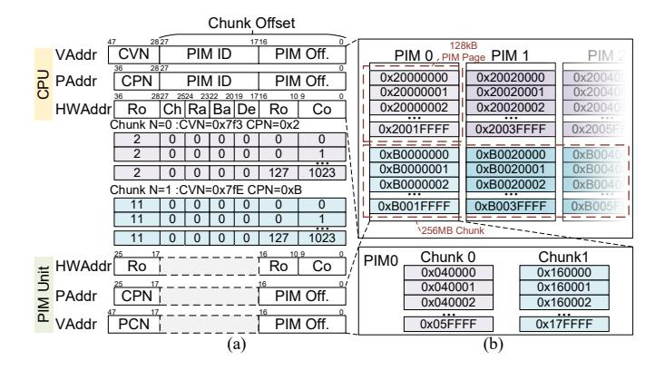

# Yiwei Hu

*Shanghai Jiao Tong University* arikara666@sjtu.edu.cn

Zongwu Wang

*Shanghai Jiao Tong University Shanghai Qi Zhi Institute* wangzongwu@sjtu.edu.cn Han Lin *Huawei Technologies Co. Ltd.* linhan11@huawei.com

Ji Li

*Huawei Technologies Co. Ltd.* liji16@huawei.com

He Xian *Shanghai Qi Zhi Institute* 51265900021@stu.ecnu.edu.cn

Hanlin Dong *Shanghai Qi Zhi Institute*

51265900020@stu.ecnu.edu.cn

Tao Yang

*Shanghai Jiao Tong University* yt594584152@sjtu.edu.cn

Naifeng Jing

sjtuj@sjtu.edu.cn

Xiaoyao Liang

*Shanghai Jiao Tong University Shanghai Jiao Tong University* liang-xy@cs.sjtu.edu.cn

Li Jiang∗

*Shanghai Jiao Tong University Shanghai Qi Zhi Institute Huawei Technologies Co. Ltd.* jiangli@cs.sjtu.edu.cn

*Abstract*—DRAM-based Processing in Memory (PIM) addresses the "memory wall" problem by incorporating computing units (PIM units) into main memory devices for faster and wider local data access. However, critical challenges prevent PIM units from being compatible with existing CPU hosts. Memory interleaving and virtual memory limit the size of contiguous data visible to PIM units that constrains the granularity of PIM tasks. Fine-grained PIM tasks result in significant CPU-PIM offloading overhead, offsetting the speed-up of PIM. Existing PIM systems adopt drastic measures to ensure PIM task offloading efficiency, including isolating PIM memory space and turning off global memory interleaving. These interventions, however, decrease the CPU's memory bandwidth and introduce extra data transfer, leading to an additional "system memory wall". This new "wall" must be eliminated before fully embracing the PIM technology.

In this work, we propose UM-PIM, a PIM system with interleaved CPU pages and non-interleaved PIM pages coexisting in a Uniform and Shared Memory space. UM-PIM enables zero-copy during PIM task offloading and maintains the CPU's memory bandwidth while ensuring PIM offloading efficiency. Firstly, we propose a dual-track memory management mechanism consisting of independent page allocation and address translation for the two kinds of pages, respectively. Second, we design UM-PIM interface hardware on the DIMM (with PIMs) side to provide a dynamic address mapping for accelerating the data re-layout. Finally, we provide APIs to reduce PIM-to-PIM communication overhead by optimizing the CPU's access to PIM pages in different communication modes. We compare UM-PIM with a CPU system and the current PIM systems. Results show

This work was partially supported by the National Natural Science Foundation of China (Grant No. 62072262, 61834006). Fangxin Liu and Li Jiang are the corresponding author.

negligible performance degradation for CPU workloads (<0.1%) on UM-PIM, contrasting with the 25.8% degradation on the current PIM system with memory interleaving switched off. For PIM workloads partitioned to CPU and PIM units, UM-PIM can reduce the CPU time by 4.93×, resulting in an end-to-end 1.96× speedup on average.

*Index Terms*—Processing in Memory (PIM), DRAM, Address Mapping, Data Re-layout.

## I. INTRODUCTION

DRAM-based Process-in-Memory (PIM) is an emerging technology to break the "memory wall" between processing units and DRAM memory, by integrating additional computational components (PIM units) into DRAM main memory. The PIM units are parallelly distributed in various memory hierarchies including cell arrays [13], [26], [60], memory banks [14], [43] or ranks [45]. These PIM units can directly access data stored within their own memory device, bypassing the global memory bus. This allows them to achieve significantly higher bandwidth compared to CPUs connected via the PCIe bus, and CPUs can offload memory-intensive operations to PIM units. The PIM units are usually customized to accelerate specific memory-bounded applications, including graph computing [6], [12], [65], [70], artificial intelligence [1], [5], [19], [39]– [42], [44], [48]–[50], encryption [22], and recommendation systems [37], [38]. As more and more operations are proved to be memory-bounded, general-purpose PIM systems emerge [14], [45], [57]. These systems allow memory-bound program segments of a general program offloaded to PIM units as

Fig. 1. (a) PIM and (b) CPU pages' ideal data layout. (c) Isolated memory space design in existing PIM systems. (d) Proposed uniform & shared memory space for DRAM-based PIM. (e) Element-wise and general-purpose operations with/without memory interleaving.

*PIM tasks* while keeping compute-bound segments remain executed by CPUs. Therefore, the compatibility of these general-purpose PIM systems with host CPUs becomes critical to ensure seamless cooperation and communication between CPUs and PIM units.

Modern memory management of computer systems limits the size of contiguous data blocks visible to PIM units for the following two reasons: (i) **Virtual Memory.** The operating system transparently maps virtual memory pages to physical pages according to memory-allocating algorithms. There is no guarantee that adjacent virtual pages reside on the same memory device, resulting in fragmenting contiguous data across multiple locations. (ii) **Memory Interleaving:** To maximize CPU bandwidth, a contiguous data page is partitioned into smaller segments and interleaved across memory devices, as shown in Fig. 1 (b). Under this data layout, the PIM unit in one memory device cannot access a contiguous portion of data. For example, bank-level PIM units cannot access even adjacent bytes within a data structure.

When offloading PIM tasks, the CPU needs to take a series of actions, including context switching [67] and locking memory regions [63]. For certain general-purpose PIM systems, this offloading overhead is even more than  $50\mu s$  [14]. The existence of offloading overhead results in PIM units having to process more data at each offload to amortize the cost. This requires PIM units to be visible to a longer contiguous data block (like in Fig. 1 (a)), which contradicts modern memory management strategies. To ensure the PIM units work efficiently, current PIM systems take the following extreme measures.

TABLE I EXISTING MEASURES FOR PIM OFFLOADING EFFICIENCY.

| Architecture    | Operation | Compa- tibility | Shared Memory Space | Interl- eaving | Re-layout Overhead |
|-----------------|-----------|--------------------|---------------------------|-------------------|-----------------------|
| TensorDIMM [44] | Tensor    | ✓                  | ×                         | ✓                 | -                     |
| Chopim [9]      | Vector    | ×                  | $\checkmark$              | $\checkmark$      | -                     |
| RecNMP [37]     | SLS       | ×                  | $\checkmark$              | $\checkmark$      | -                     |
| PiDRAM [57]     | Clone     | ×                  | $\checkmark$              | $\checkmark$      | -                     |
| MetaNMP [6]     | Graph     | $\checkmark$       | ×                         | $\checkmark$      | H                     |
| PIM-HBM [41]    | GEMM      | $\checkmark$       | ×                         | $\checkmark$      | H                     |
| AxDIMM [45]     | General   | ✓                  | ×                         | ×                 | -                     |
| UPMEM [14]      | General   | ✓                  | ×                         | ×                 | M                     |
| UM-PIM          | General   | ✓                  | ✓                         | ✓                 | L                     |

- Isolated memory space. A dedicated memory space (PIM space) is isolated from main memory for PIM units, as shown in Fig. 1(c) [14], [15], [38]. The CPU accesses the PIM space using a specific physical address, allowing data to be manually located in a specific memory module However, data is transferred between the two memory spaces through the memory bus (Steps 3 and 5) when the CPU offloads PIM tasks. This implies that an extra "memory wall" is introduced between the two isolated memory spaces.
- Software data re-layout. Data is re-layouted by CPU to ensure that a contiguous block of data is written to the same memory module [14], [15], [38], [41]. This further increases the offloading overhead. The overhead of this data transfer is over 90% on tasks with frequent, finegrained data re-layout, e.g. BFS and NW, based on an exhaustive evaluation of a real PIM system [24].
- Globally turning off memory interleaving. Some of the PIM systems turn off the memory interleaving globally to reduce the data re-layout overhead of rank and channel level [14], [45]. However, this approach reduces the CPU's memory bandwidth, aggravating the "memory wall" between the CPU and DRAM memory.

Existing PIM systems adopt different strategies for the three measures based on the feature of PIM tasks. TABLE I summarizes their measures for PIM offloading efficiency. Chopim [9], RecNMP [37], and PiDRAM [57] maintain a shared memory space by modifying the Operating System (OS) or memory controller, resulting in incompatibility with existing host CPUs. Moreover, these three PIM systems are dedicated to element-wise operations. As illustrated in Fig.1 (e), PIM units can directly process elements that are distributed across their devices in such operations. Consequently, a contiguous block of data is not essential for their functioning. Turning on memory interleaving does not damage PIM task offloading granularity. Therefore, they choose to turn on the global memory interleaving without requiring additional adjustments. In contrast, PIM units designed for other operations require a longer contiguous data block [6], [41]. These systems opt to utilize software for data re-layout or switch off memory interleaving. General-purpose PIM systems [14], [45] prioritize compatibility with the host CPU while maintaining coarse offloading granularity. These systems tend to take all the three measures

To truly break the "walls", we propose a new memory management strategy to achieve a uniform & shared memory space in a general-purpose heterogeneous CPU-PIM system, as depicted in Fig. 1(d). The CPU pages and PIM pages, with different address mapping (Fig. 1(a, b)), co-exist in the memory space, and CPUs can access both kinds of pages efficiently. This memory management strategy fulfills the requirements of PIM units for contiguous data layout while avoiding the consequences of the above extreme measures:

- By maintaining a uniform & shared memory space, zerocopy is enabled when CPUs access PIM pages. As shown in Fig. 1(d), steps for data transferring, 3 and 5, are eliminated.
- CPUs can access PIM pages efficiently and transparently without explicit address translation and data re-layout.
- CPU bandwidth remains not damaged because CPU pages can still use state-of-the-art address interleaving techniques.

To ensure compatibility with existing hardware and OS, it is necessary for the proposed approach to address the following challenges.

- A uniform memory address space requires the PIM unit to share the virtual address space managed by the CPU.
   Maintaining adjacent virtual pages locally in PIM local memory without modifying the OS is necessary.
- It is necessary to design an efficient dynamic address mapping that supports CPU and PIM pages with different data layouts.
- The non-interleaved data layout in PIM pages incurs bank conflicts when host CPUs access the PIM pages and degrades the CPU's bandwidth. Efforts should also be made to enhance CPU bandwidth when accessing PIM pages.
- Modifications should primarily focus on the DRAM side to maintain compatibility with existing CPUs and motherboards.

In this work, we propose UM-PIM, a general-purpose PIM system with uniform & shared memory space and dual-track address mapping for the two kinds of memory pages. The existing memory allocation and address mapping rules for CPU pages are kept unchanged to ensure compatibility. For PIM pages, we propose a chunk-based memory management, so as to enable PIM's virtual-to-physical address translation at a relatively low overhead. We insert a UM-PIM interface that consists of hardware modules for efficient address mapping for CPU accessing the two kinds of pages. To improve the bandwidth for accessing PIM pages, we integrate a dedicated hardware module in the DIMM buffer for data re-layout and provide communication API for efficient data transferring. All the hardware modifications are limited to the DRAM side.

The main contributions of this paper are:

Fig. 2. Data address arrangement inside one memory bank (ChRaBaDe=0) and memory mapping rule for (a) CPU systems with global memory interleaving switched on (b) PIM systems with memory interleaving off.

- We delve into the cause of the excessive offload cost of existing PIM systems — the additional memory walls brought by the isolated memory space design.
- We propose UM-PIM, a general-purpose PIM system with uniform & shared memory space, which incorporates a dual-track memory management mechanism along with dedicated hardware support.
- We provide high-level APIs, similar to NCCL communication APIs [55], which optimize the inter-PIM-unit communication efficiency leveraging UM-PIM.

#### II. BACKGROUND

#### A. Address Mapping and Memory Interleaving

In modern computer systems, the virtual address (VAddr) is mapped to the DRAM hardware location in two steps. First, the virtual address is translated to the physical address (PAddr) by the Memory Management Unit (MMU). The Virtual Page Number (VPN) is translated to the Physical Page Number (PPN) by the page table, and the page offset is kept unchanged. The page table is managed by the OS and updated in real time when the program allocates memory. After that, the memory controller translates the PAddr to the Hardware Address (HWAddr) to locate the DRAM cells. The mapping rule of this step is determined by the register states of memory controllers and cannot be changed after booting.

Memory interleaving is a technology to improve memory bandwidth. By mapping adjacent data into different DRAM devices, these data can be accessed in parallel. For example, in DDR4, the DRAM hierarchy levels, in descending order of switching overhead, are row, rank, bank, column, and channel [32]. One simplest interleaving scheme is to map lower bits in the address to memory hierarchy levels with lower switching overhead, as shown in Fig. 2(a). For the device level, devices (also known as chips) are grouped together to provide data bus width expansion [33]. Individual devices are not separately addressable and all the devices of a rank share a common bank address signal line [33]. Therefore, all the devices of a rank can only be accessed simultaneously, and device-level interleaving cannot be controlled through CPU-side address mapping.

Sophisticated address interleaving strategies are used in practice to adapt different accessing patterns of programs [10],

[28], [58], [64], [68]. They utilize the XNOR result of certain address segments to choose the DRAM banks. Nevertheless, they all depend on the high-order bits of PAddr to select rows due to significant row-switching overhead. Additionally, they scatter contiguous data blocks across different banks and devices as opposed to PIM's preference.

In contrast with CPUs, general-purpose PIM units require that they are visible to a contiguous block of data in their own memory. Therefore, the ideal address mapping of PIM units is as shown in Fig. 2 (b). The lower memory hierarchy addresses are mapped to lower-order address bits so that the PAddr inside a DRAM device is contiguous. This requirement contradicts the CPUs' requirement for memory interleaving. Current general-purpose PIM systems adopt a software-only approach to simulate the address mapping for PIM units. They allocate or reserve a large block of contiguous physical address as PIM memory space and lay out the data in PIM memory space with CPU software [14], [41], [63]. IMPICA [30] proposes to use huge pages to reduce the address translation overhead in PIM memory space. However, due to the byte-level memory interleaving in DRAM, these software-only methods introduce significant data re-layout and address mapping overhead.

#### B. Data Transfer Overhead in DRAM-based PIM

As we mention in section I, the CPU needs to transfer and re-layout data before and after CPU offloading PIM tasks. To reduce the data re-layout overhead, some works choose to turn off the memory interleave of DRAM's highlevel hierarchies (e.g. channel and rank) through BIOS [14], [18], [45]. However, the memory interleaving of lower-level hierarchies (e.g. device) cannot be turned off with BIOS. We measure the transfer time with UPMEM SDK [63], whose PIM units are at DDR4's bank level. In UPMEM, the channel and rank level interleaving is switched off, and the software stack is only responsible for bank and lower levels data layout and address translation. Fig. 3(c) depicts the breakdown of the data transfer time. Besides the memory copy, address translation and data re-layout account for nearly 70% of the total transfer time. They provide multi-thread API to accelerate the above data transfer. However, this introduces a fixed preparation time for each transfer and leads to a non-negligible impact when the length of a single transfer is short. As shown in Fig. 3(b), the transfer time is almost fixed when the length of a single transfer is less than 4 kB. Fig. 3(a) depicts the total transfer size and the number of transfers of different applications. When the total amount of transferred data is similar, the applications with more and shorter transfers, e.g. NW, BFS, and UNI, have a more significant transfer time. Therefore, for general-purpose PIM systems, it is necessary to eliminate data transfer between the PIM and CPU memory spaces and accelerate address mapping and data re-layout.

B. Li et. al. [46] compare the address translation overhead of hardware and software methods, finding that the hardware approach reduced overhead by  $4.5\times$ . Therefore, a hardware solution is necessary to reduce the dynamical address mapping overhead in the PIM system.

Fig. 3. (a) Transfer time of benchmarks. (b) Transfer time across different sizes of a single transfer (contiguous data). (c) Time breakdown of Data transfer (length = 256KB). Measured with UPMEM SDK [63].

#### C. Previous Dynamic Memory Mapping Schemes

Dynamic memory address mapping is widely researched in CPU systems. DReAM [20] and PAE [51] add hardware on the DRAM memory side to dynamically recognize the optimal address mapping and transparently change the address mapping method. The host CPU does not know the physical address of DRAM devices and the physical addresses of devices always change. Their approach cannot be applied to the PIM system. The transparency makes the host CPU hardly guarantee that the operands of the same PIM unit are mapped to the same DRAM device, and thus the PIM unit can not work. Multiple physical mappings [29] introduce address alias of the memory space with multiple address mapping rules by configuring the memory controllers. J. Zhang et. al. [71] provide a software-defined dynamical address mapping by integrating additional hardware on the CPU side. However, due to the limitation of memory controller hardware, only the interleaving of hierarchies above the bank level can be controlled by these two technologies. Moreover, the method in [71] completely modifies the memory management model and is not well-compatible with existing CPU host hardware and OS. Therefore, it is imperative to enable control over the interleaving of all DRAM hierarchy levels by modifying only the DRAM-side hardware.

#### III. DUAL-TRACK MEMORY MANAGEMENT

In this work, we propose UM-PIM, a uniform memory management for PIM-DRAM. The key insight is to enable both CPUs and PIM units to share a uniform virtual and physical address space. For CPU pages, we keep the current management and address mapping rules to guarantee CPU bandwidth. The memory address interleaving is switched on by configuring BIOS and the MMU is also enabled to handle

Fig. 4. Chunk-based management for PIM pages. (a) Address mapping. (b) Data layout.

virtual address translations. For PIM pages, we propose a chunk-based memory management strategy, enabling the PIM units to implement virtual-physical address translation at an acceptable cost while ensuring the localization requirement of PIM units. We present our approach for PIM systems with PIM units at the DRAM bank level. Note that for other PIM systems with PIM units located at higher DRAM hierarchy levels, the same aim can be achieved by streamlining our method, as fewer hierarchy levels participate in the address translation. We provide the discussion in section VII.

#### A. Chunk-based Memory Management for PIM Pages.

On the software side of UM-PIM system, the key idea to prevent OS from randomly mapping PIM pages is to enforce a uniform distribution of PIM pages across all PIM local memory devices. We thereby present a chunk-based address management for PIM's pages.

A chunk is a large block in virtual address space, which is mapped to a contiguous block of physical address space. In Linux, the chunk can be allocated through the transparent huge page (THP). As mentioned in section II-A, most interleaving strategies map the Row address to the highest-order bits of the physical address. Under this observation, if the chunk size  $(S_C)$  is large enough  $(S_C \geq Main memory capacity / Row$ number), with the global memory interleave switched on, all the PIM pages of a chunk are evenly distributed to all the memory banks. For example, the memory system configuration shown in Fig. 2 comprises 8 channels, 4 ranks per channel, 8 banks, and 8 devices per rank. If the chunk size is set to 256 MB, then each bank will contribute  $S_B = S_C/(8 \times 4 \times 4 \times 4 \times 4 \times 4 \times 4 \times 4 \times 4 \times 4 \times$  $8 \times 8$ )=128 KB data, i.e., the PIM page size. This means that whenever a PIM chunk is allocated, each PIM unit gets a 128KB PIM page in its PIM local memory.

#### B. CPU Addressing PIM Pages.

A preferred data layout inside PIM chunks is shown in Fig. 4 (b), where adjacent addresses are in the same PIM unit's pages in priority inside each chunk. This address arrangement, as depicted in Fig. 4 (a), is achieved by our proposed hardware-based address mapping modules (detailed in section IV-A).

When the host CPU addresses any data byte in a certain PIM unit's local memory, the software needs to know the virtual address. Use Fig. 4 as an example. Two chunks of size  $S_C$ =256 MB are allocated. Bits 27-0 of VAddr indicate the chunk offset and are kept unchanged when mapped to PAddr. We name bits 47-28 of VAddr as Chunk Virtual Number (CVN), used to determine whether the CPU is accessing a PIM chuck. The two chunks CVN=0x7f3 and 0x7fE are mapped to PAddr with bits 36-28 equal to 0x2 and 0xB. We name these bits of PAddr as Chunk Physical Number (CPN), used for the hardware to judge whether CPU is accessing a PIM page. Bits 27-17 in chunk offset of PAddr and VAddr are mapped sequentially to channel, rank, bank, and device. These bits represent the location of the PIM unit (PIM unit ID), used for software to determine which PIM unit's local memory CPU is accessing. Meanwhile, bits 16-0 are mapped to the Row and Column inside the 128 kB PIM pages, referred to as the offset within the PIM page (PIM offset).

In practice, the 128 kB PIM page size might not be enough for PIM tasks, so multiple chunks are allocated. The CPU host program records the CVNs of the chunks in an array CVNs.

Suppose the CPU host program needs to locate the  $k^{\rm th}$  bytes (e.g., k=0x20002) within the concatenated data of all the PIM pages in PIM unit i=0, CPU can first derive which Chunk the address belongs to (N), and the PIM offset (off) by:

$$N = k/S_B = 1, of f = k \bmod S_B = 2 \tag{1}$$

and then computes the virtual address of this byte by:

$$VAddr = CVNs[N] << 28 + i \times S_B + off$$
 (2)  
= 0x7fE0000002 (3)

This VAddr is further translated to PAddr 0xB0000002 by CPU-side page table and mapped to the HWAddr by address mapping modules.

