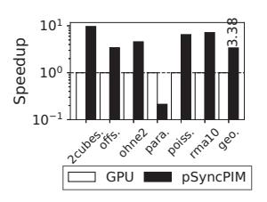
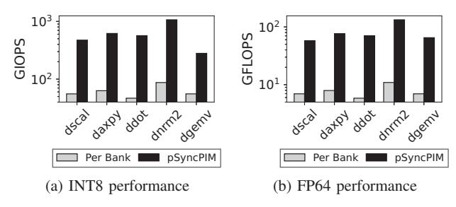

# 3) Solve lower half part $L_1x_1 = b_1'$ (Recursive SpTRSV)

This technique makes it possible to solve sparse triangular matrices of arbitrary sizes by implementing a limited-size SpTRSV kernel and a combination of SpMV kernels for most square submatrices inside the triangular matrix.

#### B. Memory Mapping of Sparse Triangular Matrix for SpTRSV

As explained before, we divide the triangular matrices recursively until the size of the generated subtriangular matrices fits in a memory row size to utilize the block algorithm of SpTRSV. When the size of a memory row is 256KB, the maximum number of rows and columns with the double-precision floating-point is 32,768. While square submatrices use SpMV mapping in memory, triangular matrices need a different mapping strategy. For memory mapping of unitriangular matrices, we excluded the diagonals with ones for efficiency. More formally, the memory stores L\*=L-I and U\*=U-I triangular matrices in memory, where I represents the identity matrix. While the physical memory representation omits diagonal elements, our SpTRSV kernel implementation assumes all elements in the diagonal are 1.

Triangular matrices  $L^*$  and  $U^*$  are stored in the column-first COO format in the memory (i.e., non-zero values are sorted in column-major). These triangular matrices are cut into rows evenly for distributing workloads and mapped into each memory bank, as shown in Figure 7. In addition, the triangular matrices are cut into several batches column-wise for each memory row for each bank in the preprocessing step. All non-zeros in each batch across all banks are in the same memory row. Since the distribution of non-zero elements is typically uneven, each batch generally has different numbers of column vectors.

## C. Execution Algorithm of SpTRSV Kernel

While the SpMV kernel can compute most parts of the sparse triangular matrix, a unique SpTRSV subroutine implementation must be provided for triangular submatrices at the diagonal. We apply a scalar multiplication-based algorithm instead of the conventional dot product-based SpTRSV algorithm (Algorithm 1) to avoid random and remote bank accesses on the distributed input vector. Algorithm 3 describes the proposed algorithm.

Within a column-wise batch of Figure 7, our acceleration scheme divides the batch into several levels where all columns are independent. For each column, pSyncPIM performs the following execution loop:

Algorithm 3 Scalar multiplication-based SpTRSV for a lower unitriangular matrix.

```
1: L: n \times n lower triangular matrix in COO format

2: b: input vector

3: x: output vector

4: for i=0 to n-1 do

5: scale=b[i]

6: for all e=(r_e,i,v_e)\in L where r_e>i do

7: x[r_e]=x[r_e]-scale\times v_e

8: end for

9: end for
```

| Field                       | Value                        |
|-----------------------------|------------------------------|
| Protocol                    | HBM2                         |
| # of bankgroups             | 4                            |
| # of banks per group        | 4                            |
| # of memory rows            | 16384                        |
| # of memory columns         | 64                           |
| # of stacks                 | 8                            |
| # of pseudo-channels        | 16                           |
| Address Mapping             | rorabgbachco (rank is 0 bit) |
| Clock Frequency             | 1GHz                         |
| Timing parameters           | HBM2 default timing          |
| External/Internal Bandwidth | 256GB/s, 2TB/s               |
| Capacity                    | 4GB                          |

TABLE VII: Memory configuration of pSyncPIM.

- 1) Read the input vector elements corresponding to the columns of the level in SB mode.
- Switch to AB mode and broadcast the input elements for each bank.
- 3) Host programs the SpTRSV kernel into pSyncPIM.
- 4) Switch to AB-PIM mode.
- 5) Perform kernel execution for all banks. The kernel executes the lines 6-8 of the Algorithm 3.
- When kernel execution terminates, switch to SB mode for the next level and repeat this process for all batches.

## D. Host-side Preprocessing

Decoupling Division Operations from SpTRSV: The conventional implementations for SpTRSV include division operations on its critical path, where these implementations do not assume all elements in diagonal are not normalized to 1. As executing the division is costly, this study uses incomplete LDU decomposition (ILDU), where the decomposition normalizes the diagonal elements of the sparse unitriangular upper matrix U and generates a diagonal matrix D. The ILDU process stores the diagonal matrix D as  $D^{-1}$  in memory for optimal computation.

**Row Reordering:** For a faster execution of SpTRSV, reducing the number of levels and maximizing the number of rows in a level to process is necessary for *pSyncPIM*. Since it is hard to implement such reordering of rows in PIM architecture, for optimal execution, the host processor should reorder rows to execute multiple independent rows in parallel at the preprocessing step.

| Field                  | Value                                  |
|------------------------|----------------------------------------|
| Datapath Width         | 32B                                    |
| # of ALUs              | INT8: 32, INT16/FP16: 16,              |
|                        | INT32/FP32: 8, INT64/FP64: 4           |
| Clock Frequency        | 250 MHz                                |
| Throughput             | INT8/16/32/64: 25.6/12.8/6.4/3.2 GIOPS |
|                        | FP16/32/64: 12.8/6.4/3.2 GFLOPS        |
| Instruction Registers  | 4B × 32                                |
| Scalar register        | 16B                                    |
| Dense vector registers | 32B × 3                                |
| Sparse vector queues   | 192B × 3                               |

TABLE VIII: Specification of a processing unit per bank.

| Matrix                 | Dimen.    | Density               | Applications |
|------------------------|-----------|-----------------------|--------------|
| 2cubes_sphere [42]     | 101,492   | $1.60 \times 10^{-5}$ | SpTRSV, PCG  |
| amazon0312 [26]        | 400,727   | $1.99 \times 10^{-5}$ | Graphs       |
| bcsstk32 [8]           | 44,609    | $1.01 \times 10^{-3}$ | SpMV         |
| ca-CondMat [26]        | 23,133    | $3.49 \times 10^{-4}$ | Graphs       |
| cant [45]              | 62,451    | $1.03 \times 10^{-3}$ | SpMV         |
| consph [45]            | 83,334    | $8.66 \times 10^{-4}$ | SpMV         |
| crankseg_2 [11]        | 63,838    | $3.47 \times 10^{-3}$ | SpMV         |
| ct20stif [12]          | 52,329    | $9.50 \times 10^{-4}$ | SpMV         |
| email-Enron [26]       | 36,692    | $2.73 \times 10^{-4}$ | Graphs       |
| facebook [26]          | 4,039     | $5.41 \times 10^{-3}$ | Graphs       |
| lhr71 [53]             | 70,304    | $3.02 \times 10^{-4}$ | SpMV         |
| offshore [41]          | 259,789   | $6.29 \times 10^{-5}$ | SpTRSV, PCG  |
| ohne2 [37]             | 181,343   | $2.09 \times 10^{-4}$ | SpMV         |
| p2p-Gnutella31 [26]    | 62,586    | $3.62 \times 10^{-5}$ | Graphs       |
| parabolic_fem [46]     | 525,825   | $1.33 \times 10^{-5}$ | SpTRSV, PCG  |
| pdb1HYS [45]           | 36,417    | $3.28 \times 10^{-3}$ | SpMV         |
| poisson3Da [16]        | 13,514    | $1.93 \times 10^{-3}$ | SpTRSV       |
| pwtk [12]              | 217,918   | $2.43 \times 10^{-4}$ | SpMV         |
| rma10 [5]              | 46,835    | $1.06 \times 10^{-3}$ | SpMV, SpTRSV |
| roadNet-CA [26]        | 1,971,281 | $1.42 \times 10^{-6}$ | Graphs       |
| shipsec1 [6]           | 140,874   | $1.80 \times 10^{-4}$ | SpMV         |
| soc-sign-epinions [26] | 131,828   | $4.84 \times 10^{-5}$ | SpMV         |
| Stanford [22]          | 281,903   | $2.90 \times 10^{-5}$ | SpMV, Graphs |
| webbase-1M [45]        | 1,000,005 | $3.11 \times 10^{-6}$ | SpMV         |
| wiki-Vote [26]         | 8,297     | $1.51 \times 10^{-3}$ | Graphs       |
| xenon2 [34]            | 157,464   | $1.56 \times 10^{-4}$ | SpMV         |

TABLE IX: Specification of sparse matrices for evaluation, collected from SuiteSparse and SNAP datasets [7], [26].

## VII. EVALUATION

#### A. Methodology

We modify the DRAMsim3 [27] simulator with HBM2 configuration to evaluate *pSyncPIM*. Table VII describes the DRAM configuration parameters and Table VIII explains the specifications for the processing unit configuration. *pSyncPIM* includes 256 processing units per memory cube. We implement all the kernels evaluated in *pSyncPIM* in hand-coded PIM assembly. In addition to the PIM architecture, we attach a SpGEMM accelerator core that supports nonsquare SpGEMM [4] for assessing interoperability with *pSyncPIM* when evaluating one real-world benchmark (TC) that includes SpGEMM kernels.

We evaluate *pSyncPIM* with various benchmarks using 26 sparse matrices. Table IX summarizes the information about all sparse matrices used for evaluation. Using these matrices, we assess the performance of the SpMV kernel, the SpTRSV kernel, and the end-to-end performance of seven graph and linear system solve applications introduced in Table II. The


Fig. 8: Speedup of pSyncPIM with SpMV kernels, normalized to the GPU performance. The Y-axis is in log-scale.

last column of Table IX maps each matrix to kernels and real-world benchmarks: *Graphs* indicate graph applications, and *SpTRSV* means the matrix is used on the SpTRSV kernel and P-BiCGStab benchmark. The matrices marked as *PCG* are positive definite matrices used in the P-CG application.

We compare *pSyncPIM* with NVIDIA Geforce RTX 3080 GPU using CUDA, cuSPARSE, and GraphBLAST libraries [30], [31], [48]. Note that our experiments do not use NVIDIA tensor cores, as tensor cores support only structural 2:1 sparsity. GPU performance was measured using wall clock time. To match the wall clock time measurements in GPU, the kernel execution time of *pSyncPIM* includes mode switching and PIM kernel programming overheads. However, the initial sparse matrix mapping times are excluded in both cases.

## B. SpMV Kernels

In addition to GPU, we also compare pSyncPIM with a perbank execution model to evaluate our partially synchronized execution model, and with a standalone asynchronous PIM architecture for SpMV - SpaceA [47], to evaluate the execution efficiency of our all-bank architecture. To match the external memory bandwidth with Geforce RTX 3080 GPU (i.e., 760GB/s), we assess the  $3 \times pSyncPIM$  configuration, with a total of 768GB/s external memory bandwidth.

Figure 8 shows the SpMV performance in Geforce RTX 3080 GPU, SpaceA, and pSyncPIM, its per-bank execution, where one memory command can control only one bank in a channel, and a  $3\times$  scenario. On average, pSyncPIM shows a  $1.96\times$  performance boost over GPU, and  $6.26\times$  performance boost over the per-bank execution model. While Figure 3 shows  $2.74\times$  of the number of memory commands on perbank over all-bank, the additional performance gap between per-bank model and pSyncPIM comes from the bank-level parallelism of all-bank PIM execution.

However, pSyncPIM offers only  $0.56\times$  performance of SpaceA. This is due to the inevitable inefficiency of the synchronized lock-step execution model versus standalone desynchronized executing PIM architecture. Although pSyncPIM does not outperform SpaceA in the majority of workloads, it still has its advantage in two points: pSyncPIM does not require any modification of DRAM communication methods between the host and the memory and covers various sparse tensor kernels including SpTRSV by PIM programming features as well as various precisions, which SpaceA does not support.




(a) Lower triangular matrix

(b) Upper triangular matrix

Fig. 9: Speedup of *pSyncPIM* with SpTRSV kernels, normalized to the GPU performance. The Y-axis is in the log scale.

For example, the notable performance gain of *pSyncPIM* with soc-sign-epinions and Stanford comes from the support of multiple precisions in *pSyncPIM*. While SpaceA covers all benchmark matrices into FP64, *pSyncPIM* can run with the original INT8 data format. Smaller data format reduces the sparse matrix's memory size and each submatrix's replication and remote accumulation factor in each processing unit. Note that bcsstk32 shows significant differences in workloads between banks which incurs no benefit from the reduction of data size: The SpMV kernel with bcsstk32 uses only 101 banks out of 256 banks of *pSyncPIM*, which distills the benefits of parallel execution. This underutilization comes from the distribution algorithm, which focuses on reducing replication and remote accumulations rather than ensuring the evenness of workloads for each processing unit.

In  $3\times$  configuration, *pSyncPIM* shows  $2.26\times$  performance boost over  $1\times$  configuration and  $4.43\times$  performance boost over RTX 3080. Note that due to the uneven distribution of each submatrix in a processing unit, the SpMV performance does not scale linearly.

#### C. SpTRSV Kernels

We evaluate the SpTRSV kernel on six double-precision floating point matrices that describe linear system problems. Figure 9 shows the performance boost of *pSyncPIM* over the cuSPARSE implementation on GPU. Note that Figure 9a shows the SpTRSV performance with lower triangular matrices, and Figure 9b shows the result with upper triangular matrices. In general, *pSyncPIM* outperforms the GPU for most cases except parabolic\_fem. Since parabolic\_fem shows hyper-sparsity on near-diagonal unitriangular submatrices, it becomes overhead for executing SpTRSV in *pSyncPIM*. Moreover, parabolic\_fem shows little data dependency



Fig. 10: Throughput of the per-bank PIM and *pSyncPIM* with dense BLAS kernels. The Y-axis is in log-scale.


Fig. 11: Speedup of *pSyncPIM* with real-world applications, normalized to the GPU performance. The Y-axis is in logscale.

between rows, where the GPU can execute more rows that exceed the memory row size boundary of *pSyncPIM* in parallel. However, even including the parabolic\_fem case, *pSyncPIM* still offers a 3.53× performance boost over cuS-PARSE in geometric mean.

## *D. Dense Matrix and Vector Kernels*

We evaluate five dense BLAS kernels for dense matrix/vector operation performance (throughput) in Figure 10. We use INT8 and FP64 precisions to represent the two ends of extreme cases in data types. In both cases, the kernel with a higher arithmetic intensity (INT8) performs better in both *pSyncPIM* and per-bank PIM. Despite the arithmetic intensity of kernels, *pSyncPIM* shows a notable performance boost over per-bank PIM in general – 9.6× speedup on average. This demonstrates that the performance efficiency of all-bank execution is also present in sparse and dense operations.

## *E. Real World Benchmarks with Accelerator-PIM Integration*

Figure 11 shows the performance comparison between GPU and *pSyncPIM* on five graph applications and two linear system solving algorithms. Note that we run graph applications with GraphBLAST library and CUDA library for the evaluation with GPU, respectively. We measure the performance of GPU with graph applications using GPU\_Timer, a wrapper structure provided by GraphBLAST library. We attach the SpGEMM accelerator [4] to pSyncPIM, in order to run SpGEMM kernels included in TC workload. For graph applications, *pSyncPIM* outperforms GPU by 51.6× in geometric mean. For linear system solving algorithms, *pSyncPIM* has 2.2× performance boost over GPU in geometric mean.


Fig. 12: Breakdown of kernel execution time in real-world applications for GPU and *pSyncPIM* (denoted as PIM). Average is an arithmetic mean.


Fig. 13: Speedup of *pSyncPIM* conjugated with SpGEMM accelerator [4] with TC application, normalized to the performance of accelerator-only configuration.

For further investigation, we compare the portion of execution times of kernels between GPU and *pSyncPIM*, as shown in Figure 12. The significant performance advances of CC and SSSP come from large overheads from GraphBLAST vector operation implementation of GPU, which decreases on *pSyncPIM*. *pSyncPIM* outperforms GPU in SpMV-major applications: 66.3× boost on BFS and 31.8× of PR. This performance boost comes from GraphBLAST code's overheads to support various algebraic structures. While GraphBLAST uses C++ templates and functors to execute various binary operations and data types in the GPU kernel, these additional overheads are understandable [48].

*pSyncPIM* also shows a 1.68× to 2.88× performance boost over GPU for SpTRSV-major linear system solve applications. While the kernel inevitably has limited parallelism due to row dependency, utilizing massive internal memory bandwidth is effective on the SpTRSV kernel.

To investigate the role of *pSyncPIM* within a SpGEMMmajor benchmark (i.e., TC), we compare the performance of TC workload between the SpGEMM accelerator-only scenario and accelerator collaborating with *pSyncPIM*. Figure 13 shows the performance comparison between the accelerator-only and accelerator-*pSyncPIM* systems. For the accelerator-only scenario, the SpGEMM accelerator [4] treats the SpMV kernel as a variant of the nonsquare SpGEMM kernel, which is inefficient. However, with *pSyncPIM*, the accelerator can offload SpMV kernels to the PIM, resulting in 2.0× performance boost. In summary, when the host accelerator is unsuitable for the SpMV kernel, the *pSyncPIM* cooperation offers a significant performance boost over a host-chip-only case.


Fig. 14: Energy consumption of per-bank PIM and pSyncPIM.

#### F. Power & Area Analysis

We estimate the power consumption from the data of Samsung HBM-PIM [24] based on the silicon product, including the power consumption of all-bank mode memory accesses. For ALU power consumption, we use [10] with the reports of HBM-PIM [24]. In addition, we assume that the buffer die's 1024-bit data I/O is turned off on PIM execution mode. We run a modified DRAMsim3 power model simulation with these data on several SpMV benchmarks. Figure 14 shows the energy consumption result between per-bank PIM and pSyncPIM. From this result, pSyncPIM shows an average of 2.67× energy efficiency over per-bank PIM for SpMV due to its shorter execution time. In addition, it has at most 5.0W of power consumption with the SpMV benchmarks, which is low enough for the power limit of HBM2.

For area, based on the HBM-PIM data [24], we analyze the processing unit's area size as 0.967  $mm^2$ . With 32 units per die, the processing unit occupies 30.94  $mm^2$ , and the rest, including the memory banks and the TSV, have 38.05  $mm^2$ . In summary, the total area of pSyncPIM becomes 68.99  $mm^2$ . Table X lists area comparisons with the prior work.

#### VIII. DISCUSSION

**Compilation:** We evaluated the benchmarks on *pSyncPIM* with hand-written PIM kernel assembly codes. To reduce the number of stalls from data dependency and ALU execution latency, we reorder and insert pre-loading inputs into the PIM assembly. We expect that additional compilation techniques could further optimize the codes.

**Supporting Neural Networks:** Our main target in this work is the HPC computation where sparse matrices usually have less than 1% non-zero elements. However, sparse neural networks typically show a density of 10% to 50%. In this case, it is better to represent the sparse metadata with a bitmap, considering the footprint [20]. Section IV-C discussed the minor hardware overhead supporting the bitmap format. Since *pSyncPIM* ISA is a superset of commercial PIMs [23], [24], it is possible to support neural network applications that include sparse and dense layers with our ISA. These neural network applications can use *pSyncPIM* directly by using the BLAS kernels, including the operations on Table III or by using ML-specific wrappers (e.g., cuDNN, MIOpen) invoking the BLAS kernels.

|               | Samsung HBM-PIM | SpaceA      | pSyncPIM    |
|---------------|-----------------|-------------|-------------|
| Baseline Tech | HBM             | HMC         | HBM         |
| Total Area    | $84.4mm^2$      | $48mm^2$    | $68.99mm^2$ |
| # of Stacks   | 4 PIM + 4 HBM   | 8 PIM       | 8 PIM       |
| PE Area       | $22.8mm^{2}$    | $2.333mm^2$ | $30.94mm^2$ |
| Capacity      | 6GB             | 8GB         | 4GB         |

TABLE X: Area comparison of prior work and pSyncPIM.

#### IX. RELATED WORKS

PIM Architectures: AESPA proposed computation of all data in a bank row through a single command, to support the asynchronous execution in all-bank PIM architecture for dense GEMV [21]. NeuPIMs proposed overlapped bank accesses for PIM execution and external near-memory accelerators for large language models, by adding a row buffer in all-bank PIM architecture [18]. Other studies investigated the acceleration of graph processing with PIM. Tesseract is an early work that applies a programmable PIM accelerator based on HMC for large-scale graph processing [2]. GraphP and GraphQ improve PIM-based graph processing with communication and data movement enhances [50], [52].

**SpMV Accelerators:** EIE and MASR proposed the acceleration of SpMV in sparse neural network inference [13], [15]. SIGMA accelerates SpMV in sparse neural network training, considering SpMV as a kind of nonsquare SpGEMM [33]. Sadi et al. proposed an accelerator for graph SpMV workloads based on algorithm-hardware co-optimization [36]. Tensaurus accelerates general sparse-dense tensor multiplications including SpMV, by focusing on a sparse data format [39]. Cerberus investigated the design space of SpMV acceleration with respect to different algorithms and data representations, proposing a multi-mode accelerator to process a wide range of SpMV workloads efficiently [20].

#### X. CONCLUSION

This study proposes *pSyncPIM*, which provides partially synchronous execution in each bank for all-bank PIM architectures. For the irregular execution needed for SpMV and SpTRSV operations, pSyncPIM overcomes the current all-bank control constraint, supporting the standard DRAM interfaces by predicated execution and conditional termination of each processing unit. In addition, it identifies another key kernel, SpTRSV, and proposes an acceleration algorithm with PIM. Using an optimized data compaction and distribution, the new sparse PIM architecture can outperform NVIDIA Geforce RTX 3080 by 4.43× for SpMV and 3.53× for SpTRSV with a similar amount of DRAM bandwidth.

#### ACKNOWLEDGEMENT

This work was supported by the Institute of Information & communications Technology Planning & Evaluation (IITP) (IITP2017-0-00466 SW StarLab and RS-2024-00396013), funded by the Ministry of Science and ICT (MSIT), Korea.

#### REFERENCES

 N. Ahmad, B. Yilmaz, and D. Unat, "A Split Execution Model for SpTRSV," *IEEE Transactions on Parallel and Distributed Systems*, vol. 32, no. 11, pp. 2809–2822, 2021.

- [2] J. Ahn, S. Hong, S. Yoo, O. Mutlu, and K. Choi, "A Scalable Processingin-Memory Accelerator for Parallel Graph Processing," in *Proceedings of the 42nd International Symposium on Computer Architecture (ISCA)*, 2015, pp. 105–117.
- [3] M. Andersch, G. Palmer, R. Krashinsky, N. Stam, V. Mehta, G. Brito, and S. Ramaswamy, "NVIDIA Hopper Architecture In-Depth," https: //developer.nvidia.com/blog/nvidia-hopper-architecture-in-depth/.
- [4] D. Baek, S. Hwang, T. Heo, D. Kim, and J. Huh, "InnerSP: A Memory Efficient Sparse Matrix Multiplication Accelerator with Locality-Aware Inner Product Processing," in *2021 30th International Conference on Parallel Architectures and Compilation Techniques (PACT)*, 2021, pp. 116–128.
- [5] S. Bova, "Model of Charleston Harbor."
- [6] C. Damhaug, "Positive definite matrices."
- [7] T. A. Davis and Y. Hu, "The University of Florida Sparse Matrix Collection," *ACM Transactions on Mathematical Software (TOMS)*, vol. 38, no. 1, pp. 1–25, 2011.
- [8] I. Duff, R. Grimes, and J. Lewis., "The original Harwell-Boeing collection." pp. 1–14, 1989.
- [9] A. Fog, "Lists of instruction latencies, throughputs and micro-operation breakdowns for Intel, AMD, and VIA CPUs," https://www.agner.org/ optimize/instruction tables.pdf, 2022.
- [10] S. Galal and M. Horowitz, "Energy-Efficient Floating-Point Unit Design," *IEEE Transactions on Computers*, vol. 60, no. 7, pp. 913–922, 2011.
- [11] N. Gould, Y. Hu, and J. Scott, "Positive definite matrices," ftp://ftp. numerical.rl.ac.uk/pub/matrices/symmetric/.
- [12] R. Grimes, "Structural engineering matrices."
- [13] U. Gupta, B. Reagen, L. Pentecost, M. Donato, T. Tambe, A. M. Rush, G.-Y. Wei, and D. Brooks, "MASR: A Modular Accelerator for Sparse RNNs," in *2019 28th International Conference on Parallel Architectures and Compilation Techniques (PACT)*, 2019, pp. 1–14.
- [14] S. Hamm, "Semiconductor simulation matrices from."
- [15] S. Han, X. Liu, H. Mao, J. Pu, A. Pedram, M. A. Horowitz, and W. J. Dally, "EIE: Efficient Inference Engine on Compressed Deep Neural Network," in *Proceedings of the 43rd International Symposium on Computer Architecture (ISCA)*, 2016, pp. 243–254.
- [16] O. Hededal and S. Krenk, "FEMLAB: a MATLAB toolbox for the finite element method," https://vbn.aau.dk/en/publications/femlab-amatlab-toolbox-for-the-finite-element-method-version-10, 1995.
- [17] K. Hegde, H. Asghari-Moghaddam, M. Pellauer, N. Crago, A. Jaleel, E. Solomonik, J. Emer, and C. W. Fletcher, "ExTensor: An Accelerator for Sparse Tensor Algebra," in *Proceedings of the 52nd Annual IEEE/ACM International Symposium on Microarchitecture (MICRO'52)*, 2019, p. 319–333.
- [18] G. Heo, S. Lee, J. Cho, H. Choi, S. Lee, H. Ham, G. Kim, D. Mahajan, and J. Park, "NeuPIMs: A NPU-PIM Heterogeneous Acceleration for Batched Inference of Large Language Model," in *Proceedings of the 29th ACM International Conference on Architectural Support for Programming Languages and Operating Systems (ASPLOS'24)*, 2024.
- [19] M. R. Hestenes and E. Stiefel, "Methods of conjugate gradients for solving linear systems," *Journal of research of the National Bureau of Standards*, vol. 49, pp. 409–435, 1952. [Online]. Available: https://api.semanticscholar.org/CorpusID:2207234
- [20] S. Hwang, D. Baek, J. Park, and J. Huh, "Cerberus: Triple Mode Acceleration of Sparse Matrix and Vector Multiplication," *ACM Transactions on Architecture and Code Optimization*, 2024, just Accepted.
- [21] H. Kal, C. Yoo, and W. Ro, "Aespa: Asynchronous execution scheme to exploit bank-level parallelism of processing-in-memory," in *56th IEEE/ACM International Symposium on Microarchitecture (MICRO)*, 2023.
- [22] S. Kamvar, "Stanford Web Matrix," http://www.stanford.edu/ ∼sdkamvar/research.html.
- [23] Y. Kwon, K. Vladimir, N. Kim, W. Shin, J. Won, M. Lee, H. Joo, H. Choi, G. Kim, B. An, J. Kim, J. Lee, I. Kim, J. Park, C. Park, Y. Song, B. Yang, H. Lee, S. Kim, D. Kwon, S. Lee, K. Kim, S. Oh, J. Park, G. Hong, D. Ka, K. Hwang, J. Park, K. Kang, J. Kim, J. Jeon, M. Lee, M. Shin, M. Shin, J. Cha, C. Jung, K. Chang, C. Jeong, E. Lim, I. Park, J. Chun, and S. Hynix, "System Architecture and Software Stack for GDDR6-AiM," in *2022 IEEE Hot Chips 34 Symposium (HCS)*, 2022, pp. 1–25.
- [24] S. Lee, S.-h. Kang, J. Lee, H. Kim, E. Lee, S. Seo, H. Yoon, S. Lee, K. Lim, H. Shin, J. Kim, O. Seongil, A. Iyer, D. Wang, K. Sohn, and N. S. Kim, "Hardware Architecture and Software Stack for PIM

- Based on Commercial DRAM Technology : Industrial Product," in *2021 ACM/IEEE 48th Annual International Symposium on Computer Architecture (ISCA)*, 2021, pp. 43–56.
- [25] M. Lenjani, A. Ahmed, M. Stan, and K. Skadron, "Gearbox: A Case for Supporting Accumulation Dispatching and Hybrid Partitioning in PIM-Based Accelerators," in *Proceedings of the 49th Annual International Symposium on Computer Architecture (ISCA'22)*, 2022, p. 218–230.
- [26] J. Leskovec and A. Krevl, "SNAP Datasets: Stanford large network dataset collection," http://snap.stanford.edu/data, Jun. 2014.
- [27] S. Li, Z. Yang, D. Reddy, A. Srivastava, and B. Jacob, "DRAMsim3: A Cycle-Accurate, Thermal-Capable DRAM Simulator," *IEEE Computer Architecture Letters*, vol. 19, no. 2, pp. 106–109, 2020.
- [28] Z. Lu, Y. Niu, and W. Liu, "Efficient block algorithms for parallel sparse triangular solve," in *Proceedings of the 49th International Conference on Parallel Processing*, ser. ICPP '20. New York, NY, USA: Association for Computing Machinery, 2020.
- [29] MATLAB, "Solve system of linear equations preconditioned conjugate gradients method," https://www.mathworks.com/help/matlab/ref/ pcg.html.
- [30] M. Naumov, L. S. Chien, P. Vandermersch, and U. Kapasi, "CUSPARSE Library," https://developer.nvidia.com/cusparse, 2022.
- [31] NVIDIA, "CUDA," https://developer.nvidia.com/cuda-zone.
- [32] S. Pal, J. Beaumont, D.-H. Park, A. Amarnath, S. Feng, C. Chakrabarti, H.-S. Kim, D. Blaauw, T. Mudge, and R. Dreslinski, "OuterSPACE: An Outer Product Based Sparse Matrix Multiplication Accelerator," in *2018 IEEE International Symposium on High Performance Computer Architecture (HPCA)*, 2018, pp. 724–736.
- [33] E. Qin, A. Samajdar, H. Kwon, V. Nadella, S. Srinivasan, D. Das, B. Kaul, and T. Krishna, "SIGMA: A Sparse and Irregular GEMM Accelerator with Flexible Interconnects for DNN Training," in *2020 IEEE International Symposium on High Performance Computer Architecture (HPCA)*, 2020, pp. 58–70.
- [34] D. Ronis, "Crystalline compounds (zeolites,sodalites)," Mar. 2001.
- [35] Y. Saad, *Iterative Methods for Sparse Linear Systems*, 2nd ed. Society for Industrial and Applied Mathematics, 2003. [Online]. Available: https://epubs.siam.org/doi/abs/10.1137/1.9780898718003
- [36] F. Sadi, J. Sweeney, T. M. Low, J. C. Hoe, L. Pileggi, and F. Franchetti, "Efficient SpMV Operation for Large and Highly Sparse Matrices using Scalable Multi-way Merge Parallelization," in *Proceedings of the 52nd International Symposium on Microarchitecture (MICRO)*, 2019, pp. 347– 358.
- [37] O. Schenk, "Semiconductor device simulation matrices," http://www. computational.unibas.ch/computer science/scicomp/matrices.
- [38] N. Srivastava, H. Jin, J. Liu, D. Albonesi, and Z. Zhang, "MatRaptor: A Sparse-Sparse Matrix Multiplication Accelerator Based on Row-Wise Product," in *2020 53rd Annual IEEE/ACM International Symposium on Microarchitecture (MICRO)*, 2020, pp. 766–780.
- [39] N. Srivastava, H. Jin, S. Smith, H. Rong, D. Albonesi, and Z. Zhang, "Tensaurus: A Versatile Accelerator for Mixed sparse-Dense Tensor Computations," in *Proceedings of the 26th International Symposium on High Performance Computer Architecture (HPCA)*, 2020, pp. 689–702.
- [40] J. Su, F. Zhang, W. Liu, B. He, R. Wu, X. Du, and R. Wang, "Capellinisptrsv: A thread-level synchronization-free sparse triangular solve on gpus," in *Proceedings of the 49th International Conference on Parallel Processing*, ser. ICPP '20. New York, NY, USA: Association for Computing Machinery, 2020.
- [41] E. Um, "3D FEM, transient electric field diffusion."
- [42] E. Um, "Fem, electromagnetics, 2 cubes in a sphere."
- [43] H. A. van der Vorst, "Bi-CGSTAB: A Fast and Smoothly Converging Variant of Bi-CG for the Solution of Nonsymmetric Linear Systems," *SIAM Journal on Scientific and Statistical Computing*, vol. 13, no. 2, pp. 631–644, 1992.
- [44] Y. Wang, C. Zhang, Z. Xie, C. Guo, Y. Liu, and J. Leng, "Dual-side Sparse Tensor Core," in *2021 ACM/IEEE 48th Annual International Symposium on Computer Architecture (ISCA)*, 2021, pp. 1083–1095.
- [45] S. Williams, L. Oliker, R. Vuduc, J. Shalf, K. Yelick, and J. Demmel, "Optimization of Sparse Matrix-vector Multiplication on Emerging Multicore Platforms," in *SC '07: Proceedings of the 2007 ACM/IEEE Conference on Supercomputing*, 2007, pp. 1–12.
- [46] P. Wissgott, "Parabolic FEM problem."
- [47] X. Xie, Z. Liang, P. Gu, A. Basak, L. Deng, L. Liang, X. Hu, and Y. Xie, "SpaceA: Sparse Matrix Vector Multiplication on Processing-in-Memory Accelerator," in *2021 IEEE International Symposium on High-Performance Computer Architecture (HPCA)*, 2021, pp. 570–583.

- [48] C. Yang, A. Buluc¸, and J. D. Owens, "Graphblast: A high-performance linear algebra-based graph framework on the gpu," *ACM Trans. Math. Softw.*, vol. 48, no. 1, feb 2022.
- [49] F. Zhang, J. Su, W. Liu, B. He, R. Wu, X. Du, and R. Wang, "Yuenyeungsptrsv: A thread-level and warp-level fusion synchronization-free sparse triangular solve," *IEEE Transactions on Parallel and Distributed Systems*, vol. 32, no. 9, pp. 2321–2337, 2021.
- [50] M. Zhang, Y. Zhuo, C. Wang, M. Gao, Y. Wu, K. Chen, C. Kozyrakis, and X. Qian, "GraphP: Reducing Communication for PIM-based Graph Processing with Efficient Data Partition," in *Proceedings of the 24th International Symposium on High Performance Computer Architecture (HPCA)*, 2018, pp. 544–557.
- [51] Z. Zhang, H. Wang, S. Han, and W. J. Dally, "SpArch: Efficient Architecture for Sparse Matrix Multiplication," in *2020 IEEE International Symposium on High Performance Computer Architecture (HPCA)*, 2020, pp. 261–274.
- [52] Y. Zhuo, W. Chao, M. Zhang, W. Rui, D. Niu, Y. Wang, and X. Qian, "GraphQ: Scalable PIM-Based Graph Processing," in *52nd IEEE/ACM International Symposium on Microarchitecture (MICRO)*, 2019, pp. 712– 725.
- [53] S. Zitney, J. Mallya, T. Davis, and M. Stad therr, "Multifrontal vs frontal techniques for chemical process simulation on supercomputers," *Computers & Chemical Engineering*, vol. 20, no. 6, pp. 641–646, 1996, fifth International Symposium on Process Systems Engineering.