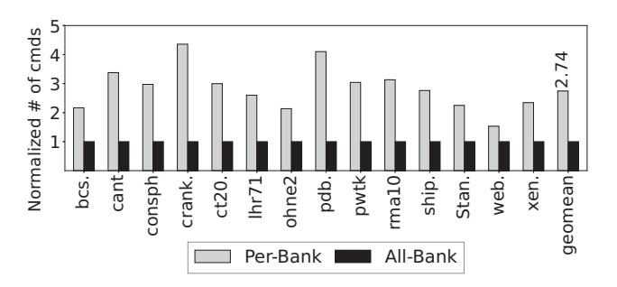
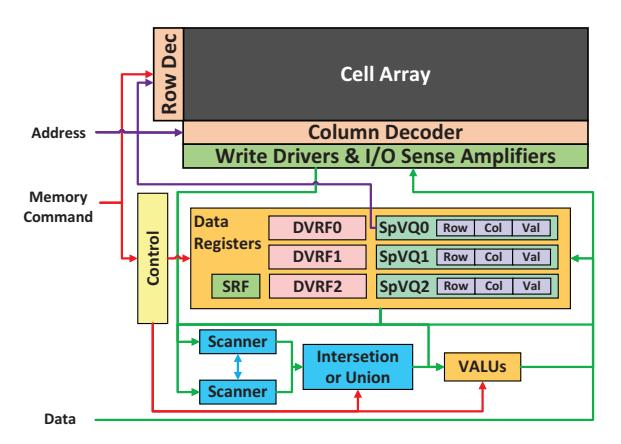

# III. MOTIVATION

## *A. Application Decomposition*

Many hardware accelerator studies have proposed various ways to improve generalized matrix-matrix multiplication (GEMM) and generalized matrix-vector multiplication (GEMV), as well as the sparse versions of those kernels (i.e., SpGEMM and SpMV). In this paper, instead of arbitrarily choosing the operations to accelerate, we first analyze realworld applications to identify the criticality of different operations (i.e., kernels) in Table I.

Table II introduces seven selected real-world sparse applications, five graphs, and two linear system problems. Figure 2 shows the execution time breakdown for these real-world benchmarks with sparse matrices in Table IX, running on NVIDIA Geforce RTX 3080 GPU. The figure breaks down the execution time into the execution time of four kernels: SpGEMM, SpTRSV, SpMV, and Level 1 BLAS operations denoted as Vector. We measure the execution time of each kernel with CUDA Runtime 11.8 [31] via NVIDIA Nsight



Fig. 3: Number of memory commands required for SpMV kernel execution with PIM, normalized to the all-bank mode.

Compute 2023.2.2. Note that our measurement excludes the pre-processing and post-processing time.

Figure 2 shows that all four kinds of kernels could be a significant bottleneck in GPU execution, including operations on simple sparse and dense vectors. For Breadth-First Search (BFS) and PageRank (PR) cases, SpMV occupies over 70% of the total execution time on average. However, for Connected Components (CC) and Single Source Shortest Path (SSSP), vector operations are the primary bottleneck. These vector operations include element-wise arithmetic operations and iterative accumulation to a scalar. For Triangle Count (TC), SpGEMM occupies over 98% of the total execution time. Lastly, in linear system solving algorithms, P-BCGS (Preconditioned Biconjugate Gradient Stabilized) and P-CG (Preconditioned Conjugate Gradient), SpTRSV is an essential operation. Therefore, it is necessary to support various sparse tensor kernels in hardware for the acceleration of the entire applications.

## *B. Challenges in Implementing Sparse Tensor Kernels on All-Bank PIM Architecture*

As an alternative control mechanism compared to the allbank (AB) mode, it is possible to make the host-PIM interface compatible with the JEDEC standard, by controlling only one bank in a channel at a time for PIM execution. For the rest of the paper, we call this execution method the perbank (PB) mode. Unlike the AB mode execution, the host memory controller must send DRAM commands to control each bank individually in per-bank execution. The DRAM commands include conventional DRAM control commands and PIM execution control ones.

To compare the computation efficiency between per-bank and all-bank modes, we count the number of memory commands of each mode by running several SpMV kernels with the simulator of Section VII-A. In the PB mode, the host controls only one bank at a time even for PIM kernel execution. Figure 3 shows the number of memory commands required to execute each SpMV kernel in each PIM mode, normalized to the all-bank mode. With the per-bank mode execution, the number of memory commands increases by 2.74× on average compared to the all-bank mode. As DRAM chips can handle only two memory commands per clock per channel, overflowing memory commands could result in a performance

## Algorithm 1 SpTRSV algorithm.

```
1: M: n \times n lower triangular matrix in COO format

2: b: input vector

3: x: output vector

4: for i=0 to n-1 do

5: s=0

6: for all e=(i,c_e,v_e)\in M where c_e < i do

7: s+=v_e \times \boldsymbol{x}[\boldsymbol{c}_e]

8: end for

9: l:=(i,i,v_l)\in M

10: \boldsymbol{x}[i]=(b[i]-s)/v_l

11: end for
```

bottleneck. Therefore, this study aims to support sparse tensor kernels for the synchronized all-bank mode execution.

The conventional synchronized all-bank execution scheme assumes all banks in a channel have the same workloads to process. However, this condition is not satisfied in sparse tensor kernels. As the nonzero elements are distributed unevenly in sparse tensors for real-world applications, each bank's data would not provide equivalent computation in sparse kernels. In addition, to avoid wasting memory capacity, sparse tensors are usually compressed in specialized sparse formats that only store the nonzero elements with their metadata (i.e., encoded data for the position of nonzero elements). This compression requires indirect memory accesses and dynamic execution paths for sparse kernels, which becomes necessary to allow each bank to access different memory rows and columns. Still, the current all-bank scheme does not allow this mechanism, requiring all banks to access the same memory row and column. Therefore, the host processor cannot know each bank's exact state for sparse tensor kernel PIM execution, including the number of elements remaining and the status of registers.

## C. Additional Challenges on SpTRSV

SpTRSV is a crucial kernel of several iterative methods on linear system solvers, used as a preconditioning technique to reduce the number of iterations to convergence significantly [29], [35]. Algorithm 1 describes the general algorithm of SpTRSV. While various applications use linear system-solving algorithms, including electromagnetics [41], [42], computational fluid dynamics [5], [16], [46], and circuit simulations [14], the SpTRSV kernel has not been studied for hardware acceleration due to its limited parallelism. As shown in Algorithm 1, lines 7 and 10, it is required to execute previous rows to compute the next row. Due to the dependency between rows, parallelizing all rows in the triangle matrix for SpTRSV computation is challenging. In addition, line 10 contains a division operation for row computation. Since the division operation requires tens of cycles [9] and additional divisor logic, supporting division operation in PIM is challenging. Therefore, overcoming the data dependency and removing the division operation from the computation step for SpTRSV acceleration is necessary.

| Kernels | Description                                                                                                   | Vector Operations    |
|---------|---------------------------------------------------------------------------------------------------------------|----------------------|
| DSWAP   | $x_d \leftrightarrow y_d$                                                                                     | DMOV                 |
| DSCAL   | $x_d \leftarrow \alpha x_d$                                                                                   | DMOV, SDV            |
| DCOPY   | $y_d \leftarrow x_d$                                                                                          | DMOV                 |
| DAXPY   | $y_d \leftarrow \alpha x_d + y_d$                                                                             | DMOV, SDV, DVDV      |
| SpAXPY  | $y_d \leftarrow \alpha x_{sp} + y_d$                                                                          | SpMOV, SSpV, SpVDV   |
| DDOT    | $s \leftarrow x_d^T y_d$                                                                                      | DMOV, DVDV, Reduce   |
| SpDOT   | $s \leftarrow x_d^T y_d \\ s \leftarrow x_{sp}^T y_d$                                                         | SpMOV, SpVDV, Reduce |
| DNRM2   | $s \leftarrow   x_d  _2$                                                                                      | DMOV, DVDV, Reduce   |
| GATHER  | $x_{sp} \leftarrow y_d$                                                                                       | GthSct, SpMOV        |
| SCATTER | $y_d \leftarrow x_{sp}$                                                                                       | GthSct, SpMOV        |
| DGEMV   | $y_d \leftarrow A_d x_d$                                                                                      | DMOV, SDV, DVDV      |
| SpMV    | $y_d \leftarrow A_{sp}x_d$                                                                                    | IndMOV, SSpV, SpVDV  |
| DTRSV   | $x_{d} \leftarrow L_{d}^{-1} x_{d}, U_{d}^{-1} x_{d}$ $x_{d} \leftarrow L_{sp}^{-1} x_{d}, U_{sp}^{-1} x_{d}$ | DMOV, SDV, DVDV      |
| SpTRSV  | $x_d \leftarrow L_{sp}^{-1} x_d, U_{sp}^{-1} x_d$                                                             | IndMOV, SSpV, SpVDV  |

TABLE III: Supported BLAS and Sparse-BLAS Level 1 and 2 kernels. The third column indicates vector operation instructions in Table V and  $\,$  VI. We omit some instructions due to the table space limit.

## IV. CONDITIONAL EXECUTION WITH ALL-BANK PIM

#### A. Design Goals

This study aims to design *pSyncPIM*, a PIM architecture that accelerates widely used dense and sparse tensor kernels while maintaining the DRAM interface with the host accelerator that handles general compute-intensive or complex kernels. In addition, this study proposes low-cost hardware mappings of two fundamental Sparse BLAS Level 2 kernels, SpMV and SpTRSV, which are the most complex kernels it aims to map. In addition, *pSyncPIM* does not deviate significantly from the existing JEDEC standard, thereby maintaining its primary function as a memory. To this end, our design achieves the following design goals:

- A flexible instruction set architecture (ISA) that can support various kernels used in multiple applications.
- A PIM architecture in which each processing unit supports predicated execution of the same PIM commands in a lock-step manner to deal with unevenly distributed sparse matrix and sparse vector workloads. In addition, each unit terminates on its own whenever the host chip sends a PIM command.
- An optimization technique that distributes the sparse matrix evenly across multiple banks to reduce remote accumulation across banks in the SpMV kernel.
- The first proposal of *SpTRSV PIM acceleration* with a memory mapping scheme on a sparse triangular matrix on each memory bank.

**Application Scope:** This study focuses on high-performance computing applications with highly sparse tensors (i.e., less than 1% density) [17]. Supported BLAS and Sparse BLAS Level 1 and 2 functions are listed in TABLE III. In TABLE III,  $s, \alpha$  are scalar values,  $x_d, y_d$  are dense vectors,  $x_{sp}$  is a sparse vector,  $A_d$  is a dense matrix,  $A_{sp}$  is a sparse matrix,  $L_d, U_d$  are dense lower/upper triangular matrices, and  $L_{sp}, U_{sp}$  are sparse lower/upper triangular matrices. Since this study aims to accelerate memory-intensive kernels to exploit PIM's high



Fig. 4: Architecture of a *pSyncPIM* processing unit for each bank. RF is a register file, and Q is a queue.

internal bandwidth, it excludes compute-intensive BLAS and Sparse BLAS functions from the PIM kernel implementation.

## B. Overview

Figure 4 shows the architecture of the processing unit of pSyncPIM. To utilize the total internal memory bandwidth, we attach a processing unit to a memory bank, which differs from the 2:1 ratio of bank and processing unit in Samsung HBM-PIM [24]. In addition, our approach assumes all memory commands are issued in the right order in the all-bank mode, which requires disabling out-of-order command issues from DRAM controllers. Each processing unit consists of a 128B control register that stores 32 PIM instructions, a 16B scalar register, 3× 32B dense vector registers, and 3× 192B sparse vector queues. A sparse vector queue includes 3× 64B subqueues to store the row index, column index, and values of matrix/vector elements. When reading data from a bank to a sparse vector queue or writing data from a sparse vector queue to the bank, the data is pushed or popped from one of the three sub-queues with 32B consecutive arrays except Gather/Scatter instructions. The Gather/Scatter instructions use all three sub-queues for push and pop. However, multiple successive elements with (row, col, value) pairs are popped from/pushed into the sparse vector queue for SIMD vector operation.

For computation, the processing unit has a 256-bit vector ALU (VALU) to support multiple precisions from 8-bit to 64-bit. An index calculator is inserted before VALU to avoid unnecessary operations between the zero-value of the sparse vector. For the union computation case, if only one side of the vector has non-zero, the processing unit skips the binary operation. Then, it copies the non-zero element of the existing one. If the index of non-zero elements matches, then VALUs compute the binary operation. For intersection, the index comparator uses the skip mechanism from the prior work [17] in the intersection computation case and computes only indexmatching elements.

| Bina                                | ry O | perati | on  | Form | at (B Fo | rmat) |    |       |      |     |    |      | _ |       |   |
|-------------------------------------|------|--------|-----|------|----------|-------|----|-------|------|-----|----|------|---|-------|---|
| OpC                                 | ode  | Dst    |     | Src0 | Src1     | Value |    | Binar | y S  | le  | dx | Idnt | U | nused |   |
| 31                                  | 28   | 27 2   | 5 2 | 4 22 | 21 19    | 18    | 15 | 14    | 11 1 | 0 9 | 8  | 7 6  | 5 |       | 0 |
| Control Operation Format (C Format) |      |        |     |      |          |       |    |       |      |     |    |      |   |       |   |
| OpCode Unused Imm0 Order Imm1       |      |        |     |      |          |       |    |       |      |     |    |      |   |       |   |
| 31                                  | 28   | 27     | 24  | 23   |          | 16    | 15 |       | 10   | 9   |    |      |   |       | 0 |

Fig. 5: Two general formats of instruction set architecture.

| Field      | Description                                             |
|------------|---------------------------------------------------------|
| OpCode     | Determines the instruction to execute.                  |
| Dst        | Destination register or queue.                          |
| Src0, Src1 | Source register or queue.                               |
| Value      | Value data format.                                      |
| Binary     | Binary operation between two elements.                  |
| S          | Intersection or union operation between vectors.        |
| Idx        | Sparse vector queue's row, column, or value sub-queues. |
| Idnt       | Identity element used in gather/scatter operations.     |
| Imm0       | Jump target.                                            |
| Order      | Loop order, used for distinguishing multiple loops.     |
| Imm1       | Counter for the number of jumps.                        |
| Unused     | Unused.                                                 |

TABLE IV: Description of fields in the instruction format.

#### C. Matrix Format

pSyncPIM uses the Coordinate List (COO) format for implementation, which is the best choice for the current target (i.e., HPC) workloads compared to other existing formats. For example, the bitmap format widely used for sparse neural networks [13], [33], [44] is inefficient for highly sparse matrices with a density under 1% [20]. Compressed row/column (CSR/CSC) formats, on the other hand, incur additional memory indirection with their metadata access, which requires extra work to maintain not to make any remote bank access.

However, *pSyncPIM* can support other sparse matrix formats with minor modifications and additions in its architecture, as the difference is only on the index matching mechanism. For example, to support CSR/CSC and their variants, only four 32-bit index registers and a 32-bit integer adder for their metadata must be added to *pSyncPIM*. Supporting multiple sparse matrix formats in a single PIM design is also feasible with minor hardware overheads. We expect that supporting two formats, one for high-sparsity applications and the other for low-sparsity applications (i.e., COO/CSR/CSC and bitmap), would be reasonable, considering the benefits and complexity.

## D. pSyncPIM Instructions

**Instruction Set Architecture:** Figure 5 shows the two general formats of the instruction set architecture: binary operation format (B format) and control operation format (C format), 4 bytes long each. *pSyncPIM* supports 15 instructions: five data movement instructions, six binary operations, and four control instructions. Control instructions use C format, and data movement and binary operation instructions use B format. Control instructions include NOP, JUMP, EXIT, and newly added CEXIT (Conditional Exit). Table IV further describes each field of the instruction format.

**Conditional Exit:** When running sparse tensor kernels that accompany uneven distributions of computations, all processing units in PIM cannot process their computation workloads at the

## Algorithm 2 Workflow of SpMV in pSyncPIM.

- 1: Read row, column, values SpVQ0←Bank
- 2: **loop**
- 3: IndMOV scalar SRF←Bank with SpVQ0 col idx
- 4: SSpV SpVQ1←SRF⊗SpVQ0 (Vector multiply)
- 5: SpVDV DRF0←SpVQ0⊕Bank (Vector accumulate)
- 6: Write vector DRF0→Bank
- 7: Read row, column, values SpVQ0←Bank
- 8: Conditional exit when SpVQ1 is empty
- 9: **end loop**

same time. Therefore, in this study, we introduce a new CEXIT (Conditional Exit) command in addition to the existing EXIT command. Through this, each processing unit runs an infinite loop in the PIM kernel, and its execution terminates when the sparse vector queues indicated by the CEXIT command are empty, as shown in Algorithm 2. In this way, the units will end the infinite loop in different timestamps, which depend on the workload size of each unit. Even after the execution terminates, each processing unit will still activate, access, and precharge the memory rows by host memory commands. However, the processing units do not change the actual data. Since processing units can terminate independently, the host chip must identify whether all banks in a memory channel complete kernel execution.

Other Instructions: pSyncPIM supports data movement instructions between the memory bank, dense vector registers, the scalar register, and sparse vector queues with several new data movement schemes. Table V summarizes the memory movement instructions. pSyncPIM defines several fundamental scalar, dense, and sparse vector instructions for computation, as shown in Table VI. Note that s is scalar,  $v_d$  is a dense vector, and  $v_{sp}$  is a sparse vector. After closely analyzing subroutines composed of frameworks commonly used in HPC areas - BLAS, Sparse BLAS Level 1, 2, and GraphBLAS - we found that using the instructions in Table VI is sufficient for implementing most memory-intensive sparse tensor kernels.

## E. Predicated Execution

While executing the infinite loop for sparse tensor computation, there is no guarantee that the sparse vector queues in a processing unit have the same amount of non-zero elements for each bank. For example, when the host sends a load instruction to a sparse vector queue, some units have 32B room to load, while others do not. In this case, units capable of pushing 32B data to the queue execute the load instruction. When the sparse vector becomes input or output, each processing unit executes predicated instructions in a lock-step manner, depending on its state. Therefore, multiple units run the same memory command simultaneously, but their actual behavior depends on their status, ensuring the correctness of the sparse tensor kernels.

## F. Support for Nested-Loop Capability

As we expand the computing capability from dense to sparse tensor kernels, nested loops inside PIM become necessary.

| Name   | Operation                                              |
|--------|--------------------------------------------------------|
| DMOV   | Move dense vector from/to bank/DRF.                    |
| IndMOV | Read the scalar from the memory bank that SpVQ points. |
| SpMOV  | Move scalar vector from/to bank/SpVQ.                  |
| SpFW   | Force write sparse vectors to the bank.                |
| GthSct | Transform between dense and sparse vectors.            |

TABLE V: Data movement instructions.

| Name   | Description                    | Operation                                  |
|--------|--------------------------------|--------------------------------------------|
| SDV    | scalar - dense vector op.      | $s \odot v_d \rightarrow v_d$              |
| SSpV   | scalar - sparse vector op.     | $s \odot v_{sp} \rightarrow v_{sp}$        |
| Reduce | iterated binary op.            | $\bigcirc v_d \to s$                       |
| DVDV   | element-wise dense vector op.  | $v_d \odot v_d \rightarrow v_d$            |
| SpVDV  | dense-sparse vector op.        | $v_{sp} \odot v_d \rightarrow v_d, v_{sp}$ |
| SpVSpV | element-wise sparse vector op. | $v_{sp} \odot v_{sp} \rightarrow v_{sp}$   |

TABLE VI: Vector operation instructions.  $\odot$  is an arbitrary binary operation.

Therefore, we add 5 bits of ORDER field inside the JUMP instruction to differentiate multiple JUMP operations from each other to separate loop counts. Each processing unit has multiple loop counters to track the number of each iteration of the JUMP instruction. As it is possible to put at most 32 instructions, 32 loop counters are sufficient for monitoring each JUMP instruction.

#### V. ACCELERATING SPMV KERNEL

pSyncPIM handles remote accumulation using conventional host chip DRAM accesses. In our architecture, the sparse matrix is cut into several submatrices in rows and columns and distributed to each bank. Suppose the input or output vector memory space spans multiple rows in a memory bank. In that case, the host chip must send multiple memory commands to access all memory rows for random accessing vectors. From that, the success rate of fetching the input and writing the output decreases as the number of rows in memory banks reserved for the input and output vector increases. Therefore, the dimension of submatrices should not overflow the size of one memory row in the division process. With the restriction of remote bank accesses, pSyncPIM divides the sparse matrix into very small submatrices with a size of 1 KB on matrix row and column dimensions.

Since the size of one memory row of the underlying HBM2 chip is 1KB, the maximum length of each input and output vector of each submatrix cannot exceed 1KB. From this basis, choosing the proper value format becomes critical to pack as many elements as possible within the memory row. By decreasing the size of values, the dimension of each submatrix mapped in a memory bank increases. With larger submatrices in rows and columns, the number of partitions decreases, with a reduction of the external traffic. Considering the gap between external and internal bandwidth (256GB/s and 2TB/s) in our architecture, reducing external traffic is critical for performance.

Matrix Compression: When submatrices are distributed naively into each memory bank, the required external memory traffic increases for replicating input vectors and accumulating


Fig. 6: Matrix compression for bank-parallel SpMV execution.

partial results. Copying inputs and adding partial outputs uses slower external I/O than internal I/O, which is the major bottleneck of SpMV computation. Therefore, to reduce these external memory I/O, we introduced a matrix compression technique to reduce the external I/O traffic. Figure 6 presents the matrix compression technique. The sparse matrix is cut row-wise first, and all-zero columns are removed for each partial matrix. Then, each row-wise partial matrix is distributed to memory banks in the reduced state. After finishing the computation for each memory bank, the host chip accumulates only non-zero outputs to reduce the external memory reads.

Conditional Exit Detection: Due to the nature of the sparse matrix, the number of non-zeros for each bank differs. While some banks consume more memory rows than others, the empty spaces of the index arrays are filled with -1. When a -1 value is in the index queue, the processing unit sets flags for the CEXIT command. With this technique, it becomes possible to allocate the same number of memory rows for the sparse matrix for each bank while maintaining the partially synchronized execution model.

## VI. ACCELERATING SPTRSV KERNEL

## A. Adopting SpTRSV Block Algorithm

In *pSyncPIM*, we adapt the state-of-art algorithm for Sp-TRSV [1] to PIM acceleration. The algorithm divides the sparse triangular matrix  $\bf L$  into two sub-sparse triangular matrices,  $\bf L_0$  and  $\bf L_1$ , and a sparse square matrix  $\bf M$  as shown in Equation 1.  $\bf O$  denotes the null matrix.

$$\mathbf{L} = \begin{pmatrix} \mathbf{L_0} & \mathbf{O} \\ \mathbf{M} & \mathbf{L_1} \end{pmatrix} \tag{1}$$

With this splitting mechanism, the divide-and-conquer mechanism can be applied to the linear system  $\mathbf{L}\mathbf{x} = \mathbf{b}$ , as shown in Equation 2.

$$Lx = \begin{pmatrix} L_0 & O \\ M & L_1 \end{pmatrix} \begin{pmatrix} x_0 \\ x_1 \end{pmatrix} = \begin{pmatrix} b_0 \\ b_1 \end{pmatrix} = b \tag{2}$$

Also, Equation 2 is decomposed into two matrix-vector solving equations of Equation 3.

$$L_0 x_0 = b_0, M x_0 + L_1 x_1 = b_1$$
 (3)

Since  $L_0$  and  $L_1$  are also sparse triangular matrices, it is possible to divide these sub-matrices recursively. Thus, the block algorithm executes SpTRSV in three steps:

- 1) Solve upper half part  $L_0x_0 = b_0$  (Recursive SpTRSV)
- 2) Perform  $\mathbf{b_1}' = \mathbf{b_1} \mathbf{M}\mathbf{x_0}$  (SpMV)


Fig. 7: Logical description of unit sparse triangular matrix memory mapping.

