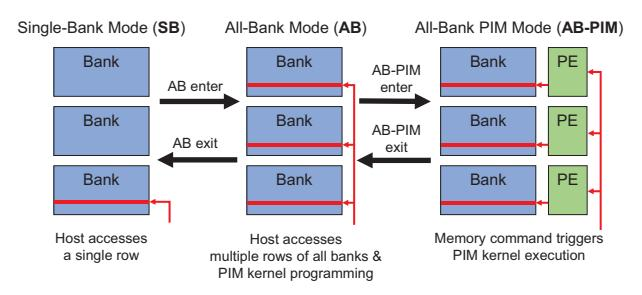

# pSyncPIM: Partially Synchronous Execution of Sparse Matrix Operations for All-Bank PIM Architectures

Daehyeon Baek†\*, Soojin Hwang‡, Jaehyuk Huh‡

†Technology Research, Samsung SDS, Seoul, Korea

‡School of Computing, KAIST, Daejeon, Korea
dh04.baek@samsung.com, sjhwang@casys.kaist.ac.kr, jhhuh@kaist.ac.kr

Abstract—Recent commercial incarnations of processing-inmemory (PIM) maintain the standard DRAM interface and employ the all-bank mode execution to maximize bank-level memory bandwidth. Such a synchronized all-bank PIM control can effectively manage conventional dense matrix-vector operations on evenly distributed matrices across banks with lock-step execution. Sparse matrix processing is another critical computation that can significantly benefit from the PIM architecture, but the current all-bank PIM control cannot support diverging executions due to the random sparsity. To accelerate such sparse matrix applications, this paper proposes a partially synchronous execution on sparse matrix-vector multiplication (SpMV) and sparse triangular matrix-vector solve (SpTRSV), filling the gap between the practical constraint of PIM and the irregular nature of sparse computation. It allows the execution of the processing unit of each bank to diverge in a limited way to manage the irregular execution path of sparse matrix computation. It proposes compaction and distribution policies for the input matrix and vector. In addition to SpMV, this paper identifies SpTRSV is another key kernel, and proposes SpTRSV acceleration on PIM technology. The experimental evaluation shows that the new sparse PIM architecture outperforms NVIDIA Geforce RTX 3080 GPU by 4.43× speedup for SpMV and  $3.53\times$  speedup for SpTRSV with a similar amount of DRAM

*Index Terms*—processing-in-memory, sparse matrix, memory bandwidth, predicated execution.

#### I. INTRODUCTION

Despite rapidly increasing GPU computation capability to the PFLOPS scale, the improvement in memory bandwidth has been lagging behind [3]. This disparity between memory bandwidth and computation capability poses a significant challenge for high-performance computing problems and graph applications that use memory-intensive kernels, such as matrix-vector multiplication and triangular matrix-vector solve. To address this memory bandwidth problem, processing-in-memory (PIM) has emerged as an alternative solution, using the internal bank-level bandwidth of DRAM by attaching processing elements directly to each bank.

Following many research investigations on the potential of PIM technology, DRAM manufacturers recently released PIM products to address such demands on memory bandwidth [23], [24]. Samsung Electronics has announced HBM2-based HBM-PIM [24], and SK Hynix has released GDDR6-AiM PIM [23]

\*This work was done at KAIST while Daehyeon Baek was a PhD student.

based on GDDR6. The commercial incarnations of PIM maintain the standard JEDEC interfaces to control DRAM while adding compute units. With the standard interface, the current HBM or GDDR-based GPU or accelerators can readily use these new PIM technologies. However, the commercial PIM architectures support only dense BLAS (Basic Linear Algebra Subprograms) operations, with its synchronous allbank controls of many banks in DRAM.

Sparse matrix operations are critical computations that can significantly benefit from the internal bandwidth of PIM, and several PIM-based designs have been proposed in academia to support such operations. They assume a standalone PIM without considering the external interface. Thus, each processing unit attached to its memory bank works independently by the internal memory controllers in the logic layer. SpaceA is a sparse matrix-vector multiplication accelerator (SpMV) based on HMC (Hybrid Memory Cube), in which each processing unit performs SpMV computation independently [47]. Gearbox deploys processing units for each subarray in the bank, enabling higher internal bandwidth [25].

However, there is a significant gap between the commercial implementations and the prior studies. First, unlike per-bank controls from the processing units for the earlier studies [25], [47], the commercial PIM designs [23], [24] use host chip DRAM controllers to execute all banks synchronously by a single command to follow the standard interface while exploiting bank-level memory bandwidth. Second, commercial designs limit the computing element attached to a bank to access only its bank, unlike remote bank accesses allowed in academic studies through on-chip networks on the logic layer. For dense BLAS operations, all-bank controls without remote bank accesses do not cause severe problems as each bank has equally distributed input matrix workloads and executes the same sequence of instructions.

However, the restriction imposed by the commercial designs significantly affects the irregular computation of sparse matrix operations. Sparse matrix-vector operations require diverging executions in each bank due to random sparsity patterns, while the current all-bank PIM cannot manage such divergence in the execution path. The load balancing across banks becomes critical as remote bank accesses are impossible. In addition, the prior sparse matrix-vector accelerators are

missing a crucial operation, such as sparse triangular matrix-vector solve (SpTRSV), commonly used in many applications. The earlier studies proposed several ways to optimize the SpTRSV kernel on GPU with various techniques to reduce data dependency between matrix rows [1], [28], [40], [49]. However, these approaches cannot overcome the fundamental limitations of SpTRSV execution, in which SpTRSV itself has a low arithmetic intensity. Therefore, their approaches are bound to the memory bandwidth, incurring low GPU usages.

To support sparse operations effectively with PIM, this paper proposes a partially synchronous control of banks for all-bank PIM architectures called pSyncPIM to fill the gap between the commercial all-bank PIM and irregular sparse matrix operations. The new partially synchronous control allows the processing units to diverge their execution path in a limited way to maintain the all-bank execution constraint. Reads and writes on rows of all banks are synchronized with the allbank control. However, each processing unit can operate on a different portion of the opened row of its bank. In addition, each processing unit can skip or exit the row computation early if it does not have any element to compute. The partially synchronous execution allows the all-bank PIM to support diverging execution with sparse data. However, the processing units need careful data distribution and compaction if too many divergences occur. Therefore, we propose data compaction and distribution policies to optimize the matrix and vector distribution across banks to maximize the processing unit utilization for random sparsity patterns.

In addition, our design accelerates SpTRSV by effectively utilizing internal memory bandwidth with the all-bank PIM design, which overcomes the memory bandwidth limit of GPU-based work approaches. While the cuSPARSE [30] library uses only the row-reordering technique to batch independent rows in the matrix to process, *pSyncPIM* uses a recursive block algorithm [1] to match the hardware limitation of memory row size, boosting the kernel performance.

We modified DRAMsim3 [27] to support all-bank PIM architectures and added our partially synchronous execution support. The experimental evaluation shows that the new sparse PIM architecture can outperform NVIDIA Geforce RTX 3080 by 443% for SpMV kernels and 353% for SpTRSV kernels with a similar amount of HBM memory bandwidth.

This study is the first one to support irregular execution for sparse matrices with all-bank PIM architectures. The contributions of the paper are as follows:

- We propose a PIM architecture in which each bank is controlled by the same commands in an all-bank synchronized manner. However, the actual execution path of each bank can diverge to process irregular sparse matrix operations.
- With *pSyncPIM*, we propose a sparse matrix workload distribution algorithm to minimize the overhead of SpMV due to the unevenness of the sparse matrix data.
- We propose a PIM acceleration scheme for SpTRSV by adopting a recursive block algorithm [1].

| Name                         | Operation                   |  |  |  |
|------------------------------|-----------------------------|--|--|--|
| Level 1 BLAS                 |                             |  |  |  |
| Swap                         | $x_d \leftrightarrow y_d$   |  |  |  |
| Scale                        | $x_d \leftarrow ax_d$       |  |  |  |
| Сору                         | $y_d \leftarrow x_d$        |  |  |  |
| AXPY                         | $y_d \leftarrow ax_d + y_d$ |  |  |  |
| Dot Product                  | $s \leftarrow x_d^T y_d$    |  |  |  |
| Euclidian Norm               | $s \leftarrow \ x_d\ _2$    |  |  |  |
| Level 1 Sparse B             | LAS                         |  |  |  |
| Gather                       | $x_s \leftarrow y_d$        |  |  |  |
| Scatter                      | $y_d \leftarrow x_s$        |  |  |  |
| Level 2 Sparse BLAS and      | d its variants              |  |  |  |
| SpMV                         | $C \leftarrow Ab$           |  |  |  |
| SpTRSV                       | $x \leftarrow L^{-1}b$      |  |  |  |
| Sp1K3 v                      | $x \leftarrow U^{-1}b$      |  |  |  |
| Level 3 Sparse BLAS variants |                             |  |  |  |
| SpGEMM                       | $C \leftarrow AB$           |  |  |  |

TABLE I: Important operations on graph applications and linear system solvers. x,  $x_d$ ,  $y_d$ , and b are dense vectors. a and s are scalars.  $x_s$  is a sparse vector. A, B, and C are sparse matrices. L is a lower triangular matrix. U is an upper triangular matrix.

Fig. 1: Execution model of HBM-PIM.

#### II. BACKGROUND

#### A. Major Sparse Matrix Kernels in Real-World Applications

The two significant problem spaces of real-world applications that use sparse matrices are graph applications and linear system problems. These applications comprise a small number of matrix and vector operations, as Table I summarizes.

From these operations, graph applications use operations with SpGEMM (Sparse General Matrix Multiplication), SpMV (Sparse Matrix-Vector Multiplication), and BLAS (Basic Linear Algebra Subproblems) level 1 vector operation kernels. On the other hand, many linear system-solving applications use iterative methods over direct Gaussian elimination-based methods to generate approximate solutions to the linear system problem from the sparse matrix for high performance. Many linear system applications, including Conjugate Gradient [19] and its variant [43], use SpMV kernels and element-wise dense vector operations, including scale, copy, AXPY, dot product, and Euclidean norms in iterations. In addition, these iterative methods use approximate sparse lower/upper triangular matrices L and U where  $A \approx LU$ . These methods compute  $\mathbf{x}' = \mathbf{U}^{-1}\mathbf{L}^{-1}\mathbf{x}$  to reduce the number of iterations and faster convergence, where SpTRSV is critical.

## *B. Industrial PIM Products*

Recently, Samsung Electronics has released HBM-PIM chips based on HBM2 technology [24]. The HBM-PIM can utilize the internal bandwidth of 1TB/s, four times the external bandwidth of 256GB/s. In addition, with only 5.4% additional power consumption, HBM-PIM achieves 3.5 to 11.2 times performance improvements over a normal HBM in neural network applications such as DS2, GNMT, and AlexNet. SK Hynix has also released a GDDR6-AiM PIM chip based on GDDR6 technology [23]. Unlike HBM-PIM, GDDR6- AiM can accelerate activation functions not supported by Samsung HBM-PIM by adding several more commands from the existing JEDEC standard. In addition to all bank operations for the paired memory bank, each processing unit in GDDR6- AiM can exchange data with other units through the global buffer added to the AiM controller on the host chip. However, the host coordinates these data exchanges, and each processing unit cannot access remote banks independently. As a result, GDDR6-AiM achieves 1TFLOPS throughput with bfloat16 precision, a 16.64× performance improvement over Intel Xeon Gold 6230 in GPT-3.

These industrial products use synchronized all-bank execution schemes for their operations. In this scheme, the host chip accesses all banks in the channel simultaneously with one memory transaction by sharing the memory command, row, and column numbers across all banks. For example, HBM-PIM uses a mode-switching technique to interoperate between normal HBM and all-bank PIM execution, as shown in Figure 1. At first, HBM-PIM operates in single-bank mode (SB), which is the same as a normal HBM, to manage memory requests from the host. For PIM execution, the DRAM controller enters a sequence of memory commands to switch the HBM-PIM to all-bank mode (AB). In this mode, the host chip can program PIM kernels into processing units in parallel. After inserting the PIM kernel instructions, the host sends another memory command sequence to switch HBM-PIM from AB mode to all-bank PIM mode (AB-PIM). In this mode, every memory transaction in a memory channel executes the programmed PIM kernels in parallel. After the kernel execution finishes, the host sends memory command sequences to HBM-PIM to switch AB-PIM mode to SB mode.

These approaches reduce the burden of changing the DRAM controller design as the host chip manufacturers can apply the PIM technologies without changing or with minor changes in the existing JEDEC standard. However, these approaches target memory-intensive neural network applications, which support only dense matrix and vector operations. While this approach is practical for these applications, the synchronous execution model cannot fit in irregular sparse matrix workloads due to a diverging control for each bank.

## *C. PIM-based Sparse Matrix Kernel Accelerators*

Unlike the industrial approach, several studies suggest standalone PIM accelerators [25], [47], in which each processing unit operates freely without synchronizing and receiving memory commands from host chips. In this manner, each processing unit can read and write in different timing and memory rows in each bank. This scheme has a substantial advantage for accelerating sparse tensor kernels because of the uneven distribution of sparse tensors and the computations each unit has to process.

SpaceA [47] is a SpMV PIM accelerator, where each processing unit paired with a memory bank can send outstanding memory requests to non-local memory banks, integrating Content Addressable Memory (CAM) at the bank level to exploit data reuse of input vectors. From the software perspective, it suggests a sparse matrix partition and mapping scheme to distribute a sparse matrix to each bank to balance workloads. SpaceA achieves 13.54× speedup and 87.49% energy reduction on average over NVIDIA TITAN Xp from these techniques.

Gearbox [25] is another standalone PIM study that exploits subarray-level parallelism inside each memory bank. It reduces remote accumulation between banks, which is required in parallel SpMV execution by introducing a dispatching mechanism. In addition, it suggests a partitioning mechanism to replace and reduce remote reads. With these techniques, a single Gearbox package achieves up to a 15.73× performance boost over an NVIDIA P100 GPU with 3 HBM2 memory.

## *D. Limitations of the Previous Work*

These standalone 3D stacked DRAM-based studies propose designs where each processing unit performs its read/write memory accesses to each memory bank without memory command synchronization. While asynchronous PIM execution is an optimized method for executing the sparse tensor kernels, this method requires significant changes in the interface between the host and DRAM chips. In the current DRAM interface, the host CPU or GPU has memory controllers that send requests to memory banks. However, the standalone PIM studies assume the memory controllers integrated into the logic die of each PIM, and it is only possible to build the standalone PIM with a complete change of the interface between the host and DRAM [24]. As CPU and GPU manufacturers may not be eager to change the memory interface to delegate their computation capability to DRAM in the current fragmented industrial environments, the chance of completely changing the DRAM interface just for PIM would be very low. The prior work [47] assumes the HMC (Hybrid Memory Cube) organization, which DRAM manufacturer no longer pursues for the same hurdle.

In summary, our research aims not to change the JEDEC interface standard to facilitate deployment on various host chips with standard HBM2 DRAM controllers, but to apply the sparse matrix operations to the synchronized execution model.

## *E. SpGEMM Accelerators*

The acceleration of sparse general matrix-matrix multiplication (SpGEMM) has been studied with a separate accelerator, as GEMM can exploit the possible locality in matrix-matrix multiplication. Outer product-based approaches use performance benefits from one-time memory reads and sequential

| Application                                        | Abbreviation | Type          |
|----------------------------------------------------|--------------|---------------|
| Breadth-First Search                               | BFS          | Graphs        |
| Connected Components                               | CC           | Graphs        |
| PageRank                                           | PR           | Graphs        |
| Single-Source Shortest Path                        | SSSP         | Graphs        |
| Triangle Count                                     | TC           | Graphs        |
| Preconditioned Biconjugated Gradient Stabilized | P-BCGS       | Linear System |
| Preconditioned Conjugate Gradient               | P-CG         | Linear System |

TABLE II: Specification of sparse tensor benchmarks.

Fig. 2: Breakdown of the execution time of sparse matrix applications.

memory access patterns for SpGEMM calculation [32], [51]. On the other hand, other SpGEMM accelerators [4], [38] propose row-wise inner products for the memory usage efficiency over outer-product accelerators.

However, unlike SpGEMM, SpMV and SpTRSV require only one multiplication and addition per input non-zero element in the sparse matrix, and element-wise operations also have a fixed number of operations per element. Therefore, this paper focuses on the streaming memory-intensive kernels: SpMV, SpTRSV, and element-wise (sparse) vector operations on processing-in-memory acceleration. The host processor handles *matrix and vector allocations, tuple extractions, transposes, preprocessing steps, and SpGEMM executions* in graph applications and linear systems.

