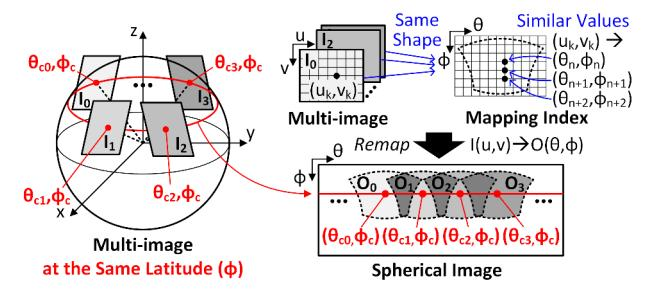
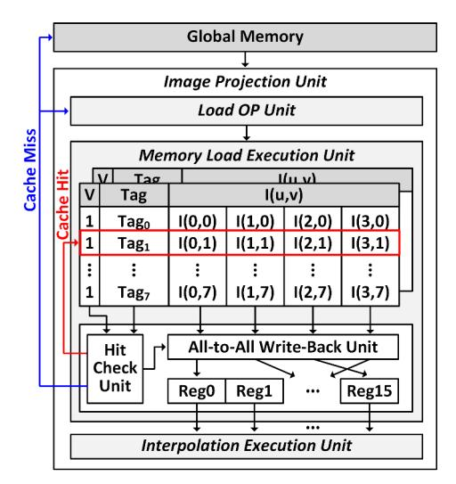
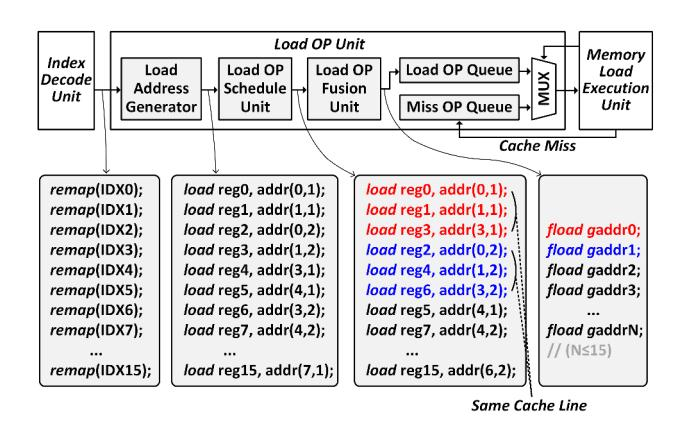

# *B. Exploitation of Inter-data and Intra-data Reuse Methods on Multi-camera Images*

Figure 6 shows the inter- and intra-data reuse methods on mapping indices to alleviate memory accesses during the LUTbased image projection. Multiple images (I0, I1, I2, I3) at the same latitude show the same shape of mapping indices (spherical rectangles as shown in the figure) each other whose values only differ by a center index (θc) on a θ-coordinate based on the equation 2. Therefore, CamPU performs image projection on latitude-aligned multi-image with a shared mapping index (inter-data reuse), and their projected outputs (O0, O1, O2, O3) are offset by different values of mapping indices (θc0, θc1, θc2, θc3) in a spherical coordinate. Specifically, the index decode

Figure 6: Inter-data reuse (shape similarity) and intra-data reuse (value similarity) methods during iProj on latitude aligned multi-camera images.

unit stores a single mapping index corresponding to four images in the mapping index LUT, saving 75% of the LUT footprint and LUT bandwidth using the inter-data reuse. Moreover, exploiting latitude-aligned multi-image benefits from efficient remap operations and image blending operations. The image projection unit performs remap operations on latitude-aligned multi-image simultaneously by aligning multiimage pixels in a cache line. Similarly, the blending unit efficiently merges the same shapes of projected outputs in parallel. Detailed benefits will be explained in Section III-C and Section III-D, respectively.

Some applications could not use latitude-aligned multiimage during Stage 1 because of a constraint camera rig. In that case, CamPU exploits the value similarity of mapping index elements (intra-data reuse) to save memory accesses. The intra-data reuse differentiates similar values of adjacent elements in a mapping index during a single image projection. As shown in an example of Figure 6, the adjacent elements in a mapping index, (θn, ϕn), (θn+1, ϕn+1), (θn+2, ϕn+2), indicate the same input pixel at (uk, vk) and can be encoded to all (0, 0) differential elements with a reference mapping index of (uk, vk). By exploiting intra-data reuse, the bit-precision of a mapping index is reduced from 8-bit to 2-bit for image projection on 256×256 sized images. Then, the index decode unit recoveries differentiating mapping indices for remap

Figure 7: An architecture of the proposed image projection unit for low-latency remap operations.

operations. Therefore, the intra-data reuse method compresses a mapping index by 75%. Finally, a mapping index can be reduced by 94.4% by exploiting both inter-data and intradata reuse methods for iProj operations on 256×256 sized 18 images at 4 different latitudes and 3, 6, 6, and 3 different longitudes.

#### *C. Out-of-order Image Projection Units with Cache Memory*

A remap operation is a generic memory load operation with a mapping index. However, massive irregular remap operations in image projection slow down the overall processing times. Moreover, inverse warping performs four times remap operations to interpolate four neighbor pixels and requires four times memory accesses. Although parallel processing is a key solution for throughput enhancement, naive implementations bring about inefficient memory load operations such as duplicate instruction fetches and memory bank conflicts.

Figure 7 illustrates the proposed image projection unit that alleviates massive and irregular memory load operations in remap operations. The load OP unit fetches remap instructions from the CPU, decodes them, and issues load operations to the memory load execution unit. The memory load execution unit executes memory load operations based on a mapping index. It exploits high-speed cache memory to minimize expensive high-level memory accesses. Cache memory consists of a 4KB 2-way set-associative cache, each of which is used for either cache hit or cache miss cases. It only supports a memory load operation, which reduces hardware costs for cache management. Cache memory holds frequently accessed input pixels with their tag and valid bits, and a cache line contains four 16-bit pixel values. The hit check unit decodes load operations and compares their target addresses to tag and valid bits to decide cache hit status. After loading a cache line from cache memory into temporal registers, the write-back unit writes target pixels in a cache line to corresponding write-back

Figure 8: An architecture of the load OP unit with dynamic instruction scheduling.

registers through an all-to-all connection, and a maximum of sixteen write-back registers (Reg0–Reg15) could be written at once. If a cache miss occurs, the image projection unit accesses high-level global memory and stores the issued load operations of a cache miss to the miss OP queue that would be used when the high-level memory data is available. Finally, the memory load execution unit propagates remapping outputs to the interpolation execution unit for bilinear interpolation.

To reduce the number of instruction issues and cache accesses, the load OP unit with dynamic instruction scheduling is proposed as shown in Figure 8. The load OP unit fetches sixteen remap instructions with recovered mapping indices from the index decode unit. Then, the load address generator decodes them and produces a group of memory load instructions with target memory addresses. The load OP schedule unit reorders load instructions whose memory addresses are in the same cache line. Then, the load OP fusion unit fuses the cache-line-aligned load instructions into a single fload instruction. As illustrated in an example of Figure 8, when a cache line holds four subsequent pixels whose addresses are addr(0, 1), addr(1, 1), addr(2, 1), and addr(3, 1), load instructions addressing addr(0, 1), addr(1, 1), and addr(3, 1) are fused into a single fload instruction indicating a group address (gaddr0). Finally, the fload instructions are stored in the load OP queue and issued to the memory load execution unit in a sequence. By fusing memory load operations, the number of instruction issues and cache memory accesses are significantly reduced. In iProj with an inverse warping process, memory load operations are reduced by 72.7%. As a result, the load OP unit remarkably reduces instruction issues and cache memory accesses through a fusion of load operations.

To efficiently execute the fload operations, the image projection unit supports out-of-order memory load executions. The load OP unit issues a fload instruction stream to the memory load execution unit. The memory load execution unit loads the target cache line from cache memory, and the all-to-all write-back unit writes back target pixels within the cache line to corresponding registers simultaneously. If a cache miss occurs, the issued fload operation is pushed to the miss OP queue in the load OP unit and requests a corresponding memory block to the high-level global memory. When the memory block is ready, the memory load execution unit fetches the fload operation from the miss OP queue and executes the fload operation on the memory block. During cache miss latency, the memory load execution unit continues to fetch the next fload instruction from either the load OP queue or the miss OP queue and then processes it not relying on the cache hit status. This parallel process can hide the cache miss latency of memory load executions. After finishing sixteen remap operations, the memory load execution unit commits the write-back registers and passes them to the interpolation execution unit. This out-of-order operation significantly reduces the latency of image projection by 74.9% by reducing the number of cache accesses and hiding a cache miss latency.

The interpolation execution unit performs weighted summation operations on neighbor pixels obtained by the memory load execution unit. The interpolation execution unit directly accesses the write-back registers of the memory load execution unit and performs bilinear interpolation. Interpolation outputs are stored in the projected output buffer and applied to following image blending operations.

The pipelined architecture of the load OP unit, the memory load execution unit, and the interpolation execution unit efficiently execute the memory-intensive image projection and bilinear interpolation by hiding each latency. Therefore, the out-of-order image projection unit improves the throughput of iProj with inverse warping, achieving 3.99× higher throughput than the in-order image projection unit for a single image projection. Moreover, it efficiently accelerates multi-camera image projections on latitude-aligned images. Thanks to the inter-data reuse among the latitude-aligned mapping indices, the image projection unit loads the shared mapping index and performs remap operations on multi-camera images at a time. A cache line consists of four pixels of four images, and the memory load execution unit simultaneously accesses four pixels for multi-image projection. As a result, the out-of-order image projection unit enhances the throughput of multi-image projection on four images by 3.17× higher than that of single image projection.

