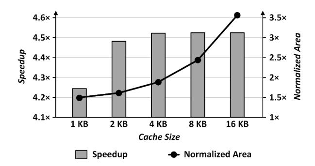

# *B. Performance on Different Numbers of Cameras*

Figure 10 shows the speedup per image performance on image projection with inverse warping and image blending in different numbers of camera images. A GPU (NVIDIA RTX2080Ti [35]) architecture cannot increase throughput due

Figure 11: Speedup and area overheads of the out-of-order image projection unit by cache size.

to low data reuse of multi-image projections and inefficient image blending operations. On the other hand, CamPU improves throughput as the number of camera images increases by exploiting latitude-aligned images. By sharing a mapping index across latitude-aligned images, the image projection unit boosts remap operations with reduced LUT bandwidth, and the blending unit speeds up overlap-aware blending operations on symmetric overlapping regions. Moreover, CamPU can accelerate image projection on a single-camera image (1 batch size) through intra-data reuse on a mapping index and the outof-order image projection. Finally, CamPU achieves 3.99× and 12.7× higher speedup per image than the GPU at a singlecamera image and four-camera images, respectively.

