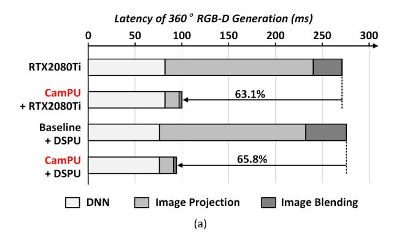
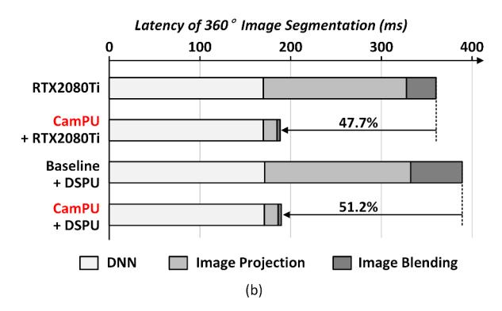

# *C. Latency Breakdown among Various Platforms running 360*◦ *Spatial Computing Systems*

Figure 16 illustrates the system latency breakdown of various platforms running four-stage 360◦ spatial computing systems with 18 multi-camera images at 4 different latitudes and 3, 6, 6, and 3 different longitudes. Figure 16 (a) shows the latency of 360◦ RGB-D generation benchmark [30] with 256×256 sized tangent images. The RTX2080Ti platform executes all stages of the system pipeline, taking 270.1 ms of the system latency. However, the latency of image projection and image blending on multi-camera images accounts for 69.8% of the total latency. Therefore, the CamPU-integrated GPU platform which assumes an integration of dedicated CamPU into the GPU architecture offloads image projection and image blending tasks to CamPU, remarkably reducing the overall system latency by 63.1%. The CamPU-integrated RTX2080Ti platform achieves under 100 ms of end-to-end processing time. On the other hand, the DSPU accelerates DNN tasks in much lower latency (76.1 ms) and lower power consumption (766.0 mW) than RTX2080Ti (82.0 ms of latency and a TDP of 250 W). However, the DSPU platform

Figure 16: System latency breakdown of various platforms running four-stage 360◦ spatial computing systems with 18 multi-camera images: (a) 360◦ RGB-D generation and (b) 360◦ image segmentation.

requires an additional accelerator for a multi-camera system. Slow multi-image projection and blending of the baseline architecture, which performs the in-order image projection and image blending on full-sized intermediate images, is a bottleneck in the overall system, and the baseline + DSPU platform shows 275.6 ms of processing time. On the other hand, CamPU significantly reduces a multi-camera system by 65.8% with minimal area occupancy and power consumption. Consequently, the CamPU + DSPU platform achieves the lowest latency (94.1 ms) among the 3D spatial computing platforms, which is 2.9× faster than the RTX2080Ti platform.

Figure 16 (b) describes the system latency breakdown of 360◦ image segmentation benchmark [38] with 320×240 sized tangent images. Although large image and DNN sizes of the image segmentation system take more latency compared to the RGB-D generation system, the CamPU only has 3% latency overheads of image projection and image blending in regard to processing 17% increased image pixels. Finally, the CamPU-integrated platforms achieve under 200 ms of end-toend processing time, reducing the system latency by 47.7% in the RTX2080Ti platform and 51.2% in the DSPU platform.

