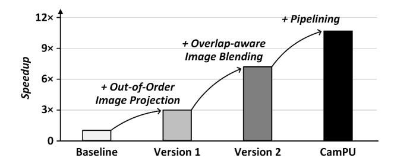
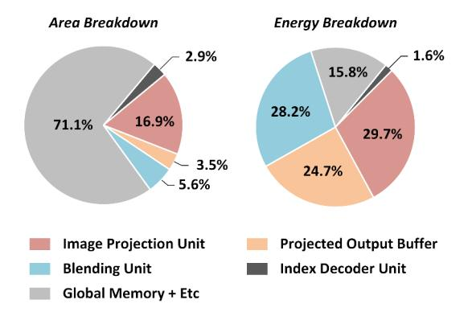

# *C. Performance and Area Overheads by Different Cache Memory Sizes*

Figure 11 shows the speedup and area overhead of the outof-order image projection unit by cache memory size. By adopting 1 KB of cache memory, the image projection unit achieves 4.3× throughput with 1.5× area overhead compared to no cache memory. Increasing cache sizes results in a low cache miss rate so that the throughput of image projection is enhanced as a cache memory size increases. However, throughput enhancement becomes saturated at larger than 4 KB of cache memory size. Additionally, a large cache size causes a large area overhead of the image projection unit. The image projection unit with 16 KB of cache memory size shows a 3.6× area overhead. By considering both performance and area overheads, the out-of-order image projection unit adopts 4 KB of cache memory size and achieves 4.5× speedup with 1.9× area overhead.

#### *D. Ablation Study of CamPU*

Figure 12 shows the ablation study for image projection and blending. The baseline architecture integrates the in-order image projection unit with the cache memory and the blending unit processing full-sized intermediate spherical images. The version 1 architecture adopts out-of-order image projection from the baseline architecture and increases the overall throughput by 3.0×. The version 2 architecture integrates the overlap-aware blending unit for accelerating image blending,

Figure 12: Ablation study of CamPU.

Figure 13: Area and energy consumption breakdowns of CamPU.

improving overall performance by 2.4× higher than the version 1 architecture. The last version architecture (CamPU) exploits the pipelined image projection and overlap-aware blending units and hides the latency between them, achieving 1.5× throughput enhancement. Finally, CamPU accomplishes 10.7× speedups compared to the baseline architecture.

