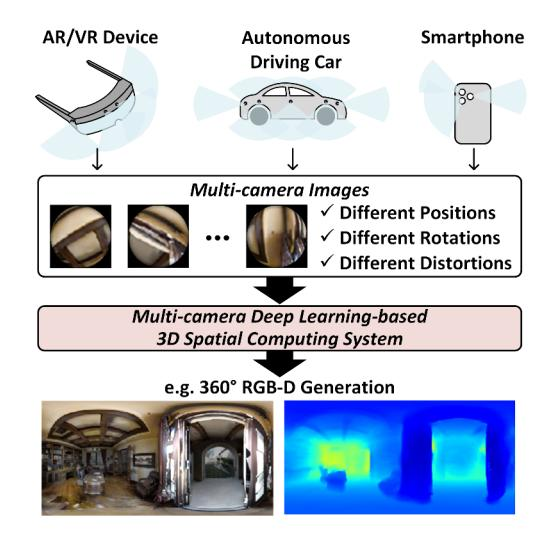
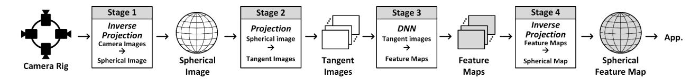
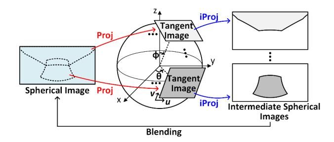

# CamPU: A Multi-Camera Processing Unit for Deep Learning-based 3D Spatial Computing Systems

Dongseok Im *Information & Electronics Research Institute KAIST* Daejeon, South Korea dsim@kaist.ac.kr

Hoi-Jun Yoo *School of Electrical Engineering KAIST* Daejeon, South Korea hjyoo@kaist.ac.kr

*Abstract*—A 3D spatial computing system that understands a surrounding environment and interacts with real-world objects has emerged with the development of deep learning technologies. A multi-camera system captures a surrounding view of a scene using multiple cameras, and a deep neural network (DNN) system extracts semantic features from multi-camera images and provides useful information to users. However, processing a multicamera system requires massive memory accesses as the number of cameras increases while processing a DNN system can improve throughput by exploiting batch processing. This performance gap limits the overall performance of 3D spatial computing systems. To solve this problem, a multi-camera processing unit (CamPU) is proposed. CamPU exploits the inter- and intradata reuse methods on multi-camera images, minimizing memory accesses for image projection. Moreover, the out-of-order image projection unit with cache memory is designed to increase multi-image projection throughput by avoiding redundant cache accesses and hiding the latency of high-level memory accesses. Lastly, the overlap-aware blending unit speeds up image blending by efficiently handling overlapping regions between adjacent images. The CamPU architecture is evaluated through RTLlevel simulation, and the CamPU-integrated DNN platform provides a comprehensive analysis of end-to-end multi-camera deep learning-based 3D spatial systems. Finally, CamPU speedups the overall system performance 2.9× faster than an NVIDIA RTX2080Ti GPU platform.

*Keywords—*3D spatial computing accelerator, 360◦ RGB-D generation, multi-camera system, low-latency hardware architecture, image projection unit, image blending unit, cache memory

### I. INTRODUCTION

Recently, 3D spatial computing systems have emerged as the development of deep learning technologies. They understand a surrounding view of a scene at a time by exploiting multiple cameras, providing immersive experiences and innovative functionalities on artificial intelligence (AI) applications. Figure 1 illustrates an example of a multi-camera deep learningbased 3D spatial computing system. AR/VR devices such as Microsoft HoloLens 2 [46], Meta Oculus Quest [9], and Apple Vision Pro [3] integrate more than four cameras for precise interaction with objects in a 3D world. Autonomous driving cars such as Tesla [5] support more than eight cameras surrounding a car to generate a 3D reconstruction map for the purpose of detecting cars and pedestrians. Even smartphones such as Apple iPhone [4] have more than two cameras for photography enhancement and taking spatial videos. Therefore, a

Figure 1: An example of multi-camera deep learning-based 3D spatial computing systems: 360◦ RGB-D generation.

multi-camera system is an essential technique for wide fieldof-view (FoV) spatial computing applications. For real-time interaction, it requires low latency and energy consumption with limited resources in an edge device.

Figure 2 shows a four-stage multi-camera deep learningbased spatial computing system pipeline for wide FoV vision applications. Stage 1 is a synthesis of a unified spherical image from a number of camera images that have different positions, rotations, and distortions. It performs an inverse perspective projection (iProj) on multi-camera images, which transforms a Cartesian coordinate of each camera to a spherical coordinate in regard to their perspective views. These transformed images are stitched together, producing a unified spherical image. Stage 2 is a generation of multiple tangent images from a spherical image. Since most deep neural network (DNN) models are pre-trained with rectilinear image datasets such as ImageNet [39] and KITTI [16], Stage 2 produces virtual camera images that are the same image quality as DNN image datasets for optimal DNN performance. It applies perspective projection (Proj) on a unified spherical image and produces

Figure 2: An overall flow of a four-stage multi-camera deep learning-based spatial computing system pipeline. Stage 1 is inverse perspective projections (iProj) on multi-camera images, Stage 2 is perspective projection (Proj) on a spherical image, Stage 3 is deep neural network (DNN) executions on each tangent image, and Stage 4 is iProj on feature maps.

tangent images according to target perspective views. Stage 3 is a DNN process on tangent images to extract their semantic features. It executes a DNN model on each tangent image and obtains semantic features such as classification, regression, and attributes. Stage 4 is a fusion of the semantic features of tangent images. It performs iProj on the DNN feature maps and stitches them to reconstruct a spherical feature map. These stages are basic flows of the multi-camera spatial computing system pipeline, and some of them could be skipped based on target applications.

The main operations of a multi-camera deep learning-based spatial computing system are image projection and DNN operations as shown in Figure 2. Image projection is a nonlinear image warping process that finds out a mapping index from a source coordinate to a destination coordinate and then applies remap operations on a source image with a mapping index to obtain a projected image. When a remap operation is performed, a large memory footprint is required to load a mapping index and corresponding source image pixels and store output pixels. On the other hand, DNN in a vision system has developed in two categories, convolutional neural network (CNN) [18], [39], [40] and vision transformer (ViT) [13]. CNN extracts visual information in receptive fields through convolutional filters while ViT understands the global context of an image by applying a self-attention mechanism [47] on a sequence of image patches. Since these DNN models have massive matrix multiplications, tremendous multiplierand-accumulate (MAC) units are required.

However, previous spatial computing accelerators such as the GPU show inefficient implementations of multi-camera deep learning-based spatial computing systems. Although the GPU is capable of batch processing for DNN operations on multi-camera images, it under-utilizes batch processing for nonlinear image projections on them. Specifically, unlike sharing weight parameters across multi-camera images on the GPU during a DNN process, non-sharable image mapping indices cannot boost the GPU's throughput for image projection operations as the number of camera images increases. Moreover, the GPU degrades performance for image projection because of massive memory accesses of multiple intermediate data (24 MB/frame) and frequent cache misses (23% cache miss rate) caused by irregular two-dimensional patterns of the mapping index. Finally, the GPU implementation (NVIDIA RTX2080Ti [35]) of a 360◦ RGB-D generation system [30] shows 87.3 ms latency for image projection operations on 8

Figure 3: An illustration of perspective projection (Proj) and inverse perspective projection (iProj) operations between a spherical coordinate (θ, ϕ) and a tangent planar coordinate (u, v).

tangent images which is 2.2× slower than its DNN operations.

This paper introduces a hardware-software co-design methodology to accelerate image projection on multi-camera images. The new evaluation platform mitigates performance gaps between image projection and DNN operations, achieving 2.9× faster than an NVIDIA RTX2080Ti GPU platform at a multi-camera deep learning-based spatial computing system.

