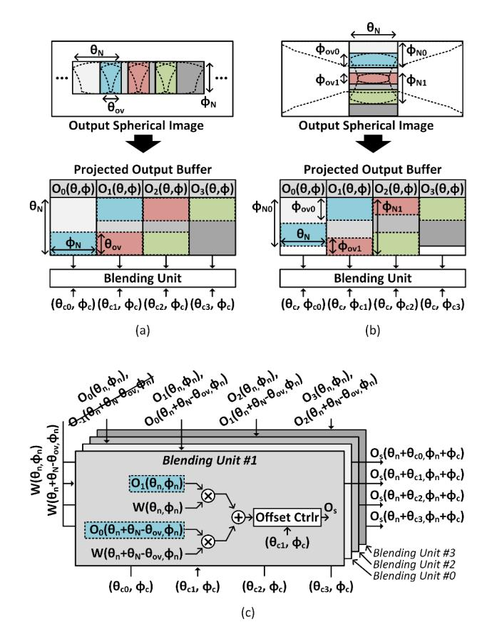
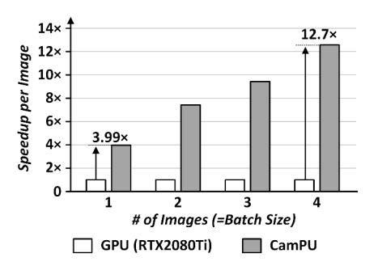

# *D. Overlap-aware Blending Unit with Rectangular Projected Outputs*

The overlap-aware blending unit is proposed to efficiently execute image blending. Unlike processing full-sized intermediate spherical images, CamPU performs image projection with a small-sized rectangular mapping index that has minimal invalid regions with an indication of the center coordinate (θc, ϕc) of each projected output. Although invalid regions still exist in projected outputs, processing image blending on rectangular projected outputs is compatible with the conventional memory system and allows a blending unit to efficiently handle overlapping regions among them. Consequently, CamPU exploits a rectangular mapping index for image projection and

Figure 9: A concept of the overlap-aware image blending unit with rectangular projected outputs: (a) image blending on latitude-aligned projected output images, (b) image blending on longitude-aligned projected output images, and (c) dataflow of the overlap-aware blending unit.

then applies image blending on rectangular projected outputs, reducing intermediate data size by 81.9% compared to the full-sized image process on the GPU.

As shown in Figure 9 (a), the overlap-aware blending unit aggregates the latitude-aligned rectangular projected images. After image projections on latitude-aligned images, their projected outputs have the same rectangular shapes (θN ×ϕN ), and their overlapping regions are also the same (θov×ϕN ) among the projected outputs (O0, O1, O2, O3). Moreover, overlapping regions occur symmetrically between adjacent projected images. Therefore, the projected output buffer stores the same-sized projected outputs, and overlapping regions are allocated in the buffer symmetrically. Similarly, the overlapaware blending unit processes longitude-aligned rectangular projected images as shown in Figure 9 (b). Unlike a latitudealigned process, the shapes of the mapping indices are different by latitude. Therefore, projected spherical images are cropped to have the same width (θN ), and then the cropped projected images are stitched together through the blending unit. To efficiently blend all projected images, the blending unit stitches

Figure 10: CamPU performance of image projection and blending operations with batch processing.

all latitude-aligned images in each longitude at first and then blends the stitching outputs across different longitudes.

Figure 9 (c) describes a dataflow of the overlap-aware blending unit. The blending unit aggregates projected outputs (O0, O1, O2, O3) and stitches them with the blending weights (W) to generate an unified spherical image (Os). The blending unit loads projected outputs from the projected output buffer and blending weights from the weight buffer, and it applies weighted summation. By exploiting symmetric overlapping regions, the overlap-aware blending unit loads a pair of projected images, O1(θn, ϕn) and O0(θn + θN − θov, ϕn), from the projected output buffer and performs weighted summation with corresponding blending weights W(θn, ϕn) and W(θn + θN − θov, ϕn). Final output (Os) is offset by the offset controller before propagating to the global memory. Finally, the overlap-aware blending unit achieves 53.1% memory access reduction when image blending on 18 images at 4 different latitudes and 3, 6, 6, and 3 different longitudes.

