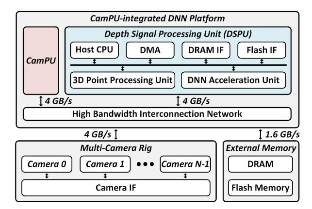
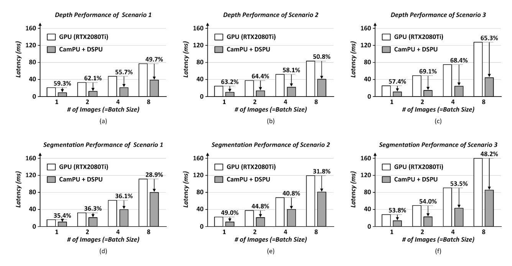

# *E. Area and Power Breakdown of CamPU*

Figure 13 illustrates area and energy consumption breakdowns of the CamPU architecture. The image projection unit takes 16.9% of the total area, the blending unit accounts for 5.6%, the projected output buffer shows 3.5%, and the index decoder unit takes 2.9%. Global memory with other components (the coordinate converter, the instruction decoder, etc) takes 71.1% of the total area, which is dominant due to its large-sized SRAM memory. On the other hand, the energy consumption is dominated by the image projection unit, consuming 29.7% of the total energy because of its complex datapath for the out-of-execution. Similarly, the blending unit takes 28.2% of the total energy consumption because of massive memory accesses by pairs of image pixels and blending weights. The projected output buffer takes 24.7%, global memory with other components takes 15.8%, and the index decoder unit accounts for 1.6%.

Figure 14: An overall architecture of the CamPU-integrated DNN evaluation platform for multi-camera deep learningbased 3D spatial computing systems.

#### V. SYSTEM EVALUATIONS

#### *A. Simulation Environment of System Evaluations*

Figure 14 describes the CamPU-integrated DNN platform for a multi-camera deep learning-based 3D spatial computing system. The platform has been upgraded from a previous 3D spatial computing platform [20] to support a multicamera system. A new platform consists of CamPU and a 3D depth signal processing unit (DSPU) [21], attaching a multi-camera rig and external memory. The DSPU is a host device integrating the RISC-V CPU, external low-power DRAM [12] and flash memory [11] interfaces, a 3D point processing unit, and a DNN acceleration unit. The RISC-V CPU controls all hardware components including CamPU, a multi-camera rig, and external memory. The CPU sends instruction streams to CamPU through the interconnection network, and the CamPU's instruction decoder stores them in an instruction buffer. Then, CamPU sequentially decodes instructions from the buffer and activates the target hardware units. The DSPU performs high-speed deep learning-based image-to-image tasks such as monocular depth estimation [7], [17] and image segmentation [38] on a camera image and additionally extracts 3D perception such as a 3D bounding box [36] by activating a 3D point processing unit and a DNN acceleration unit. The DSPU is designed in 28 nm technology occupying 12.96 mm2 of area and consuming 766.0 mW under 500 MHz of operating frequency. The packet-based interconnection network connects CamPU, the DSPU, and a multi-camera rig offering high bandwidth (4 GB/s). The external low-power DRAM provides 1.6 GB/s bandwidth and an average latency of 70 cycles.

The CamPU-integrated DNN platform executes 360◦ RGB-D generation and image segmentation systems, processing 256×256 and 320×240 sized tangent images, respectively. A multi-camera rig samples images from multiple cameras and supplies multi-image batches to the CamPU-integrated DNN platform through the high bandwidth interconnection

Figure 15: An end-to-end latency of the GPU platform and CamPU-integrated DNN platform running multi-camera deep learning-based 3D spatial computing systems by different numbers of cameras: (a) monocular depth estimation with Scenario 1, (b) monocular depth estimation with Scenario 2, (c) monocular depth estimation with Scenario 3, (d) image segmentation with Scenario 1, (e) image segmentation with Scenario 2, and (f) image segmentation with Scenario 3. \*Scenario 1: Stage 3 (DNN) + Stage 4 (iProj), Scenario 2: Stage 2 (Proj) + Stage 3 (DNN) + Stage 4 (iProj), and Scenario 3: Stage 1 (iProj) + Stage 2 (Proj) + Stage 3 (DNN) + Stage 4 (iProj).

network. CamPU receives multi-camera images and stitches them to generate a unified spherical RGB image. Then, it produces the same quality and different perspective views of tangent images for DNN processing. The DSPU performs deep learning-based image-to-image tasks on tangent images as a multi-batch parallel process. After obtaining deep learning outputs from the DSPU, CamPU stitches them through image projection and image blending and finally generates a 360◦ deep learning output.

*B. Performance Comparisons under Various Stages of Multicamera Deep Learning-based 3D Spatial Computing Systems*

Figure 15 describes an end-to-end latency of the GPU platform and the CamPU-integrated DNN platform evaluated in three scenarios about deep learning-based monocular depth estimation [17] (Figure 15 (a), (b), and (c)) and image segmentation [38] (Figure 15 (d), (e), and (f)) extended to a multi-camera system. In Scenario 1, the platform processes multi-camera images directly, that are horizontally aligned in a multi-camera rig, with the processes of Stage 3 (DNN) and Stage 4 (iProj). Scenario 2 is that the platform receives a spherical image from commercial 360◦ cameras [22], [29] and performs Stage 2 (Proj), Stage 3 (DNN), and Stage 4 (iProj) on it. Scenario 3 is that the platform runs all four stages with arbitrarily positioned cameras. Each scenario is tested under different numbers of cameras, and the performance of a single camera (1 batch size) is also reported as processing a distorted wide FoV image like a fisheye lens along with a DNN model pre-trained with rectilinear image datasets.

NVIDIA RTX2080Ti [35] is a high-performance graphic processing unit (GPU) integrating ray-tracing cores for realistic 3D graphics and CUDA/Tensor cores for parallel computations, accomplishing high-end 3D spatial computing systems. With plentiful hardware resources, the GPU platform accelerates DNN, image projection, and image blending operations under a thermal design power (TDP) of 250 W. On the other hand, the CamPU-integrated DNN platform is a heterogeneous architecture; low-power CamPU (12.9 mW) accelerates image projection and blending operations and the low-power DSPU (766.0 mW) executes DNN operations.

In 256×256 sized monocular depth estimation executions of Scenario 1 as shown in Figure 15 (a), the GPU platform slows down the overall system latency due to non-sharable computations and massive memory accesses of image projection and blending. In contrast, the CamPU-integrated DNN platform significantly boosts the overall system performance by accelerating image projection and blending on multi-image. Finally, the CamPU-integrated DNN platform achieves 59.3%, 62.1%, 55.7%, and 49.7% latency reductions at 1, 2, 4, and 8 numbers of multi-image processing compared to the GPU platform, respectively.

In Scenario 2, the GPU platform accelerates an additional execution of Stage 2 through multi-batch processing with sufficient hardware resources, showing slightly higher latency than Scenario 1 as illustrated in Figure 15 (b). Similarly, CamPU boosts an execution of Stage 2 through LUT-based image projection so that its latency overhead is minimal compared to the execution of Scenario 1. As a result, the CamPU-integrated platform reduces latency by 63.2%, 64.4%, 58.1%, and 50.8% at 1, 2, 4, and 8 numbers of images compared to the GPU platform, respectively.

Figure 15 (c) describes the depth performance of the platforms running Scenario 3. Heavy iProj operations of Stage 1 and Stage 4 deteriorate the overall system performance of the GPU platform, resulting in the slowest performance among the scenarios. However, the CamPU-integrated DNN platform efficiently accelerates dominant iProj operations, reducing latency by 57.4%, 69.1%, 68.4%, and 65.3% at 1, 2, 4, and 8 numbers of image batch sizes compared to the GPU platform, respectively, whose amounts are the largest reductions among the scenarios.

Figure 15 (d), (e), and (f) illustrate 320×240 sized image segmentation executions of Scenario 1, 2, and 3, respectively. Relatively large image and DNN sizes of the image segmentation task limit latency reduction compared to the monocular depth estimation task because of a lack of hardware resources for multi-batch DNN executions in the CamPU-integrated platform compared to the GPU platform. Nonetheless, the CamPU-integrated DNN platform surpasses the GPU platform, showing 35.4%, 36.3%, 36.1%, and 28.9% at 1, 2, 4, and 8 numbers of images in Scenario 1, 49.0%, 44.8%, 40.8%, and 31.8% in Scenario 2, and 53.8%, 54.0%, 53.5%, and 48.2% in Scenario 3, respectively. Finally, the CamPU-integrated DNN platform accomplishes the lowest system latency in multicamera deep learning-based spatial computing systems.

