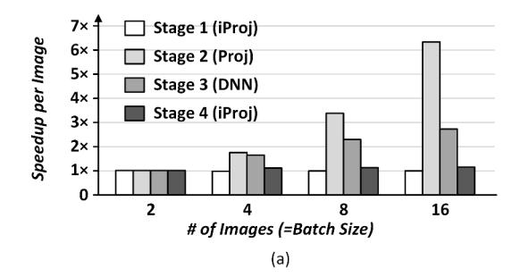
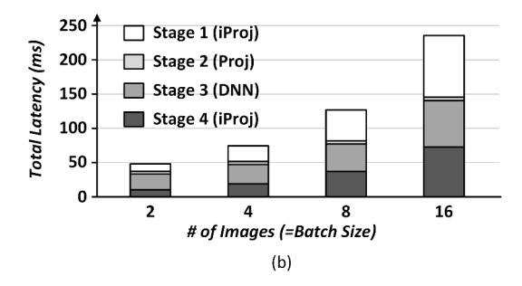
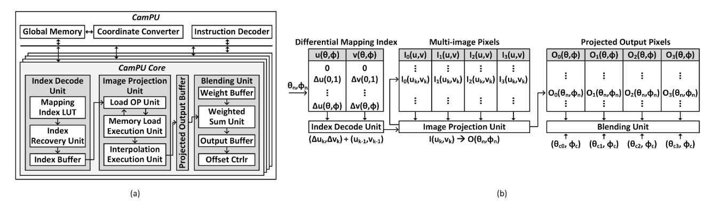

# II. BACKGROUND AND MOTIVATION

This section introduces basic image projection operations and their inefficient GPU implementations with design challenges. The key contributions of this work are then presented for low-latency multi-camera deep learning-based 3D spatial computing systems.

Figure 3 describes image projection operations used in spatial computing systems. Image projection operations require coordinate transformation between a spherical coordinate and a planar coordinate [42]. For a Proj operation of Stage 2, longitude (θ) and latitude (ϕ) of a spherical coordinate (θ, ϕ) are transformed to a tangent planar (u, v) with the following equation,

$$u = \frac{\cos(\phi)\sin(\theta - \theta_c)}{\cos(c)},$$

$$v = \frac{\cos(\phi_c)\sin(\phi) - \sin(\phi_c)\cos(\phi)\cos(\theta - \theta_c)}{\cos(c)},$$

$$\cos(c) = \sin(\phi_c)\sin(\phi) + \cos(\phi_c)\cos(\phi)\cos(\theta - \theta_c)$$
(1)

where (θc, ϕc) is a spherical coordinate of the center of a tangent planar. Using the equation 1, a spherical image is mapped to a tangent image. To fill out all output pixels, each output pixel is calculated through inverse warping which projects four neighbor source pixels and interpolates them through bilinear interpolation.

For an iProj operation of Stage 1 and Stage 4, coordinate transformation from a tangent planar to a spherical coordinate is the following formula,

$$\theta = \theta_c + \tan^{-1}\left(\frac{u \cdot \sin(c)}{\gamma \cos(\phi_c) \cos(c) - v \cdot \sin(\phi_c) \sin(c)}\right),$$

$$\phi = \sin^{-1}(\cos(c) \sin(\phi_c) + \frac{1}{\gamma}v \cdot \sin(c) \cos(\phi_c))$$
(2)

where  $\gamma = \sqrt{u^2 + v^2}$  and  $c = \tan^{-1}\gamma$ . Each tangent image is mapped to a spherical image through the equation 2 with inverse warping. Additionally, projected intermediate spherical images are stitched together through image blending, generating a unified spherical image. An image blending algorithm merges overlapping pixels between adjacent intermediate spherical images with blending weights to reduce visual artifacts [37].

If multiple cameras are fixed in a multi-camera rig (and a multi-camera rig is movable in a real-world coordinate), the mapping index in regard to the equation 1 and 2 is invariant. Once the mapping index is calculated, it does not need to be updated in every frame. Therefore, the mapping index is stored in a lookup table (LUT), and a processing unit loads it and performs remap operations on an image for image projection. The LUT-based image projection alleviates computational costs of the equation 1 and 2 by replacing them with memory operations.

However, the LUT-based image projection limits hardware throughput because of massive memory accesses. Memory-intensive iProj operations of Stage 1 and Stage 4 require large-sized mapping indices (1 MB/image) and generate large-sized spherical images (2 MB/image) that are further stitched together through blending algorithms. Moreover, mapping indices of images show different shapes and values by latitude and longitude of a spherical coordinate based on the equation 1 and 2. As a result, processing these large amounts of inconsistent data brings about critical problems in hardware architectures as follows.

The LUT-based multi-image projection has low data reuse, causing massive memory accesses. To perform the LUT-based image projection, an image projection unit loads mapping index data from a LUT and then fetches target input pixels from memory based on a mapping index. However, since values and shapes of mapping indices are different among multi-camera images, an image projection unit cannot reuse large-sized mapping index data across multi-camera images. Moreover, an image projection unit fetches massive multi-image data and generates large-sized intermediate spherical images when it applies iProj for executions of Stage 1 and Stage 4. Therefore, as the number of cameras increases, image projection units require that amount of massive memory accesses. In specific, Figure 4 (a) describes speedup per image performance with batch processing on RTX2080Ti. The batch

Figure 4: GPU performance of DNN and image projection operations with batch processing: (a) speedup per image and (b) total latency.

processing of Stage 3 (DNN) can increase throughput as the number of images increases by sharing weight parameters across batch inputs. Similarly, Stage 2 (Proj) for generating multiple tangent images achieves significant performance enhancement by sharing a single spherical input image across small-sized mapping indices (0.125 MB/image) corresponding to perspective views. On the other hand, multi-image projection of Stage 1 and Stage 4 (iProj) cannot enhance performance for batch processing because of non-sharable large-sized mapping indices and intermediate spherical images. Therefore, it linearly increases processing times as the number of images increases, resulting in no speedup. Moreover, Stage 1 and Stage 4 dominates the overall processing time as the number of images increases as shown in Figure 4 (b). Consequently, a new image projection unit is required to alleviate memory accesses for multi-image projection.

Massive remap operations in image projection bring about redundant instruction issues and cache memory accesses. A remap operation is a geometrical transformation function that loads an input pixel from memory and stores it in another address of memory. It brings about irregular memory accesses for image projection caused by a nonlinear image warping process based on the equation 1 and 2. Moreover, inverse warping performs four times memory-intensive remap operations to get an output pixel. It fills out all output pixels by loading their corresponding four neighbor input pixels, increasing the number of memory accesses by four times. To minimize the latency of memory accesses, high-speed cache memory is adopted that stores frequently accessed data. An

image projection unit with 4 KB 2-way set associative cache memory improves 1.4× throughput of inverse warping by exploiting a spatial similarity of neighbor pixels (showing 6% cache miss rate). However, an in-order image projection unit with cache memory is still inefficient in executing quadruple remap operations of inverse warping. It takes four times the latency to issue quadruple instructions and repetitively accesses the same cache memory address where target pixels are positioned in the same cache line. In specific, the latency of instruction issues and cache memory access accounts for 2.1× higher than the cache miss latency even though a cache miss is 8× slower than their processes. Therefore, an efficient image projection unit with a cache memory system is necessary to alleviate the challenges of remap operations.

Processing image blending on non-rectangular projected outputs is incompatible with the conventional memory system. The shape of iProj outputs is non-rectangular as shown in Figure 3. This is because output pixels are mapped from a tangent image within an inner pixel condition 0 < u < W idth and 0 < v < Height based on the equation 2. Therefore, the conventional memory system which utilizes rectangular memory blocks deteriorates the hardware performance to perform image blending across non-rectangular intermediate spherical images. The GPU could accelerate the non-rectangular image blending by performing image projection with expanded mapping indices. It expands different shapes of mapping indices to the same-sized and full-sized rectangular ones with invalid maps and applies image projection with them. Then, their rectangular projected outputs are merged by masking invalid regions. This approach allows the GPU to perform parallel computing but wastes massive redundant memory accesses (88.3% out of total data) caused by invalid regions. Therefore, image blending following image projection with invalid maps causes numerous memory footprints caused by redundant data and is a burden for parallel processing in resource-limited hardware platforms.

To solve these problems, a multi-camera processing unit (CamPU) is newly introduced.

- Inter-data and intra-data reuse methods on multi-camera images are proposed to alleviate memory accesses of the LUT-based image projection. The inter-data reuse method exploits shape similarity among mapping indices of latitude-aligned images, which benefits in sharing mapping index across them. Moreover, the intra-data reuse method exploits value similarity between adjacent mapping index elements which processes small-sized differential mapping indices. As a result, exploitation of inter- and intra-data reuse saves the LUT footprint and bandwidth during the LUT-based image projection.
- The out-of-order image projection unit with cache memory is proposed for high throughput remap operations in image projection. The load OP unit dynamically schedules and fuses memory load operations to access target pixels allocated in the same cache line. Then, the out-oforder memory load execution unit executes fused load operations and writes back to destination registers simul-

- taneously, reducing the number of instruction issues and cache memory accesses. Moreover, the out-of-order execution hides the latency of high-level memory accesses. Finally, the pipelined out-of-order image projection unit significantly reduces the overall image projection latency.
- The overlap-aware blending unit is proposed for high throughput of image blending. It merges rectangular projected outputs having minimum invalid regions and offsets an output coordinate by the offset controller. Moreover, the overlap-aware blending unit minimizes redundant memory footprints by handling overlapping regions between adjacent images. Consequently, it alleviates memory accesses caused by non-rectangular projected images in the memory system.
- RTL-level simulation of the CamPU architecture provides a cycle-accurate architectural analysis, and the CamPUintegrated DNN platform is designed for a comprehensive evaluation of a multi-camera deep learning-based spatial computing system. The evaluation results demonstrate the critical role of CamPU, showing low latency of the endto-end system performance with minimal hardware costs.

#### III. CAMPU ARCHITECTURE

#### *A. Overall Architecture and Dataflow*

Figure 5 describes the overall CamPU architecture and its dataflow that performs LUT-based image projection. CamPU consists of four CamPU cores each of which consists of the index decoder unit, the image projection unit, 2 KB of projected output buffer, and the blending unit. The index decode unit applies inter- and intra-data reuse methods that achieve significant benefits from sharing mapping index and memory footprint reduction (Section III-B). The mapping index LUT stores differential mapping index (∆u, ∆v) obtained through pre-computations of the equation 2 (intra-data reuse). Then, the index recovery unit accesses the mapping index LUT corresponding to the target address (θn, ϕn), and recovers the original mapping index (uk, vk) by adding differential mapping index (∆uk, ∆vk) to the previously recovered one (uk−1, vk−1). Moreover, the mapping index is shared across the latitude-aligned multiple images (I0(uk, vk), I1(uk, vk), I2(uk, vk), I3(uk, vk)) that increases throughput of multiimage projection (inter-data reuse). For a single image projection, CamPU only exploits intra-data reuse on the mapping index and still reduces the size of the mapping index.

After obtaining the mapping index, the image projection unit performs remap operations (I(u, v) → O(θ, ϕ)). It adopts cache memory that exploits frequently accessed image pixels during image projection, which reduces the latency of memory accesses (Section III-C). Thanks to the inter-data reuse, the memory load execution unit loads multi-image pixels aligned in the same cache line at a time, increasing the throughput of multi-image projection. For image projection on a single image, adjacent pixels of an image are aligned in the cache line, which increases the number of cache hits. The image projection unit also supports bilinear interpolation for inverse warping. The final projected outputs (O0(θn, ϕn), O1(θn, ϕn),

Figure 5: (a) An overall CamPU architecture and (b) its dataflow.

O2(θn, ϕn), O3(θn, ϕn)) are stored into the projected output buffer and are processed by the blending unit for image blending. When CamPU only performs image projection without image blending, it deactivates the blending unit and transfers projected outputs to the global memory as final outputs.

The blending unit blends the projected outputs to generate a unified spherical image. It applies the overlap-aware rectangular image blending method to reduce redundant memory footprints (Section III-D). The blending unit fetches projected output pixels and corresponding blending weights, and performs weighted summation. The blending outputs are offset through the offset controller by adding each center index of spherical images (θc0, ϕc), (θc1, ϕc), (θc2, ϕc), (θc3, ϕc). The blending outputs are finally stored in the global memory.

CamPU integrates 256 KB of global memory to load and store intermediate data across CamPU cores, taking 8 cycles of latency on average. The coordinate converter unit computes the equation 1 and 2. It exploits a piecewise linear approximation of trigonometric functions through single instruction multiple data (SIMD) units and direct global memory access without occupying the interconnect network. Once the mapping index is calculated, the coordinate converter unit is deactivated until an update is needed. The instruction decoder receives instructions from the CPU and issues them to target hardware units. The interconnect network connects all of the hardware units providing sufficient bandwidth.

