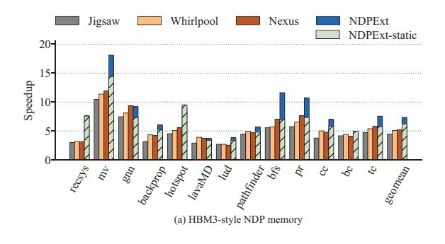
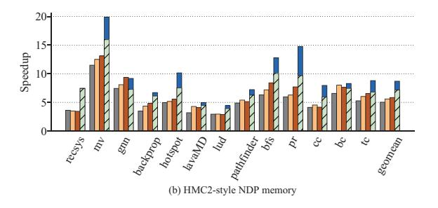
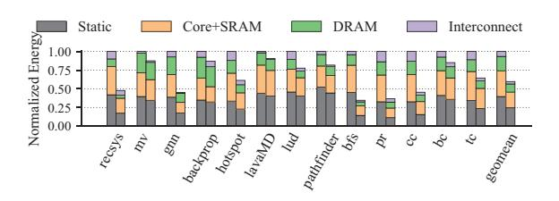
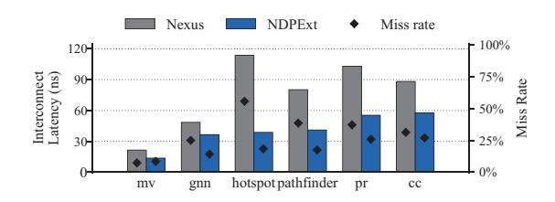
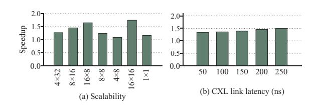
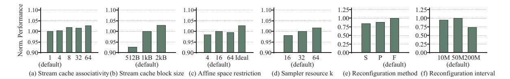

# *A. Overall Comparison*

Fig. 5(a) and (b) present the performance comparisons for the HBM-style and HMC-style NDP systems, respectively. In both cases, NDP systems exhibit considerable performance advantages over non-NDP host execution, with gains ranging from 4.3× to 7.3×. Among the NDP-based ones, NDPExt consistently achieves the best performance, outperforming the second-best one, Nexus, by 1.41× with HBM and 1.48× with HMC on average. The recsys workload shows notable benefits, with up to 2.43× and 2.17× improvements under HBM

Fig. 5. Overall performance comparison between NDPExt and the baselines using (a) HBM-style and (b) HMC-style NDP. Normalized to non-NDP host.

Fig. 6. Overall energy comparison between NDPExt (right) and Nexus (left) using HBM-style NDP. Normalized to Nexus.

Fig. 7. Interconnect latency (bars) and miss rate (dots) comparisons between NDPExt and Nexus.

Fig. 8. Speedups of NDPExt over Nexus with (a) different NDP core counts, as # stacks × # NDP cores per stack, and (b) different CXL link latencies.

and HMC. Although the HBM-style system has fewer NUCA nodes than the HMC-style one, they exhibit similar speedups. This is because the performance is mainly bound by the interstack links that have much lower bandwidth and higher latency than the intra-stack NoC. Finally, NDPExt surpasses NDPExt-static by  $1.2\times$  on average, and shows substantial speedups up to  $1.7\times$  on irregular workloads like pr, which would require more dynamic cache configuration decisions.

The performance gains of NDPExt can be attributed to two reasons: metadata access elimination and better stream-level placement. For metadata, although the 128 kB dual-granularity metadata cache in the baselines achieves over 95% hit rates for high-locality workloads, with large-scale graph workloads the hit rates drastically decrease to 47%. Since each metadata miss requires at least a local memory access on the critical path, the performance suffers. In contrast, NDPExt uses coarse-grained stream-level metadata that are much smaller and can stay local, alleviating the metadata access overheads.

For data placement, Fig. 7 further presents both the average interconnect latencies and the miss rates in Nexus and NDPExt, for a selection of representative workloads. The interconnect latency reflects the interconnect overheads, while the miss rate quantifies the number of requests serviced by the extended memory. NDPExt significantly reduces the interconnection overheads with better data placement and proper data replication. For example, in hotspot, Nexus suffers from a long average interconnect latency of 113 ns, while NDPExt uses several small replication groups each containing 1 or 2 units, besides a large group of 10 units. The interconnect latency is thus reduced to 38 ns. For the miss rate, using the stream abstraction effectively enables prefetching that exploits spatial locality, e.g., hotspot and pathfinder. Although for some workloads like my the miss rate may slightly increase due to replication, overall NDPExt exhibits better performance than the baseline. The results indicate NDPExt can properly size streams and form good replication groups for each stream.

Fig. 6 exhibits the energy consumption breakdown for all workloads. On average, NDPExt saves a significant portion of 40.3% energy consumption compared to Nexus. The static energy follows the execution time. Since NDPExt eliminates additional tag accessing, and the miss rate to the higher-energy extended memory decreases (Fig. 7), the DRAM energy is reduced by 8.3%. Thanks to better placement schemes, the interconnect energy is reduced from 6.6% to 3.2%. This energy reduction confirms the previous reduction in access latency.

#### B. Performance Analysis

From now on, we focus on the HBM-style system, and only present the average performance results due to space limit.

**NDP core count scalability.** In Fig. 8(a), we first change the stack counts and keep the same total core count (first three bars). With more distant cores across more stacks, the interconnection cost reduction in NDPExt is more critical, leading to higher speedups of up to  $1.65 \times$  for 16 stacks. We next scale down NDP cores from 128 cores to 32 cores by using fewer stacks (4th and 5th bars). NDPExt still achieves

Fig. 9. Impact of various design decisions in NDPExt. The results in each case are normalized to the default value as marked.

9% higher performance for a small 4-stack system. We then test a large 16-stack, 256-core system. More cores stress the interconnect with more accesses, and thus NDPExt achieves a higher speedup to 1.75×. Finally, we show the speedup of only one NDP unit. The NDP system falls back to a conventional DRAM cache. In this case, cache configuration in Section V is no longer needed, and we eliminate its cost in the results, similar to the static mode in Fig. 5. NDPExt still offers a speedup of 1.16× from the more efficient stream abstraction.

CXL link latency impact. In Fig. 8(b), we evaluate different CXL link latencies. We use a more practical 200 ns CXL link latency, but also consider optimistic 50 to 70 ns projections in earlier reports [49], [51], [66], [80]. Higher link latencies make misses to the extended memory more expensive. In this case, the placement scheme in NDPExt has higher benefits compared to the center-of-mass method used in the baselines. Since NDPExt effectively reduces such misses as in Fig. 7, it obtains higher speedups with slower CXL links, from 1.33× to 1.50×.

Reconfiguration overheads. The overheads consist of two parts. First, the host processor assigns samplers to streams (Section V-B), whose cost is evaluated in Fig. 4(b). Second, data migration will happen during reconfiguration. We find that data migration requests only account for 1.3% of all access requests, thanks to the optimization in Section V-D.

