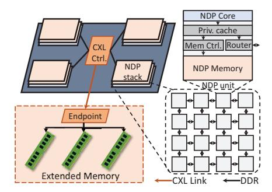

# I. INTRODUCTION

Nowadays, big data, artificial intelligence, and in-memory databases have posed continuously increasing demands on the memory systems of modern computers, due to their large data footprints and excessive access rates. Data accesses to and from the conventional DRAM-based main memory have emerged as a crucial performance and energy bottleneck, known as the "memory wall" [52]. In order to adapt to such urgent demands of memory-intensive applications, two emerging architectures have gained significant attention recently. On one hand, Near-Data Processing (NDP) systems [11], [18], [23], [26], [38], [41], [46], [55] move the computations close to where the data reside, thereby enabling high-bandwidth and low-latency data accesses and reducing data movement overheads. On the other hand, the Compute Express Link (CXL) specification [16] outlines the interaction between the host processor's memory and the peripheral memories, making it efficient and convenient to extend system memory capacities [24], [25], [30], [31], [49], [51].

However, for those NDP systems based on 3D-stacked memory technologies [35], [54], despite the abundant data bandwidth to the memory dies and the flexible interconnection

across the logic dies, a significant limitation is the overall capacity, which is currently limited to only about six stacks with several gigabytes each [14], [32]. We therefore propose to extend the current 3D-stacked NDP system with external memory modules that are connected through the CXL interface. We name such a design as *NDP with extended memory*. In this architecture, the memory regions of the NDP stacks are used as a distributed DRAM cache, while the extended CXL-based memory serves as the OS-visible physical memory space. To each core in one of the NDP stacks, some cache space is local while the others are remote, naturally exhibiting non-uniform access characteristics similar to the conventional non-uniform cache architecture (NUCA) [42].

However, NDP has its unique challenges, such as the much more severe interconnect latencies when accessing remote cache locations across the 3D memory stacks, and the substantial overheads of maintaining and looking up the metadata of the distributed DRAM cache. Previous NUCA solutions [6], [7], [56], [71] fail to address these two issues, because they do not sufficiently consider the data placement issue to reduce the interconnect distance, and they cannot adopt efficient and flexible data replication due to the metadata constraint. Even though NDP and NUCA are both well-explored topics, the above unique challenges make it ineffective to directly combine existing techniques and call for new innovations.

In this work, we propose NDPExt, an optimized architecture of NDP with extended memory, leveraging two hardware-software co-designed optimizations to address the above challenges. On the hardware side, NDPExt adopts software-defined data streams [74]–[76] as a coarse-grained abstraction to organize the distributed DRAM cache as *stream caches*. Compared to the traditional fine-grained, cacheline-level management, the stream cache not only reduces the metadata storage and lookup cost, but also offers a nice level of abstraction on which we can apply flexible and customized placement and replication strategies to individual data streams without much complexity.

On the software side, NDPExt periodically derives the optimized cache configuration schemes which partition and allocate the distributed DRAM space to the many different streams in the workload. The configuration algorithm is executed by a software runtime on the host processor, taking as input the cache miss behaviors of all the streams that are profiled by specially designed hardware samplers. We propose efficient sampling methods that can scale to many different

streams and many NDP cores in the system. Compared to existing NUCA algorithms, our algorithm co-optimizes the sizing of each stream cache and the placement across different cores. It also supports more flexible data replication where each stream can use its own custom replication scheme.

When evaluated on a wide range of memory-intensive workloads, NDPExt significantly outperforms the state-of-theart NUCA solutions [6], [7], [56], [71] by  $1.41\times$  on average, and up to  $2.43\times$ . The reasons for such improvements are mainly two-fold: the much lower metadata access overheads enabled by our hardware stream cache design, and the better data placement and replication enabled by our software configuration algorithm. Overall, NDPExt represents a novel design that efficiently alleviates the memory capacity limitation of 3D-stacked NDP systems, and contributes towards large-scale practical NDP adoption.

### II. BACKGROUND AND RELATED WORK

#### A. Emerging Memory Architectures

We first introduce the two emerging techniques: Near-Data Processing (NDP) and Compute Express Link (CXL).

Near-Data Processing (NDP). NDP moves processing logic closer to data locations to enjoy the high bandwidth and low latency of data access and to reduce the data movement overheads. Currently, NDP systems targeting the main memory can be broadly categorized into those that retain the original DIMM form factor, and those that rely on 3Dstacked memories (e.g., HBM and HMC [35], [54]). DIMMbased NDP systems add computing logic on the separate rank-level buffer chips [11], [18], [41], [46], [55] or near the internal DRAM banks [23], [26], [38]. Because there are only links between the memory controller and each DIMM, the interconnect bandwidth among the NDP logic remains limited if not applying hardware modifications [70], [81], which restricts their use in complex applications. In contrast, 3D-stacked NDP systems put computing logic on the bottom dies of 3D memory stacks, where the memory dies on the top support fast data accesses [1], [8], [17], [20], [21], [43], [45], [69], [79], [82]. High-bandwidth interconnects could also be implemented on and between the logic dies with on-chip and off-chip links, connecting them into a memory network [44], [58], [60], [78] that supports flexible communication.

However, compared to DIMMs, 3D-stacked memory devices currently suffer from limited capacity due to fundamental technology difficulties. First, the number of memory stacks is constrained by the interposer area, with rapidly increasing cost for more stacks and more complex routing [39]. Second, the capacity of each stack is constrained by the die-stacking difficulty and their thermal conductivity. For example, each 3D stack such as HMC and HBM currently is limited to only a few gigabytes [35], [54]. Even when connected using multiple stacks, the total memory capacity is far below that of a typical modern server, which could have up to several terabytes.

**Compute Express Link (CXL).** The CXL standard [16] has enabled efficient and convenient interaction with the peripheral memories on the I/O buses. It encompasses several protocols

tailored for different use cases. CXL.io provides a basic protocol for device configuration on top of PCIe. CXL.cache allows accelerators to cache data from the host memory and ensures coherence. CXL.mem maps the device memory addresses into the host address space for direct load/store accesses.

In this work, we primarily concentrate on the CXL.mem feature for memory pooling [24], [25], [49], [51], such as memory expanders as large as 512 GB per module [59]. To configure a CXL memory pool, at the boot time, the hostside driver recognizes and initializes the CXL-enabled devices. This includes mapping the control interface and the actual CXL memory into the host address space. Once mapped, any load/store to this space is handled by the CXL controller, which in turn accesses the corresponding CXL memory. CXL.mem enables efficient memory accesses with no polling or syscall software overheads. Compared with conventional DIMMs and networking-based memory pooling, CXL is more scalable. First, memory bandwidth can substantially improve with more PCIe lanes, e.g., with the most recent CXL 3.0 + PCIe 6.0, the bandwidth ranges from 7.6 GB/s (x1) to 121 GB/s (x16). Second, memory capacity can also grow using additional CXL switches to reach terabyte-scale pooling. Third, CXL.mem promises fewer pins without the need for multiple individual DDR controllers. For instance, an 8-lane CXL port can offer bandwidth comparable to a DDR5-4800 channel, using  $5 \times$  fewer pins [12], [25], [49], [66].

### B. Non-Uniform Cache Architecture (NUCA)

In classical chip multi-processors, the growing chip area and the increasing core count both lead to the increasingly larger last-level cache (LLC) capacity realized through multiple individual banks spread across the chip. The access latencies from a specific core to these different banks become non-uniform, motivating prior research to optimize such a non-uniform cache architecture (NUCA) [42]. Unlike traditional centralized caches, NUCA requires complex placement, migration, and replication strategies. NUCA designs can be categorized into static (S-NUCA) and dynamic (D-NUCA), based on how flexibly a cacheline could be migrated across banks. D-NUCA can be further classified as shared-cache-based [6], [13], [28], [56], [71] and private-cache-based [5], [9], [47], [61]. Sharedcache-based designs view all the banks as a shared cache and remap cachelines to different locations, while private-cachebased designs use cache coherence protocols to look up and migrate cachelines among the banks. Several state-of-the-art shared-cache-based D-NUCA designs have considered finegrained and access-pattern-aware data placement. Jigsaw [6] partitioned the cache across multiple threads according to waybased sampling results. Whirlpool [56] distinguished different data structures during partitioning. Nexus [71] further supported replication for read-only data.

## C. Stream Basics

Streams are a coarse-grained abstraction that expresses the memory address range and the expected access pattern within the range [57]. In this paper, we mainly focus on two types of

Fig. 1. Proposed architecture of NDP with extended memory. The NDP stacks use dedicated extended memory connected using CXL, which can be directly accessed without involving the host processor.

streams: affine and indirect. An affine stream has statically determined access addresses following an affine function, e.g., addr = *a*×*i*+*b*, resembling the common sequential and strided access patterns. On the other hand, the addresses in an indirect stream are dynamically determined by the input data, e.g., addr = *s*[*i*] where *s* is another affine or indirect stream. Distinguishing between affine and indirect streams provides hints about the access patterns for different data in the workload, enabling us to use different management mechanisms tailored for each address range. Prior work also used stream programming hints to facilitate prefetching [74], instruction offloading [75], [76], and automated parallelization [73].

